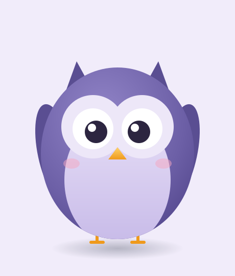

# Самостоятельная работа — Векторная графика, Урок 8

> 🧑‍🎓 Не повторяем пингвина! Собираешь **своего** зверя-маскота из фигур.

---

## ✅ Задание 1 (для всех) — «Свой зверь-маскот» (новый вызов)

Собери **кавайного персонажа** ДРУГОГО зверя (не пингвин) — только из **кругов и овалов**. Выбери **одного**:

- 🦉 **Совёнок** (круглое тело, огромные глаза, ушки-треугольнички);
- 🐱 **Котик** (круглая голова, ушки, усы);
- 🐸 **Лягушонок** (глаза-пузыри сверху, широкий рот);
- 🐻 **Медвежонок** (круглые ушки, носик);
- 👾 **Монстрик** (один глаз, рожки, зубик) — можно любой формы.

**🖼 Пример результата** (совёнок — тоже из кругов и овалов):

**Обязательные условия (чтобы был кавай):**
- [ ] Собран **из фигур** (круги/овалы), не «от руки»;
- [ ] Есть **обрезка** детали по телу («Пересечение»);
- [ ] Симметрия через **Отражение** (глаза/уши/лапки);
- [ ] **Большие глаза с бликом** + мягкие формы;
- [ ] Раскрашен (плоско или градиентом) + **тень** под героем;
- [ ] Экспорт **PNG** (+ .ai).

---

## 🔗 Задание 2 (комбо, уроки 3/6/7 + 8) — «Маскот в деле»

Свяжи с прошлым:
- 🃏 посади персонажа **на карточку** (урок 3) как героя;
- 🏷 или сделай из него **лого-аватар** в круге-бейдже;
- ✨ или добавь **глянец** (урок 7): блик на теле, объём градиентом.

**Результат:** твой герой в «фирменном» оформлении.

---

## ⚡ Задание 3 (разминка-челлендж) — эмоция за 5 минут

**За 5 минут:** возьми готового персонажа (своего или пингвина), сделай **копию** и поменяй **только глаза/клюв/бровки** → получи другую **эмоцию** (радость / сон / удивление). Тренируем «набор эмоций» из одного героя.

---

## 📋 Что проверяем

- [ ] Персонаж — **свой зверь** (не пингвин);
- [ ] Собран из фигур + **обрезка** («Пересечение»);
- [ ] Симметрия **Отражением**;
- [ ] Большие глаза с бликом, мягкие формы;
- [ ] Цвет + тень; экспорт PNG + .ai;
- [ ] Сделано **«Комбо»** (карточка/бейдж/глянец).

## 🧩 Для 5–7 классов
- Плоский цвет, детали простыми овалами сверху (без обрезки). Обязательно попробовать **Отражение** для глаз.

## 🎓 Для 9–11 классов
- **Градиентная сетка** на теле/крыльях; текстура (перья/шерсть).
- **Набор эмоций** (стикерпак 3–4 штуки).
- Поза/аксессуар (шапка, шарф, предмет в лапах).

## 🖼 Галерея «Зверята класса»
Сдай маскота — соберём «зоопарк класса». Голосуем: **самый милый** и **самый оригинальный** персонаж.

## Что сдать
- `маскот_*.png` (+ `.ai`) (Задание 1) + герой в оформлении (Задание 2).
