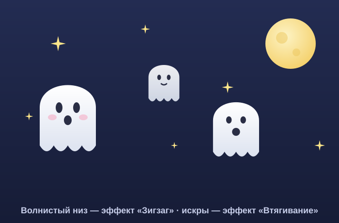

# Урок 9 — Меню «Эффект»: семья призраков и звёзды-искры 👻⭐

**Модуль 3 · Векторная графика · Урок 9 из 13 | 2 ак.ч. (1,5 часа)**

> 🔁 В начале — [разминка/повтор](повторение.md) (5 мин).
> 👨‍🏫 Сценарий с хронометражом — в [преподавателю.md](преподавателю.md).
> 🖼 Референсы и что показать — в [изображения.md](изображения.md) и в конце («Материалы»).
> ⚠️ Всё делаем **вручную**, без ИИ.
> 🎁 Ещё проекты на эффекты (морские звёзды, звёздочки, череп) — в [Копилке проектов](../ДОП-ЗАДАНИЯ-illustrator.md) (раздел «Эффекты»).

> 🧭 **Как читать урок.** Сегодня — **волшебное меню «Эффект»**: одним кликом фигура становится волнистой, колючей, дрожащей или изогнутой. И, что круто, эффекты **живые** — их можно менять и отменять в любой момент (панель «Внешний вид»). Идём одним сквозным примером — делаем **семью призраков** 👻 (волнистый низ — эффектом **Зигзаг**) и **искрящиеся звёзды** ⭐ (эффектом **Втягивание**). Каждый шаг расписан: что нажать, где кнопка, что появится, зачем и типичная ошибка.

---

## 🎬 Что мы сделаем сегодня и что получим

**Задача:** научиться «преображать» фигуры **эффектами**. Сделаем **призрака** с фирменным **волнистым низом** (эффект Зигзаг), добавим лицо, размножим в **семью** с разными эмоциями, а вокруг рассыплем **звёзды-искры** (эффект Втягивание). Всё — на тёмном «ночном» фоне.

**В итоге у тебя получится:** милая **хэллоуин-сценка** 👻⭐ — семья призраков с искрами. Экспорт **SVG/PNG**.

**Главный навык урока:** меню **«Эффект»** (Зигзаг, Огрубление, Втягивание и раздувание, Скругление углов, Деформация) + панель **«Внешний вид»** — эффекты **живые и редактируемые**. Это быстрый способ получать сложные формы из простых.

> 💡 Секрет эффектов: они **не портят фигуру**, а «надеваются» на неё сверху (как фильтр). Хочешь — поменял параметры, хочешь — снял. А когда доволен — «запекаешь» (Разобрать оформление).

**🖼 Вот что должно получиться:**

---

## 🧭 Где что находится (эффекты)

- **Меню «Эффект»** (вверху):
  - `Эффект → Искажение и трансформация → **Зигзаг**` — волны/зубцы по контуру (Гладко = волны, Углом = зубцы).
  - `… → **Огрубление** (Roughen)` — «дрожащий», неровный край.
  - `… → **Втягивание и раздувание**` — Втягивание (вогнутые лучи = искра) / Раздувание (пухлое).
  - `… → **Скручивание** (Twist)` — закрутить.
  - `Эффект → Стилизация → **Скругление углов**` — мягкие уголки.
  - `Эффект → **Деформация** → Дуга / Флаг / Раздувание…` — изогнуть весь объект.
- **Панель «Внешний вид» (Appearance)** — `Окно → Внешний вид` (`Shift+F6`): тут список эффектов; **двойной клик** — изменить, **корзина** — удалить, **перетащить** — поменять порядок.
- **Запечь эффект:** `Объект → Разобрать оформление` (Expand Appearance) — эффект станет «настоящими» точками.

> ⚠️ **Про старые уроки:** «Разобрать оформление вид» = **«Разобрать оформление»**; `Command`=`Ctrl`. Эффекты живут в **«Внешний вид»**, а не в свойствах фигуры.

---

## Часть 1 — 🎮 Что такое «живой эффект» (8 минут)

1. **«Отрезок линии»** (`\`) → нарисуй **горизонтальную линию** ~200 пикс.
2. `Эффект → Искажение и трансформация → **Зигзаг**`. В окне: **Размер** ~10, **Складки на сегмент** ~4, точки — **Гладко**. Появится **волна** 〰️ (или **Углом** → зубцы).
3. Открой **«Внешний вид»** (`Shift+F6`) — там строка «Зигзаг». **Двойной клик** по ней → поменяй размер → волна изменилась **вживую**. Хочешь убрать — **корзина**.

**👀 Вывод:** эффект **живой** — надет на фигуру, редактируется и снимается. Исходная линия цела.

> 💡 Один и тот же Зигзаг: **Гладко** = волны (призрак, вода), **Углом** = зубцы (звезда, трещина, монстр).

---

## Часть 2 — 👻 Призрак с волнистым низом (16 минут)

### Шаг 1. Тело-капсула

1. Возьми **«Прямоугольник со скруглёнными углами»**: на панели инструментов **слева** **зажми** иконку «Прямоугольник» (`M`) — выпадет группа — выбери **«Прямоугольник со скруглёнными углами»**.
2. **Один клик** по холсту → в окне впиши **Ширина 150, Высота 200, Радиус углов 60** → ОК. 👀 Получилась «капсула» с круглым верхом (голова) и почти прямым низом.
3. **Цвет:** двойной клик по «Заливке» (внизу панели инструментов) → `#` **FFFFFF** (белый). Обводку убери (`/`).

### Шаг 2. Волнистый низ — эффект «Зигзаг»

1. Выдели тело **«Выделением»** (`V`).
2. `Эффект → Искажение и трансформация → **Зигзаг…**`. В окне поставь: **Размер 10 пикс**, **Складки на сегмент 5**, точки — **Гладко** (не «Углом»!). Внизу — галочка **«Просмотр»**, чтобы видеть вживую → ОК.
3. 👀 **Что произойдёт:** **нижний** (почти прямой) край пойдёт **волной-оборкой**, а круглая макушка почти не изменится — вышел классический призрак-простыня. 👻
4. Проверь в **«Внешний вид»** (`Shift+F6`): там строка «Зигзаг» — двойной клик её правит, корзина снимает.

> ⚠️ **Ошибка:** поставить точки **«Углом»** — низ станет колючим, как пила. Для мягкой оборки — **«Гладко»**. И не задирай «Размер» — 8–12 достаточно, иначе «каша».

### Шаг 3. Лицо

1. **Глаза:** «Эллипс» (`L`) → **18 × 26** каждый, тёмный **#2A2E45**. Поставь два, близко. *(симметрию можно через «Отражение» `O` → «Копировать», как в уроке 8.)*
2. **Рот:** «Эллипс» → **20 × 24**, тот же тёмный → круглый «ооо» (испуг). Для улыбки — вместо овала дуга «Пером» (`P`).
3. **Румянец** (по желанию): «Эллипс» → **18 × 12**, розовый **#F6A5C0**, непрозрачность **50%** (панель «Прозрачность»).

**Ожидаемый результат:** милый призрак с волнистым низом и рожицей. 👻

> 💡 **Хочешь «спуки»-вариант:** к телу другого призрака вместо мягкого Зигзага применяй **Огрубление** (см. Часть 4) — контур задрожит.

---

## Часть 3 — ⭐ Звёзды-искры (Втягивание) (10 минут)

1. Возьми **«Звезда»**: на панели инструментов **зажми** иконку «Прямоугольник»/«Эллипс» — в группе есть **«Звезда»**.
2. **Один клик** по холсту → окно «Звезда»: **Радиус 1: 40**, **Радиус 2: 18**, **Лучи: 4** → ОК. 👀 Появилась 4-конечная звёздочка. Залей белым/жёлтым **#FDE68A**, обводку убери.
3. Выдели её (`V`) → `Эффект → Искажение и трансформация → **Втягивание и раздувание…**`. Двигай ползунок в сторону **«Втягивание»** (влево, минус) примерно до **−40%** (галочка «Просмотр» включена) → ОК.
4. 👀 **Что произойдёт:** лучи станут **тонкими и вогнутыми** — классическая **искра/блеск** ✨.
5. *(глянец)* можно залить **радиальным градиентом** (белый центр → жёлтый), приём из урока 7.
6. **Рассыпь искры:** выдели искру → `Ctrl+C`, `Ctrl+V` несколько раз, каждую **уменьши** (тяни угол рамки с `Shift`) и раскидай вокруг призраков.

**Ожидаемый результат:** сверкающие звёзды-искры разного размера.

> 💡 **Втягивание** делает из звезды искру, из круга — «кляксу-цветок». **Раздувание** (ползунок вправо) — надувает (лепестки, облачка). Пробуй в обе стороны.

---

## Часть 4 — Семья и разные эффекты (10 минут)

Размножим призрака и покажем силу эффектов.

1. **Копии:** выдели призрака (`V`), `Ctrl+G` (группа), затем `Ctrl+C`/`Ctrl+V` ×2 → **3 призрака**. Каждого **уменьши/увеличь** (угол рамки + `Shift`) и поменяй **лицо** (сдвинь глаза, смени рот) — семья разного роста и настроения.
2. **Деформация:** выдели одного → `Эффект → **Деформация** → **Дуга…**` (или «Флаг») → в окне «Изгиб» ~**+30%** → ОК. 👀 Призрак «колышется», будто летит вбок. Правится в «Внешний вид».
3. **Огрубление:** «злому» призраку → `Эффект → Искажение и трансформация → **Огрубление…**`: **Размер 2%**, **Детали 8**, точки **Углом** → ОК. 👀 Контур **задрожал** — спуки-вариант.
4. **Фон-ночь:** «Прямоугольник» (`M`) на весь холст, залей тёмно-синим **#1B2340**, уведи в самый низ (`Shift+Ctrl+[`). **Луна:** «Эллипс» (`L`) + `Shift` → круг, жёлтый **#FDE68A**, поставь в угол.

**Ожидаемый результат:** семья призраков (разные позы/эмоции) на ночном фоне с искрами. 🎃

---

## ✅ Как правильно / ❌ Как НЕ надо (эффекты)

| ❌ Как НЕ надо | ✅ Как правильно |
|----------------|------------------|
| Рисовать волну/зубцы вручную точками | **Эффект Зигзаг** (быстро и ровно) |
| Зигзаг «Углом» для мягкой оборки | Для волны — **Гладко**; для зубцов — Углом |
| Искать, где «отменить» эффект | Открыть **«Внешний вид»** → изменить/удалить |
| «Запечь» эффект сразу и потом жалеть | Держать **живым**, пока не уверен; потом Разобрать |
| Задрать параметры до каши | Небольшие значения; смотреть превью |
| Экспорт со «сломанным» эффектом | Перед экспортом при необходимости **Разобрать оформление** |

> ⚠️ Главная ошибка — **забыть про «Внешний вид»**: кажется, что эффект «не убрать». А он там, живой — двойной клик правит, корзина снимает.

---

## Часть 5 — Экспорт (5 минут)

1. *(если эффекты сложные)* `Объект → **Разобрать оформление**` — «запечёт» эффекты в контуры (надёжно для экспорта).
2. **`Файл → Экспортировать → Экспортировать как…`** → **PNG** и/или **SVG**.
3. Сохрани **`.ai`**.

> 💡 Живые эффекты в SVG обычно переносятся, но **Разобрать оформление** перед экспортом гарантирует, что всё выглядит как на экране.

---

## 🎓 Часть 6 — Для 9–11: глубже (8 минут)

- **Стек эффектов:** на одну фигуру — несколько эффектов сразу (Зигзаг + Скругление + Деформация) в «Внешний вид»; меняй **порядок** — результат разный.
- **Скручивание (Twist)** + Втягивание — необычные «магические» формы.
- **Огрубление** на тексте/лого — «рваный» стиль.
- **Морская звезда / звёздочки** — из [Копилки](../ДОП-ЗАДАНИЯ-illustrator.md), с Скруглением и текстурой.
- **Своя графстиль:** сохрани связку эффектов как **графический стиль** и применяй в один клик.

---

## 🧩 Для 5–7 классов (проще)

- Призрак: тело — **скруглённый прямоугольник**, низ — **волнистая белая полоса** сверху (без соединения).
- Хватит **1 призрака + 2 искры**.
- Эффекты берём с **готовыми** параметрами (учитель подскажет числа).

---

## 🏁 Итог урока (5 минут)

Сегодня освоили **меню «Эффект»**:

- ✅ **Зигзаг:** волны (Гладко) / зубцы (Углом) — волнистый низ призрака.
- ✅ **Втягивание:** звезда → искра ✨.
- ✅ **Деформация / Огрубление / Скругление** — колышется, дрожит, мягчает.
- ✅ **«Внешний вид»:** эффекты **живые** — правим, удаляем, меняем порядок.
- ✅ **Разобрать оформление** — «запечь» перед экспортом.

> 🏆 Теперь одним кликом ты превращаешь простое в сложное! Дальше — **поп-арт портрет** (урок 11) и **сцена** (урок 10). Впереди урок 10 — **городской пейзаж/сцена** с кистями и глубиной.

> 🎤 **Блиц:** какой эффект делает волну? а искру? где правят/снимают эффекты? Гладко или Углом для оборки? что делает «Разобрать оформление»?

### 🎮 Викторина-закрепление

Открой **[викторина.html](викторина.html)** — вопросы про эффекты и панель «Внешний вид» + смешные и «на подумать».

➡️ **Самостоятельная работа** (свои эффект-существа + комбо) — в [практике](практика.md).
🧰 **Трюки урока** (эффекты, «Внешний вид», стек) — в [лайфхак.md](лайфхак.md).

---

## 🔗 Материалы и ссылки к уроку

**🧰 Инструмент:** Adobe Illustrator (по лицензии класса), русский интерфейс.

**📥 Референсы (для вдохновения, НЕ копировать):**
- 👻 **Милые призраки / Хэллоуин:** поиск — *cute ghost vector*, *flat halloween characters*.
- ✨ **Искры/звёзды:** поиск — *sparkle vector*, *twinkle star icon*.
- 🎁 **Готовые туториалы** (морские звёзды, звёздочки): [Копилка проектов](../ДОП-ЗАДАНИЯ-illustrator.md).

**🎬 Вдохновение:** YouTube (рус.): *«эффекты Illustrator»*, *«Зигзаг иллюстратор»*, *«панель Внешний вид Illustrator»*.

**⚙️ Учителю:** показать «линия → Зигзаг» и живую правку через «Внешний вид» на проекторе; приготовить параметры эффектов. Список — в [изображения.md](изображения.md).
