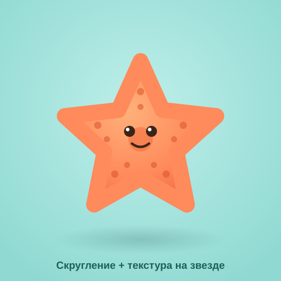

# Самостоятельная работа — Векторная графика, Урок 9

> 🧑‍🎓 Не повторяем призраков! Делаешь **своих** существ и объекты через эффекты.

---

## ✅ Задание 1 (для всех) — «Существо на эффектах» (новый вызов)

Сделай **своё существо/объект**, где форму создаёт **эффект** (не рисуешь руками). Выбери **одно**:

- 🌊 **Слизень-монстрик** (капли-подтёки — Зигзаг «Гладко» по низу + глаза);
- ⭐ **Набор искр/звёзд** (звёзды → Втягивание, разного размера, с глянцем);
- 🌟 **Морская звезда** (5-луч. звезда → Скругление + пухлость, текстура-точки);
- ☀️ **Солнце с лучами-волнами** (круг + лучи через Зигзаг/Втягивание);
- 🦠 **Микроб/вирус** (круг + шипы через Втягивание/Огрубление, рожица).

**🖼 Пример результата** (морская звезда — Скругление + текстура):

**Обязательные условия:**
- [ ] Форма сделана **эффектом** (Зигзаг / Втягивание / Огрубление / Деформация);
- [ ] Эффект **живой** — покажи, что менял его в «Внешний вид»;
- [ ] Есть **2+ варианта** (разные параметры/размеры) — «семейка»/набор;
- [ ] Раскрашено (можно с глянцем/градиентом из урока 7);
- [ ] Экспорт **PNG** (+ .ai). Перед экспортом — **Разобрать оформление**.

---

## 🔗 Задание 2 (комбо, уроки 6/8 + 9) — «Оживи прошлого героя»

Свяжи с прошлым:
- добавь своему **маскоту** (урок 8) **эффект**: колышущийся хвост (Зигзаг), дрожащий контур (Огрубление), или деформацию «на ветру» (Деформация);
- или укрась **логотип** (урок 6) эффектом (искры, волны).

**Результат:** прошлая работа заиграла новым эффектом.

---

## ⚡ Задание 3 (разминка-челлендж) — эффект за 5 минут

**За 5 минут:** нарисуй **звезду** → **Втягивание** (искра) и **круг** → **Зигзаг «Углом»** (солнце/шестерёнка). Поменяй параметры в «Внешний вид». Тренируем «фигура + эффект».

---

## 📋 Что проверяем

- [ ] Существо/объект — **своё** (не урочные призраки);
- [ ] Форма создана **эффектом**, эффект **живой** (правил в «Внешний вид»);
- [ ] Есть набор/семейка (2+ варианта);
- [ ] Цвет; экспорт PNG + .ai (после «Разобрать оформление»);
- [ ] Сделано **«Комбо»** (эффект на прошлом герое/лого).

## 🧩 Для 5–7 классов
- Хватит **1 существа + пары искр**. Параметры эффектов — готовые. «Внешний вид» — просто показать, что там эффект.

## 🎓 Для 9–11 классов
- **Стек эффектов** (2–3 сразу) + смена порядка; сохрани как **графический стиль**.
- Скручивание/Огрубление для «магических» форм.
- Возьми «Морские звёзды»/«Звёздочки» из [Копилки](../ДОП-ЗАДАНИЯ-illustrator.md).

## 🖼 Галерея «Зоопарк эффектов»
Сдай существо — соберём весёлую галерею. Голосуем: **самый крутой эффект** и **самое смешное существо**.

## Что сдать
- `эффект_*.png` (+ `.ai`) (Задание 1) + прошлый герой с эффектом (Задание 2).
