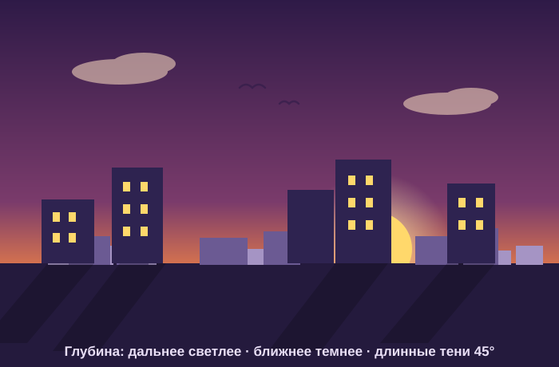

# Урок 10 — Сцена с глубиной: флэт-город на закате 🌆✨

**Модуль 3 · Векторная графика · Урок 10 из 13 | 2 ак.ч. (1,5 часа)**

> 🔁 В начале — [разминка/повтор](повторение.md) (5 мин).
> 👨‍🏫 Сценарий с хронометражом — в [преподавателю.md](преподавателю.md).
> 🖼 Референсы сцен и что показать — в [изображения.md](изображения.md) и в конце («Материалы»).
> ⚠️ Всё делаем **вручную**, без ИИ.
> 🎁 Ещё сцены (кофейня, завтрак, торт) — в [Копилке проектов](../ДОП-ЗАДАНИЯ-illustrator.md) (раздел «Сцены»).

> 🧭 **Как читать урок.** До этого мы делали **отдельные объекты**. Сегодня — **целая сцена** с ощущением **глубины**: далёкие дома светлые и «в дымке», ближние — тёмные и крупные. Идём одним сквозным примером — рисуем **флэт-город на закате** 🌆: небо-градиент, солнце, три плана домов, модные **длинные тени** и облака **переменной толщины линии**. Каждый шаг расписан: что нажать, где кнопка, что появится, зачем и типичная ошибка.

---

## 🎬 Что мы сделаем сегодня и что получим

**Задача:** собрать **пейзаж с глубиной**. Небо-градиент и солнце → три ряда домов (дальний светлый → ближний тёмный) → **длинные тени** от домов → облака и птицы **кистью/переменной линией**. Получится атмосферный закатный город.

**В итоге у тебя получится:** красивая **флэт-сцена** 🌆 с настоящей глубиной — как постер или обои. Экспорт **SVG/PNG**.

**Главный навык урока:** **глубина сцены** (планы + атмосферная перспектива: дальнее — светлее и меньше контраста) + **длинная тень** (флэт-приём) + **кисти и инструмент «Ширина»** (переменная толщина линии). Так рисуют пейзажи и постеры.

> 💡 Секрет глубины: **дальнее — светлее и «в дымке», ближнее — темнее и крупнее**. Мозг читает это как «далеко/близко». Плюс **планы на слоях**: небо → дальние дома → средние → передние.

**🖼 Вот что должно получиться:**

---

## 🧭 Где что находится (сцена, кисти, ширина)

- **Панель «Слои»** (`Окно → Слои`, `F7`) — планы держим на **отдельных слоях** (небо / дальний / средний / передний). Так не путаемся и легко двигать план целиком.
- **Инструмент «Ширина» (Width)** — слева, `Shift+W`. Тянешь по линии → она **толстеет/тончает** в этой точке (для облаков, холмов, «капли»-линий).
- **Панель «Кисти»** — `Окно → Кисти` (`F5`). Меню панели → **Открыть библиотеку кистей** → Художественные / Декоративные. Кисть применяется как **обводка** линии.
- **Заливка/градиент** — `Ctrl+F9` (для неба).
- **Прозрачность / режим «Умножение»** — `Окно → Прозрачность` (для теней).
- **Обтравочная маска** — `Объект → Обтравочная маска → Создать` (`Ctrl+7`) — обрезать тени по земле.

> ⚠️ **Про старые уроки:** «Изображение в перспективе» и «Перспективная сетка» — это **продвинутый** способ (🎓). Мы делаем сцену **планами**, это проще и тоже даёт глубину.

---

## Часть 1 — Небо и солнце (8 минут)

1. **Документ:** `Файл → Создать` → профиль **RGB**, пиксели, **1200 × 800** → ОК.
2. **Слой «небо»:** открой панель **«Слои»** (`F7`, справа) → двойной клик по «Слой 1» → назови **«небо»**.
3. **Прямоугольник неба:** «Прямоугольник» (`M`) → **один клик** по холсту → **Ширина 1200, Высота 800** → ОК. Поставь в угол (0,0) — закроет весь холст.
4. **Градиент неба:** открой **«Градиент»** (`Ctrl+F9`) → кликни **миниатюру градиента** (прямоугольник зальётся) → «Тип» **Линейный**. На ползунке сделай **3 остановки** (кликни **под** полосой посередине, чтобы добавить третью): левая **#2E1A47** (фиолет, верх), средняя **#FF8C42** (оранжевый), правая **#FFC46B** (тёплый, низ).
5. Возьми инструмент **«Градиент»** (`G`) → **протяни линию сверху вниз** по прямоугольнику (держи `Shift` — строго вертикально). 👀 Небо: тёмный верх → закатный низ.
6. **Солнце:** «Эллипс» (`L`) → клик → **80 × 80** → ОК, залей **#FFD86B**, поставь **низко у горизонта**. **Свечение:** ещё круг **180 × 180** позади (`Ctrl+[`), радиальный градиент жёлтый→прозрачный (правая остановка: «Непрозрачность 0»).

**👀 Что видишь:** закатное небо с солнцем. Основа настроения готова.

---

## Часть 2 — Планы домов: создаём глубину (16 минут)

Главный приём урока — **атмосферная перспектива**. Делаем **3 плана** на разных слоях. **Новый слой:** внизу панели «Слои» — кнопка **«Создать новый слой»** (иконка листа ＋). Создай три: **«дальний»**, **«средний»**, **«передний»** (сверху вниз в списке: передний — выше всех).

### Дальний план (слой «дальний»)

1. Кликни слой **«дальний»** (рисуем на нём). «Прямоугольник» (`M`) → дома-полоски **невысокие** (напр. **60 × 90**, **80 × 70**, **50 × 110**), в ряд у **линии горизонта** (на уровне солнца).
2. Цвет — **светлый, «в дымке»** (близко к небу): бледно-сиреневый **#A594C4**. Деталей нет.

### Средний план (слой «средний»)

1. Кликни слой **«средний»**. Дома **повыше** (**90 × 150**, **70 × 190**), спереди от дальних (перекрывают их низ).
2. Цвет **темнее и насыщеннее**: **#6B5A93**. Добавь **пару окошек** (маленькие прямоугольники **10 × 14**).

### Передний план (слой «передний»)

1. Кликни слой **«передний»**. Дома **самые высокие и крупные** (**110 × 260**, **90 × 320**), внизу холста.
2. Цвет **тёмный, почти силуэт**: **#3B2E5A**. Тёплые **окна** — жёлтые квадратики **#FFD86B** рядами.

**👀 Что произойдёт:** появится **глубина** — глаз видит, что светлые дома далеко, а тёмные близко. 🌆

> 💡 **Как быстро наделать домов:** нарисовал один прямоугольник → `Ctrl+C`, `Ctrl+V` → меняй высоту (тяни верхнюю ручку). Соседние дома пусть слегка перекрываются.

> ⚠️ **Типичная ошибка:** все дома одного цвета и размера — сцена «плоская», без глубины. Дальние — **светлее/меньше**, ближние — **темнее/крупнее**. Это правило пейзажа.

> 💡 **Планы на слоях** = порядок: небо снизу, дальний выше, средний, передний — сверху. Двигать план целиком — просто, ничего не перепутается.

---

## Часть 3 — 🕶 Длинные тени (флэт-приём) (12 минут)

Модная фишка флэт-дизайна: **длинная диагональная тень** от объектов. Делаем её **наклоном копии** — надёжно и просто.

1. **Направление:** солнце у нас справа-низко → тени падают **влево-вниз**, все под **одним углом 45°**.
2. Выдели **передний дом** (`V`) → `Ctrl+C`, затем **`Ctrl+B`** (вставить **позади** дома).
3. Копию-тень залей **чёрным** (`#000000`).
4. Пока тень выделена: `Объект → Трансформировать → **Наклон…**` → в окне **Угол наклона 45°**, ось **Горизонтальная**, галочка «Просмотр» → ОК. 👀 Копия «повалилась» вбок — это тень.
5. *(длиннее)* потяни **нижнюю** ручку рамки тени вниз — тень вытянется по земле.
6. **Смягчи:** панель **«Прозрачность»** (`Shift+Ctrl+F10`) → режим наложения **«Умножение»**, **Непрозрачность 25%**. 👀 Тень стала прозрачно-тёмной, не «чёрным блином».
7. **Повтори** пункты 2–6 для **2–3** передних домов. ⚠️ Все тени — **в одну сторону**!
8. **Обрежь тени по земле** (чтобы не лезли на небо): «Прямоугольник» (`M`) на **нижнюю** часть холста (земля, от домов вниз) поверх теней → выдели **прямоугольник + все тени** → `Объект → Обтравочная маска → Создать` (`Ctrl+7`).

**Ожидаемый результат:** дома отбрасывают длинные закатные тени — сцена «ожила». 🕶️

> ⚠️ **Ошибка:** тень чёрная и непрозрачная — выглядит как «дыра». Всегда **«Умножение» + ~25%**. И все тени — под **одним** углом.

> 🎓 **Про-способ (идеально ровная тень):** копию сдвинуть на 1px по диагонали много раз через **Переход (Blend)** (`Объект → Переход → Создать`) и объединить «Соединением».

---

## Часть 4 — Облака и птицы: кисти и «Ширина» (10 минут)

Добавим воздух и жизнь.

1. **Облака инструментом «Ширина»:**
   - «Отрезок линии» (`\`) → проведи короткую **горизонтальную** линию в небе. Дай ей толстую **белую обводку** (панель «Обводка», ~14 пт, концы «скруглённые»).
   - Возьми **«Ширина»** (`Shift+W`, слева — в группе с «Масштаб»). Наведи на **середину** линии — курсор станет с кружком — **тяни в стороны**: линия **раздуется** посередине. Потяни в 2–3 местах → получилось пухлое **облако**.
   - Панель «Прозрачность» → непрозрачность ~**80%**, чтобы облако было мягким.
2. **Кисть для дымки** *(вариант):* `Окно → Кисти` (`F5`) → меню панели (☰ в углу) → **«Открыть библиотеку кистей» → Художественные → Художественные_Акварель/Мел** → выбери мягкую кисть → проведи «Кистью» (`B`) лёгкую дымку.
3. **Птицы:** «Кисть»/«Перо» — мелкие **«галочки»** (две дуги: `\/`). Скопируй 3–4, разбросай вдали. Дальние — **мельче и бледнее** (та же перспектива и в небе!).
4. **Дымка у горизонта:** «Прямоугольник» — тонкая горизонтальная полоса на линии горизонта, белая, **непрозрачность 20%** → дальние дома «утонут» в дымке = глубже.

**Ожидаемый результат:** в небе облака и птицы, у горизонта дымка — сцена дышит. ✨

---

## ✅ Как правильно / ❌ Как НЕ надо (сцена с глубиной)

| ❌ Как НЕ надо | ✅ Как правильно |
|----------------|------------------|
| Все дома одного цвета/размера | Дальние **светлее/меньше**, ближние **темнее/крупнее** |
| Планы свалены на один слой | **Планы на отдельных слоях** (небо/дальний/средний/передний) |
| Тени в разные стороны | **Один свет** → все тени под **одним углом** |
| Тень залезает на небо | **Обтравочная маска** по земле |
| Резкие одинаковые детали вдали | Вдали — **меньше деталей**, мягче, бледнее |
| Плоское небо | **Градиент** + солнце + дымка |

> ⚠️ Главная ошибка — **нет разницы между планами**: сцена плоская. Дай дальнему «уйти в дымку», ближнему — стать тёмным и крупным.

---

## Часть 5 — Экспорт (5 минут)

1. *(если использовал кисти/ширину)* по желанию `Объект → Разобрать оформление` перед экспортом.
2. **`Файл → Экспортировать → Экспортировать как…`** → **PNG** (обои/постер) и/или **SVG**.
3. Сохрани **`.ai`** (со слоями-планами).

> 💡 Хочешь обои на телефон — задай холст вертикально (напр. 1080 × 1920) и экспортируй PNG.

---

## 🎓 Часть 6 — Для 9–11: глубже (8 минут)

- **Перспективная сетка** (`Вид → Перспективная сетка`) — рисовать дома в настоящей 2-точечной перспективе (продвинуто).
- **Отражение** города в воде (копия вниз + маска непрозрачности с градиентом = «растворяется»).
- **Свет в окнах:** тёплое свечение (радиальный градиент, «Экран»).
- **Свои кисти:** сделать кисть из фигуры (дерево, звезда) и «рассыпать» по сцене.
- **Туман/градиент глубины:** полупрозрачный слой цвета неба поверх дальних планов — усиливает дымку.

---

## 🧩 Для 5–7 классов (проще)

- Хватит **2 планов** (дальний светлый + передний тёмный) + небо и солнце.
- Длинную тень — **простым параллелограммом** (без маски), полупрозрачным.
- Облака — обычными овалами; «Ширину» попробовать на одной линии.

---

## 🏁 Итог урока (5 минут)

Сегодня собрали **целую сцену с глубиной**:

- ✅ **Планы на слоях:** небо → дальний → средний → передний.
- ✅ **Атмосферная перспектива:** дальнее светлее/меньше, ближнее темнее/крупнее.
- ✅ **Длинная тень:** диагональ 45°, «Умножение», обрезка по земле.
- ✅ **Кисти + «Ширина»:** облака и линии переменной толщины.
- ✅ **Экспорт** PNG/SVG (со слоями-планами в .ai).

> 🏆 Ты нарисовал целый мир с глубиной! Дальше — **поп-арт портрет** (урок 11): превратим фото в яркую векторную графику трассировкой.

> 🎤 **Блиц:** как показать, что дом далеко? зачем планы на слоях? куда падают тени? что делает «Ширина»? чем обрезать тени по земле?

### 🎮 Викторина-закрепление

Открой **[викторина.html](викторина.html)** — вопросы про глубину, планы, длинную тень и кисти + смешные и «на подумать».

➡️ **Самостоятельная работа** (своя сцена другой темы + комбо) — в [практике](практика.md).
🧰 **Трюки урока** (глубина, тень, кисти) — в [лайфхак.md](лайфхак.md).

---

## 🔗 Материалы и ссылки к уроку

**🧰 Инструмент:** Adobe Illustrator (по лицензии класса), русский интерфейс.

**📥 Референсы (для вдохновения, НЕ копировать):**
- 🌆 **Флэт-пейзажи:** поиск — *flat cityscape sunset*, *flat landscape layers*, *long shadow flat*.
- ☁️ **Кисти:** встроенные библиотеки Illustrator (Художественные/Декоративные).
- 🎁 **Готовые туториалы** (кофейня, завтрак, торт): [Копилка проектов](../ДОП-ЗАДАНИЯ-illustrator.md).

**🎬 Вдохновение:** YouTube (рус.): *«флэт пейзаж Illustrator»*, *«длинная тень Illustrator»*, *«инструмент Ширина Illustrator»*.

**⚙️ Учителю:** показать «дальний светлый / ближний тёмный» и длинную тень на проекторе; приготовить палитру заката и пример со слоями-планами. Список — в [изображения.md](изображения.md).
