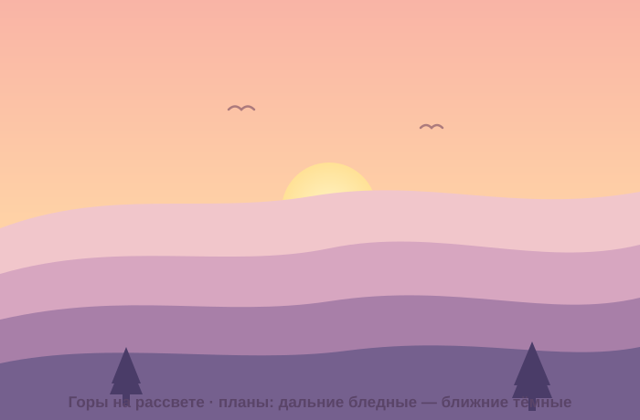

# Самостоятельная работа — Векторная графика, Урок 10

> 🧑‍🎓 Не повторяем город! Собираешь **свою** сцену другой темы — с той же глубиной.

---

## ✅ Задание 1 (для всех) — «Своя сцена с глубиной» (новый вызов)

Сделай **пейзаж/сцену** на ДРУГУЮ тему (не город). Главное — **глубина** (планы) и **длинная тень** или дымка. Выбери **одну**:

- 🏔 **Горы на рассвете** (гряды холмов, дальние бледные — ближние тёмные);
- 🌲 **Лес** (ряды деревьев планами, туман между ними);
- 🏝 **Остров/пляж** (море-градиент, дальний берег в дымке, пальма спереди);
- 🌌 **Космос** (планеты разного размера — крупные ближе, мелкие бледные дальше);
- 🏜 **Пустыня/дюны** (волны песка планами, длинные тени от кактусов).

**🖼 Пример результата** (горы на рассвете — планы от бледных к тёмным):

**Обязательные условия (чтобы была глубина):**
- [ ] Минимум **3 плана** (дальний/средний/передний) на **разных слоях**;
- [ ] **Атмосферная перспектива:** дальнее светлее/меньше, ближнее темнее/крупнее;
- [ ] **Небо-градиент** + источник света (солнце/луна);
- [ ] **Длинная тень** ИЛИ дымка у горизонта (в одну сторону/тон);
- [ ] Использованы **кисть** или **«Ширина»** (облака/линии);
- [ ] Экспорт **PNG** (+ .ai со слоями).

---

## 🔗 Задание 2 (комбо, уроки 7/8 + 10) — «Герой в сцене»

Свяжи с прошлым:
- посели своего **персонажа** (урок 8) или **глянцевый объект** (урок 7) в сцену как **передний план**;
- дай ему **длинную тень** в ту же сторону, что и у остальных;
- впиши по цвету (тёплый закат/холодная ночь).

**Результат:** твой герой живёт в атмосферном мире.

---

## ⚡ Задание 3 (разминка-челлендж) — глубина за 5 минут

**За 5 минут:** три ряда холмов (три волнистые полосы): дальняя — **бледная**, средняя — **средняя**, ближняя — **тёмная**. Добавь солнце-круг. Готово — уже есть глубина! Тренируем атмосферную перспективу.

---

## 📋 Что проверяем

- [ ] Сцена — **своя тема** (не урочный город);
- [ ] **3 плана** на слоях + атмосферная перспектива;
- [ ] Небо-градиент + свет; **длинная тень**/дымка в одну сторону;
- [ ] Есть кисть/«Ширина»;
- [ ] Экспорт PNG + .ai;
- [ ] Сделано **«Комбо»** (герой/объект в сцене).

## 🧩 Для 5–7 классов
- Хватит **2 планов** (дальний светлый + передний тёмный) + небо и солнце. Тень — простым параллелограммом.

## 🎓 Для 9–11 классов
- **Перспективная сетка** (город/дорога в 2-точечной перспективе).
- **Отражение** в воде (маска непрозрачности).
- Свои **кисти** (дерево/звезда), свет в окнах.

## 🖼 Галерея «Миры класса»
Сдай сцену — соберём «выставку миров». Голосуем: **самая глубокая** сцена и **самое красивое настроение**.

## Что сдать
- `сцена_*.png` (+ `.ai` со слоями) (Задание 1) + сцена с героем (Задание 2).
