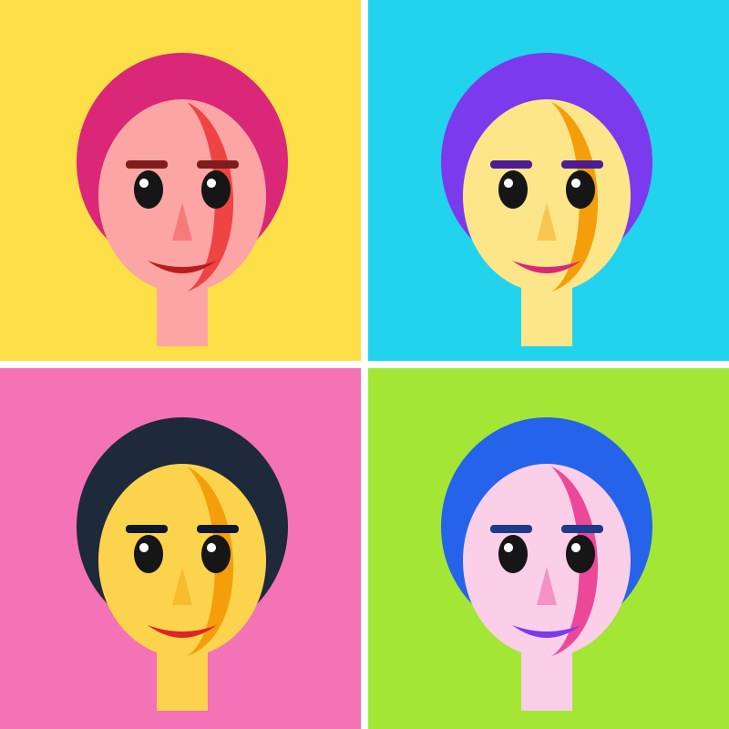

# Урок 11 — Трассировка фото: поп-арт портрет 🎭🌈

**Модуль 3 · Векторная графика · Урок 11 из 13 | 2 ак.ч. (1,5 часа)**

> 🔁 В начале — [разминка/повтор](повторение.md) (5 мин).
> 👨‍🏫 Сценарий с хронометражом — в [преподавателю.md](преподавателю.md).
> 🖼 Что скачать (фото-исходник) — в [изображения.md](изображения.md) и в конце («Материалы»).
> ⚠️ Всё делаем **вручную**, без ИИ (трассировка — это **не** нейросеть, а честный алгоритм обводки; генеративку не трогаем).
> 🎁 Ещё проекты — в [Копилке проектов](../ДОП-ЗАДАНИЯ-illustrator.md).

> 🧭 **Как читать урок.** Раньше мы рисовали с нуля. Сегодня — превратим **фото в вектор** одной командой (**Трассировка изображения**), а потом **перекрасим** его в яркий **поп-арт** в стиле Энди Уорхола: 4 портрета разными кислотными цветами. Каждый шаг расписан **до кнопки**: что нажать, где, что увидишь, зачем, ошибка. Фото берём **своё** (селфи) или бесплатное — **не знаменитостей и не с брендами**.

---

## 🎬 Что мы сделаем сегодня и что получим

**Задача:** взять **фото лица**, командой **Трассировка изображения** превратить его в **вектор из нескольких тонов**, **разобрать** на редактируемые фигуры и **перекрасить** в яркие поп-арт цвета. Соберём **сетку 2×2** — 4 варианта одного портрета в разных палитрах, как знаменитые постеры Уорхола.

**В итоге у тебя получится:** стильный **поп-арт постер** 🎭 (4 ярких портрета), который чётко печатается в любом размере. Экспорт **SVG/PNG**.

**Главный навык урока:** **Трассировка изображения (Image Trace)** — фото → вектор + **ручная доводка** (разобрать, почистить, перекрасить через «Выделить одинаковые»). Так делают векторные портреты, логотипы из набросков, стикеры из фото.

> 💡 Секрет поп-арта: **мало тонов + кислотные цвета**. Фото с миллионом оттенков сводим к **3–5** плоским цветам и красим их дерзко (розовый, циан, жёлтый). Контраст и смелость — вот и весь стиль.

**🖼 Вот что должно получиться** (сетка 2×2 — одно лицо, 4 палитры):

---

## 🧭 Где что находится (трассировка)

- **Поместить фото:** `Файл → Поместить…` → выбери фото → клик по холсту. Вверху на **панели управления** появится кнопка **«Встроить»** (Embed) — нажми, чтобы фото «вшилось» в файл.
- **Запустить трассировку:** выделить фото → `Объект → Трассировка изображения → Создать` (или кнопка **«Трассировка изображения»** на панели управления вверху).
- **Панель настроек:** `Окно → **Трассировка изображения**`. Там: **Набор** (пресеты), **Режим** (Цвет / Оттенки серого / Чёрно-белый), **Цвета/Порог**, и раздел **«Дополнительно»** (Контуры, Углы, **Шум**).
- **«Запечь» результат:** кнопка **«Разобрать»** (Expand) вверху — трассировка станет **настоящими векторными фигурами**.
- **Перекрасить умно:** `Выделение → Одинаковые → **Цвет заливки**` — выделит все фигуры одного тона разом.
- **Разгруппировать:** `Shift+Ctrl+G` (иногда 2–3 раза).

> ⚠️ **Трассировка ≠ ИИ.** Это алгоритм, который просто **обводит** контуры фото. Генеративную перекраску/«текст в вектор» не используем — красим сами.

---

## Часть 1 — Готовим фото (6 минут)

1. **Выбери фото:** своё **селфи** анфас или бесплатное фото человека (см. [изображения.md](изображения.md)). Хорошо, если лицо **крупное**, свет **контрастный** (светлая и тёмная стороны). ⚠️ **Не бери** знаменитостей, кадры из фильмов, логотипы.
2. `Файл → Создать` → RGB, пиксели, **1200 × 1200** (под сетку 2×2).
3. `Файл → Поместить…` → выбери фото → клик на холсте. Масштабируй под **левый-верхний квадрат** (~560 × 560), держи `Shift` (без искажения).
4. Вверху нажми **«Встроить»** — иначе трассировка не запустится.

**👀 Что видишь:** фото лежит в углу холста, «вшито» в файл. Готовы трассировать.

> 💡 **Контраст решает.** Чем яснее свет/тень на лице, тем «читаемее» выйдет поп-арт. Тусклое фото → каша из тонов.

---

## Часть 2 — Трассировка в несколько тонов (14 минут)

1. Выдели фото (`V`).
2. `Объект → Трассировка изображения → **Создать**`. 👀 Фото на секунду станет чёрно-белым «наброском» — это трассировка по умолчанию.
3. Открой панель **`Окно → Трассировка изображения`**.
4. Настрой для поп-арта:
   - **Режим:** **Цвет** (Color).
   - **Палитра:** «Ограниченная».
   - **Цвета (Colors):** ползунок на **4–5** — столько плоских тонов останется.
   - Раскрой **«Дополнительно»**: **Контуры (Paths) ~75%**, **Углы (Corners) ~70%**, **Шум (Noise) ~20–25** (чем больше Шум, тем меньше мелких пятнышек-«мусора»).
   - Внизу — галочка **«Просмотр»** (видно вживую).
5. 👀 **Что видишь:** лицо превратилось в **несколько плоских цветовых пятен** — светлая кожа, тень, волосы, фон. Это уже поп-арт-набросок.

> ⚠️ **Ошибка:** поставить Цвета = 20 — вектор «зашумится» сотнями оттенков и фигур. Поп-арту нужно **мало тонов** (4–5). Меньше цветов = чётче стиль и легче красить.

> 💡 Хочешь классический 2-цветный трафарет — поставь **Режим: Чёрно-белый** и крути **Порог** (Threshold): что темнее порога — чёрное, светлее — белое.

---

## Часть 3 — Разбираем и чистим (12 минут)

1. Пока портрет выделен, вверху нажми **«Разобрать»** (Expand). 👀 Трассировка превратилась в **группу настоящих фигур** (появились узлы-точки).
2. **Разгруппируй:** `Shift+Ctrl+G` (повтори 2 раза, если надо).
3. **Убери фон:** возьми **«Прямое выделение»** (`A`) → кликни фоновую фигуру вокруг головы → `Delete`. *(если фон разбит на куски — выдели один, потом `Выделение → Одинаковые → Цвет заливки`, `Delete`.)*
4. **Почисти «мусор»:** мелкие пятнышки — выдели «Прямым выделением» и удали. Не увлекайся — поп-арт любит «грубость».

**Ожидаемый результат:** чистый векторный портрет из 3–5 плоских тонов, без фона.

> 💡 **«Выделить одинаковые» — твой друг.** Кликнул одну фигуру → `Выделение → Одинаковые → Цвет заливки` → выделились **все** такого же цвета. Так удобно и чистить, и перекрашивать.

---

## Часть 4 — 🌈 Перекраска в поп-арт (12 минут)

Сводим тона к **дерзкой палитре** (как Уорхол).

1. Кликни фигуру **кожи** (`V`) → `Выделение → Одинаковые → Цвет заливки` (выделились все «кожаные») → задай яркий цвет: **#FFC24D** (жёлтый) или **#F9A8D4** (розовый). Двойной клик по «Заливке» → `#`.
2. Кликни фигуру **тени на лице** → «Выделить одинаковые» → тёмно-красный **#B91C1C** или фиолетовый.
3. **Волосы** → «Выделить одинаковые» → циан **#22D3EE** или чёрный.
4. **Губы/детали** → яркий контрастный (красный #DC2626).
5. **Фон-плашка:** нарисуй «Прямоугольник» (`M`) размером с квадрат, залей кислотным цветом (#A3E635 лайм), уведи **назад** (`Shift+Ctrl+[`) под портрет.

**👀 Что видишь:** портрет засиял кислотными цветами — чистый поп-арт. 🎨

> 💡 **«Перекрасить графику» (Recolor Artwork):** можно выделить весь портрет → на панели управления/«Свойства» кнопка **«Перекрасить»** → покрутить цвета сразу всей палитрой. Это **ручной** подбор (не ИИ) — быстро тестировать варианты.

> ⚠️ **Ошибка:** робкие «натуральные» цвета — получится не поп-арт, а «блёклое фото». Не бойся **кислоты** и контраста.

---

## Часть 5 — Сетка 2×2 (Уорхол) (8 минут)

1. Выдели весь портрет + фон-плашку (`V`, рамкой) → `Ctrl+G` (группа) → это плитка №1.
2. `Ctrl+C`, `Ctrl+V` ×3 → расставь **4 плитки сеткой 2×2** (ровно — включи `Просмотр → Быстрые направляющие` `Ctrl+U` и панель «Выравнивание»).
3. В каждой плитке **поменяй палитру** (кликаешь тон → «Выделить одинаковые» → новый цвет). Пример 4 схем:
   - жёлтый фон / розовые волосы; циан фон / фиолет волосы; розовый фон / чёрные волосы; лайм фон / синие волосы.

**Ожидаемый результат:** 4 ярких портрета в ряд-сетку — постер в стиле Уорхола. 🎭

> 💡 Каждая плитка — **одно лицо, разные цвета**. В этом весь приём Уорхола: повтор + смелый цвет.

---

## ✅ Как правильно / ❌ Как НЕ надо (трассировка и поп-арт)

| ❌ Как НЕ надо | ✅ Как правильно |
|----------------|------------------|
| Трассировать в 20+ цветов | **4–5 тонов** — чёткий стиль, легко красить |
| Тусклое, ровное фото | Фото с **контрастом** (свет/тень) |
| Красить «на глаз» каждую фигуру | **«Выделить одинаковые → Цвет заливки»** |
| Натуральные блёклые цвета | **Кислотные**, контрастные (поп-арт!) |
| Забыть «Разобрать» | Сначала **Разобрать (Expand)**, потом красить |
| Взять фото звезды/кадр из фильма | **Своё** фото или свободный сток |

> ⚠️ Главная ошибка — **много тонов и робкие цвета**. Поп-арт = мало плоских цветов + дерзкая палитра + повтор.

---

## Часть 6 — Экспорт (5 минут)

1. `Файл → Сохранить как` → **.ai** (рабочий).
2. `Файл → Экспортировать → Экспортировать как…` → **PNG** (постер/аватарка) или **SVG** (вектор). Для печати — крупный PNG (300 ppi).

> 💡 Один портрет-плитку тоже сохрани отдельно — годится на аватарку/стикер.

---

## 🎓 Часть 7 — Для 9–11: глубже (8 минут)

- **Ручная доводка кривых:** «Прямым выделением» (`A`) подчисти рваные края главных фигур — портрет станет «дороже».
- **Полутона (halftone):** фон-плашке дай **узор из точек** (`Окно → Библиотеки образцов → Узоры → Базовая графика_Точки`) — фирменный комикс-фон.
- **Контур-обводка:** добавь чёрную обводку главным фигурам (толщина 2–3) — «трафаретный» вид.
- **Своя палитра:** подбери 4 схемы на [Coolors](https://coolors.co/), сохрани как **стили/образцы**.
- **Трассировка не лица:** логотип из наброска, кот, кроссовок, рука — попробуй.

---

## 🧩 Для 5–7 классов (проще)

- Бери **Режим: Оттенки серого** или **Чёрно-белый** (проще, чем цвет) → получится 2-тоновый трафарет.
- Хватит **1 портрета** (без сетки 2×2).
- Перекрась **2 тона** (светлый/тёмный) в 2 ярких цвета — уже поп-арт.

---

## 🏁 Итог урока (5 минут)

Сегодня превратили **фото в поп-арт**:

- ✅ **Поместить + Встроить** фото.
- ✅ **Трассировка изображения:** Режим Цвет, **4–5 цветов**, Шум против «мусора».
- ✅ **Разобрать (Expand)** → чистка «Прямым выделением».
- ✅ **Перекраска:** «Выделить одинаковые → Цвет заливки» в кислотные тона.
- ✅ **Сетка 2×2** Уорхола + экспорт.

> 🏆 Ты умеешь превращать фото в вектор и стилизовать! Дальше — **Blend, 3D и узоры** (урок 12): постер/игровой UI.

> 🎤 **Блиц:** что делает Трассировка? сколько цветов брать для поп-арта? что делает «Разобрать»? как выделить все фигуры одного цвета? почему кислотные цвета?

### 🎮 Викторина-закрепление

Открой **[викторина.html](викторина.html)** — вопросы про трассировку, тоны, разбор и поп-арт + смешные и «на подумать».

➡️ **Самостоятельная работа** (поп-арт другого объекта + комбо) — в [практике](практика.md).
🧰 **Трюки урока** (мало тонов, «Выделить одинаковые», полутона) — в [лайфхак.md](лайфхак.md).

---

## 🔗 Материалы и ссылки к уроку

**🧰 Инструмент:** Adobe Illustrator (по лицензии класса), русский интерфейс.

**📥 Фото-исходники (бесплатно, НЕ знаменитости/бренды):**
- 👤 **Портреты:** своё **селфи** или [Pexels](https://www.pexels.com/ru-ru/) / [Unsplash](https://unsplash.com/) — `portrait`, крупное лицо, контрастный свет.
- 🌈 **Палитры:** [Coolors](https://coolors.co/).

**🎬 Вдохновение:** поиск в браузере (Картинки) — *pop art portrait*, *warhol style poster*, *image trace illustrator pop art*. YouTube (рус.): *«трассировка изображения Illustrator»*, *«поп-арт Illustrator»*.

**⚙️ Учителю:** заранее скачать 4–5 контрастных фото-портретов (свободные) в общую папку; показать трассировку и «Выделить одинаковые» на проекторе. Список — в [изображения.md](изображения.md).
