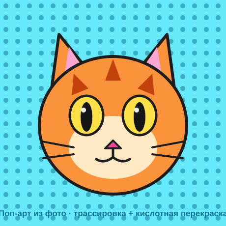

# Самостоятельная работа — Векторная графика, Урок 11

> 🧑‍🎓 Не повторяем свой урочный портрет! Делаешь поп-арт **другого объекта**.

---

## ✅ Задание 1 (для всех) — «Поп-арт другого объекта» (новый вызов)

Сделай поп-арт из **другого** фото (не своё урочное лицо). Выбери **одно**:

- 🐱 **Питомец** (кот/собака — своё фото);
- 👟 **Кроссовок / вещь** (яркий предмет);
- 🍌 **Фрукт/еда** (банан, перец, кекс);
- 🚗 **Машинка / игрушка**;
- ✋ **Своя рука / жест** (получается неожиданно круто).

**🖼 Пример результата** (поп-арт кота — кислотная перекраска + полутона):

**Обязательные условия:**
- [ ] Фото **помещено и встроено** (кнопка «Встроить»);
- [ ] **Трассировка изображения** в **4–5 тонов** (Шум против «мусора»);
- [ ] **Разобрано** (Expand) и почищено (убран фон);
- [ ] Перекрашено в **кислотную** палитру через «Выделить одинаковые»;
- [ ] Экспорт **PNG** (+ .ai). Фото — **своё/свободное**, без брендов/звёзд.

---

## 🔗 Задание 2 (комбо, уроки 3/9 + 11) — «Поп-арт в дело»

Свяжи с прошлым:
- 🃏 помести поп-арт-объект на **карточку** (урок 3) как арт;
- ✨ добавь **искры/звёзды** (урок 9, эффект Втягивание) вокруг;
- 🔲 или собери **сетку 2×2** (Уорхол) из своего объекта.

**Результат:** твой поп-арт стал постером/карточкой.

---

## ⚡ Задание 3 (разминка-челлендж) — трассировка за 5 минут

**За 5 минут:** возьми любое контрастное фото → **Трассировка** (Режим **Чёрно-белый**, крути **Порог**) → **Разобрать** → перекрась 2 тона в 2 ярких цвета. Готов трафарет-поп-арт! Тренируем весь путь фото→вектор.

---

## 📋 Что проверяем

- [ ] Объект — **другой** (не урочное лицо);
- [ ] Помещено+встроено; **трассировка 4–5 тонов**;
- [ ] Разобрано, почищено, перекрашено «Выделить одинаковые»;
- [ ] Кислотная палитра; экспорт PNG + .ai;
- [ ] Сделано **«Комбо»** (карточка/сетка/искры).

## 🧩 Для 5–7 классов
- Режим **Чёрно-белый** (2 тона) + перекраска в 2 цвета. Без сетки. Фото — контрастное, простое.

## 🎓 Для 9–11 классов
- **Сетка 2×2** с 4 палитрами + **полутона** (узор из точек) на фоне.
- Ручная доводка кривых главных фигур; чёрная обводка-трафарет.

## 🖼 Галерея «Поп-арт класса»
Сдай постер — соберём яркую стену. Голосуем: **самый сочный цвет** и **самый неожиданный объект**.

## Что сдать
- `попарт_*.png` (+ `.ai`) (Задание 1) + сетка/карточка (Задание 2).
