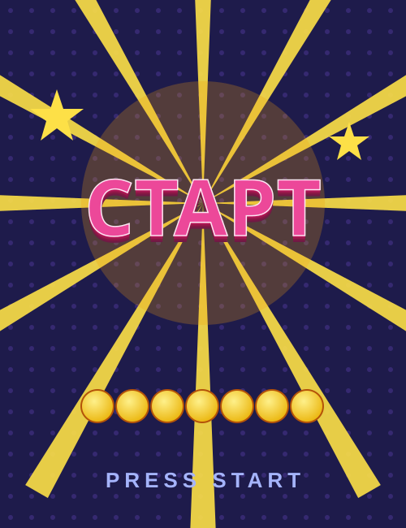

# Урок 12 — Переходы, 3D и узоры: аркадный постер 🕹️✨

**Модуль 3 · Векторная графика · Урок 12 из 13 | 2 ак.ч. (1,5 часа)**

> 🔁 В начале — [разминка/повтор](повторение.md) (5 мин).
> 👨‍🏫 Сценарий с хронометражом — в [преподавателю.md](преподавателю.md).
> 🖼 Референсы и что показать — в [изображения.md](изображения.md) и в конце («Материалы»).
> ⚠️ Всё делаем **вручную**, без ИИ.
> 🎁 Ещё проекты (игровой интерфейс, значки) — в [Копилке проектов](../ДОП-ЗАДАНИЯ-illustrator.md).

> 🧭 **Как читать урок.** Последний «инструментальный» урок Illustrator — три мощных приёма разом: **Переход (Blend)** размножает и перетекает фигуры, **3D-эффект** делает объёмные буквы, **узоры (Pattern)** заливают фон повтором. Соберём **аркадный постер** 🕹️: лучи-солнце из Blend, объёмный 3D-заголовок «СТАРТ», ряд монеток и узорчатый фон. Каждый шаг — **до кнопки**: что нажать, где, что увидишь, зачем, ошибка. Слово на постере — **своё** (не бренд игры).

---

## 🎬 Что мы сделаем сегодня и что получим

**Задача:** собрать яркий **постер в стиле ретро-аркады**: **узорчатый фон**, за заголовком — **лучи-солнце** (сделаны Переходом из двух линий), сам заголовок — **объёмный 3D-текст**, а снизу — **ряд монеток** (тоже Переход) и звёзды.

**В итоге у тебя получится:** сочный **игровой постер** 🕹️, который можно печатать или ставить на обложку. Экспорт **SVG/PNG**.

**Главный навык урока:** **Переход (Blend)** (перетекание/размножение), **3D-эффект** (объём букв), **узоры-паттерны** (Pattern). Это финальные «спецэффекты» вектора — постеры, принты, игровые UI.

> 💡 Секрет: **Переход** — это «клонировать между». Ставишь две фигуры — Illustrator рисует **все промежуточные**. Так делают лучи, ряды, объёмные линии, длинные тени, неон.

**🖼 Вот что должно получиться:**

---

## 🧭 Где что находится (Blend, 3D, узоры)

- **Переход (Blend):** `Объект → Переход → **Создать**` (`Alt+Ctrl+B`). Настройка — `Объект → Переход → **Параметры перехода**` (Интервалы: «Заданное число шагов» / «Плавный цвет»). «Запечь» — `Объект → Переход → **Разобрать**`.
- **3D:** `Эффект → **3D и материалы** → Выдавливание и фаска…` *(в старых версиях: `Эффект → 3D → Выдавливание и скос`)*. Крутить — **кубик**-виджет или поля углов; «Глубина выдавливания» = толщина.
- **Узоры (Pattern):** `Объект → **Узор** → Создать` (сделать свой) **или** `Окно → Библиотеки образцов → Узоры → …` (готовые). Применяется как **заливка**: выделил фигуру → клик по образцу-узору.
- **Панель «Образцы»** — `Окно → Образцы` (тут узоры и цвета).
- **Заливка/обводка, порядок, выравнивание** — как в прошлых уроках.

> ⚠️ **Про старые уроки:** «Переход» иногда зовут «Blend/Перетекание»; `Command`=`Ctrl`. 3D-меню в новых версиях — **«3D и материалы»**.

---

## Часть 1 — Узорчатый фон (10 минут)

1. `Файл → Создать` → RGB, пиксели, **1000 × 1300** (постер-вертикаль).
2. **Фон:** «Прямоугольник» (`M`) → клик → **1000 × 1300** → залей тёмно-синим **#1E1B4B**. Поставь в (0,0).
3. **Узор поверх:**
   - Способ А (готовый): `Окно → Библиотеки образцов → Узоры → Базовая графика_Точки`. Нарисуй ещё прямоугольник поверх фона → **кликни образец-узор** — он зальётся точками. Задай цвет узора посветлее, непрозрачность ~15% (панель «Прозрачность»).
   - Способ Б (свой): нарисуй маленький **крестик/звёздочку** → `Объект → Узор → Создать` → в окне «Параметры узора» тип «Кирпич по горизонтали», «Готово» вверху. Узор появится в «Образцах» → залей им прямоугольник.

**👀 Что видишь:** тёмный фон с лёгким повторяющимся узором — «ретро-экран».

> 💡 **Узор = одна фигура, размноженная сеткой.** Меняешь исходную плитку — меняется весь фон. Держи узор **бледным** (фон, а не главное).

---

## Часть 2 — Лучи-солнце (Переход) (12 минут)

Лучи за заголовком сделаем **Переходом** из **двух** линий/треугольников.

1. Нарисуй **тонкий треугольник-луч** (острый клин) от центра постера вверх, светло-жёлтый **#FDE047**.
2. Сделай **копию** и **поверни** её вокруг **центра** на, скажем, **160°** в другую сторону (инструмент «Поворот» `R`: `Alt`-клик по центру → задай угол → «Копировать»). Теперь два луча — крайний левый и крайний правый.
3. Выдели **оба луча** → `Объект → Переход → **Создать**` (`Alt+Ctrl+B`). 👀 Между ними появится **веер лучей**!
4. Настрой количество: `Объект → Переход → **Параметры перехода**` → «Интервалы: **Заданное число шагов**», число **10–14** → ОК. Лучи стали ровным **солнцем-веером**. ☀️
5. Поставь веер **за** будущим заголовком (по центру), уведи назад (`Ctrl+[`), но выше фона.

**👀 Что произойдёт:** классические аркадные лучи, расходящиеся из центра.

> ⚠️ **Ошибка:** взять «Плавный цвет» вместо «Число шагов» — получится мутный градиент, а не отдельные лучи. Для лучей — **Заданное число шагов**.

> 💡 **Переход крутит по кругу?** Он идёт «по прямой» между фигурами. Чтобы лучи легли веером, вращай копию **вокруг общего центра** — тогда переход пойдёт по дуге.

---

## Часть 3 — 3D-заголовок (14 минут)

1. **«Текст»** (`T`) → впиши **своё** слово: **СТАРТ** (или PLAY, УРОВЕНЬ — не бренд). Крупный жирный шрифт, размер ~**180 пт**, цвет яркий **#EC4899** (маджента).
2. Выдели текст (`V`).
3. `Эффект → **3D и материалы** → **Выдавливание и фаска…**` *(старые версии: `Эффект → 3D → Выдавливание и скос`)*.
4. В окне:
   - Покрути **кубик**-виджет (или задай углы, напр. X **−18°**, Y **−26°**) — буквы развернутся в объём.
   - **«Глубина выдавливания» ~ 60–90 пт** — толщина «бока» букв.
   - *(по желанию)* «Фаска» — скруглённый край.
   - Галочка «Просмотр» → ОК.
5. 👀 **Что произойдёт:** плоские буквы стали **объёмными**, с боковой гранью — как аркадная вывеска.

> 💡 3D — **живой эффект** (в «Внешний вид»): двойной клик → правь угол/глубину в любой момент. «Запечь» — `Объект → Разобрать оформление`.

> ⚠️ **Ошибка:** глубина 300 — буквы «разъедутся» в кашу. 60–90 достаточно; смотри превью.

---

## Часть 4 — Монетки и звёзды (Переход) + сборка (10 минут)

1. **Ряд монеток:** нарисуй **одну** монетку (круг **50 × 50**, золотой градиент #FDE047→#EAB308, обводка тёмная). Сделай **копию** справа (на другом конце постера, `Shift`+перетаскивание — по прямой).
2. Выдели **обе** → `Объект → Переход → Создать` → «Параметры»: **Число шагов 6** → ровный **ряд монеток**. 💰
3. **Звёзды-искры:** инструмент «Звезда» → пара звёзд, раскидай по углам (можно с эффектом «Втягивание» из урока 9).
4. **Собери постер:** фон (низ) → узор → лучи → 3D-заголовок → монетки/звёзды (верх). Проверь порядок (`Ctrl+]`/`Ctrl+[`).
5. **Подпись снизу:** мелкий текст «PRESS START» / «НОВАЯ ИГРА» (своё).

**Ожидаемый результат:** цельный аркадный постер — узор, лучи, 3D-текст, монетки. 🕹️✨

---

## ✅ Как правильно / ❌ Как НЕ надо (Blend, 3D, узоры)

| ❌ Как НЕ надо | ✅ Как правильно |
|----------------|------------------|
| Рисовать 12 лучей/монеток вручную | **Переход (Blend)** — 2 фигуры → много |
| Blend «Плавный цвет» для лучей | Для лучей/рядов — **«Число шагов»** |
| 3D-глубина 300 (каша) | Глубина **60–90**, смотреть превью |
| Яркий, кричащий узор на весь фон | Узор **бледный** (фон, не главное) |
| Всё в кучу, порядок «как вышло» | Порядок: фон→узор→лучи→3D→монетки |
| Слово-бренд игры | **Своё** слово (СТАРТ/УРОВЕНЬ/PLAY) |

> ⚠️ Главная ошибка — **делать руками то, что делает Переход**. Две фигуры + Blend = ряд, веер, объёмная линия, длинная тень. Экономит часы.

---

## Часть 5 — Экспорт (5 минут)

1. `Файл → Сохранить как` → **.ai** (рабочий).
2. `Файл → Экспортировать → Экспортировать как…` → **PNG** (постер) или **SVG**. Для печати — крупный PNG (300 ppi).

> 💡 3D и узоры при экспорте лучше сперва **«Разобрать оформление»** — вид в файле точно совпадёт с экраном.

---

## 🎓 Часть 6 — Для 9–11: глубже (8 минут)

- **Blend по траектории:** сделай переход, потом `Объект → Переход → Заменить траекторию` кривой — фигуры «поедут» по дуге/волне (гирлянда, дорожка).
- **Blend-неон:** толстая тёмная линия + тонкая светлая поверх → Переход «Плавный цвет» = свечение неона.
- **3D-материалы/свет** (новые версии): задай материал (глянец/металл) и источник света 3D-заголовку.
- **Свой узор** сложнее (иконки/еда) + разный масштаб плитки.
- **Игровой UI:** собери не постер, а **экран игры** (кнопки, полоска жизней, счёт) из этих приёмов.

---

## 🧩 Для 5–7 классов (проще)

- **Готовый узор** из библиотеки (не делать свой).
- Лучи/монетки — Переход из 2 фигур (число шагов дать готовое).
- 3D — только **«Выдавливание»** с готовыми углами (не крутить долго).

---

## 🏁 Итог урока (5 минут)

Сегодня освоили **три спецэффекта** вектора:

- ✅ **Переход (Blend):** 2 фигуры → веер лучей, ряд монеток («Число шагов»).
- ✅ **3D-эффект:** объёмный заголовок (Выдавливание, глубина, поворот кубиком).
- ✅ **Узоры (Pattern):** повторяющийся фон (готовый или свой).
- ✅ **Сборка постера** + порядок слоёв + экспорт.

> 🏆 Ты умеешь размножать, «объёмить» и «узорить»! Дальше — **финал модуля** (урок 13): собираем **бренд-набор** из всего, что научились, и **защищаем**.

> 🎤 **Блиц:** что делает Переход? какие «Интервалы» для лучей? чем делают объём букв? откуда узоры? почему узор держим бледным?

### 🎮 Викторина-закрепление

Открой **[викторина.html](викторина.html)** — вопросы про Переход, 3D и узоры + смешные и «на подумать».

➡️ **Самостоятельная работа** (свой постер/бейдж + комбо) — в [практике](практика.md).
🧰 **Трюки урока** (Blend, 3D, узоры) — в [лайфхак.md](лайфхак.md).

---

## 🔗 Материалы и ссылки к уроку

**🧰 Инструмент:** Adobe Illustrator (по лицензии класса), русский интерфейс.

**📥 Референсы (для вдохновения, НЕ копировать):**
- 🕹️ **Ретро-постеры/аркады:** поиск — *retro arcade poster*, *sunburst rays vector*, *3d text illustrator*.
- 🔤 **Жирные шрифты:** [Google Fonts](https://fonts.google.com/) (Bebas Neue, Luckiest Guy).
- 🎁 **Готовые туториалы** (игровой интерфейс): [Копилка проектов](../ДОП-ЗАДАНИЯ-illustrator.md).

**🎬 Вдохновение:** YouTube (рус.): *«переход Blend Illustrator»*, *«3D текст Illustrator»*, *«узоры паттерны Illustrator»*.

**⚙️ Учителю:** показать Blend (2 фигуры → веер) и 3D-выдавливание на проекторе; приготовить жирный шрифт и пример узора. Список — в [изображения.md](изображения.md).
