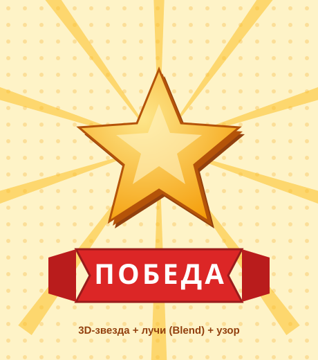

# Самостоятельная работа — Векторная графика, Урок 12

> 🧑‍🎓 Не повторяем «СТАРТ»! Делаешь **свой** постер/бейдж с Переходом, 3D и узором.

---

## ✅ Задание 1 (для всех) — «Свой постер/бейдж» (новый вызов)

Сделай **яркий постер или значок** на ДРУГУЮ тему (со **своим** словом, не бренд). Выбери **одну**:

- 🏅 **Медаль/бейдж** «ПОБЕДА» (3D-звезда + лучи-Blend + лента);
- 🎉 **Постер вечеринки** (3D-слово + узор-конфетти + гирлянда-Blend);
- 🚀 **Космо-постер** «ПОЛЁТ» (3D-текст + звёзды-Blend + узор-точки);
- 🏆 **Спорт-афиша** «ФИНАЛ» (3D-число + лучи + узор);
- 🕹 **Экран игры** (кнопки, счёт, полоса жизней — игровой UI).

**🖼 Пример результата** (бейдж «ПОБЕДА» — 3D-звезда + лучи-Blend + узор):

**Обязательные условия:**
- [ ] Использован **Переход (Blend)** (лучи/ряд/гирлянда — 2 фигуры → много);
- [ ] Есть **3D-эффект** (объёмный текст или фигура);
- [ ] **Узор-фон** (готовый из библиотеки или свой);
- [ ] Порядок слоёв аккуратный; слово — **своё** (не бренд);
- [ ] Экспорт **PNG** (+ .ai).

---

## 🔗 Задание 2 (комбо, уроки 8/11 + 12) — «Постер с героем»

Свяжи с прошлым:
- посади на постер своего **персонажа** (урок 8) или **поп-арт** (урок 11);
- добавь ему **3D-подставку** или **лучи-Blend** позади;
- узор-фон в тон.

**Результат:** афиша с твоим героем в центре.

---

## ⚡ Задание 3 (разминка-челлендж) — Blend за 5 минут

**За 5 минут:** сделай **ряд из 8 кружков** (2 круга → `Объект → Переход → Создать` → «Число шагов 6») и **веер лучей** (2 повёрнутых треугольника → Переход). Тренируем главный приём — «2 фигуры → много».

---

## 📋 Что проверяем

- [ ] Постер/бейдж — **свой** (не урочный «СТАРТ»), слово не бренд;
- [ ] Есть **Переход**, **3D**, **узор**;
- [ ] Аккуратный порядок; экспорт PNG + .ai;
- [ ] Сделано **«Комбо»** (герой/поп-арт на постере).

## 🧩 Для 5–7 классов
- Узор — готовый из библиотеки. Переход — из 2 фигур (число шагов готовое). 3D — только «Выдавливание» с готовыми углами.

## 🎓 Для 9–11 классов
- **Blend по траектории** (гирлянда по дуге) и **Blend-неон** (свечение).
- **3D-материалы/свет** (новые версии).
- Полноценный **игровой UI-экран**.

## 🖼 Галерея «Аркада класса»
Сдай постер — соберём ретро-стену. Голосуем: **самый сочный 3D** и **самый крутой Blend**.

## Что сдать
- `постер_*.png` (+ `.ai`) (Задание 1) + постер с героем (Задание 2).
