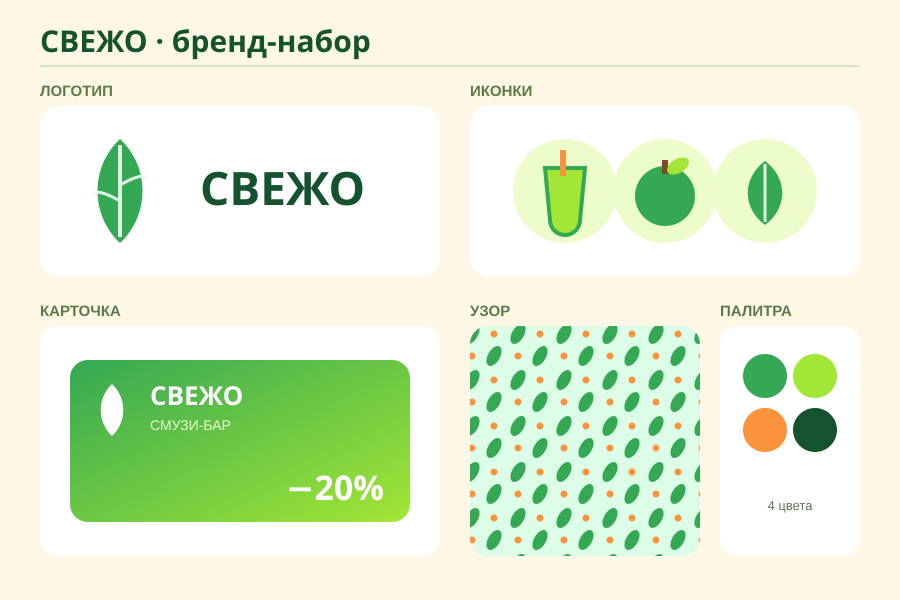

# Урок 13 — 🏆 ФИНАЛ: бренд-набор и защита 🎨🚀

**Модуль 3 · Векторная графика · Урок 13 из 13 (ФИНАЛ модуля) | 2 ак.ч. (1,5 часа)**

> 🔁 В начале — [разминка/повтор всего модуля](повторение.md) (5 мин).
> 👨‍🏫 Сценарий с хронометражом — в [преподавателю.md](преподавателю.md).
> 🖼 Референсы бренд-бордов и что показать — в [изображения.md](изображения.md) и в конце («Материалы»).
> ⚠️ Всё делаем **вручную**, без ИИ.
> 🎁 Идеи и проекты — в [Копилке проектов](../ДОП-ЗАДАНИЯ-illustrator.md).

> 🧭 **Как читать урок.** Это **дипломный** урок вектора — сегодня **не новый инструмент**, а **сборка всего** в одну сильную работу: **фирменный набор** (бренд-бук) для придуманной марки. Логотип, иконки, карточка, узор — всё в **едином стиле**. И в конце — **защита**: расскажешь про свой бренд. Идём сквозным примером — делаем бренд смузи-бара **«СВЕЖО»** 🥤. Каждый шаг ссылается на уже изученные приёмы (с точными кнопками), но собирает их **в систему**.

---

## 🎬 Что мы сделаем сегодня и что получим

**Задача:** придумать **свою марку** и собрать её **фирменный набор**: 🏷 **логотип** (знак + название), 🍏 **набор иконок**, 🎫 **карточка** (лояльности/визитка), 🔁 **узор-паттерн** — всё в **одной палитре и стиле**. Разложить это на **презентационном листе** (бренд-борд).

**В итоге у тебя получится:** цельный **бренд-набор** 🎨 — как настоящий гайд фирменного стиля. Плюс — **защита** работы. Это твоя **дипломная работа** модуля вектора и сильный лист портфолио.

**Главный «навык» урока:** **сборка и единство** — как соединить логотип, иконки, карточку и узор в **одну систему** через **единую палитру** и стиль. Плюс — **презентация** своей работы.

> 💡 Секрет фирменного стиля: **всё из одной палитры и в одном характере**. 3–4 цвета, один тип форм (округлые/острые), один тип линий — и разные элементы выглядят «родными».

**🖼 Вот что должно получиться** (бренд-борд: логотип, иконки, карточка, узор, палитра):

---

## 🧭 Где что находится (это сборка — вспоминаем инструменты)

Сегодня новых кнопок нет — **комбинируем** изученное:

- 🎨 **Палитра как образцы:** `Окно → Образцы` — сюда сохраним 3–4 фирменных цвета (перетащи цвет из «Заливки» на панель «Образцы»). Дальше **всё** красим из них.
- 🏷 **Логотип:** перо + отражение (урок 6) или фигуры (урок 5), «Соединение» (Обработка контуров).
- 🍏 **Иконки:** фигуры + **Обработка контуров** (урок 5).
- 🎫 **Карточка:** прямоугольник + **градиент** (урок 7) + текст.
- 🔁 **Узор:** `Объект → Узор → Создать` (урок 12).
- 🖼 **Раскладка:** монтажная область / большой прямоугольник-подложка; выравнивание (`Shift+F7`).
- 📤 **Экспорт:** `Файл → Экспортировать как…` (PNG/SVG) + `.ai`.

> 💡 Держи **все цвета в «Образцах»**. Тогда любой новый элемент — из той же палитры, и набор «звучит» как одно целое.

---

## Часть 0 — Придумай бренд (на бумаге, 5 минут)

До компьютера реши **4 вещи** (запиши):

1. **Что за марка** (наш пример: смузи-бар **«СВЕЖО»**).
2. **Символ/идея** логотипа (капля-листик = «свежесть»).
3. **Палитра 3–4 цвета** (зелёный #34A853, лайм #A3E635, оранж #FB923C, крем #FFF7E6).
4. **Характер** (округлый, сочный, добрый) → значит формы мягкие, цвета яркие.

> 💡 **Название + идея + палитра** — фундамент. Реши их сразу, иначе элементы «разъедутся» по стилю.

---

## Часть 1 — Палитра в «Образцы» (6 минут)

1. `Файл → Создать` → RGB, пиксели, **1600 × 1120** (лист бренд-борда).
2. Открой `Окно → **Образцы**`.
3. Для каждого фирменного цвета: нарисуй маленький квадрат → задай цвет (двойной клик по «Заливке» → `#`) → **перетащи «Заливку» на панель «Образцы»** (или кнопка «Новый образец» внизу панели). Сделай так все **4 цвета**.

**👀 Что видишь:** в «Образцах» — твоя фирменная палитра. Теперь красим **только из неё**.

> ⚠️ **Ошибка:** брать случайные цвета «на глаз» для каждого элемента — набор развалится. Всё — **из образцов**.

---

## Часть 2 — 🏷 Логотип (14 минут)

Собери **знак + название** (приёмы урока 6).

1. **Знак «капля-листик»:** «Эллипс» (`L`) → овал **90 × 120** → «Прямым выделением» (`A`) потяни **верхнюю** точку вверх и сделай острой (кнопка «Преобразовать… в углы») → капля. Залей зелёным (образец).
2. **Прожилка листа:** тонкая линия по центру (обводка кремом) или маленький вырез (Минус верхний) — «листик».
3. *(симметрия)* если знак симметричный — рисуй половину и **Отражение → «Копировать»** (урок 6), потом «Соединение».
4. **Название:** «Текст» (`T`) → **СВЕЖО** жирным, цвет тёмно-зелёный (образец), рядом со знаком.
5. Сгруппируй знак + название (`Ctrl+G`) → это **логотип**. Проверь: **читается ли маленьким** (уменьши до аватарки).

**Ожидаемый результат:** аккуратный логотип марки.

---

## Часть 3 — 🍏 Набор иконок (12 минут)

Сделай **3 иконки** в том же стиле и палитре (приёмы урока 5).

1. Например: 🥤 **стакан** (скруглённый прямоугольник + эллипс-напиток), 🍏 **фрукт** (круг + листик), 🌿 **листик** (эллипс, заострить точки).
2. Собирай из фигур, где нужно — **Обработка контуров** (Соединение/Минус верхний/Пересечение).
3. Крась **только из образцов**. Держи **единый размер** (например, всё в квадрате 200×200) и одинаковые скругления.

**👀 Что видишь:** три иконки-«семья» — как в меню приложения бренда.

> ⚠️ **Ошибка:** иконки разного стиля (одна острая, другая пухлая) — не «семья». Один характер форм на весь набор.

---

## Часть 4 — 🎫 Карточка (10 минут)

Собери **карту лояльности/визитку** (приёмы урока 7).

1. «Прямоугольник» (`M`) → **500 × 300**, скругление **24**.
2. Залей **градиентом** из фирменных цветов (зелёный → лайм), приём урока 7.
3. Помести **логотип** (копия) в угол, добавь текст («−20% на смузи» / имя-должность).
4. Мелкие детали — из образцов.

**Ожидаемый результат:** фирменная карточка в стиле бренда.

---

## Часть 5 — 🔁 Узор-паттерн (8 минут)

Сделай **фирменный узор** (приём урока 12).

1. Возьми **иконку-листик** (или мелкий значок) → сделай **1–2 копии**, раскидай в маленьком квадрате.
2. Выдели их → `Объект → **Узор** → Создать` → в окне «Параметры узора» тип «Кирпич по горизонтали» → вверху **«Готово»**. Узор попал в «Образцы».
3. Нарисуй прямоугольник → залей этим узором. 👀 Фирменный повторяющийся фон/обёртка.

**Ожидаемый результат:** узор из фирменного элемента — для упаковки/фона.

---

## Часть 6 — Бренд-борд и экспорт (10 минут)

Разложи всё **на одном листе** — как гайд стиля.

1. **Подложка:** большой прямоугольник кремового цвета (образец) на весь лист.
2. Разложи **блоками** с подписями: **Логотип**, **Иконки**, **Карточка**, **Узор**, **Палитра** (4 цветных кружка).
3. **Выравнивание:** `Shift+F7` — ровняй блоки по сетке (включи `Просмотр → Быстрые направляющие` `Ctrl+U`).
4. Сверху — **название бренда** и слоган.
5. **Экспорт:** `Файл → Сохранить как` → **.ai**; `Файл → Экспортировать как…` → **PNG** (для показа/портфолио) и **SVG**.

**Ожидаемый результат:** аккуратный **бренд-борд** — логотип, иконки, карточка, узор, палитра на одном листе. 🎨

---

## 🎤 Часть 7 — Защита (главное финала!)

Каждый выходит с бренд-бордом и за **1 минуту** отвечает:

- **Что за марка** (название, что продаёт/делает)?
- **Идея логотипа** (почему такой знак/цвета)?
- **Какие приёмы модуля** использовал (назови 3–4: перо/отражение, Обработка контуров, градиент, узор, компоненты)?
- **Что было сложнее всего** и чем **гордишься**?

> 💡 Защита — это **презентация дизайнера**. Уметь объяснить свой стиль и решения ценится не меньше самой работы. Пригодится в любом деле.

---

## ✅ Как правильно / ❌ Как НЕ надо (фирменный стиль)

| ❌ Как НЕ надо | ✅ Как правильно |
|----------------|------------------|
| Каждый элемент своей палитрой | **Одна палитра** (из «Образцов») на всё |
| Логотип острый, иконки пухлые | **Один характер форм** на весь набор |
| Логотип из мелких деталей | **Простой** знак, читается маленьким |
| Всё свалено без выравнивания | Бренд-борд **по сетке**, с подписями |
| «Просто красиво», без идеи | **Идея**: название + смысл знака + палитра |
| Показать молча | **Защитить** — рассказать о решениях |

> ⚠️ Главная ошибка финала — **разнобой**: элементы из разных «миров». Спасают **единая палитра + единый характер форм + выравнивание**.

---

## 🎓 Часть 8 — Для 9–11: глубже (8 минут)

- **Гайд стиля:** добавь правила (отступы логотипа, что нельзя делать, размеры), мокапы (логотип на стакане/вывеске).
- **Компоненты/стили** (Figma): собери набор как переиспользуемые компоненты + стили цвета.
- **Тёмная/светлая версия** логотипа; одноцветный вариант.
- **Анимация-тизер** (мостик к Animate): как логотип «собирается».

---

## 🧩 Для 5–7 классов (проще)

- Хватит **логотипа + 2 иконок + карточки** в одной палитре (узор — по желанию).
- Знак — из **фигур** (без сложного пера).
- Палитру берём **готовую** (3 цвета), главное — **везде одинаковые**.

---

## 🏁 Итог урока и МОДУЛЯ (5 минут)

Сегодня собрали **дипломную работу** вектора — фирменный набор:

- ✅ **Идея:** название + смысл знака + палитра.
- ✅ **Единство:** одна палитра (Образцы) + один характер форм.
- ✅ **Сборка:** логотип + иконки + карточка + узор из приёмов модуля.
- ✅ **Бренд-борд** по сетке + экспорт.
- ✅ **Защита:** рассказал о бренде и решениях.

> 🏆 **Ты прошёл весь вектор — Figma и Illustrator!** От первой иконки до фирменного стиля. Это серьёзный навык дизайнера. Впереди — **Модуль 4: Анимация (Adobe Animate)** — оживим то, что научились рисовать!

> 🎤 **Блиц:** что держит набор единым? почему логотип должен быть простым? какие приёмы ты соединил? зачем защита?

### 🎮 Викторина-закрепление (по всему модулю!)

Открой **[викторина.html](викторина.html)** — вопросы по всему вектор-модулю (Figma + Illustrator) + смешные и «на подумать».

➡️ **Самостоятельная работа** (свой бренд другой темы + комбо) — в [практике](практика.md).
🧰 **Трюки урока** (единство, бренд-борд, защита) — в [лайфхак.md](лайфхак.md).

---

## 🔗 Материалы и ссылки к уроку

**🧰 Инструмент:** Adobe Illustrator и/или Figma (по лицензии/бесплатно), русский интерфейс.

**📥 Референсы (для вдохновения, НЕ копировать):**
- 🎨 **Бренд-борды / гайды стиля:** поиск — *brand board*, *logo icon pattern brand kit*, *brand style guide*.
- 🌈 **Палитры:** [Coolors](https://coolors.co/).
- 🔤 **Шрифты:** [Google Fonts](https://fonts.google.com/).
- 🎁 **Проекты:** [Копилка проектов](../ДОП-ЗАДАНИЯ-illustrator.md).

**🎬 Вдохновение:** YouTube (рус.): *«фирменный стиль Illustrator»*, *«бренд-бук»*, *«brand board»*.

**⚙️ Учителю:** показать «единая палитра держит стиль» и раскладку бренд-борда; провести **защиту** (регламент 1 мин, опорные вопросы). Список — в [изображения.md](изображения.md).
