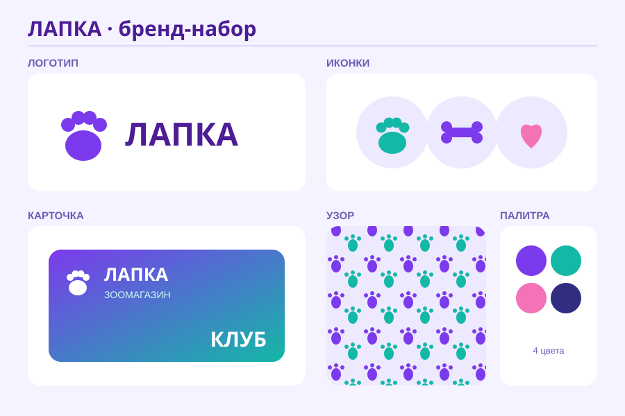

# Самостоятельная работа — Векторная графика, Урок 13 (ФИНАЛ)

> 🧑‍🎓 Не повторяем «СВЕЖО»! Делаешь **свой** бренд-набор другой темы — это дипломная работа и лист портфолио.

---

## ✅ Задание 1 (для всех) — «Свой бренд-набор» (новый вызов)

Придумай **свою марку** (ДРУГУЮ, не смузи-бар) и собери её фирменный набор. Выбери **тему**:

- 🐾 **Зоомагазин / приют** (мордочка-маскот, лапка);
- 🎮 **Гейм-студия** (пиксель/джойстик, дерзкие цвета);
- 🍰 **Пекарня / кафе** (кекс, чашка, тёплые цвета);
- 🛹 **Скейт/спорт-бренд** (молния, звезда, яркий);
- 🚀 **Космо-стартап** (ракета/планета, тёмно-синий).

**🖼 Пример результата** (другой бренд — зоомагазин «ЛАПКА», своя палитра):

**Обязательные условия (настоящий бренд-набор):**
- [ ] **Логотип** (знак + название) — читается маленьким;
- [ ] **2–3 иконки** в одном стиле;
- [ ] **Карточка** (визитка/лояльность) с логотипом;
- [ ] **Узор-паттерн** из фирменного элемента;
- [ ] **Единая палитра** (3–4 цвета из «Образцов») на всё;
- [ ] Разложено на **бренд-борде** с подписями; экспорт **PNG + .ai**;
- [ ] Готов **защитить** (название, идея, приёмы).

**Марка — своя** (не копия реального бренда/лого).

---

## 🔗 Задание 2 (комбо, весь модуль) — «Мокап и спецэффект»

Усложни, вплетя приёмы:
- 🖼 покажи логотип **на мокапе** (на стакане/футболке/вывеске — нарисуй простой предмет и налепи лого);
- ✨ добавь **3D** (урок 12) или **глянец** (урок 7) к знаку;
- 🔲 сделай **тёмную и светлую** версии логотипа.

**Результат:** бренд выглядит «как в жизни».

---

## ⚡ Задание 3 (разминка-челлендж) — палитра-единство (5 минут)

**За 5 минут:** сохрани **3 цвета** в «Образцы» и нарисуй **3 разные фигуры**, покрась **только из образцов**. Убедись: даже случайные фигуры смотрятся «семьёй». Тренируем главный секрет стиля — единую палитру.

---

## 📋 Что проверяем

- [ ] Бренд — **свой, другая тема** (не урочный смузи-бар);
- [ ] Есть логотип + иконки + карточка + узор;
- [ ] **Единая палитра** и характер форм;
- [ ] Бренд-борд по сетке; экспорт PNG + .ai;
- [ ] Сделано **«Комбо»** (мокап / 3D-глянец / версии);
- [ ] Готова **защита**.

## 🧩 Для 5–7 классов
- Логотип + 2 иконки + карточка в **одной палитре** (узор по желанию). Знак — из фигур. Палитра готовая.

## 🎓 Для 9–11 классов
- Полный **гайд стиля** (правила, мокапы, версии лого).
- Собрать как **компоненты/стили** в Figma.
- Анимация-тизер сборки логотипа (мостик к Animate).

## 🖼 Галерея «Бренды класса» + защита
Развесим все бренд-борды. Каждый **защищает** (1 мин): марка, идея, приёмы, гордость. Голосуем: **лучший стиль**, **самая сильная идея**, **приз зрительских симпатий**.

## Что сдать
- `бренд_*.png` (+ `.ai`) — бренд-борд (Задание 1) + мокап/версии (Задание 2). В **портфолио**! 🏆
