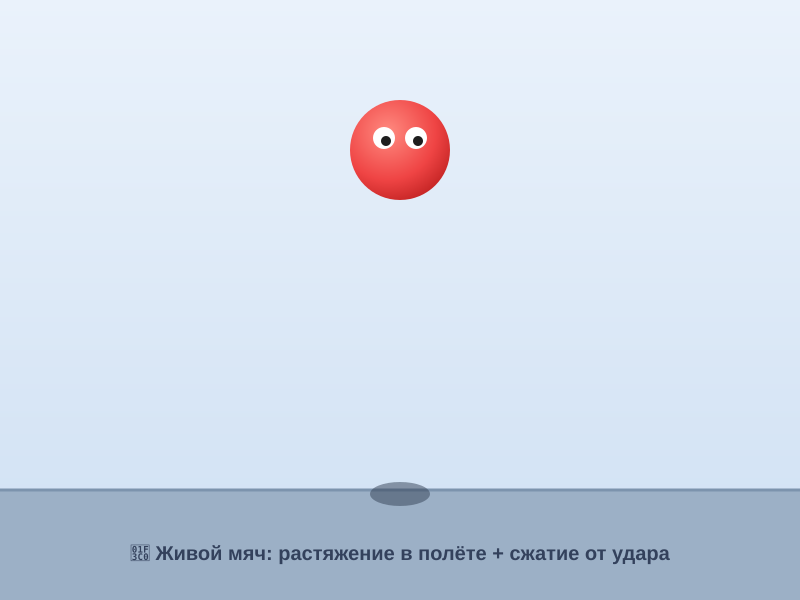

# Урок 1 — Таймлайн и «Живой мяч»: анимация с характером 🏀✨

**Модуль 4 · Анимация в Adobe Animate · Урок 1 из 5 | 2 ак.ч. (1,5 часа)**

> 🔁 В начале — [разминка/повтор](повторение.md) (5 мин).
> 👨‍🏫 Сценарий с хронометражом — в [преподавателю.md](преподавателю.md).
> 🖼 Что показать и материалы — в [изображения.md](изображения.md) и в конце («Материалы»).
> ⚠️ Всё делаем **вручную**, без ИИ.
> 🎞 **Рендер результата** (реально двигается) — [`изображения/результат-мяч.svg`](изображения/результат-мяч.svg), открой в браузере.

> 🧭 **Как читать урок.** Это **первый урок анимации** — учимся оживлять картинку по **кадрам** на **таймлайне**. Сквозной проект — **«Живой мяч»** 🏀: он прыгает не «как деревяшка», а **с характером** — вытягивается в полёте и **сплющивается** от удара (принцип мультипликаторов **сжатие-растяжение**). Потом превратим его в **символ** и заставим **улететь** одной командой (анимация движения). Каждый шаг расписан **до кнопки и до номера кадра**: что нажать, где, что увидишь, зачем, ошибка.

---

## 🎬 Что мы сделаем сегодня и что получим

**Задача:** оживить мяч! Нарисуем его, а на **таймлайне** по кадрам заставим **прыгать** — с вытягиванием в полёте и сплющиванием об пол. Добавим **глазки** — и мяч «оживёт». Потом сделаем его **символом** и **анимацией движения** отправим за край экрана. Сохраним как **GIF**.

**В итоге у тебя получится:** живой прыгающий мяч 🏀 (GIF, который можно кинуть другу) + файл `.fla` со всеми кадрами.

**Главный навык урока:** **кадры и таймлайн** (ключевые кадры, «луковичная кожа»), **символ** (`F8`) и **анимация движения** (motion tween), а также два принципа: **сжатие-растяжение** и **тайминг** (быстро/медленно = вес и жизнь).

> 💡 Секрет «живого» движения: **мяч не остаётся кругом**. В быстром полёте он **вытянут** (растяжение), а в момент удара — **сплющен** (сжатие). Мозг читает это как «упругий и живой».

**🎞 Вот что должно получиться** (открой в браузере — **двигается!**):

---

## 🧭 Где что находится в Animate (запомни — весь модуль)

- **Сцена (Stage)** — большой белый прямоугольник **по центру**: это «экран» мультика.
- **Временная шкала (Timeline)** — **внизу**: строка **кадров** (ячейки) + **слои** слева. Кадр = один «снимок» мультика. Внизу шкалы — **частота кадров (к/с, FPS)**.
- **Панель инструментов** — **слева**: «Выделение» (`V`), «Овал» (`O`), «Прямоугольник» (`M`), «Свободное трансформирование» (`Q`), «Текст» (`T`).
- **Панель «Свойства»** — **справа**: цвет заливки/обводки, размер, параметры кадра/анимации.
- **Библиотека (Library)** — справа (вкладка): хранит **символы**.
- **Ключевые клавиши кадров:** `F6` — **ключевой кадр** (копия), `F7` — **пустой** ключевой, `F5` — продлить кадр, `Shift+F5` — удалить.

> 💡 **Кадр vs ключевой кадр.** Ключевой кадр (●) — где ты **что-то поменял** (новое положение/форма). Обычный кадр — «то же самое держится». Анимация = цепочка ключевых кадров.

---

## Часть 1 — Новый документ (6 минут)

1. **`Файл → Создать`** → тип **«HTML5 Canvas»** (подходит для GIF/веба). Задай **Ширина 800, Высота 600**, **Частота кадров 24** (к/с) → «Создать».
2. Внизу — **Временная шкала** с одним слоем «Слой_1» и кадром 1.
3. **Пол:** возьми «Прямоугольник» (`M`) → нарисуй узкую полосу внизу сцены (пол), залей серым. *(Лучше на отдельном слое: внизу шкалы кнопка «Новый слой», назови «фон».)*

**👀 Что видишь:** пустая сцена с полом и таймлайн внизу. Готовы анимировать.

> ⚠️ **Типичная ошибка:** рисовать мяч и пол на **одном** слое — потом мяч не подвигать отдельно. Держи **пол на своём слое**, мяч — на своём.

---

## Часть 2 — Рисуем мяч (6 минут)

Новый слой **«мяч»** (кнопка «Новый слой» внизу шкалы).

1. «Овал» (`O`) → с `Shift` (ровный круг) нарисуй мяч **~100 × 100** в **верхней** части сцены. Залей ярким (красный).
2. **Глазки:** два маленьких белых круга + тёмные зрачки — мяч «ожил». Блик-точка.
3. Выдели весь мяч (`V`, рамкой) → сгруппируй (`Ctrl+G`), чтоб не рассыпался.

**👀 Что видишь:** мяч с глазами вверху сцены, на кадре 1.

---

## Часть 3 — Прыжок по кадрам + сжатие-растяжение (18 минут)

Оживим мяч **вручную по ключевым кадрам** — так понятнее всего.

### Шаг 1. Ставим ключевые кадры

На слое «мяч» будем ставить ключевые кадры и в каждом двигать/деформировать мяч. Инструмент деформации — **«Свободное трансформирование»** (`Q`).

- **Кадр 1** — мяч **вверху** (старт). Форма круглая.
- **Кадр 4:** кликни ячейку кадра 4 → `F6` (ключевой) → сдвинь мяч **ниже**; `Q` → **чуть вытяни по вертикали** (падает быстро — **растяжение**).
- **Кадр 6:** `F6` → мяч у **самого пола**, ещё **вытянут** вниз.
- **Кадр 7 (удар):** `F6` → мяч на полу, **сплющи** его: `Q` → **уменьши высоту, увеличь ширину** (широкий блин — **сжатие**).
- **Кадр 9 (отскок):** `F6` → мяч подпрыгнул вверх, снова **вытянут** вверх.
- **Кадр 12:** `F6` → мяч **вверху**, но **пониже** старта (потерял энергию), форма круглая.

**👀 Что произойдёт:** нажми **Enter** — мяч **прыгнет** с вытягиванием и сплющиванием. Живой!

### Шаг 2. «Луковичная кожа» — видеть соседние кадры

Внизу шкалы включи кнопку **«Луковичная кожа»** (Onion Skin) — увидишь **призраки** соседних кадров. Так удобно вести мяч по **дуге** и ровнять расстояния.

> 💡 **Тайминг:** мало кадров = **быстро**, много = **медленно**. У пола мяч быстрый (кадры близко), у вершины «зависает» (добавь лишний кадр). Так рождается «вес».

> ⚠️ **Главная ошибка новичка** — мяч остаётся **кругом** весь полёт: движение «мёртвое». Обязательно **вытягивай** в полёте и **сплющивай** в ударе.

---

## Часть 4 — Символ + анимация движения (улетаем) (12 минут)

Теперь — **автоматическая** анимация (motion tween). Для неё нужен **символ**.

1. Продли жизнь мяча: на кадре **20** слоя «мяч» нажми `F5` (кадры продлятся). Пусть после прыжка мяч ещё «живёт».
2. Выдели мяч (`V`) на последнем ключевом кадре → **`F8`** (Преобразовать в символ) → тип **«Фрагмент ролика»** (Movie Clip) → назови «мяч» → ОК. Символ попал в **Библиотеку**.
3. **Правый клик** по диапазону кадров мяча (после прыжка) → **«Создать анимацию движения»** (Create Motion Tween). Диапазон станет **синим/оранжевым**.
4. Встань на **последний** кадр этого диапазона → **передвинь символ мяча за правый край сцены**. 👀 Появится **пунктирная траектория** с точками — мяч сам поедет по ней и **укатится** за экран!
5. *(плавность)* Выдели tween → в «Свойствах» поставь **«Замедление» (Ease)** ~ **−30** (разгон) — мяч «разгоняется», уезжая.

**Ожидаемый результат:** мяч прыгнул (по кадрам) и **укатился** (анимацией движения). 🏀

> 💡 **Два способа анимации:** **по кадрам вручную** (полный контроль, для «живого» прыжка) и **анимация движения** (программа сама «дорисовывает» середину между началом и концом). Профи сочетают оба.

---

## ✅ Как правильно / ❌ Как НЕ надо (анимация движения)

| ❌ Как НЕ надо | ✅ Как правильно |
|----------------|------------------|
| Мяч весь полёт — ровный круг | **Растяжение** в полёте + **сжатие** в ударе |
| Все кадры на равном расстоянии | **Тайминг:** у пола быстро, у вершины «зависает» |
| Движение по прямой линии | Живое движется по **дуге** (луковичная кожа поможет) |
| Motion tween на простой фигуре | Сначала **`F8`** — символ (без символа tween не работает) |
| Пол и мяч на одном слое | **Каждый объект — свой слой** |
| Забыл частоту кадров | **24 к/с** — плавно (12 — «дёргано») |

> ⚠️ Главная ошибка — **«деревянное» движение** без сжатия-растяжения и тайминга. Именно они делают мяч «живым», а не просто «едущим».

---

## Часть 5 — Экспорт GIF (6 минут)

1. Проверь весь ролик: **Enter** (проиграть) или **листай кадры**.
2. **`Файл → Экспорт → Экспортировать анимированный GIF…`** → выбери размер/качество → «Экспорт» → папка.
3. Сохрани и **`.fla`** (`Файл → Сохранить`) — рабочий файл с кадрами.

**Ожидаемый результат:** файл `.gif` — прыгающий живой мяч, крутится в браузере/чате.

> 💡 Для видео (MP4) — `Файл → Экспорт → Экспортировать видео/медиа…` (через Adobe Media Encoder).

---

## 🎓 Часть 6 — Для 9–11: глубже (8 минут)

- **Летающий объект:** сделай символ бабочки/НЛО и пусти его **анимацией движения** по сцене; внутри символа — своя мини-анимация (крылья машут) = **вложенный символ**.
- **Идеальный тайминг:** настрой «зависание» у вершины (лишние кадры) и «удар» (резко) — почувствуй вес.
- **Тень под мячом:** отдельный слой — тёмный эллипс, который **сжимается**, когда мяч вверху, и **расширяется** у пола.
- **Классическая анимация** (Classic Tween) между двумя ключевыми кадрами — сравни с motion tween.

---

## 🧩 Для 5–7 классов (проще)

- Хватит **прыжка по 4–5 кадрам** (вверху → у пола сплющен → отскок) + глазки.
- Сжатие-растяжение — «Свободным трансформированием» (`Q`), не точно, а «на глаз».
- Motion tween — по желанию; можно только по кадрам.

---

## 🏁 Итог урока (5 минут)

Сегодня сделали **первую анимацию** — живой мяч:

- ✅ **Таймлайн и кадры:** ключевой кадр `F6`, продлить `F5`, «луковичная кожа».
- ✅ **Сжатие-растяжение:** вытянут в полёте, сплющен в ударе (`Q`).
- ✅ **Тайминг:** быстро у пола, «зависание» у вершины.
- ✅ **Символ** (`F8`) + **анимация движения** (укатился за экран).
- ✅ **Экспорт GIF** (+ `.fla`).

> 🏆 Ты оживил картинку! Дальше — **полёт по кривой траектории** (урок 2): пустим ракету по петле с разгоном.

> 🎤 **Блиц:** что такое ключевой кадр? зачем мяч сплющивается? что делает «луковичная кожа»? зачем `F8` перед motion tween? 24 или 12 к/с — плавнее?

### 🎮 Викторина-закрепление

Открой **[викторина.html](викторина.html)** — вопросы про кадры, таймлайн, сжатие-растяжение и символы + смешные и «на подумать».

➡️ **Самостоятельная работа** (свой прыгающий/летающий объект + комбо) — в [практике](практика.md).
🧰 **Трюки урока** (кадры, сжатие-растяжение, tween) — в [лайфхак.md](лайфхак.md).

---

## 🔗 Материалы и ссылки к уроку

**🧰 Инструмент:** Adobe Animate (по лицензии класса), русский интерфейс.

**📥 Материалы (свободные):**
- 🏀 **Мяч рисуем сами.** Хочешь готовый объект — свои работы из Модуля 3 (экспорт PNG) или [PNGImg](https://pngimg.com/) (`ball png`, `character png`).
- 🔊 **Звук «бонк» отскока** (пригодится в след. уроках): [Pixabay Sound](https://pixabay.com/sound-effects/) (`bounce`, `boing`), [Mixkit](https://mixkit.co/free-sound-effects/).

**🎬 Вдохновение:** поиск (Картинки/видео) — *bouncing ball animation squash stretch*, *animation timing chart*. YouTube (рус.): *«прыгающий мяч анимация»*, *«Adobe Animate для начинающих»*, *«motion tween Animate»*.

**⚙️ Учителю:** заранее собрать документ и прыжок до урока; показать «луковичную кожу» и сжатие-растяжение на проекторе. Список — в [изображения.md](изображения.md).
