# Самостоятельная работа — Анимация, Урок 1

> 🧑‍🎓 Не повторяем мяч! Оживляешь **свой** прыгающий/летающий объект с характером.

---

## ✅ Задание 1 (для всех) — «Свой прыгун» (новый вызов)

Оживи **другой** объект (не мяч), чтобы он двигался **с характером** (сжатие-растяжение + тайминг). Выбери **одну** идею:

- 💧 **Капля воды** (плюхается и растекается);
- 🐸 **Лягушонок** (прыгает — сжимается перед прыжком, вытягивается в полёте);
- ⭐ **Звёздочка/смайлик** (скачет и подмигивает);
- 🎈 **Шарик** (мягко подпрыгивает и колышется);
- 🚀 **Летающий объект** (НЛО/бабочка) — не прыжок, а **полёт** по сцене (символ + анимация движения).

**🎞 Пример результата** (летающий объект — открой в браузере, **двигается!**):

**Обязательные условия:**
- [ ] Есть **ключевые кадры** на таймлайне (не один кадр);
- [ ] Видно **сжатие-растяжение** (деформация «Свободным трансформированием» `Q`);
- [ ] Есть **тайминг** (где-то быстро, где-то «зависает»);
- [ ] Каждый объект — на **своём слое**;
- [ ] Экспортировано в **GIF** (+ сохранён `.fla`).

---

## 🔗 Задание 2 (комбо, Модуль 3 + Модуль 4) — «Оживи своего героя»

Свяжи с прошлым модулем:
1. Возьми **своего персонажа из вектора** (лиса/пингвин/маскот) — экспортируй из Illustrator/Figma в **PNG**.
2. `Файл → Импорт → Импортировать в библиотеку` → перетащи на сцену.
3. Сделай его **символом** (`F8`) и **анимацией движения** заставь **проехать/подпрыгнуть** по сцене.

**Результат:** твой нарисованный герой **ожил** и задвигался!

---

## ⚡ Задание 3 (разминка-челлендж) — отскок за 5 минут

**За 5 минут:** нарисуй кружок → 3 ключевых кадра: **вверху → сплющен у пола → отскочил**. Проиграй (Enter). Тренируем самый базовый «живой» отскок.

---

## 📋 Что проверяем

- [ ] Объект — **свой** (не урочный мяч);
- [ ] Ключевые кадры + **сжатие-растяжение** + тайминг;
- [ ] Слои раздельные; экспорт GIF + `.fla`;
- [ ] Сделано **«Комбо»** (ожил герой из Модуля 3).

## 🧩 Для 5–7 классов
- Хватит **3–4 кадров** прыжка + глазки. Деформация «на глаз». Импорт героя — по желанию.

## 🎓 Для 9–11 классов
- **Вложенный символ** (внутри летающего объекта — своя анимация: крылья/огонь).
- **Тень**, которая сжимается/расширяется в такт прыжку.
- Точный тайминг (зависание у вершины, резкий удар).

## 🖼 Галерея «Прыгуны класса»
Сдай GIF — соберём весёлую ленту. Голосуем: **самый живой** и **самый смешной** прыгун.

## Что сдать
- `прыгун_*.gif` + `*.fla` (Задание 1) + оживший герой из М3 (Задание 2).
