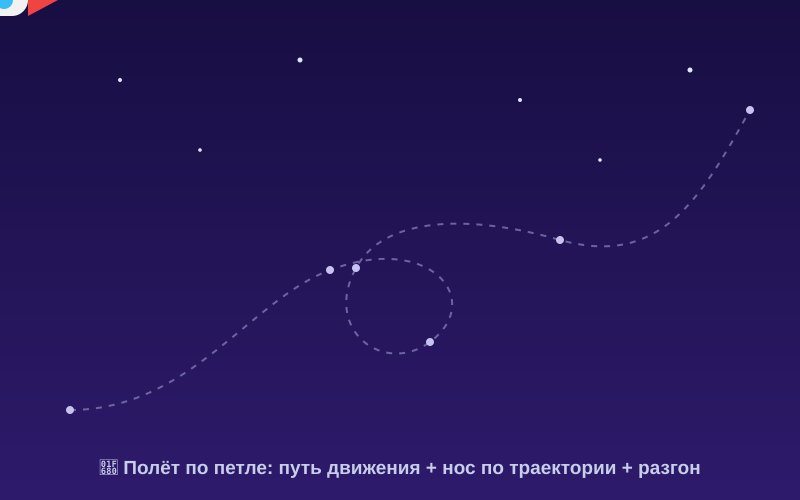

# Урок 2 — Полёт по петле: путь движения и плавность 🚀🌀

**Модуль 4 · Анимация в Adobe Animate · Урок 2 из 5 | 2 ак.ч. (1,5 часа)**

> 🔁 В начале — [разминка/повтор](повторение.md) (5 мин).
> 👨‍🏫 Сценарий с хронометражом — в [преподавателю.md](преподавателю.md).
> 🖼 Что показать и материалы — в [изображения.md](изображения.md) и в конце («Материалы»).
> ⚠️ Всё делаем **вручную**, без ИИ.
> 🎞 **Рендер результата** (двигается) — [`изображения/результат-полёт.svg`](изображения/результат-полёт.svg), открой в браузере.

> 🧭 **Как читать урок.** В прошлый раз мяч двигался вверх-вниз. Сегодня объект полетит **по красивой кривой траектории** — по **петле**! Сквозной проект — **ракета летит по петле** 🚀 через сцену, **нос повёрнут по пути**, с **разгоном и торможением** (плавность/easing). Два новых принципа: **дуги** (живое движется по дугам, не по прямой) и **медленный вход/выход**. Каждый шаг — до кнопки и до кадра: что нажать, где, что увидишь, зачем, ошибка. Можно оживить **свою ракету из Модуля 3** (урок 1 вектора).

---

## 🎬 Что мы сделаем сегодня и что получим

**Задача:** запустить **ракету по кривому пути с петлёй**. Сделаем **анимацию движения** (motion tween), **изогнём траекторию** в петлю, включим **«ориентацию по пути»** (нос смотрит по направлению полёта) и добавим **плавность** — ракета **разгоняется и тормозит**, а не едет «как трактор».

**В итоге у тебя получится:** эффектный полёт ракеты по петле 🚀 (GIF) + файл `.fla`.

**Главный навык урока:** **путь движения** (кривая траектория, «ориентация по пути») + **плавность (easing)** — разгон/торможение. Принцип **дуги**.

> 💡 Секрет живого полёта: **не по прямой линии, а по дуге**. Всё живое (птица, мяч, ракета) движется плавными кривыми. Прямая линия = «робот».

**🎞 Вот что должно получиться** (открой в браузере — **летит по петле!**):

---

## 🧭 Где что находится (путь и плавность)

- **Анимация движения (motion tween):** выдели символ → **правый клик по кадрам** → **«Создать анимацию движения»**. На сцене появится **траектория** (пунктир с точками).
- **Изогнуть траекторию:** возьми **«Выделение»** (`V`) → наведи **на линию** пути (не на точку) — курсор покажет дугу → **тяни** — путь изогнётся. Точки-узлы двигай «Прямым выделением» (`A`).
- **Ориентация по пути:** выдели **диапазон** анимации → панель **«Свойства»** → раздел **«Вращение»** → галочка **«Ориентировать по траектории»** (нос повернётся по пути).
- **Плавность (Замедление / Ease):** выдели диапазон → «Свойства» → поле **«Замедление»**: **минус** = разгон (медленно→быстро), **плюс** = торможение (быстро→медленно). Тонко — **«Редактор движения»** (двойной клик по диапазону).
- **Старый способ (🎓):** «Слой направляющей движения» + классическая анимация (см. Часть 6).

> 💡 **Траектория — это «рельсы».** Ты рисуешь путь, а символ едет по нему. Изгибаешь рельсы — меняется полёт.

---

## Часть 1 — Документ и ракета-символ (8 минут)

1. **`Файл → Создать`** → **HTML5 Canvas**, **800 × 500**, **24 к/с**.
2. **Фон:** слой «фон» → прямоугольник на всю сцену, тёмно-синее небо (`#1B1150`) + пара звёзд.
3. **Ракета:** на слое «ракета» нарисуй её из фигур (корпус-капсула, красный нос, плавники, окно, огонёк) — **носом вправо**. *(Или импортируй свою ракету из Модуля 3: `Файл → Импорт → Импортировать в библиотеку` → PNG/SVG.)*
4. Выдели ракету → **`F8`** → тип **«Фрагмент ролика»** → назови «ракета» → ОК. Теперь это **символ**.

**👀 Что видишь:** ракета-символ на тёмном небе, носом вправо. Готовы задать путь.

> ⚠️ **Типичная ошибка:** рисовать ракету **носом вверх**. Для «ориентации по пути» удобнее рисовать её **носом вправо** (по направлению «вперёд»).

---

## Часть 2 — Анимация движения: прямой путь (8 минут)

1. Поставь ракету в **левый-нижний** угол сцены (старт).
2. На слое «ракета» продли кадры: кликни кадр **48** → `F5`.
3. **Правый клик** по диапазону кадров ракеты → **«Создать анимацию движения»**. Диапазон окрасится.
4. Встань на **последний** кадр (48) → **передвинь ракету в правый-верхний** угол. 👀 Появится **прямая траектория** (пунктир с точками) — ракета летит из угла в угол.
5. Нажми **Enter** — проверь. Пока летит **по прямой**.

**👀 Результат:** ракета едет из угла в угол по прямой. Сейчас изогнём.

---

## Часть 3 — Изгибаем траекторию в петлю (14 минут)

1. Возьми **«Выделение»** (`V`).
2. Наведи курсор **на середину линии** траектории (не на точку) — рядом появится **маленькая дуга** у курсора → **зажми и тяни** — линия **выгнется дугой**. 👀 Ракета полетит по дуге!
3. **Петля:** чтобы сделать **петлю**, тяни путь сильнее и добавляй изгибы. Можно кликнуть по траектории **«Пером»** (`P`), добавить точку и вытянуть её усы — путь закрутится.
4. **Точки-узлы** двигай **«Прямым выделением»** (`A`), их усы — тоже, чтобы «нарисовать» красивую петлю.
5. Нажми **Enter** — ракета летит **по петле**! 🌀

> ⚠️ **Ошибка:** дёргать за **точку** вместо **линии** — точка просто переедет, а не изогнёт путь. Для изгиба тяни **саму линию** между точками.

> 💡 **Дуги — признак жизни.** Даже если объект летит «прямо», лёгкая дуга делает движение живым. Прямая идеальная линия — только у роботов и лазеров.

---

## Часть 4 — Нос по пути + плавность (12 минут)

### Ориентация по пути

1. Выдели **диапазон** анимации (клик по синим кадрам).
2. Панель **«Свойства»** → раздел **«Вращение»** → включи галочку **«Ориентировать по траектории»**.
3. 👀 Теперь **нос ракеты поворачивается по направлению полёта** — она «рулит» по петле, а не летит боком.

### Плавность (разгон и торможение)

1. Тот же диапазон выделен → «Свойства» → поле **«Замедление» (Ease)**.
2. Поставь **−50** → ракета **разгоняется** (медленно стартует, потом быстро). Или **+50** → тормозит к концу.
3. 🎓 Тонкая настройка — **«Редактор движения»** (двойной клик по диапазону): нарисуй кривую «медленно-быстро-медленно».

**Ожидаемый результат:** ракета летит по петле, носом по пути, с разгоном. Красота! 🚀🌀

> 💡 **«Медленный вход/выход» (easing)** — почти всё в природе стартует и останавливается **плавно**, а не рывком. Разгон/торможение = живое движение.

---

## ✅ Как правильно / ❌ Как НЕ надо (путь и плавность)

| ❌ Как НЕ надо | ✅ Как правильно |
|----------------|------------------|
| Полёт по идеальной прямой | По **дуге/кривой** (тянуть линию траектории `V`) |
| Ракета летит **боком** | Галочка **«Ориентировать по траектории»** |
| Скорость ровная, «трактор» | **Замедление (Ease)** — разгон/торможение |
| Тянуть за точку (путь не гнётся) | Тянуть за **линию** между точками |
| Ракета носом вверх (криво «рулит») | Рисовать символ **носом вправо** |
| Motion tween без символа | Сначала **`F8`** — символ |

> ⚠️ Главная ошибка — **прямой путь + ровная скорость + летит боком**. Три исправления: дуга, ориентация по пути, easing — и полёт «оживает».

---

## Часть 5 — Экспорт GIF (6 минут)

1. Проверь ролик (**Enter**).
2. **`Файл → Экспорт → Экспортировать анимированный GIF…`** → «Экспорт» → папка.
3. Сохрани **`.fla`**.

> 💡 Зациклить красиво: пусть конец пути **подходит** к началу — GIF будет крутиться без «скачка».

---

## 🎓 Часть 6 — Для 9–11: глубже (8 минут)

- **Старый способ — направляющая движения:** правый клик по слою → **«Добавить классическую направляющую движения»** → нарисуй путь **«Карандашом»** → «примагнить» центр символа к концам пути (классическая анимация). Сравни с motion tween.
- **Хвост-шлейф:** за ракетой — символ дыма/искр, летящий следом (второй tween с задержкой).
- **Custom Ease:** в «Редакторе движения» задай свою кривую скорости (рывок на старте, плавная посадка).
- **Несколько объектов** по разным путям (стая, салют) — свои слои и tween-ы.

---

## 🧩 Для 5–7 классов (проще)

- Достаточно **дуги** (без сложной петли): просто изогнуть путь `V`.
- «Ориентировать по траектории» — включить галочку (готово).
- Замедление — одно значение (напр. −50), не углубляться в редактор.

---

## 🏁 Итог урока (5 минут)

Сегодня научили объект **красиво летать**:

- ✅ **Путь движения:** анимация движения → **изогнуть траекторию** (тянуть линию `V`), петля.
- ✅ **Ориентация по пути:** нос смотрит по направлению полёта.
- ✅ **Плавность (Ease):** разгон/торможение.
- ✅ **Принцип дуги:** живое движется по кривым, не по прямой.
- ✅ **Экспорт GIF** (+ `.fla`).

> 🏆 Твои объекты летают как надо! Дальше — **морфинг** (урок 3): одна форма **плавно превращается** в другую (капля → рыбка → птица).

> 🎤 **Блиц:** как изогнуть траекторию? за что тянуть — за точку или линию? что делает «Ориентировать по траектории»? минус или плюс Ease для разгона? почему движение по дуге «живее»?

### 🎮 Викторина-закрепление

Открой **[викторина.html](викторина.html)** — вопросы про путь движения, ориентацию по пути и плавность + смешные и «на подумать».

➡️ **Самостоятельная работа** (свой полёт другого объекта + комбо) — в [практике](практика.md).
🧰 **Трюки урока** (траектория, easing, ориентация) — в [лайфхак.md](лайфхак.md).

---

## 🔗 Материалы и ссылки к уроку

**🧰 Инструмент:** Adobe Animate (по лицензии класса), русский интерфейс.

**📥 Материалы (свободные):**
- 🚀 **Ракету/объект рисуем сами** — или бери **свою из Модуля 3** (экспорт PNG/SVG), или [PNGImg](https://pngimg.com/) (`rocket png`, `butterfly png`).
- 🔊 **Звук полёта/свист** (на будущее): [Pixabay Sound](https://pixabay.com/sound-effects/) (`whoosh`, `rocket`), [Mixkit](https://mixkit.co/free-sound-effects/).

**🎬 Вдохновение:** поиск — *motion path animation*, *loop de loop animation*, *orient to path animate*. YouTube (рус.): *«путь движения Adobe Animate»*, *«траектория анимации»*, *«easing замедление Animate»*.

**⚙️ Учителю:** собрать полёт по петле до урока; показать изгиб траектории (тянуть линию) и галочку «Ориентировать по траектории». Список — в [изображения.md](изображения.md).
