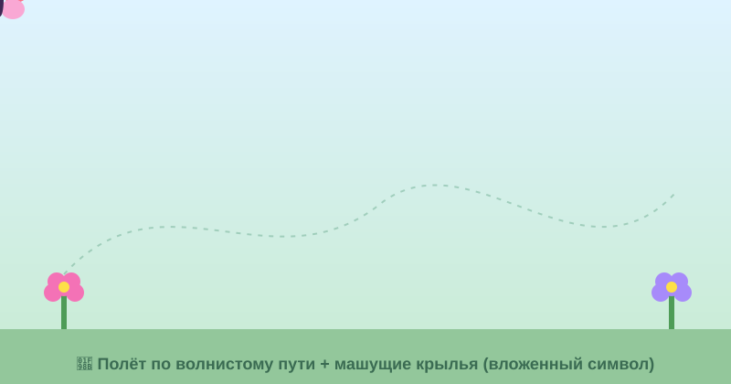

# Самостоятельная работа — Анимация, Урок 2

> 🧑‍🎓 Не повторяем ракету! Запускаешь **свой** объект по красивой траектории.

---

## ✅ Задание 1 (для всех) — «Свой полёт» (новый вызов)

Отправь **другой** объект в полёт по кривой (не ракету). Выбери **одну** идею:

- 🦋 **Бабочка** порхает по волнистому пути между цветами;
- 🐝 **Пчёлка** летит зигзагом к улью;
- 🍂 **Листик** плавно падает, кружась (по спирали/дуге);
- ⭐ **Комета** проносится по дуге со шлейфом;
- 🐦 **Птичка** пролетает через сцену по дуге.

**🎞 Пример результата** (бабочка по волнистому пути — открой в браузере, **летит и машет крыльями!**):

**Обязательные условия:**
- [ ] Объект — **символ** (`F8`) с **анимацией движения**;
- [ ] Траектория **изогнута** (дуга/волна/петля), не прямая;
- [ ] Включена **«Ориентировать по траектории»** (объект «рулит» по пути);
- [ ] Есть **плавность (Ease)** — разгон или торможение;
- [ ] Экспорт **GIF** (+ `.fla`).

---

## 🔗 Задание 2 (комбо, уроки 1 + 2) — «Полёт + характер»

Свяжи прошлые приёмы:
- пусть объект летит по дуге **и** слегка **колышется/пружинит** (сжатие-растяжение из урока 1) — например, бабочка машет крыльями (вложенный символ), листик покачивается;
- или в конце пути — **мягкая посадка** (торможение + лёгкий отскок).

**Результат:** полёт не просто «едет по рельсам», а живёт.

---

## ⚡ Задание 3 (разминка-челлендж) — дуга за 5 минут

**За 5 минут:** символ → анимация движения из угла в угол → **изогни путь в дугу** (тяни линию `V`) → включи «Ориентировать по траектории». Проиграй. Тренируем главный приём — кривой путь.

---

## 📋 Что проверяем

- [ ] Объект — **свой** (не урочная ракета);
- [ ] Символ + анимация движения; траектория **изогнута**;
- [ ] **«Ориентировать по траектории»** + **Ease**;
- [ ] Экспорт GIF + `.fla`;
- [ ] Сделано **«Комбо»** (колыхание/посадка/машущие крылья).

## 🧩 Для 5–7 классов
- Достаточно **дуги** (без петли) + галочка ориентации. Ease — одно значение. Объект попроще (шарик/звёздочка).

## 🎓 Для 9–11 классов
- **Петля** + **Custom Ease** («Редактор движения»).
- **Шлейф** за объектом (второй символ следом).
- Классическая **направляющая движения** (старый способ) — для сравнения.

## 🖼 Галерея «Полёты класса»
Сдай GIF — соберём «небо» из полётов. Голосуем: **самая красивая траектория** и **самый живой полёт**.

## Что сдать
- `полёт_*.gif` + `*.fla` (Задание 1) + версия с характером (Задание 2).
