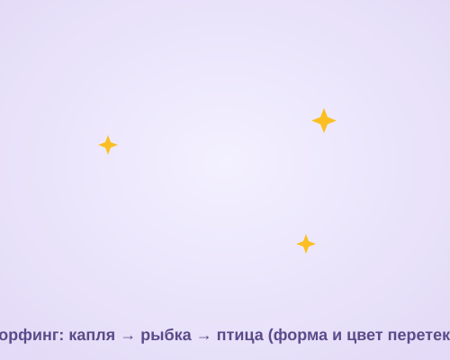

# Урок 3 — Превращение: морфинг форм 🪄🐟

**Модуль 4 · Анимация в Adobe Animate · Урок 3 из 5 | 2 ак.ч. (1,5 часа)**

> 🔁 В начале — [разминка/повтор](повторение.md) (5 мин).
> 👨‍🏫 Сценарий с хронометражом — в [преподавателю.md](преподавателю.md).
> 🖼 Что показать и материалы — в [изображения.md](изображения.md) и в конце («Материалы»).
> ⚠️ Всё делаем **вручную**, без ИИ.
> 🎞 **Рендер результата** (двигается) — [`изображения/результат-морфинг.svg`](изображения/результат-морфинг.svg), открой в браузере.

> 🧭 **Как читать урок.** Сегодня — самая «магия»: одна форма **плавно превращается** в другую! Сквозной проект — **«Превращение»** 🪄: **капля → рыбка → птица** (и цвет перетекает вместе с формой). Это **анимация формы (морфинг)** — работает не с символами (как раньше), а с **чистыми фигурами**. Плюс приручим **фигурные подсказки** — чтобы форма перетекала красиво, а не «мялась». Каждый шаг — до кнопки и кадра: что нажать, где, что увидишь, зачем, ошибка.

---

## 🎬 Что мы сделаем сегодня и что получим

**Задача:** заставить форму **волшебно перетекать**: нарисуем **каплю**, дальше на таймлайне заменим её на **рыбку**, потом на **птицу** — и программа **сама дорисует все промежуточные формы**. Цвет тоже плавно поменяется. Зациклим — получится бесконечное превращение.

**В итоге у тебя получится:** гипнотическая анимация-морфинг 🪄 (GIF) + файл `.fla`.

**Главный навык урока:** **анимация формы (shape tween / морфинг)** — плавный переход **между фигурами** (не символами!) + **фигурные подсказки** (управляем перетеканием) + морф **цвета**.

> 💡 Секрет морфинга: он работает **только с “чистыми” фигурами** (заливка на слое), а **не** с символами и группами. Это противоположность прошлым урокам — там был нужен символ, здесь — наоборот!

**🎞 Вот что должно получиться** (открой в браузере — форма **превращается!**):

---

## 🧭 Где что находится (анимация формы)

- **Анимация формы (морфинг):** между двумя ключевыми кадрами с **разными фигурами** → **правый клик по кадрам** → **«Создать анимацию формы»**. Диапазон станет **зелёным** (у движения был синий/оранжевый — так отличают!).
- **Только фигуры!** Если объект — символ/группа, разбери: **`Изменить → Разделить`** (Break Apart, `Ctrl+B`).
- **Фигурные подсказки:** **`Изменить → Фигура → Добавить фигурную подсказку`** (`Ctrl+Shift+H`). Появится **красный** кружок с буквой (a, b, c…) — поставь его на точку **первой** фигуры, затем на последнем кадре поставь **зелёный** такой же на **соответствующую** точку второй фигуры.
- **Показать/скрыть подсказки:** `Изменить → Фигура → Показать фигурные подсказки`.
- **Цвет** перетекает сам, если у фигур разная заливка.

> ⚠️ **Главное отличие урока:** морфинг — для **фигур**, motion tween (движение) — для **символов**. Перепутал — не сработает.

---

## Часть 1 — Первая фигура: капля (6 минут)

1. **`Файл → Создать`** → **HTML5 Canvas**, **500 × 400**, **24 к/с**.
2. На слое «морф» нарисуй **каплю** 💧: «Овал» (`O`) → овал по центру → «Выделением» подправь верх в остриё (или пером). Залей **голубым** (`#38BDF8`).
3. **Важно:** это должна быть **чистая фигура** (заливка), **не** группа и **не** символ. Если случайно сгруппировал — `Ctrl+B` (Разделить).

**👀 Что видишь:** голубая капля на кадре 1. Это старт превращения.

> ⚠️ **Типичная ошибка:** сделать каплю **символом** (`F8`) по привычке. Для морфинга — **НЕ надо** символ! Только фигура.

---

## Часть 2 — Ещё формы + анимация формы (16 минут)

### Шаг 1. Кадр с рыбкой

1. Кликни кадр **12** → **`F7`** (пустой ключевой кадр) → нарисуй на нём **рыбку** 🐟 (тело-овал + хвост-треугольник, «Разделить» если нужно). Залей **оранжевым** (`#F97316`).
   - *(проще)* можно `F6` на кадре 12 (копия капли) и **переделать** её в рыбку, двигая точки «Выделением».

### Шаг 2. Кадр с птицей

2. Кадр **24** → `F7` → нарисуй **птицу** 🐦 (тело + клюв + намёк на крыло). Залей **фиолетовым** (`#A78BFA`).

### Шаг 3. Замыкаем цикл

3. Кадр **36** → `F7` → снова **капля** голубая (можно скопировать кадр 1: клик по кадру 1 → `Ctrl+C`, кадр 36 → `Ctrl+V` кадров). Так превращение зациклится.

### Шаг 4. Создаём морфинг

4. **Правый клик** по кадрам **между 1 и 12** → **«Создать анимацию формы»** → диапазон стал **зелёным**. Повтори между 12–24 и 24–36.
5. Нажми **Enter** — капля **перетекает** в рыбку, рыбка в птицу, птица обратно в каплю. И цвет меняется! 🪄

**👀 Что произойдёт:** форма **плавно превращается** — настоящая магия морфинга.

> ⚠️ **Ошибка:** между кадрами **символы/группы** — морфинг не создастся (или «прыгнет»). Нужны **чистые фигуры** (`Ctrl+B`).

---

## Часть 3 — Фигурные подсказки: красивое перетекание (12 минут)

Иногда форма перетекает **криво** — «мнётся», выворачивается. Это чинят **фигурные подсказки**.

1. Встань на **первый** кадр пары (напр. кадр 1, капля).
2. **`Изменить → Фигура → Добавить фигурную подсказку`** (`Ctrl+Shift+H`) → появится **красный кружок «a»**. Перетащи его на **заметную точку** капли (например, остриё сверху).
3. Перейди на **последний** кадр пары (кадр 12, рыбка) → там появился **зелёный «a»** → поставь его на **соответствующую** точку рыбки (например, нос).
4. Добавь ещё 2–3 подсказки (**b, c, d**) — по **кругу, по порядку** (по часовой стрелке): низ, бок, хвост. Ставь их **в том же порядке** на обеих фигурах.
5. Проиграй (**Enter**) — теперь форма перетекает **аккуратно**, а не «мнётся».

**Ожидаемый результат:** плавное, красивое превращение без «выворачивания».

> 💡 **Правило подсказок:** ставь их **по порядку и по кругу** (a, b, c… по часовой) на **обеих** фигурах. Тогда программа понимает, «какая точка куда переезжает».

> ⚠️ **Ошибка:** подсказки в разнобой (a вверху у капли, но a внизу у рыбки) — форма перекрутится ещё хуже. Порядок и расположение — **одинаковые**.

---

## Часть 4 — Тайминг, цвет, цикл (8 минут)

1. **Тайминг:** хочешь, чтобы форма «задержалась» в виде рыбки? Добавь после её ключевого кадра пару обычных кадров (`F5`) — рыбка «замрёт» на миг.
2. **Цвет** уже перетекает (разные заливки). Хочешь ярче — сделай контрастные цвета фигур.
3. **Свечение/искры** (по желанию): отдельный слой с мерцающими звёздочками — «волшебство».
4. Проверь **цикл**: последняя форма = первой → крутится без «скачка».

**Ожидаемый результат:** бесконечное красивое превращение с плавным цветом. ✨

---

## ✅ Как правильно / ❌ Как НЕ надо (морфинг)

| ❌ Как НЕ надо | ✅ Как правильно |
|----------------|------------------|
| Морфить **символы**/группы | Только **чистые фигуры** (`Ctrl+B` разделить) |
| Диапазон синий (это движение) | Морфинг — **зелёный** диапазон |
| Форма «мнётся»/выворачивается | **Фигурные подсказки** (a, b, c по кругу) |
| Подсказки в разнобой | Одинаковый **порядок и места** на обеих фигурах |
| Слишком разные фигуры за 3 кадра | Дать **достаточно кадров** на переход |
| Цикл со «скачком» | Последняя форма = первой |

> ⚠️ Главная ошибка — **пытаться морфить символ**. Морфинг живёт на **фигурах**. И если «мнётся» — спасают **фигурные подсказки**.

---

## Часть 5 — Экспорт GIF (6 минут)

1. Проверь (**Enter**).
2. **`Файл → Экспорт → Экспортировать анимированный GIF…`** → «Экспорт» → папка.
3. Сохрани **`.fla`**.

> 💡 Морфинг-GIF гипнотичен — отлично заходит как «живая» аватарка или заставка.

---

## 🎓 Часть 6 — Для 9–11: глубже (8 минут)

- **Логотип «собирается»:** буквы/знак из разбросанных фигур **морфят** в готовый логотип (эффектное интро бренда из Модуля 3).
- **Много подсказок** (5–8) для сложных форм — точный контроль.
- **Морф текста:** разбей текст (`Ctrl+B` дважды — до фигур) и морфь одно слово в другое.
- **Жидкость/клякса:** морфинг капель, слияние — «желейный» эффект.

---

## 🧩 Для 5–7 классов (проще)

- Хватит **2 форм** (капля → рыбка) без птицы.
- Фигурные подсказки — по желанию (если и так перетекает нормально).
- Бери **простые, похожие** формы (круг → сердце → звезда) — морфятся легче.

---

## 🏁 Итог урока (5 минут)

Сегодня освоили **морфинг** — магию превращения:

- ✅ **Анимация формы** — для **чистых фигур** (не символов!), диапазон **зелёный**.
- ✅ **Ключевые кадры** с разными формами → «Создать анимацию формы».
- ✅ **Фигурные подсказки** (a, b, c по кругу) — красивое перетекание.
- ✅ **Цвет** морфит вместе с формой; **цикл** без скачка.
- ✅ **Экспорт GIF** (+ `.fla`).

> 🏆 Ты умеешь превращать одно в другое! Дальше — **персонаж на костях** (урок 4): соберём говорящего маскота, который машет и «говорит» со звуком.

> 🎤 **Блиц:** морфинг — для символов или фигур? какого цвета диапазон морфинга? что делают фигурные подсказки? как их ставить? как зациклить без скачка?

### 🎮 Викторина-закрепление

Открой **[викторина.html](викторина.html)** — вопросы про анимацию формы, фигуры vs символы и подсказки + смешные и «на подумать».

➡️ **Самостоятельная работа** (своё превращение + комбо) — в [практике](практика.md).
🧰 **Трюки урока** (морфинг, подсказки, цвет) — в [лайфхак.md](лайфхак.md).

---

## 🔗 Материалы и ссылки к уроку

**🧰 Инструмент:** Adobe Animate (по лицензии класса), русский интерфейс.

**📥 Материалы (свободные):**
- 🪄 **Формы рисуем сами.** Для морфа логотипа — свой знак из **Модуля 3** (разбить на фигуры `Ctrl+B`).
- 🔊 **Волшебный звук «вжух»** (на будущее): [Pixabay Sound](https://pixabay.com/sound-effects/) (`magic`, `transform`, `sparkle`), [Mixkit](https://mixkit.co/free-sound-effects/).

**🎬 Вдохновение:** поиск — *shape tween morph animation*, *liquid morphing animation*, *logo morph*. YouTube (рус.): *«анимация формы Animate»*, *«морфинг shape tween»*, *«фигурные подсказки shape hints»*.

**⚙️ Учителю:** собрать превращение до урока; показать «зелёный диапазон» и фигурные подсказки на проекторе; объяснить «фигуры, не символы». Список — в [изображения.md](изображения.md).
