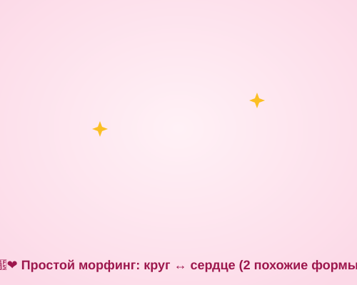

# Самостоятельная работа — Анимация, Урок 3

> 🧑‍🎓 Не повторяем каплю-рыбку-птицу! Придумываешь **своё** превращение.

---

## ✅ Задание 1 (для всех) — «Своё превращение» (новый вызов)

Сделай **свой морфинг** из другой цепочки форм. Выбери **одну** идею:

- ⭐ **Геометрия:** круг → квадрат → звезда → сердце;
- 🌗 **День-ночь:** солнце → луна → звезда;
- ☁️ **Облако-фантазия:** облако → зайчик → кит (облачные формы);
- 🍎 **Фрукты:** яблоко → груша → банан;
- 😀 **Эмоции:** смайлик радость → грусть → удивление (морф рта/бровей).

**🎞 Пример результата** (простой морф — открой в браузере, **круг превращается в сердце!**):

**Обязательные условия:**
- [ ] Формы — **чистые фигуры** (не символы!); при надобности `Ctrl+B`;
- [ ] Между ними — **анимация формы** (зелёный диапазон);
- [ ] Если «мнётся» — добавлены **фигурные подсказки** (a, b, c по кругу);
- [ ] **Цвет** тоже перетекает (разные заливки);
- [ ] Зациклено (последняя = первой) + экспорт **GIF** (+ `.fla`).

---

## 🔗 Задание 2 (комбо, Модуль 3 + Модуль 4) — «Логотип собирается»

Свяжи с брендом:
1. Возьми **свой логотип/знак из Модуля 3** → экспортируй, вставь в Animate → **`Ctrl+B`** до фигур.
2. Сделай, чтобы он **собирался** из простой формы (кляксы/круга) морфингом — эффектное **интро бренда**.

**Результат:** твой логотип «магически» появляется.

---

## ⚡ Задание 3 (разминка-челлендж) — морф за 5 минут

**За 5 минут:** нарисуй **круг** (фигура!) → кадр 12 переделай в **сердце** → «Создать анимацию формы». Проиграй. Тренируем самый базовый морфинг двух форм.

---

## 📋 Что проверяем

- [ ] Превращение — **своё** (не урочное);
- [ ] Фигуры (не символы); **анимация формы** (зелёный);
- [ ] При надобности **фигурные подсказки**; цвет перетекает;
- [ ] Зациклено; экспорт GIF + `.fla`;
- [ ] Сделано **«Комбо»** (логотип собирается).

## 🧩 Для 5–7 классов
- Хватит **2 похожих форм** (круг → сердце). Подсказки — по желанию. Разные цвета — обязательно (красиво).

## 🎓 Для 9–11 классов
- Цепочка из **4+ форм** с аккуратными подсказками.
- **Морф текста** (слово → слово, `Ctrl+B` дважды).
- «Желейный» морф капель (слияние/разделение).

## 🖼 Галерея «Превращения класса»
Сдай GIF — соберём гипнотическую стену морфов. Голосуем: **самое плавное** и **самое неожиданное** превращение.

## Что сдать
- `морф_*.gif` + `*.fla` (Задание 1) + «логотип собирается» (Задание 2).
