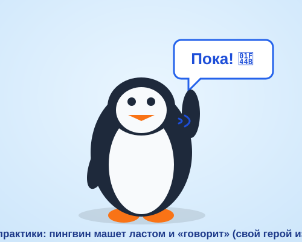

# Самостоятельная работа — Анимация, Урок 4

> 🧑‍🎓 Не повторяем робо-маскота «Бип»! Оживляешь **своего** героя со **своей** репликой и жестом.

---

## ✅ Задание 1 (для всех) — «Свой говорящий герой» (новый вызов)

Собери **своего** персонажа-марионетку с костями, звуком и ртом. Выбери **одну** идею (герой + реплика + жест — **другие**, чем на уроке):

- 🐧 **Пингвин** (твой из Модуля 3) машет **ластом** и говорит **«Пока!»**;
- 🦊 **Лиса** (из Модуля 3) кивает головой и говорит **«Привет, друг!»**;
- 🐱 **Котик** поднимает **лапку** и «мяукает» **«Мяу!»**;
- 🤖 **Другой робот** показывает **большой палец** и говорит **«Класс!»**;
- 👽 **Инопланетянин** машет **двумя руками** и говорит **«Уии!»**.

**🎞 Пример результата** (открой в браузере — **пингвин машет ластом и «говорит»!**):

> 🤖 **Голос своей реплики** делаем как на уроке — **нейросетью-озвучкой по тексту** ([TTSMaker](https://ttsmaker.com/) и т.п.): впечатал фразу героя → выбрал русский голос → скачал MP3. Микрофон не нужен (свой голос — по желанию).

**Обязательные условия:**
- [ ] Персонаж из **деталей-символов** (`F8`);
- [ ] В руке/ласте — **кости (Bone/IK)**, жест поставлен **позами** на слое «Арматура»;
- [ ] **Звук реплики** (озвучка нейросетью по тексту / свой голос) импортирован, синхронизация **«Поток»**;
- [ ] **Рот/клюв** шевелится (минимум **2 формы**, лучше 3) в такт слогам;
- [ ] Экспорт **HTML** (или MP4) + сохранён **`.fla`**.

---

## 🔗 Задание 2 (комбо, прошлые уроки + Урок 4) — «Кнопка + движение по пути»

Собери навыки вместе:
1. Сделай **кнопку-триггер** (`this.stop();` на кадре 1 + метка + Фрагмент кода) — по клику герой оживает.
2. Добавь герою **проезд по сцене** приёмом из **Урока 2** (**путь движения** + easing) — например, маскот **въезжает** слева, останавливается, машет и говорит.
3. Или: по клику герой **превращается** (морфинг из **Урока 3**) и затем машет.

**Результат:** интерактивная сценка «нажал → герой приехал/превратился и заговорил».

---

## ⚡ Задание 3 (разминка-челлендж) — риг за 5 минут

**За 5 минут:** нарисуй простую «руку» из **2 овалов-символов** (плечо + предплечье) → инструмент **«Кость»** (`M`) → протяни **2 кости** (плечо→локоть, локоть→кисть) → «Выделением» **потяни за кисть**. Убедись, что **вся рука гнётся сама** (IK). Тренируем самый базовый риг.

---

## 📋 Что проверяем

- [ ] Герой — **свой** (не робо-маскот с урока), реплика и жест **другие**;
- [ ] Есть **кости (IK)**, жест поставлен позами на «Арматуре»;
- [ ] **Звук** на таймлайне, синхронизация **«Поток»**;
- [ ] **Рот** шевелится (2–4 формы) в такт;
- [ ] **Кнопка** работает (стоп в начале → клик → оживает);
- [ ] Сделано **«Комбо»** (кнопка + путь/морфинг);
- [ ] Экспорт HTML/MP4 + `.fla`.

## 🧩 Для 5–7 классов
- Готовый герой из Модуля 3, **1 кость** в руке (или вращение символа руки без костей).
- Рот — **2 формы** (закрыт ↔ открыт), чередуй.
- Кнопку — через **Фрагменты кода** (код не пишем руками).

## 🎓 Для 9–11 классов
- Риг **всего тела** (обе руки + шея/кивок), ограничение суставов.
- **Точный липсинк** по гласным (рот-символ с кадрами, Single Frame).
- **Две кнопки** — «Привет!» и «Пока!» с разными звуками и жестами.

## 🖼 Галерея «Говорящие маскоты класса»
Сдай HTML/MP4 (или GIF взмаха) — соберём «команду маскотов». Голосуем: **самый живой жест** и **самый смешной голос**.

## Что сдать
- `маскот_*.html` (или `*.mp4`) + `*.fla` (Задание 1) + сценка «кнопка + движение» (Задание 2).
