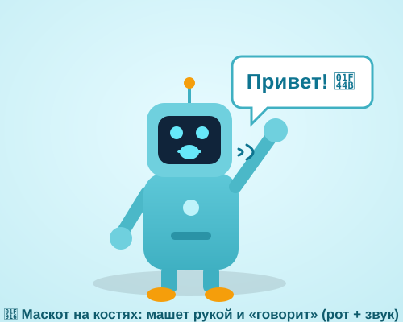

# Урок 4 — Говорящий маскот: кости, звук и кнопка 🤖🎤

**Модуль 4 · Анимация в Adobe Animate · Урок 4 из 5 | 2 ак.ч. (1,5 часа)**

> 🔁 В начале — [разминка/повтор](повторение.md) (5 мин).
> 👨‍🏫 Сценарий с хронометражом — в [преподавателю.md](преподавателю.md).
> 🖼 Что показать и материалы (особенно **звук**) — в [изображения.md](изображения.md) и в конце («Материалы»).
> ⚠️ Всё делаем **вручную**, без ИИ.
> 🎞 **Рендер результата** (двигается) — [`изображения/результат-маскот.svg`](изображения/результат-маскот.svg), открой в браузере.

> 🧭 **Как читать урок.** Сегодня самый «взрослый» приём — **риг** (rig): соберём персонажа как **куклу-марионетку на костях**, чтобы он **махал рукой** одним движением. Потом дадим ему **голос** (импорт звука), заставим **шевелить ртом в такт** (липсинк) и повесим **кнопку**: нажал — маскот помахал и «сказал». Сквозной проект — **робо-маскот «Бип»** 🤖, который говорит «Привет!». Можно оживить **своего героя из Модуля 3** (лиса/пингвин). Каждый шаг — до кнопки, панели и кадра: что нажать, где это, что увидишь 👀, зачем и какая типичная ошибка.

---

## 🎬 Что мы сделаем сегодня и что получим

**Задача:** взять простого персонажа, **связать его руку костями** (плечо → локоть → кисть), одним движением заставить **махать**, добавить **звук голоса**, синхронизировать **рот** с речью и сделать **кнопку «Скажи привет!»** — нажал, и маскот машет и говорит.

**В итоге у тебя получится:** интерактивный **говорящий маскот** 🤖 (машет рукой + шевелит ртом под звук) с кнопкой-триггером + файл `.fla` + экспорт GIF/HTML.

**Главные навыки урока:**
- 🦴 **Арматура «Кость» (Bone tool / IK — инверсная кинематика)** — риг персонажа: тянешь кисть — вся рука сгибается сама.
- 🔊 **Импорт звука** в библиотеку + постановка на таймлайн + синхронизация **«Поток» (Stream)**.
- 👄 **Липсинк** (синхронизация рта) — несколько форм рта под слоги.
- 🔘 **Кнопка-триггер** (символ «Кнопка» + действие) — запуск анимации по клику.

> 💡 **Что такое риг простыми словами.** Риг — это «скелет» для картинки. Ставишь **кости** внутрь персонажа, и дальше двигаешь не каждую деталь по отдельности, а **тянешь за кисть** — плечо и локоть подстраиваются сами. Это и есть **IK (инверсная кинематика)**: «тяну за конец — сгибается вся цепочка».

**🎞 Вот что должно получиться** (открой в браузере — маскот **машет и «говорит»!**):



---

## 🧭 Где что находится (кости, звук, кнопка)

- **Инструмент «Кость» (Bone Tool)** — на **панели инструментов слева**, значок в виде **косточки** 🦴 (в одной группе с «Заливкой»; если не видно — зажми стрелку в углу инструмента). Горячая клавиша — **`M`**. Им «протыкаешь» цепочку деталей → появляются кости.
- **Слой «Арматура» (Armature)** — как только поставил кости, детали **сами переезжают** на новый **зелёный слой с человечком-позой**. Позы (движения) ставим **только на нём**.
- **Библиотека (Library)** — панель **справа** (вкладка «Библиотека»). Туда попадают импортированные звуки и все символы. Открыть: **`Окно → Библиотека`** (`Ctrl+L`).
- **Импорт звука:** **`Файл → Импорт → Импортировать в библиотеку…`**. Звук ляжет в **Библиотеку**.
- **Панель «Свойства» (Properties)** — **справа сверху**. Когда выделен кадр со звуком, там появляется раздел **«Звук (Sound)»** с параметром **«Синхронизация (Sync)»** (варианты: «Событие», **«Поток»**, «Начать», «Остановить»).
- **Символ «Кнопка» (Button):** `F8` → тип **«Кнопка»**. Внутри у неё **4 кадра**: **Вверх / Над / Нажатие / Область** (Up / Over / Down / Hit).
- **Действия (Actions)** — окно кода: **`Окно → Действия`** (`F9`). Для HTML5 Canvas код — на **JavaScript**.
- **Фрагменты кода (Code Snippets)** — **`Окно → Фрагменты кода`**: готовые «кубики» кода (для кнопки — без ручного набора!).

> ⚠️ **Важно про кости:** они работают **на символах** (несколько инстансов, связанных в цепочку) **или внутри одной фигуры**. Мы возьмём **символы** (голова/тело/плечо/предплечье/кисть) — так нагляднее.

> 💡 **Тип документа.** Делаем в **HTML5 Canvas** (как в прошлых уроках) — тогда кнопка и звук работают в браузере, а код — на JavaScript. *(В старом типе «ActionScript 3.0» код другой — мы его не берём.)*

---

## Часть 1 — Собираем персонажа из деталей-символов (10 минут)

Маскота соберём из **отдельных деталей**, и каждую сделаем **символом** — чтобы кости было к чему крепить.

1. **`Файл → Создать`** → **HTML5 Canvas**, **500 × 400**, **24 к/с** → «Создать».
2. Нарисуй детали робо-маскота (простыми фигурами, «Прямоугольник со скруглением» `R`, «Овал» `O`):
   - **тело** — скруглённый прямоугольник, голубой `#5EC8D8`;
   - **голова** — скруглённый прямоугольник сверху + тёмный «экран-лицо» `#10243A` с глазами-кружками;
   - **плечо-предплечье** — вытянутый овал/капсула (это будущая рука); **кисть** — кружок на конце;
   - **ноги** — два прямоугольника.
3. **Каждую деталь → в символ.** Выдели деталь → **`F8`** → тип **«Графика»** (Graphic) → имя (`тело`, `голова`, `рука`, `кисть`…) → «ОК».
   - 👀 **Что видишь:** вокруг детали — тонкая рамка символа, в **Библиотеке** появился новый элемент.
4. **Разложи по слоям** (панель слоёв снизу, кнопка **«Новый слой»** — листочек с плюсом): отдельные слои `голова`, `тело`, `рука`, `рот`, `звук`, `кнопка`. Так проще управлять.
5. Собери фигуру: тело по центру, голова сверху, рука сбоку у «плеча».

**👀 Что видишь:** аккуратный маскот из деталей-символов, каждая на своём слое.

> ⚠️ **Типичная ошибка:** оставить детали **фигурами** (заливкой). Для костей-на-символах нужны **символы** (`F8`). *(Кости умеют и по «сырой» фигуре — но связка символов нагляднее и надёжнее для новичка.)*

> 🧩 **Для 5–7:** возьми **готового** персонажа (свою лису/пингвина из Модуля 3): экспортируй PNG, вставь, разбей на 3–4 части (голова/тело/рука/рот) и сделай их символами. Меньше рисования — больше анимации.

---

## Часть 2 — Ставим кости: риг руки (14 минут)

Теперь свяжем руку **костями**, чтобы она гнулась как настоящая.

### Шаг 1. Берём инструмент «Кость»

1. На **панели инструментов слева** выбери **«Кость» (Bone Tool)** — значок 🦴 (или клавиша **`M`**).

### Шаг 2. Протягиваем цепочку костей

2. **Нажми и протяни** от **плеча к локтю** (по «плечу-предплечью») — появится **первая кость** (треугольная «морковка»).
3. От **конца первой кости** (локтя) **протяни к кисти** — появится **вторая кость**. Получилась **цепочка**: плечо → локоть → кисть.
   - 👀 **Что произойдёт:** детали руки **сами перескочат** на новый **зелёный слой «Арматура»** с человечком-позой. Это и есть скелет.

### Шаг 3. Проверяем IK (инверсную кинематику)

4. Возьми **«Выделение»** (`V`) → **потяни за кисть**.
   - 👀 **Что видишь:** тянешь кончик — **вся рука сгибается сама** (локоть, плечо подстраиваются). Это **IK** — «тяну за конец, гнётся вся цепочка». Магия рига! 🦴

> 💡 **Мостик из жизни:** это как твоя настоящая рука — тянешься за кружкой, и плечо с локтем сами находят угол. Ты не думаешь про каждый сустав.

> ⚠️ **Ошибка:** ставить кость от кисти к плечу (задом наперёд) — цепочка «вывернется». Веди кости **от туловища к кончику** (плечо → локоть → кисть).

> ⚠️ **Ошибка:** детали были **не символами/не связаны** — кость «не цепляется». Убедись, что рука — из символов, и веди кость прямо по ним.

> 🎓 **Для 9–11:** добавь кость и во **вторую руку**, и в «шею» (голова кивает). Чем больше суставов — тем живее. Можно ограничить углы сустава в **Свойствах** кости (галочки «Вращение → Ограничить»), чтобы рука не выгибалась неестественно.

---

## Часть 3 — Оживляем взмах: позы на таймлайне (10 минут)

Кости есть — заставим руку **махать**. На слое «Арматура» ставим **позы** (движения) в разных кадрах.

1. Встань на **кадр 1** слоя «Арматура» — это стартовая поза (рука опущена/чуть в сторону).
2. Кликни **кадр 8** этого слоя → **правый клик → «Вставить позу»** (Insert Pose) *(или просто передвинь кисть — поза создастся сама, появится **чёрный ромбик**)*. Потяни кисть **вверх-вправо** (рука поднята).
3. **Кадр 12** → снова передвинь кисть **влево** (рука качнулась в другую сторону).
4. **Кадр 16** → верни в положение как на кадре 8 (вверх-вправо).
5. **Кадр 20** → верни в стартовую позу (как кадр 1), чтобы взмах закончился ровно.
6. Нажми **Enter** — маскот **машет рукой**! 👋

**👀 Что видишь:** между твоими позами Animate **сам достраивает** плавное движение — рука качается туда-сюда.

> 💡 **Секрет живого взмаха:** делай **чуть больше** мах в одну сторону и **чуть меньше** в другую (не симметрично) — движение перестаёт быть «механическим». И добавь лёгкий **наклон головы** в такт (если поставил кость в шею).

> ⚠️ **Ошибка:** ставить позы на **обычном слое**, а не на «Арматуре». Позы IK живут **только** на зелёном слое-арматуре.

> ⚠️ **Ошибка:** резкий «телепорт» руки — мало кадров между позами. Дай **6–8 кадров** на каждое качание, чтобы было плавно.

---

## Часть 4 — Даём голос: импорт и постановка звука (10 минут)

Теперь маскот заговорит. Нужен короткий звук — например «Привет!» (можно записать свой голос телефоном или скачать, ссылки ниже).

### Шаг 1. Импорт в библиотеку

1. **`Файл → Импорт → Импортировать в библиотеку…`** → выбери файл `privet.mp3` (или `.wav`) → «Открыть».
   - 👀 **Что видишь:** звук появился в **Библиотеке** (панель справа) — со значком «динамик» и мини-волной.

### Шаг 2. Ставим звук на таймлайн

2. Кликни слой **«звук»** → встань на **кадр 1** (или на тот кадр, где маскот начинает говорить).
3. **Перетащи звук из Библиотеки на сцену** (или открой **Свойства** → раздел **«Звук»** → выпадающий список **«Имя»** → выбери свой звук).
   - 👀 **Что видишь:** на слое «звук» появилась **синяя волна** (waveform) — это дорожка голоса.

### Шаг 3. Синхронизация «Поток» (Stream)

4. Не снимая выделения с кадра, в **Свойствах** → раздел **«Звук»** → **«Синхронизация (Sync)»** выбери **«Поток» (Stream)**.
   - 💡 **Зачем «Поток»:** он **привязывает звук к таймлайну** — звук играет ровно пока едет плейхед, кадр за кадром. Именно это нужно для **липсинка** (рот успевает за голосом). Режим **«Событие» (Event)** играл бы сам по себе, не совпадая с кадрами.
5. **Растяни кадры под длину звука:** посмотри, до какого кадра тянется синяя волна, и на **всех слоях** нажми `F5` до этого кадра (например, до кадра 30), чтобы сцена жила, пока звучит голос.

**👀 Что видишь:** тянешь плейхед по таймлайну (скраббинг) — **слышишь голос** по кусочкам. Так найдём, где какие слоги.

> ⚠️ **Ошибка:** синхронизация **«Событие»** вместо **«Поток»** — тогда рот не совпадёт с голосом (звук живёт отдельно). Для липсинка — только **«Поток»**.

> ⚠️ **Ошибка:** звук «обрывается» — кадров **меньше**, чем длина звука. Дотяни `F5` до конца волны.

> 🔊 **Где взять «Привет!»:** запиши свой голос (диктофон телефона → перекинь файл) — это веселее всего! Или скачай на [Pixabay Sound](https://pixabay.com/sound-effects/), [Mixkit](https://mixkit.co/free-sound-effects/), [Freesound](https://freesound.org/) (поиск: `hello voice`, `hi`, `robot voice`).

---

## Часть 5 — Липсинк: рот шевелится в такт (12 минут)

Голос есть — пусть **рот двигается** под него. Секрет простой: **несколько форм рта** в разных кадрах.

1. Нарисуй **2–4 формы рта** (каждую — на слое «рот», как кадры-варианты):
   - **закрытый** — прямая чёрточка/тонкий овал (звуки **М, П, Б**);
   - **открытый круглый** — овал «О»/«А»;
   - **широкий** — растянутый овал «И/Е»;
   - (по желанию) **средний** полукруг.
2. **Скраббинг:** медленно тяни плейхед по синей волне звука и слушай, где какой слог.
3. На слое «рот» ставь **ключевые кадры** (`F6`/`F7`) и на каждом — **подходящую форму**:
   - на «При-» → рот **открыт**;
   - на «-ВЕ-» → рот **широкий**;
   - на «-Т!» → рот **закрыт**.
4. Между слогами можно вернуть **закрытый** рот. Не гонись за идеалом: **чередование открыт/закрыт** уже создаёт иллюзию речи!
5. **Enter** — маскот **говорит**: рот двигается, рука машет, звучит голос. 🎉

**👀 Что видишь:** рот меняет форму синхронно с голосом — персонаж «ожил» и заговорил.

> 💡 **Правило ленивого липсинка:** для короткого слова хватает **3 форм рта** (закрыт → открыт → закрыт). Главное — **открывать рот на гласных** (А, О, Э) и **закрывать на М/П/Б**.

> ⚠️ **Ошибка:** рот открыт **всё время** (одна форма) — выглядит как «завис». Нужна **смена** форм хотя бы 2–3 раза за слово.

> ⚠️ **Ошибка:** рот двигается, а звук — «Событие» (не привязан). Проверь: синхронизация **«Поток»**, иначе рот и голос разъедутся.

> 🎓 **Для 9–11:** сделай **набор рта символом** (Graphic) с формами на кадрах внутри, и на таймлайне переключай кадр символа через **Свойства → «Зациклить → Один кадр (Single Frame)»** — профи-приём липсинка. Разложи слово на слоги точнее (А-О-У-И-М).

> 🧩 **Для 5–7:** хватит **2 форм** (закрыт ↔ открыт), чередуй их каждые 3–4 кадра — уже «говорит».

---

## Часть 6 — Кнопка-триггер: «Скажи привет!» (10 минут)

Сделаем, чтобы маскот стоял тихо, а **говорил и махал по нажатию кнопки**.

### Шаг 1. Стоп в начале

1. Создай слой **«код»**. На **кадре 1** → **`F9`** (Действия) → впиши:
   ```javascript
   this.stop();
   ```
   👀 Теперь сцена **замирает** на кадре 1 — маскот ждёт нажатия.

### Шаг 2. Метка старта речи

2. Кликни **кадр 2** (или тот, где начинается взмах/звук) → в **Свойствах** в поле **«Метка кадра (Label)»** впиши `говорит`. Появится **красный флажок** — это «адрес», куда прыгнет кнопка.

### Шаг 3. Рисуем кнопку

3. На слое **«кнопка»** нарисуй прямоугольник + текст **«▶ Скажи привет!»** → выдели всё → **`F8`** → тип **«Кнопка»** → имя `кнопкаПривет` → «ОК».
4. **Дважды кликни** по кнопке — войдёшь внутрь, там **4 кадра**: **Вверх / Над / Нажатие / Область**. На кадре **«Над»** сделай кнопку чуть ярче (`F6` → поменяй цвет) — будет подсвечиваться под курсором. Выйди из кнопки (клик по «Сцена 1» сверху слева).

### Шаг 4. Имя экземпляра + код (проще всего — Фрагменты кода)

5. Выдели кнопку на сцене → в **Свойствах** сверху впиши **«Имя экземпляра (Instance name)»**: `btnPrivet`.
6. **Самый лёгкий путь — Фрагменты кода:** **`Окно → Фрагменты кода`** → раздел **HTML5 Canvas → Действия по времени/События мыши** → **«Щёлкните, чтобы перейти к кадру и играть» (Click to Go to Frame and Play)**. Двойной клик по фрагменту — Animate **сам впишет код** и спросит номер кадра/метку. Укажи метку `говорит`.
   - 👀 Код появится в панели «Действия» примерно такой:
   ```javascript
   this.btnPrivet.addEventListener("click", fl_ClickToGoToAndPlay.bind(this));
   function fl_ClickToGoToAndPlay() {
     this.gotoAndPlay("говорит");
   }
   ```
7. В конце речи (последний кадр, напр. 30) поставь на слое «код» ещё раз **`this.stop();`** — чтобы после реплики маскот снова ждал.

### Шаг 5. Проверка

8. **`Управление → Тестировать`** (`Ctrl+Enter`) — откроется в браузере. **Наведи** на кнопку (подсветилась) → **кликни** → маскот **машет и говорит «Привет!»** 🎉

> 💡 **Почему через «Фрагменты кода»:** не нужно помнить синтаксис — Animate пишет JavaScript за тебя, ты только выбираешь действие и метку. Отличный старт в программирование анимации.

> ⚠️ **Ошибка:** забыл **`this.stop();`** на кадре 1 — маскот сразу проигрывает всё сам, кнопка «не нужна». Стоп в начале обязателен.

> ⚠️ **Ошибка:** у кнопки **нет имени экземпляра** (`btnPrivet`) — код не находит кнопку, клик не работает. Имя вписывают в **Свойства**, не путать с именем символа в Библиотеке.

> ⚠️ **Ошибка:** тип документа — **ActionScript**, а код скопирован **JavaScript** (или наоборот). Мы в **HTML5 Canvas** → код на **JavaScript** (`this.gotoAndPlay(...)`).

---

## ✅ Как правильно / ❌ Как НЕ надо (риг, звук, кнопка)

| ❌ Как НЕ надо | ✅ Как правильно |
|----------------|------------------|
| Ставить кости по «сырым» фигурам вразнобой | Детали — **символы** (`F8`), кости ведём цепочкой |
| Кость от кисти к плечу (задом наперёд) | От туловища к кончику: **плечо → локоть → кисть** |
| Позы взмаха на обычном слое | Только на **зелёном слое «Арматура»** |
| Синхронизация звука **«Событие»** | Для липсинка — **«Поток» (Stream)** |
| Кадров меньше, чем длина звука | Дотянуть `F5` до конца **синей волны** |
| Рот открыт всё время (одна форма) | **Менять** формы рта под слоги (2–4 формы) |
| Забыть `this.stop();` на кадре 1 | **Стоп** в начале → маскот ждёт кнопку |
| Кнопка без имени экземпляра | Вписать **имя экземпляра** (`btnPrivet`) в Свойства |

> ⚠️ Главные ошибки урока: **звук в режиме «Событие»** (рот не совпадёт) и **нет `stop()` в начале** (кнопка бессмысленна). Проверь оба первым делом, если «не работает».

---

## Часть 7 — Экспорт (6 минут)

- **Проверка в браузере (с кнопкой и звуком):** `Управление → Тестировать` (`Ctrl+Enter`).
- **Живой сайт-версия (кнопка работает):** `Файл → Экспорт → Экспортировать ролик…` (HTML5 Canvas — получишь `.html` + папку, открывается в браузере, кнопка кликается).
- **GIF на память (без звука/клика):** `Файл → Экспорт → Экспортировать анимированный GIF…`.
- **Видео со звуком (MP4):** `Файл → Экспорт → Экспортировать видео/медиа…` → через **Adobe Media Encoder**.
- Сохрани **`.fla`** (`Ctrl+S`).

> 💡 GIF **не хранит звук и клики** — для «говорящего с кнопкой» показывай **HTML-версию** или **MP4**. GIF — для быстрой демонстрации взмаха.

---

## 🎓 Часть 8 — Для 9–11: глубже (8 минут)

- **Полный риг тела:** кости в обе руки, шею и «позвоночник» — маскот кивает и жестикулирует.
- **Ограничение суставов:** в Свойствах кости включи «Ограничить вращение» — рука не выгибается неестественно.
- **Точный липсинк:** рот-символ с кадрами на каждую гласную (А-О-У-И-Э-М), переключение через Single Frame.
- **Две реакции:** вторая кнопка «Пока!» → своя метка, свой звук и жест.
- **Реплика подлиннее:** целая фраза, разложенная на слоги.

---

## 🧩 Для 5–7 классов (проще)

- Готовый персонаж из Модуля 3 (лиса/пингвин), 3–4 детали.
- **Одна кость** в руке (или совсем без костей — просто вращай символ руки «Свободным трансформированием»).
- Рот — **2 формы** (закрыт ↔ открыт).
- Звук — **короткое слово**; синхронизация «Поток».
- Кнопку собрать через **Фрагменты кода** (код не пишем руками).

---

## 🏁 Итог урока (5 минут)

Сегодня собрали и оживили **говорящего маскота**:

- ✅ **Кости (Bone/IK)** — риг руки: тянешь кисть, гнётся вся рука.
- ✅ **Слой «Арматура»** — позы взмаха живут только на нём.
- ✅ **Импорт звука** в Библиотеку + постановка на таймлайн + **«Поток» (Stream)**.
- ✅ **Липсинк** — смена форм рта под слоги.
- ✅ **Кнопка-триггер** + `this.stop();` + `gotoAndPlay("говорит")` (через Фрагменты кода).
- ✅ Экспорт (HTML/MP4 — со звуком; GIF — без).

> 🏆 Ты сделал **интерактивного персонажа**, который реагирует на клик! Дальше — **финал модуля** (урок 5): соберём из всего **свой мультик 10–15 сек** с монтажом, титрами и экспортом.

> 🎤 **Блиц:** что такое IK? на каком слое живут позы? какая синхронизация нужна для липсинка? сколько кадров у кнопки? что делает `this.stop();` на кадре 1?

### 🎮 Викторина-закрепление

Открой **[викторина.html](викторина.html)** — вопросы про кости/IK, звук, липсинк и кнопку + смешные и «на подумать».

➡️ **Самостоятельная работа** (свой говорящий герой + комбо) — в [практике](практика.md).
🧰 **Трюки урока** (риг, «Поток», ленивый липсинк, кнопка) — в [лайфхак.md](лайфхак.md).

---

## 🔗 Материалы и ссылки к уроку

**🧰 Инструмент:** Adobe Animate (по лицензии класса), русский интерфейс, тип документа **HTML5 Canvas**.

**📥 Материалы (свободные):**
- 🔊 **Голос «Привет!»** — **запиши свой** (диктофон телефона) или скачай: [Pixabay Sound](https://pixabay.com/sound-effects/) (`hi`, `hello voice`, `robot voice`), [Mixkit](https://mixkit.co/free-sound-effects/), [Freesound](https://freesound.org/).
- 🖼 **Персонаж** — нарисуй сам **или** возьми своего из **Модуля 3** (лиса/пингвин: экспорт PNG/SVG → разбить на детали → символы). Ещё ассеты: [PNGImg](https://pngimg.com/), [Freepik](https://www.freepik.com/).

**🎬 Вдохновение:** поиск — *bone tool rig Animate*, *IK inverse kinematics Adobe Animate*, *lip sync animation 2D*, *button click sound Animate HTML5 Canvas*. YouTube (рус.): *«инструмент Кость Animate»*, *«риг персонажа Animate»*, *«липсинк 2D анимация»*, *«кнопка в Animate HTML5»*.

**⚙️ Учителю:** заранее собрать риг руки, импортировать тестовый звук и повесить кнопку; показать на проекторе IK (тянешь кисть — гнётся рука), «Поток» vs «Событие», Фрагменты кода. Список — в [изображения.md](изображения.md).
