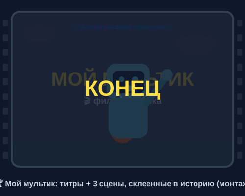

# Урок 5 — Мой мультик: сцены, монтаж и титры 🏆🎬

**Модуль 4 · Анимация в Adobe Animate · Урок 5 из 5 (ФИНАЛ модуля) | 2 ак.ч. (1,5 часа)**

> 🔁 В начале — [разминка/повтор](повторение.md) (5 мин).
> 👨‍🏫 Сценарий с хронометражом — в [преподавателю.md](преподавателю.md).
> 🖼 Что показать и материалы (музыка/звук) — в [изображения.md](изображения.md) и в конце («Материалы»).
> ⚠️ Всё делаем **вручную**, без ИИ.
> 🎞 **Рендер результата** (двигается) — [`изображения/результат-мультик.svg`](изображения/результат-мультик.svg), открой в браузере.

> 🧭 **Как читать урок.** Это **финал модуля** 🏆 — сегодня НЕ учим один новый приём, а **собираем всё вместе** в настоящий **мультик 10–15 секунд**: придумываем **историю**, раскладываем её по **сценам**, **монтируем** на таймлайне, добавляем **титры** (заголовок и «Конец») и **музыку**, а потом **экспортируем в GIF/MP4** — файл, который можно показать друзьям и положить в портфолио. Оживших героев берём из прошлых уроков (мяч, ракета, морфинг, говорящий маскот). Каждый шаг — до кнопки и кадра.

---

## 🎬 Что мы сделаем сегодня и что получим

**Задача:** превратить набор анимаций в **историю с началом, серединой и концом**. Сделаем **раскадровку** (план из 3 сцен), соберём сцены на таймлайне, склеим их **монтажом** с плавными переходами, поставим **титр-заголовок** и **«КОНЕЦ»**, добавим **фоновую музыку** и **экспортируем готовый мультик**.

**В итоге у тебя получится:** твой собственный **мультфильм 10–15 секунд** 🎬 (титр → 3 сцены → «Конец» + музыка) в формате **GIF и/или MP4** + файл `.fla`. Это **итоговая работа Модуля 4** для портфолио.

**Главные навыки урока (сборка всего модуля):**
- 🗺 **Раскадровка** — план истории по сценам (начало → середина → конец).
- 🎞 **Сцены (Scenes)** и слои — крупные части мультика.
- ✂️ **Монтаж на таймлайне** — порядок и **тайминг** событий, плавные **переходы** между сценами.
- 🔤 **Титры** — заголовок и «Конец» с плавным появлением/уходом.
- 🎵 **Фоновая музыка** + звуки.
- 📤 **Экспорт GIF / MP4** — финальный файл.

> 💡 **Главная мысль урока:** анимация — это не отдельные трюки, а **история**. Зрителю важно «что происходит и чем закончится». Даже 10 секунд должны иметь **начало, середину и конец**.

**🎞 Вот что должно получиться** (открой в браузере — идёт **мини-мультик**: титр → 3 сцены → «Конец»):

---

## 🧭 Где что находится (сборка мультика)

- **Сцены (Scenes):** **`Окно → Сцены`** — панель со списком сцен. Кнопка **«+»** добавляет сцену; сцены **играют по порядку** сверху вниз. *(Можно и без них — сделать всё на одной длинной шкале, разделив «главами»-метками. Оба способа разберём.)*
- **Метки кадров (Frame Labels):** выдели кадр → **Свойства → «Метка кадра»** → впиши имя (`сцена1`, `финал`). Красный флажок = «глава» истории.
- **Слои (Layers):** панель слоёв снизу. Держи по слою на смысловой элемент: `фон`, `герой`, `титры`, `музыка`. Порядок слоёв = что поверх чего.
- **Тайминг:** длину куска задаёшь кадрами (`F5` тянет, `F7`/`F6` — ключевые). При **24 к/с**: 24 кадра = 1 секунда, значит 15 сек ≈ **360 кадров**.
- **Плавный переход (fade):** прямоугольник-«шторка» как **символ** → **анимация движения** → **Свойства → Эффект цвета → Альфа (Alpha)** от 0% до 100% (затемнение) — или наоборот.
- **Титр-текст:** «Текст» (`T`) → в символ (`F8`) → анимация движения → **Альфа** 0→100 (появился) и 100→0 (ушёл).
- **Музыка/звук:** `Файл → Импорт → Импортировать в библиотеку` → на слой `музыка` → **Свойства → Звук → Синхронизация «Поток»** (как в уроке 4).
- **Экспорт:** `Файл → Экспорт → Экспортировать анимированный GIF…` (GIF, без звука) или `…Экспортировать видео/медиа…` (MP4 со звуком, через Media Encoder).

> ⚠️ **Про звук в GIF:** GIF **не хранит звук**. Мультик с музыкой сохраняй в **MP4** (или как HTML5). GIF — для быстрой немой версии.

---

## Часть 1 — Раскадровка: придумываем историю (10 минут)

Мультик начинается **не в программе, а на бумаге**. Раскадровка — это план из нескольких «кадриков».

1. Возьми лист, раздели на **3 квадрата** — это 3 сцены.
2. В каждом квадрате нарисуй **простой набросок** и подпиши, что происходит:
   - **Сцена 1 (начало):** знакомим героя/место. *(Пример: восходит солнце, по земле прыгает мяч.)*
   - **Сцена 2 (середина):** событие/движение. *(Пример: взлетает ракета по дуге.)*
   - **Сцена 3 (конец):** развязка. *(Пример: маскот машет и говорит «Пока!».)*
3. Реши **тайминг**: каждая сцена ≈ **3–5 секунд** (итого 10–15 сек).

**👀 Что получишь:** понятный план — не будешь «зависать» в программе, думая «а что дальше».

> 💡 **Правило истории:** начало (кто/где) → середина (что случилось) → конец (чем всё кончилось). Даже без слов зритель должен понять сюжет.

> 🧩 **Для 5–7:** хватит **2 сцен** (например: мяч прыгает → маскот машет). Меньше — но с началом и концом.

> 🎓 **Для 9–11:** добавь **завязку и «поворот»** (что-то идёт не так и решается); 3–4 сцены, продуманные переходы.

---

## Часть 2 — Готовим сцены и героев (12 минут)

1. **`Файл → Создать`** → **HTML5 Canvas**, **500 × 400**, **24 к/с**.
2. **Добавь сцены:** `Окно → Сцены` → кнопкой **«+»** создай **3 сцены** (`Сцена 1`, `Сцена 2`, `Сцена 3`). Переключаешься кликом по имени.
   - *(Упрощённый путь без панели «Сцены»: работай на **одной** шкале, ставь метки `сцена1` на кадре 1, `сцена2` на кадре ~90, `сцена3` на кадре ~200.)*
3. **Наполни каждую сцену героями из прошлых уроков** — не рисуй заново:
   - открой прошлый `.fla` → выдели анимацию/символ → **`Ctrl+C`**;
   - в мультике: нужная сцена → **`Ctrl+V`** (или через **Библиотеку**: перетащи символ);
   - либо **импортируй** экспортированные PNG/SVG героев (`Файл → Импорт → Импортировать в библиотеку`).
4. Разложи по **слоям**: `фон`, `герой`, потом добавим `титры` и `музыка`.

**👀 Что видишь:** три сцены, в каждой — свой оживший герой.

> 💡 **Экономь силы:** мультик — это **сборка** уже готового. Мяч из урока 1, ракета из урока 2, морфинг из урока 3, маскот из урока 4 — всё идёт в дело.

> ⚠️ **Ошибка:** рисовать всех героев заново с нуля — не успеешь. **Переиспользуй** свои прошлые работы.

---

## Часть 3 — Монтаж: тайминг и переходы (14 минут)

**Монтаж** — это порядок и длительность сцен + как они склеены.

### Шаг 1. Длительность сцен

1. В каждой сцене дотяни кадры (`F5`) до нужной длины: **≈ 3–4 сек = 72–96 кадров** при 24 к/с.
2. Проверь, что действие **успевает** произойти и не «висит» лишнего.

### Шаг 2. Порядок сцен

3. В панели **«Сцены»** перетаскиванием выстрой порядок: `Сцена 1 → 2 → 3`. Они проиграются подряд.

### Шаг 3. Плавный переход (fade) между сценами

4. В конце сцены сделай **затемнение**: новый слой `шторка` сверху → нарисуй **чёрный прямоугольник** на весь кадр → **`F8`** (символ) → **анимация движения** → в начале **Альфа 0%** (прозрачный), в конце **Альфа 100%** (чёрный). Сцена «уходит в чёрное».
5. В начале следующей сцены — наоборот: чёрный прямоугольник **Альфа 100% → 0%** (из чёрного «появляемся»).
   - 👀 **Что видишь:** сцены плавно перетекают через затемнение — красиво, как в кино.
   - *(Проще — «встык»: без шторки, сцена сразу сменяет сцену. Это тоже монтаж.)*

**👀 Что произойдёт:** нажми **`Ctrl+Enter`** — мультик идёт сценами, с плавными переходами.

> 💡 **Тайминг решает всё:** быстрые склейки = бодро/весело, длинные планы = спокойно/грустно. Меняй длину сцен под настроение.

> ⚠️ **Ошибка:** сцена «висит» 8 секунд без движения — скучно. Держи **3–4 сек** и режь лишнее.

> ⚠️ **Ошибка:** «шторка» под героем, а не над ним — затемнение не видно. Слой `шторка` должен быть **самым верхним** (кроме титров).

---

## Часть 4 — Титры: заголовок и «Конец» (10 минут)

Настоящий фильм начинается с **названия** и кончается **«Конец»**.

### Заголовок (в начале)

1. Перед первой сценой (или на её первых кадрах) новый слой `титры`.
2. «Текст» (`T`) → впиши **название мультика** (например, «МОЙ МУЛЬТИК») → крупный шрифт, яркий цвет.
3. Текст → **`F8`** (символ) → **анимация движения**:
   - кадр 1: **Альфа 0%** (не видно);
   - кадр ~12: **Альфа 100%** (появился);
   - держится ~1 сек;
   - потом **Альфа 100% → 0%** (растворился) — и начинается сцена 1.

### Финал «КОНЕЦ»

4. В конце последней сцены — слой `титры` → текст **«КОНЕЦ»** → так же **Альфа 0 → 100** на тёмном фоне.
5. По желанию — строка «Автор: **твоё имя**» под «Конец».

**👀 Что видишь:** мультик открывается названием и закрывается «Конец» — выглядит по-настоящему.

> 💡 **Секрет титра:** плавное **появление через Альфу** смотрится дороже, чем текст, который просто «выскочил». 12–15 кадров на проявление — то, что нужно.

> ⚠️ **Ошибка:** сделать титр **фигурой-текстом** и крутить Альфу — не выйдет. Для эффектов цвета/Альфы текст должен быть **символом** (`F8`).

---

## Часть 5 — Музыка и звук (8 минут)

Звук делает мультик живым.

1. Скачай короткую **фоновую музыку** (10–15 сек; ссылки ниже) или звук-настроение.
2. **`Файл → Импорт → Импортировать в библиотеку`** → музыка в **Библиотеке**.
3. Новый слой `музыка` → встань на **кадр 1** → перетащи музыку на сцену (появится **синяя волна**).
4. **Свойства → Звук → Синхронизация → «Поток» (Stream)** — музыка привяжется к таймлайну.
5. Дотяни кадры `F5` до конца волны (или обрежь музыку под длину мультика).
6. По желанию — **звуки-акценты** (прыжок мяча «бдыщ», взлёт ракеты «вжух») на отдельном слое в нужных кадрах.

> 💡 **Совет:** громкую музыку приглуши в **Свойствах → «Эффект»** (например, «Слабое затухание в конце»), чтобы мультик мягко «затих».

> ⚠️ **Ошибка:** музыка длиннее мультика — оборвётся резко. Подбери трек **под 10–15 сек** или добавь затухание.

---

## ✅ Как правильно / ❌ Как НЕ надо (мультик и монтаж)

| ❌ Как НЕ надо | ✅ Как правильно |
|----------------|------------------|
| Сразу лезть в программу без плана | Сначала **раскадровка** (3 сцены на бумаге) |
| Рисовать всех героев заново | **Переиспользовать** символы из уроков 1–4 |
| Сцена «висит» 8 сек без действия | **3–4 сек** на сцену, резать лишнее |
| Титр-текст крутить как фигуру | Текст → **символ** (`F8`) → Альфа |
| «Шторка» перехода под героем | Слой перехода — **сверху** |
| Музыка «Событие», длиннее ролика | Синхронизация **«Поток»**, трек под длину + затухание |
| Мультик с музыкой сохранить в GIF | Со звуком — **MP4** (GIF — немой) |

> ⚠️ Главные ошибки финала: **нет истории** (набор трюков без начала-конца) и **плохой тайминг** (сцены висят). Сначала план — потом сборка.

---

## Часть 6 — Экспорт готового мультика (8 минут)

1. **Финальная проверка:** `Управление → Тестировать` (`Ctrl+Enter`) — смотри целиком, со звуком.
2. **GIF (немой, для быстрой демонстрации):** `Файл → Экспорт → Экспортировать анимированный GIF…` → проверь **зацикливание** → «Экспорт».
3. **MP4 (со звуком — главный формат мультика):** `Файл → Экспорт → Экспортировать видео/медиа…` → откроется **Adobe Media Encoder** → формат **H.264** → «Запустить очередь». Получишь `.mp4`.
4. **HTML5 (интерактив/кнопки работают):** `Файл → Экспорт → Экспортировать ролик…`.
5. **Сохрани `.fla`** (`Ctrl+S`) — исходник для будущих правок.

**Ожидаемый результат:** файл `мой_мультик.mp4` (со звуком) + `.gif` + `.fla`. 🎉

> 💡 Для портфолио выкладывай **MP4** (звук + плавность). GIF удобен для чатов, но без звука и тяжелее по весу.

---

## 🎓 Часть 7 — Для 9–11: глубже (8 минут)

- **Завязка и поворот:** мини-сюжет с проблемой и решением (герой что-то теряет и находит).
- **Движение «камеры»:** имитируй наезд/отъезд — плавно масштабируй весь слой (символ-обёртка + tween масштаба).
- **Ритм монтажа:** подгони склейки под **биты музыки** (смена сцены на удар).
- **Титры с ролями:** «Режиссёр», «Аниматор», «Музыка» — как в настоящем кино.
- **Оптимизация GIF:** меньше цветов/кадров → легче файл.

---

## 🧩 Для 5–7 классов (проще)

- **2 сцены** + титр «Конец».
- Переходы **встык** (без шторок).
- Один герой из прошлых уроков.
- Музыка — необязательно; хватит GIF.

---

## 🏁 Итог урока и модуля (5 минут)

Ты собрал **свой первый мультфильм** — и завершил **весь Модуль 4**! 🏆

- ✅ **Раскадровка** — история из сцен (начало → середина → конец).
- ✅ **Сцены и слои** — крупные части мультика.
- ✅ **Монтаж** — тайминг сцен + плавные переходы (Альфа-шторки).
- ✅ **Титры** — заголовок и «Конец» через Альфу (текст-символ).
- ✅ **Музыка** — «Поток» + затухание.
- ✅ **Экспорт** — MP4 (со звуком), GIF, `.fla`.

**За весь модуль ты научился:** таймлайн и кадры, символы и анимация движения (урок 1), путь и easing/дуги (урок 2), морфинг форм (урок 3), кости/IK, звук, липсинк и кнопки (урок 4), и наконец — **собирать всё в историю** (урок 5). Ты умеешь **оживлять** то, что рисуешь! 🎬

> 🏆 **Защита работы (1 мин):** покажи мультик классу и расскажи — **о чём история**, какие **приёмы** использовал (из каких уроков), что получилось лучше всего.

> 🎤 **Блиц по модулю:** сколько кадров в секунде при 24 к/с в 5 секундах? для чего нужен символ? морфинг — для фигур или символов? что даёт IK? какая синхронизация у музыки? в каком формате сохранять мультик со звуком?

### 🎮 Викторина-закрепление (по ВСЕМУ Модулю 4)

Открой **[викторина.html](викторина.html)** — вопросы по всему модулю: кадры, символы, tween, путь, морфинг, кости, звук, монтаж + смешные и «на подумать».

➡️ **Самостоятельная работа** (свой мультик + комбо) — в [практике](практика.md).
🧰 **Трюки урока** (раскадровка, переходы, титры, экспорт) — в [лайфхак.md](лайфхак.md).

---

## 🔗 Материалы и ссылки к уроку

**🧰 Инструмент:** Adobe Animate (по лицензии класса), русский интерфейс, тип **HTML5 Canvas**; для MP4 — Adobe Media Encoder.

**📥 Материалы (свободные):**
- 🎵 **Музыка:** [Pixabay Music](https://pixabay.com/music/) (`happy`, `fun`, `cartoon`), [YouTube Audio Library](https://www.youtube.com/audiolibrary).
- 🔊 **Звуки-акценты:** [Pixabay Sound](https://pixabay.com/sound-effects/), [Mixkit](https://mixkit.co/free-sound-effects/), [Freesound](https://freesound.org/) (`boing`, `whoosh`, `pop`).
- 🖼 **Герои:** **свои из уроков 1–4** (мяч, ракета, морфинг, маскот) и из Модуля 3 (лиса/пингвин). Ещё: [PNGImg](https://pngimg.com/), [Freepik](https://www.freepik.com/).

**🎬 Вдохновение:** поиск — *2D animation short story*, *animatic storyboard*, *scene transition fade Animate*, *export mp4 Adobe Animate*. YouTube (рус.): *«сцены в Animate»*, *«монтаж анимации»*, *«титры в Animate»*, *«экспорт мультика GIF MP4 Animate»*.

**⚙️ Учителю:** заранее собрать образец-мультик (титр + 2–3 сцены + «Конец» + музыка), показать панель «Сцены», Альфа-переход и экспорт MP4/GIF на проекторе. Список — в [изображения.md](изображения.md).
