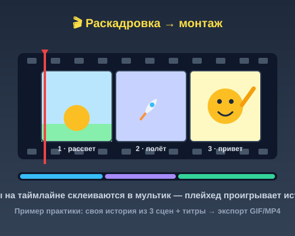

# Самостоятельная работа — Анимация, Урок 5 (финал)

> 🧑‍🎓 Это твой **итоговый мультик** модуля. Не повторяем образец — придумываешь **свою** историю.

---

## ✅ Задание 1 (для всех) — «Мой мультфильм» (итоговый проект)

Собери **свой** мультик 10–15 секунд по **своей** истории. Выбери **один** сюжет (или придумай сам):

- 🚀 **Космос:** ракета взлетает → летит мимо планет → приземляется, из неё машет герой;
- 🌦 **Погода:** солнце (морфинг в тучу) → дождь → радуга и весёлый герой;
- ⚽ **Гол:** мяч прыгает → летит по дуге в ворота → герой празднует;
- 🦊 **Знакомство:** твой герой из Модуля 3 просыпается → идёт по сцене → машет и говорит «Привет!»;
- 🎂 **Праздник:** свеча-морфинг → шарики взлетают → маскот поздравляет.

**🎞 Пример подхода** (открой в браузере — **раскадровка склеивается в мультик на таймлайне**):

**Обязательные условия:**
- [ ] Сделана **раскадровка** (план из 2–3 сцен: начало → середина → конец);
- [ ] **3 сцены** (🧩 можно 2), собраны из **своих героев** прошлых уроков (не рисуем всё заново);
- [ ] **Монтаж:** тайминг сцен по 3–4 сек + хотя бы один **плавный переход** (Альфа-шторка);
- [ ] **Титры:** название в начале + **«Конец»** (текст-символ, Альфа);
- [ ] **Музыка** (синхронизация «Поток»);
- [ ] Экспорт **MP4** (со звуком) + **GIF** + сохранён **`.fla`**.

---

## 🔗 Задание 2 (комбо — весь модуль) — «Три приёма в одном ролике»

Покажи мастерство: в мультике должны встретиться **минимум три разных приёма модуля**:
1. **Анимация движения** (урок 1) — прыжок/укатывание со сжатием-растяжением;
2. **Путь + easing** (урок 2) — полёт по дуге с разгоном;
3. **Морфинг** (урок 3) — превращение формы **или** **говорящий маскот** (урок 4) — взмах + звук.

**Результат:** ролик-«визитка» твоих навыков — по нему видно, что ты освоил весь модуль.

---

## ⚡ Задание 3 (разминка-челлендж) — раскадровка за 5 минут

**За 5 минут:** на листе нарисуй **раскадровку** из 3 квадратов для **любой** идеи (что в начале, что в середине, что в конце) и подпиши **тайминг** каждой сцены. Тренируем главный навык финала — **думать историей**, а не трюками.

---

## 📋 Что проверяем

- [ ] Есть **раскадровка** и понятная история (начало→середина→конец);
- [ ] **2–3 сцены** из своих героев; монтаж с таймингом;
- [ ] Хотя бы один **плавный переход**;
- [ ] **Титры** (название + «Конец»);
- [ ] **Музыка** («Поток»);
- [ ] Встретились **≥3 приёма** модуля (Задание 2);
- [ ] Экспорт **MP4 + GIF + `.fla`**.

## 🧩 Для 5–7 классов
- **2 сцены** + «Конец», переходы встык, один герой.
- Музыка по желанию; хватит **GIF**.
- Раскадровку можно устно/наброском.

## 🎓 Для 9–11 классов
- **Завязка и поворот** в сюжете; 3–4 сцены.
- Движение «камеры» (наезд/отъезд масштабом), склейки **под биты музыки**.
- Полные **титры** с ролями; оптимизация GIF.

## 🖼 Кинофестиваль класса 🎬
Сдай **MP4/GIF** — устроим показ! Голосуем: **лучшая история**, **лучший монтаж**, **приз зрительских симпатий**. Соберём общий «сборник мультиков класса».

## Что сдать
- `мой_мультик.mp4` + `.gif` + `*.fla` (Задание 1) + раскадровка (фото листа).
