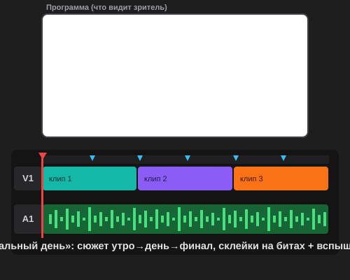

# Урок 1 — «Мой идеальный день»: клип с сюжетом под музыку 🎬🌅

**Модуль 5 · Видеомонтаж в Adobe Premiere Pro · Урок 1 из 5 | 2 ак.ч. (1,5 часа)**

> 🔁 В начале — [разминка/повтор](повторение.md) (5 мин).
> 👨‍🏫 Сценарий с хронометражом — в [преподавателю.md](преподавателю.md).
> 🖼 Что показать и материалы (клипы, музыка) — в [изображения.md](изображения.md) и в конце («Материалы»).
> ⚠️ Всё делаем **вручную**, без ИИ.
> 🎞 **Рендер результата** (двигается) — [`изображения/результат-клип.svg`](изображения/результат-клип.svg), открой в браузере.

> 🧭 **Как читать урок.** Это первый урок монтажа — знакомимся с **Adobe Premiere Pro**. Сегодня соберём не «случайную нарезку», а **клип с сюжетом** — сквозной проект **«Мой идеальный день» 🌅**: рассвет → приключение днём → закат → яркий финал. Картинку **нарежем в ритм музыки**, а сверху добавим **вау-приёмы монтажёров**: **крючок** (чтобы не пролистали), **вспышку на бите** и **склейку по движению**. В конце — **первый экспорт** в MP4. Каждый шаг — до конкретной панели, кнопки и клавиши: что нажать, где это, что увидишь 👀, зачем и какая типичная ошибка.

---

## 🎬 Что мы сделаем сегодня и что получим

**Задача:** из набора коротких клипов + музыки собрать **мини-историю** «Мой идеальный день»: спокойное утро, динамичный день, красивый закат и мощный финал. Не «клипы подряд», а с **аркой** (нарастанием): к финалу склейки чаще, музыка сильнее. Сверху — фирменные вау-приёмы монтажа.

**В итоге у тебя получится:** твой **первый смонтированный клип с сюжетом** 🎬 (≈25–30 секунд, картинка режется в ритм, есть крючок, вспышка на дропе и плавный финал) в формате **MP4** + проект `.prproj`. Это уже уровень роликов, которые заливают на канал.

**Главные навыки урока:**
- 🗂 **Интерфейс Premiere** — где Проект, мониторы «Исходник»/«Программа», Таймлайн, инструменты.
- 🎬 **Идея и структура клипа** — арка «утро → день → закат → финал» + **крючок**.
- 📥 **Импорт** клипов и музыки; **секвенция** + раскладка **по сюжету**.
- ✂️ **Точки Входа/Выхода** — берём только лучший кусок.
- 🥁 **Нарезка в ритм** — маркеры на битах + склейки на них.
- ✨ **Вау-приёмы:** **вспышка на бите** (Dip to White), **склейка по движению** (match cut), плавный **«Наплыв»** + первый **экспорт** MP4.

> 💡 **Главная мысль:** крутой клип — это **история + ритм**. Сначала придумываем, *о чём* ролик и *как он развивается*, а потом режем лучшие куски **в такт** музыке. Тогда даже простые кадры складываются в «вау».

**🎞 Вот что должно получиться** (открой в браузере — сюжет утро→день→финал, склейки на битах, вспышка на дропе):

---

## 🧭 Где что находится (интерфейс Premiere)

Premiere с непривычки пугает — панелей много. Но нам нужны всего **пять**. Вверху выбери рабочую среду **«Редактирование» (Editing)**: `Окно → Рабочие среды → Редактирование` (или `Сбросить к сохранённому макету`), чтобы панели встали как в уроке.

- **Панель «Проект» (Project)** — **слева внизу**. Сюда попадают все импортированные клипы и музыка. Здесь же **бины** (папки-корзины).
- **Монитор «Исходник» (Source)** — **слева вверху**. Здесь **просматриваем один клип** и вырезаем кусок (Вход/Выход) **до** таймлайна.
- **Монитор «Программа» (Program)** — **справа вверху**. Показывает **то, что видит зритель** — собранный монтаж (что под плейхедом).
- **Таймлайн (Timeline)** — **внизу**. Главное рабочее место: дорожки видео **V1, V2…** (сверху) и звука **A1, A2…** (снизу). Синяя вертикальная линия — **плейхед**.
- **Панель «Инструменты» (Tools)** — узкая полоска у таймлайна: **Выделение** (`V`, стрелка), **Лезвие** (`C`, режет), и др.

> 💡 **Клавиши, которые решают всё:** **Пробел** — играть/стоп · **`I`** — Вход · **`O`** — Выход · **`C`** — Лезвие · **`V`** — Выделение · **`M`** — маркер · **`S`** — привязка вкл/выкл.

> ⚠️ **Типичная ошибка новичка:** искать клипы «в компьютере». В Premiere работаешь только с тем, что **импортировал в Проект**. Нет клипа в панели «Проект» — его нет и в монтаже.

---

## Часть 1 — Идея и структура клипа (10 минут)

Крутой ролик начинается **не с программы, а с идеи**. Как раскадровка в анимации — сначала план.

**Сквозная тема урока — «Мой идеальный день» 🌅.** Это история одного дня, рассказанная кадрами. У неё есть **арка** (развитие) из 4 частей:

| Часть клипа | Что показываем | Музыка | Ритм склеек |
|-------------|----------------|--------|-------------|
| 🎣 **Крючок** (0–3 сек) | Самый эффектный кадр дня (прыжок, брызги, салют — «вкусный» момент) | старт | 1 яркая склейка |
| 🌅 **Завязка — утро** | Рассвет, будильник, завтрак, потягушки | спокойная | редкие, длинные |
| 🚲 **Развитие — день** | Движение: велик, город, море, друзья, игра | бодрая | чаще, в ритм |
| 🎆 **Кульминация — финал** | Закат → самый мощный кадр + **вспышка** | дроп/пик | частые, на бит |

**Что сделать сейчас (на бумаге, 3 минуты):**
1. Реши, **о чём твой день** (спорт? море? город? дом с питомцем?).
2. Набросай **4 квадрата** (крючок / утро / день / финал) и подпиши, какой кадр в каждом.
3. Прикинь **длину** — итого ≈25–30 сек.

> 💡 **Правило крючка:** первые **3 секунды** решают, будут ли смотреть дальше. Ставь в самое начало **самый эффектный** кадр — не «раскачивайся».

> 💡 **Правило арки:** к финалу склейки становятся **чаще**, а музыка **сильнее** — зритель чувствует нарастание. Ровная «нарезка без развития» быстро наскучивает.

> 🧩 **Для 5–7:** хватит **3 частей** (утро → день → финал) без отдельного крючка. Главное — чтобы был понятный «день».

---

## Часть 2 — Создаём проект и импортируем материалы (10 минут)

### Шаг 1. Новый проект

1. Запусти Premiere → **«Новый проект»** (или **`Файл → Создать → Проект`**).
2. Впиши **имя** (`Мой_идеальный_день`) и выбери **папку** (своя папка ученика). → **«Создать»**.
   - 👀 **Что видишь:** открылось рабочее окно с пустыми панелями.

> 💡 **Правило порядка:** храни клипы/музыку в **той же папке**, что и проект. Переместишь файлы — Premiere «потеряет» их («Медиаданные offline»).

### Шаг 2. Импорт клипов и музыки

3. **`Файл → Импорт…`** (`Ctrl+I`) → выбери **клипы стартер-пака** (зажми `Ctrl`) **и** музыку → **«Открыть»**. *(Быстрее — перетащи файлы прямо в панель «Проект».)*
   - 👀 **Что видишь:** в «Проекте» появились превью клипов и музыки.
4. **Наведи мышь на превью** и веди вправо-влево — быстрый просмотр (hover scrub). Отметь, какой кадр в какую часть арки пойдёт (крючок/утро/день/финал).

> 🧩 **Для 5–7:** учитель заранее кладёт стартер-пак «День» (утро/день/финал + трек) в папку ученика.

---

## Часть 3 — Секвенция и раскладка по сюжету (12 минут)

**Секвенция** — твоя «монтажная лента» (то, что показывает таймлайн).

1. Перетащи **первый клип** (тот, что будет **крючком** — самый эффектный) на пустой Таймлайн.
   - 👀 **Что произойдёт:** Premiere **сам создаст секвенцию** под размер клипа. Клип ляжет на **V1**.
2. Перетащи **музыку** на дорожку **A2** — появится зелёная волна.
3. Разложи остальные клипы на **V1 по порядку арки**: крючок → утро → день → закат/финал. Включи **привязку** (`S`), чтобы встык без щелей.
   - 👀 **Что видишь:** на V1 — история по порядку, на A2 — музыка.
4. Нажми **Пробел** — монтаж играет в мониторе **«Программа»**.

> 💡 **Дорожки — это слои, как в Photoshop:** что на **V2**, перекрывает **V1**. Пока хватит одной дорожки V1.

> ⚠️ **Ошибка:** чёрные щели на V1 → при просмотре мелькает чёрный экран. Двигай встык (`S`) или убери щель: ПКМ по щели → **«Удалить со сдвигом» (Ripple Delete)**.

---

## Часть 4 — Точки Входа/Выхода: берём лучший кусок (12 минут)

Клипы длинные, а нам нужны **лучшие 1–2 секунды** каждого.

1. **Дважды кликни** клип в «Проекте» → он в мониторе **«Исходник»**.
2. Играй (**Пробел**), на начале нужного момента жми **`I`** (**Вход**), на конце — **`O`** (**Выход**).
   - 👀 **Что видишь:** выбранный кусок подсветился.
3. **Перетащи** кусок из «Исходника» на Таймлайн в нужную часть арки. *(Или клавишами: `.` — **Перезапись**, `,` — **Вставка**.)*
4. Повтори для всех клипов: открыл → `I` … `O` → перетащил в своё место.

> 💡 **Вставка vs Перезапись:** **Перезапись** (`.`) кладёт клип **поверх** того, что под плейхедом. **Вставка** (`,`) **раздвигает** соседей и вклинивается. Для начала проще **Перезапись**.

> ⚠️ **Ошибка:** тащить на таймлайн **весь** длинный клип. Сначала обрежь `I`/`O` — монтаж станет плотным и динамичным.

> 🎓 **Для 9–11:** пробуй **J/L-склейки** — звук следующего клипа приходит чуть **раньше** картинки (или наоборот). Делает переходы «профессионально мягкими».

---

## Часть 5 — Нарезка в ритм музыки (12 минут)

Самое «вкусное»: склейки ставим **на удары**, а к финалу — чаще.

1. Плейхед в начало (**`Home`**). Играй музыку (**Пробел**) и на каждый **сильный удар** жми **`M`** — сыплются **маркеры** (метки ритма).
2. Останови (**Пробел**). Включи **привязку** (`S`).
3. **Лезвие** (`C`) → режь клип **на маркере**. Вернись на **Выделение** (`V`) → лишний хвост → **`Shift+Delete`** (**удалить со сдвигом / Ripple**) — сосед подтянется без щели.
4. Добейся, чтобы **склейки попадали на биты**. По арке: в «утре» — реже (каждый 4-й бит), в «дне/финале» — чаще (каждый 2-й).
5. Играй (**Пробел**) — картинка **меняется в ритм**, к финалу нарастает! 🥁

> 💡 **Секрет ритма:** не обязательно резать под каждый бит. Меняй кадр на **сильные** удары — так «дышит», а не мельтешит. А ускорение склеек к финалу = ощущение кульминации.

> ⚠️ **Ошибка:** после Лезвия забыл вернуться на **Выделение** (`V`) — режешь всё подряд. Порезал — сразу `V`.

> ⚠️ **Ошибка:** обычный `Delete` оставляет **щель**. Со сдвигом — **`Shift+Delete`**.

---

## Часть 6 — ✨ Вау-приёмы монтажёров (14 минут)

Три приёма, которые превращают ролик из «неплохо» в «вау». Всё — **чистый монтаж**, без спецэффектов.

### 🌫 Приём 1 — «Наплыв» на смене времени суток

Смягчаем переходы **между частями арки** (утро→день, день→финал):
1. `Окно → Эффекты` → **Видеопереходы → Растворение → «Наплыв» (Cross Dissolve)**.
2. **Перетащи «Наплыв»** на стык двух частей. А в **самое начало** первого клипа и **конец** последнего — тоже «Наплыв»: ролик **появится из чёрного** и красиво уйдёт.
   - 👀 Один кадр плавно перетекает в другой.

> 💡 «Наплыв» — только на **смену сцены/времени** и на концы. Внутри «дня» — резкие склейки по ритму, иначе будет «мыльно».

### ⚡ Приём 2 — «Вспышка на бите» (Dip to White)

Фирменный трюк клипов: на **дропе** (самый мощный удар перед финалом) — короткая **белая вспышка**.
1. В «Эффектах» → **Видеопереходы → Растворение → «Погружение в белый» (Dip to White)**.
2. Перетащи его на **склейку ровно на дропе** (сильный маркер перед финалом).
3. Сделай его **коротким** — потяни край до ~**8–10 кадров** (вспышка должна быть быстрой!).
   - 👀 **Что видишь:** на бите экран на миг **вспыхивает белым** — «бам!» — и начинается финал. Очень эффектно.

> 💡 Вспышка = «восклицательный знак» клипа. Хватит **одной** на весь ролик (на главном ударе). Много вспышек — глаза устают.

### 🤸 Приём 3 — «Склейка по движению» (match cut) — 🎓 вау

Высший пилотаж: движение **продолжается через склейку**, будто камера одна.
- **Как найти:** ищи два клипа с **похожим движением** — в конце клипа А что-то движется в одну сторону, и в начале клипа Б движение **продолжается**. Примеры: рука проводит по камере (свайп) → новая сцена; прыжок вверх → приземление в другом месте; поворот/бег в одну сторону.
- **Как склеить:** обрежь клип А **на пике движения** (`O`), а клип Б — **сразу после того же движения** (`I`), поставь встык. Глаз «не заметит» склейку — сцена сменится волшебно.

> 💡 Даже **одна** удачная склейка по движению вызывает «вау, как ты это сделал?!». Не обязательно много — одна на ролик.

> ⚠️ **Ошибка:** match cut между **разными** направлениями движения (влево→вправо) — «дёргается». Движение должно **совпадать** по направлению и скорости.

---

## ✅ Как правильно / ❌ Как НЕ надо (клип с сюжетом)

| ❌ Как НЕ надо | ✅ Как правильно |
|----------------|------------------|
| Клипы подряд без идеи | Сначала **арка**: крючок → утро → день → финал |
| Скучный старт, «раскачка» | **Крючок**: эффектный кадр в первые 3 сек |
| Ровный ритм от начала до конца | Склейки **чаще к финалу** (нарастание) |
| Тащить весь длинный клип | Обрезать **Входом/Выходом** (`I`/`O`) |
| Щели (чёрные мелькания) | Встык + `S`; щель — **Ripple** (`Shift+Delete`) |
| «Наплыв»/вспышка на каждой склейке | «Наплыв» — на смену сцены; вспышка — **одна** на дропе |
| Match cut разных движений | Движение должно **совпадать** по направлению |
| Двигать файлы после импорта | Держать в папке проекта (иначе «offline») |

> ⚠️ Главные ошибки урока: **нет истории** (случайная нарезка) и **щели между клипами**. Сначала арка на бумаге, потом плотный монтаж встык.

---

## Часть 7 — Первый экспорт в MP4 (8 минут)

1. Плейхед в начало (`Home`), проверь ролик целиком (**Пробел**).
2. **`Файл → Экспорт → Медиаконтент…`** (`Ctrl+M`).
3. Настрой: **Формат — H.264** (это MP4); **Набор настроек — «Match Source – High bitrate»** или **«YouTube 1080p»**; **имя** и **папку**.
4. **«Экспорт»** → подожди рендер.
   - 👀 **Что получишь:** `Мой_идеальный_день.mp4` — играет в любом плеере/телефоне.
5. Сохрани проект: **`Ctrl+S`** (`.prproj`).

> ⚠️ **Ошибка:** в окне экспорта стоят точки Входа/Выхода на **часть** — выйдет кусок. Проверь, что выбран **весь** диапазон секвенции.

---

## 🎓 Часть 8 — Для 9–11: глубже (8 минут)

- **Match cut** (склейка по движению) — найди и сделай хотя бы одну.
- **J/L-склейки** — звук приходит раньше/позже картинки.
- **Крючок-петля:** первый кадр = намёк на финал (клип «закольцован» по смыслу).
- **Вертикаль** 1080×1920 (Shorts/Reels) — `Файл → Создать → Секвенция`.
- **Ритм по дропу:** самый частый монтаж — именно после вспышки, в финале.

---

## 🧩 Для 5–7 классов (проще)

- Стартер-пак и музыку раскладывает учитель; ребёнок импортирует.
- История из **3 частей** (утро → день → финал), **3–4 клипа**, склейки под музыку «на глаз».
- Точки Входа/Выхода — по желанию; можно обрезать край на таймлайне.
- Вау-приём — только **«Наплыв»** на концах (вспышку/ match cut по желанию).

---

## 🏁 Итог урока (5 минут)

Сегодня ты сделал **первый клип с сюжетом** в Premiere:

- ✅ **Интерфейс** — Проект, «Исходник», «Программа», Таймлайн, Инструменты.
- ✅ **Идея и арка** — крючок → утро → день → финал (история, а не нарезка).
- ✅ **Импорт**, авто-**секвенция**, раскладка **по сюжету**.
- ✅ **Точки Входа/Выхода** — лучший кусок клипа.
- ✅ **Нарезка в ритм** — маркеры (`M`), Лезвие (`C`), Ripple (`Shift+Delete`), нарастание к финалу.
- ✅ **Вау-приёмы** — «Наплыв», **вспышка на бите** (Dip to White), **склейка по движению** (match cut).
- ✅ **Экспорт MP4** (`Ctrl+M`, H.264) + сохранение `.prproj`.

> 🏆 У тебя в руках инструмент видеоблогеров — и клип, у которого есть **история**! Дальше — **урок 2 «Повелитель времени»**: слоу-мо, ускорение, реверс и стоп-кадр.

> 🎤 **Блиц:** зачем клипу крючок? что такое арка ролика? как поставить маркер на бит? что делает вспышка на бите? в чём секрет склейки по движению?

### 🎮 Викторина-закрепление

Открой **[викторина.html](викторина.html)** — вопросы про интерфейс, структуру клипа, ритм и вау-приёмы + смешные и «на подумать».

➡️ **Самостоятельная работа** (свой клип с сюжетом + комбо) — в [практике](практика.md).
🧰 **Трюки урока** (быстрая обрезка, ритм, вспышка, match cut) — в [лайфхак.md](лайфхак.md).

---

## 🔗 Материалы и ссылки к уроку

**🧰 Инструмент:** Adobe Premiere Pro (по лицензии класса), русский интерфейс, рабочая среда «Редактирование».

**📥 Материалы (свободные):**
- 🎬 **Клипы (стартер-пак «День»):** [Pexels Video](https://www.pexels.com/videos/), [Pixabay Video](https://pixabay.com/videos/), [Mixkit](https://mixkit.co/free-stock-video/), [Coverr](https://coverr.co/) (поиск: `sunrise`, `breakfast`, `bike`, `city`, `beach`, `sunset`, `fireworks`, `jump`). Можно **свои** кадры дня с телефона.
- 🎵 **Музыка (с нарастанием/дропом, 25–40 сек):** [Pixabay Music](https://pixabay.com/music/) (`upbeat`, `energetic`, `epic`), [YouTube Audio Library](https://www.youtube.com/audiolibrary).

**🎬 Вдохновение:** поиск — *day in the life edit*, *beat sync edit*, *dip to white flash transition*, *match cut editing*. YouTube (рус.): *«монтаж под музыку»*, *«вспышка на бите Premiere»*, *«склейка по движению match cut»*.

**⚙️ Учителю:** заранее собрать стартер-пак «День» (кадры утро/день/финал + трек с дропом) в общей папке; показать арку, крючок, маркеры на битах, вспышку (Dip to White) и match cut на проекторе. Список — в [изображения.md](изображения.md).
