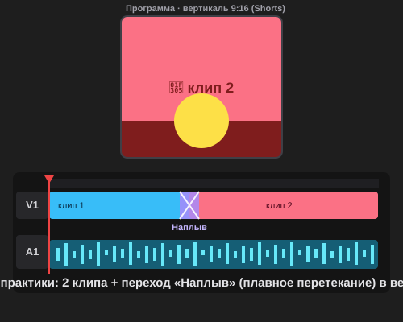

# Самостоятельная работа — Видеомонтаж, Урок 1

> 🧑‍🎓 Не повторяем урочный ролик! Собираешь **свой** клип на **другую** тему и с **другой** музыкой.

---

## ✅ Задание 1 (для всех) — «Свой клип под музыку» (новый вызов)

Смонтируй **свой** ролик 20–30 секунд, нарезанный в ритм. Выбери **одну** тему (клипы — из другого стартер-пака или свои с телефона):

- 🛹 **Спорт/движение:** скейт, велик, футбол, танцы;
- 🐾 **Питомец:** смешные моменты кота/собаки;
- 🌆 **Мой город:** улицы, транспорт, вывески, парк;
- 🍳 **Готовка/крафт:** как что-то делается (по шагам);
- 🌿 **Природа:** море, лес, закат, дождь.

**🎞 Пример результата** (открой в браузере — **2 клипа + переход «Наплыв» в вертикали**):

**Обязательные условия:**
- [ ] Новый **проект** + импорт клипов и музыки;
- [ ] Минимум **4 клипа**, у каждого взят **лучший кусок** (точки Входа/Выхода);
- [ ] Клипы **встык** (без чёрных щелей), склейки — **в ритм** (маркеры на битах);
- [ ] Хотя бы один **переход «Наплыв»** (начало/конец/смена сцены);
- [ ] Экспорт **MP4** (H.264) + сохранён **`.prproj`**.

---

## 🔗 Задание 2 (комбо, Модуль 4 + Модуль 5) — «Анимация внутри клипа»

Свяжи монтаж с анимацией:
1. Возьми **свой GIF/MP4 из Модуля 4** (мяч, ракета, морфинг или говорящий маскот) — экспортируй его как видео.
2. **Импортируй** его в Premiere и **вставь в свой клип** как одну из сцен (например, интро или концовку).
3. Подгони под ритм музыки, добавь «Наплыв» на входе.

**Результат:** ролик, где живое видео сочетается с **твоей анимацией** — мини-визитка навыков.

---

## ⚡ Задание 3 (разминка-челлендж) — обрезка за 5 минут

**За 5 минут:** импортируй **1 длинный клип** → открой в «Исходнике» → поставь **точку Входа `I`** и **Выхода `O`** на самый сочный момент (2–3 сек) → перетащи кусок на таймлайн. Тренируем главный навык — **брать лучшее, а не всё**.

---

## 📋 Что проверяем

- [ ] Тема и музыка — **свои** (не урочные);
- [ ] У клипов взяты **лучшие куски** (Вход/Выход);
- [ ] Клипы встык, склейки **в ритм**;
- [ ] Есть **«Наплыв»**;
- [ ] Экспорт MP4 + `.prproj`;
- [ ] Сделано **«Комбо»** (вставлена анимация из Модуля 4).

## 🧩 Для 5–7 классов
- Готовый стартер-пак от учителя, **3 клипа** встык под музыку.
- Точную подгонку под бит можно не делать — достаточно, что клипы идут под музыку.
- «Наплыв» — в начале и конце.

## 🎓 Для 9–11 классов
- **6+ клипов**, точная нарезка на каждый 4-й бит.
- **J/L-склейки** (звук приходит раньше/позже картинки).
- **Вертикальная** версия 1080×1920 для Shorts/Reels.

## 🖼 Кинозал класса 🎬
Сдай MP4 — устроим показ! Голосуем: **самый ритмичный монтаж** и **самая интересная тема**.

## Что сдать
- `мой_клип.mp4` + `*.prproj` (Задание 1) + версия с анимацией из М4 (Задание 2).
