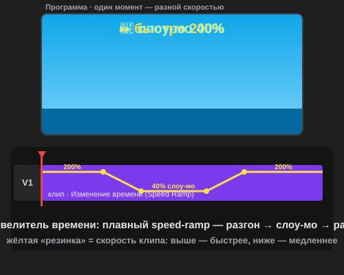

# Урок 2 — Повелитель времени: слоу-мо, реверс, стоп-кадр ⚡⏳

**Модуль 5 · Видеомонтаж в Adobe Premiere Pro · Урок 2 из 5 | 2 ак.ч. (1,5 часа)**

> 🔁 В начале — [разминка/повтор](повторение.md) (5 мин).
> 👨‍🏫 Сценарий с хронометражом — в [преподавателю.md](преподавателю.md).
> 🖼 Что показать и материалы (клипы с движением) — в [изображения.md](изображения.md) и в конце («Материалы»).
> ⚠️ Всё делаем **вручную**, без ИИ.
> 🎞 **Рендер результата** (двигается) — [`изображения/результат-время.svg`](изображения/результат-время.svg), открой в браузере.

> 🧭 **Как читать урок.** В прошлый раз мы резали и склеивали в ритм. Сегодня получаем **суперсилу — власть над временем** ⚡. Сквозной проект — **«Кино-момент»**: берём **один обычный кадр** (прыжок, поворот к камере, брызги воды) и превращаем его в **эпичный, как в трейлере блокбастера** — **замедляем** самый сок (слоу-мо), **ускоряем** скучное (таймлапс), пускаем **задом наперёд** (реверс) и **замораживаем** на пике (стоп-кадр). А сверху — вау-приём монтажёров: **плавный speed-ramp** (видео «влетает» в слоу-мо). Каждый шаг — до конкретной панели, кнопки и клавиши: что нажать, где это, что увидишь 👀, зачем и какая типичная ошибка. *(А в практике из этого приёма соберём целый **трейлер** по любимому фильму/книге/аниме!)*

---

## 🎬 Что мы сделаем сегодня и что получим

**Задача:** взять обычный клип с движением и «поиграть со временем», чтобы кадр стал **киношным**, как в трейлере: обычный подход → **слоу-мо** на пике → **стоп-кадр** (драматичная пауза «замри!») → **реверс** (перемотка назад для вау/шутки) → **быстрый повтор**. Всё — под музыку, слоу-мо ложится на **дроп**.

**В итоге у тебя получится:** эффектный **«Кино-момент»** ⚡ (≈15–25 сек) с слоу-мо, стоп-кадром, реверсом и **плавным speed-ramp** — в формате **MP4** + проект `.prproj`. Такое собирает лайки: «как ты это сделал?!». А в [практике](практика.md) из этого приёма ты соберёшь **трейлер по любимому фильму/книге/аниме**.

**Главные навыки урока:**
- 🐌 **Слоу-мо и ускорение** — «Скорость/Длительность» (< 100% и > 100%).
- 📐 **Растянуть скорость** (Rate Stretch, `R`) — меняем скорость, растягивая клип.
- ◀ **Реверс** — видео задом наперёд (галка «Реверс скорости»).
- ❚❚ **Стоп-кадр** — заморозка на пике (удержание кадра).
- ⚡ **Speed-ramp** (Изменение времени / Time Remapping) — плавный «влёт» в слоу-мо + **Оптический поток** для гладкости.

> 💡 **Главная мысль:** скорость — это **эмоция**. Замедлил — «вау, красиво/эпично»; ускорил — «весело/энергично»; заморозил — «вот он, момент!»; реверс — «магия/шутка». Один и тот же кадр разной скоростью рассказывает разное.

**🎞 Вот что должно получиться** (открой в браузере — комета летит с **плавным speed-ramp**, резинка скорости на клипе):

---

## 🧭 Где что находится (инструменты времени)

- **«Скорость/Длительность»** — **правый клик по клипу** на таймлайне → **«Скорость/Длительность…»** (или `Ctrl+R`). Окно: поле **«Скорость» %** (50% = медленно, 200% = быстро), галка **«Реверс скорости»** (задом наперёд), галка **«Сохранить высоту звука»**, и **«Волновое изменение…»** (чтобы соседи подвинулись, а не осталась дырка).
- **Инструмент «Растянуть скорость» (Rate Stretch, `R`)** — на **панели инструментов** (в одной группе с «Подрезкой»). Тянешь **край клипа** → скорость меняется, чтобы заполнить длину (длиннее = медленнее).
- **Стоп-кадр (удержание кадра):** правый клик по клипу → **«Добавить остановку кадра»** (заморозит с плейхеда) или **«Вставить сегмент удержания кадра»** (вставит замороженный кусочек в середину). Ещё есть значок **фотоаппарата** под монитором — «Экспортировать кадр» (сохранить как картинку).
- **Изменение времени (Time Remapping / speed-ramp):** на клипе значок **fx** (левый верхний угол клипа) → **правый клик → «Показать ключевые кадры» → «Изменение времени» → «Скорость»**. На клипе появится **горизонтальная резинка** (rubber band): выше = быстрее, ниже = медленнее. **`Ctrl`+клик** по резинке = ключ скорости.
- **Оптический поток:** правый клик по клипу → **«Интерполяция времени» → «Оптический поток»** — для **плавного** слоу-мо программа **дорисовывает** промежуточные кадры (нужен **рендер**: `Enter`).
- **Рендер участка:** **`Enter`** — Premiere просчитает участок, чтобы слоу-мо/эффекты играли гладко (полоса над клипом станет зелёной).

> 💡 **Клавиши урока:** `Ctrl+R` — Скорость/Длительность · `R` — Растянуть скорость · `V` — обратно на Выделение · `Enter` — рендер участка · Пробел — играть.

> ⚠️ **Про настоящее слоу-мо:** плавнее всего замедляется видео, снятое с **большим числом кадров/сек** (60/120 fps). Обычное видео при сильном замедлении «дёргается» — тут и спасает **Оптический поток**.

---

## Часть 1 — Идея: «Кино-момент» (8 минут)

Сначала — план (как раскадровка). Представь, что ты снимаешь **кадр для трейлера**: обычное действие должно выглядеть **эпично**. Возьми **один клип с ярким движением** (прыжок, поворот к камере, брызги воды, скейт-трюк, бегущий питомец, летящий мяч) и распиши, **где какая власть времени**:

| Момент клипа | Власть времени | Эмоция |
|--------------|----------------|--------|
| Подход/разбег | обычная скорость | завязка |
| **Пик действия** (прыжок/удар) | **слоу-мо 40%** + speed-ramp | «ВАУ, эпично» |
| Момент триумфа | **стоп-кадр** (пауза) | «вот он!» |
| Повтор/шутка | **реверс** ◀ или **ускорение** ⏩ | «магия/весело» |

**Сделай сейчас:** реши, какой у тебя **кино-момент** и на каком кусочке будет слоу-мо. Подбери музыку с **дропом** — слоу-мо поставим на него.

> 💡 **Правило слоу-мо:** замедляй **только сок** (1–2 секунды пика), а не весь клип. Слоу-мо на всё = скучно и долго.

---

## Часть 2 — Слоу-мо и ускорение (14 минут)

### Слоу-мо (замедление)

1. Положи клип на таймлайн (как в уроке 1). Найди кусок с пиком — при желании **отрежь** его отдельным клипом (Лезвие `C` по краям).
2. **Правый клик по клипу → «Скорость/Длительность…»** (`Ctrl+R`).
3. Поставь **«Скорость» = 40%** (или 50%). Включи галку **«Волновое изменение, сдвиг конечных клипов»** (чтобы соседи подвинулись). → **«ОК»**.
   - 👀 **Что видишь:** клип на таймлайне **стал длиннее**, а движение — **медленным и плавным**. Эпично!

### Ускорение (таймлапс)

4. Для «скучного» куска (долгий подход, облака, дорога) поставь **«Скорость» = 300–800%**.
   - 👀 **Что произойдёт:** клип **укоротился**, время «летит» — таймлапс.

> 💡 **Мостик:** слоу-мо и ускорение = «резиновое» время. 50% — в 2 раза медленнее, 200% — в 2 раза быстрее.

> ⚠️ **Ошибка:** замедлил, но осталась **дырка** или клипы **наехали** друг на друга. Ставь галку **«Волновое изменение…»** — соседи подвинутся правильно.

> ⚠️ **Ошибка:** сильное слоу-мо «дёргается». Включи **Оптический поток** (Часть 6) и нажми **`Enter`** (рендер).

---

## Часть 3 — Растянуть скорость мышкой (Rate Stretch) (8 минут)

Быстрый способ подогнать скорость **под нужную длину** (например, ровно под музыкальную фразу).

1. Возьми инструмент **«Растянуть скорость» (Rate Stretch, `R`)**.
2. Наведи на **край клипа** и **тяни**:
   - тянешь **длиннее** → клип **замедляется**;
   - тянешь **короче** → **ускоряется**.
3. Вернись на **Выделение** (`V`).

**👀 Что получишь:** скорость подстроилась под длину куска — удобно, когда слоу-мо должно закончиться ровно на склейке/бите.

> 💡 Rate Stretch — когда важна **длина** (влезть в ритм), а «Скорость/Длительность» — когда важен **точный процент**.

> ⚠️ **Ошибка:** тянешь край **Выделением** (`V`) — это просто обрежет клип, а не изменит скорость. Для скорости нужен именно **`R`**.

---

## Часть 4 — Реверс: время назад ◀ (8 минут)

Самый весёлый трюк — пустить видео **задом наперёд** (разбитое собирается, прыжок «отматывается», вода втягивается).

1. **Правый клик по клипу → «Скорость/Длительность…»** (`Ctrl+R`).
2. Включи галку **«Реверс скорости»** (Reverse Speed). Можно вместе со скоростью (например, **−50%** = медленно и назад). → **«ОК»**.
   - 👀 **Что видишь:** клип играет **задом наперёд** — магия!

> 💡 **Идея для вау:** сними/возьми клип, где что-то **падает/разливается**, и пусти реверсом — «само собирается». Смотрится волшебно.

> ⚠️ **Ошибка:** реверс со **звуком речи** звучит жутко. Для реверс-кусков звук обычно **отключают** (или ставят муз. эффект).

---

## Часть 5 — Стоп-кадр: заморозка на пике ❚❚ (10 минут)

Драматичная **пауза** на самом крутом моменте (как «замри!» в кино).

1. Поставь **плейхед** точно на пик действия (лучший кадр).
2. **Правый клик по клипу → «Вставить сегмент удержания кадра»** (Insert Frame Hold Segment).
   - 👀 **Что произойдёт:** клип разрежется, и в середину вставится **замороженный кусочек** (~2 сек) — картинка «застыла», потом действие продолжается.
3. Длину заморозки подгони, потянув край сегмента (короче/длиннее).
   - *(Вариант: **«Добавить остановку кадра»** — заморозит клип от плейхеда и до конца.)*

**👀 Что получишь:** момент триумфа «застывает» на пару секунд — очень эффектно, особенно под удар музыки.

> 💡 **Комбо:** стоп-кадр + следом слоу-мо = «застыл на пике → медленно поехало дальше». Кинематографично!

> ⚠️ **Ошибка:** заморозил **не тот кадр** (смазанный/переходный). Вставай плейхедом на **чёткий пик** — прыжок в высшей точке, брызги в момент всплеска.

---

## Часть 6 — ⚡ Вау: плавный speed-ramp + Оптический поток (14 минут)

### Speed-ramp (плавный «влёт» в слоу-мо)

Профи не «щёлкают» скорость резко — они **плавно вкатываются** в слоу-мо и так же выкатываются. Это **Изменение времени (Time Remapping)**.

1. На клипе (V1) сделай его чуть выше (потяни границу дорожки вверх, чтобы видеть резинку).
2. **Правый клик по клипу → «Показать ключевые кадры» → «Изменение времени» → «Скорость»**.
   - 👀 По центру клипа появится **горизонтальная жёлтая резинка** (rubber band) — это скорость.
3. **`Ctrl`+клик** по резинке в двух местах (начало и конец «эпик-момента») — поставь **два ключа скорости**.
4. Между ними **опусти резинку вниз** — участок станет **медленным** (слоу-мо), а по краям останется быстрым.
5. **Раздвинь половинки ключа** (потяни за них) — переход скорости станет **плавным** (появится «горка»): видео **плавно вкатывается** в слоу-мо и выкатывается. Это и есть **speed-ramp**! 🌊
6. Играй (**Пробел**) — момент красиво «влетает» в замедление.

### Оптический поток (гладкое слоу-мо)

7. **Правый клик по клипу → «Интерполяция времени» → «Оптический поток»**.
8. Нажми **`Enter`** — Premiere **просчитает** участок (дорисует промежуточные кадры). Полоса над клипом станет зелёной.
   - 👀 Слоу-мо теперь **плавное**, без «дёрганья».

> 💡 **Speed-ramp — главный вау-приём урока.** Именно плавный «whoosh» в слоу-мо отличает крутой ролик от «просто замедлил».

> ⚠️ **Ошибка:** ждёшь плавности **без рендера**. После Оптического потока обязательно **`Enter`** (иначе при проигрывании тормозит/дёргается).

---

## ✅ Как правильно / ❌ Как НЕ надо (власть над временем)

| ❌ Как НЕ надо | ✅ Как правильно |
|----------------|------------------|
| Слоу-мо на весь клип | Замедлять **только пик** (1–2 сек) |
| После замены скорости — дырки/наезды | Галка **«Волновое изменение…»** |
| Тянуть край Выделением ради скорости | Скорость — инструментом **`R`** (Rate Stretch) |
| Резкий скачок скорости | Плавный **speed-ramp** (раздвинуть ключи) |
| Слоу-мо «дёргается» | **Оптический поток** + **`Enter`** (рендер) |
| Стоп-кадр на смазанном кадре | Заморозка на **чётком пике** |
| Реверс речи (звучит жутко) | Отключить звук на реверс-куске |

> ⚠️ Главные ошибки урока: **слоу-мо на всё** (скучно) и **забыть рендер** после Оптического потока (дёргается). Замедляй только сок и жми `Enter`.

---

## Часть 7 — Экспорт (6 минут)

1. **`Enter`** — просчитай участки со слоу-мо (полосы зелёные).
2. Проверь ролик целиком (**Пробел**).
3. **`Файл → Экспорт → Медиаконтент…`** (`Ctrl+M`) → **H.264** → пресет **«Match Source»** / **«YouTube 1080p»** → **«Экспорт»**.
4. Сохрани проект (`Ctrl+S`).

> 💡 Слоу-мо и рендер делают файл «тяжелее» — это нормально. H.264 всё равно ужмёт до разумного размера.

---

## 🎓 Часть 8 — Для 9–11: глубже (8 минут)

- **Двойной ramp:** быстрый разгон → глубокое слоу-мо на пике → быстрый выкат (как в спортивных хайлайтах).
- **Реверс-петля:** кусок вперёд + он же реверсом = «туда-обратно» бесшовно.
- **Стоп-кадр под бит:** заморозка ровно на дропе, потом слоу-мо.
- **Скорость + движение:** слоу-мо на клипе, который ещё и едет по кадру (связь с уроком «движение»).
- **fps-осознанность:** для сильного слоу-мо ищи исходники **60/120 fps**.

---

## 🧩 Для 5–7 классов (проще)

- Один клип, **одно** слоу-мо (Скорость 50%) + **один** реверс — уже вау.
- Speed-ramp и Оптический поток — по желанию/показом учителя.
- Стоп-кадр — «Добавить остановку кадра» (проще, чем сегмент).
- Готовый клип с движением даёт учитель.

---

## 🏁 Итог урока (5 минут)

Сегодня ты стал **повелителем времени**:

- ✅ **Слоу-мо и ускорение** — «Скорость/Длительность» (< 100% / > 100%) + «Волновое изменение».
- ✅ **Rate Stretch** (`R`) — скорость под нужную длину.
- ✅ **Реверс** — время назад (галка «Реверс скорости»).
- ✅ **Стоп-кадр** — заморозка на пике (удержание кадра).
- ✅ **Speed-ramp** (Изменение времени) — плавный влёт в слоу-мо + **Оптический поток** + `Enter`.
- ✅ **Экспорт MP4** + `.prproj`.

> 🏆 Один момент — а сколько эмоций! Дальше — **урок 3 «Голос и титры»**: добавим ролику заголовок, субтитры и киношный звук (музыка, эффекты, озвучка).

> 🎤 **Блиц:** какая скорость = слоу-мо? какая галка делает реверс? что делает Оптический поток и что нажать после него? чем speed-ramp лучше резкого замедления? на какой кадр ставить стоп-кадр?

### 🎮 Викторина-закрепление

Открой **[викторина.html](викторина.html)** — вопросы про скорость, реверс, стоп-кадр, speed-ramp и Оптический поток + смешные и «на подумать».

➡️ **Самостоятельная работа** — собери **трейлер по любимому фильму/книге/аниме** (время-приёмы в деле!) — в [практике](практика.md).
🧰 **Трюки урока** (слоу-мо, реверс, стоп-кадр, ramp) — в [лайфхак.md](лайфхак.md).

---

## 🔗 Материалы и ссылки к уроку

**🧰 Инструмент:** Adobe Premiere Pro (по лицензии класса), русский интерфейс.

**📥 Материалы (свободные):**
- 🎬 **Клипы с ярким движением:** [Pexels Video](https://www.pexels.com/videos/), [Pixabay Video](https://pixabay.com/videos/), [Mixkit](https://mixkit.co/free-stock-video/) (поиск: `slow motion`, `jump`, `splash`, `skate`, `dog running`, `timelapse`, `waves`). Для сильного слоу-мо ищи пометку **60fps/120fps/slow motion**. Можно **свои** кадры.
- 🎵 **Музыка с дропом:** [Pixabay Music](https://pixabay.com/music/) (`epic`, `drop`, `cinematic`), [YouTube Audio Library](https://www.youtube.com/audiolibrary).

**🎬 Вдохновение:** поиск — *speed ramp Premiere Pro*, *time remapping tutorial*, *freeze frame effect*, *reverse clip Premiere*, *optical flow slow motion*. YouTube (рус.): *«спид рамп Premiere»*, *«слоу-мо оптический поток»*, *«стоп-кадр Premiere»*, *«реверс видео Premiere»*.

**⚙️ Учителю:** заранее подготовить 2–3 клипа с движением (лучше 60fps) + трек с дропом; показать слоу-мо, реверс, стоп-кадр, speed-ramp (резинка) и Оптический поток+рендер на проекторе. Список — в [изображения.md](изображения.md).
