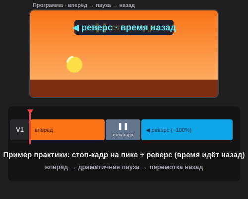

# Самостоятельная работа — Видеомонтаж, Урок 2

> 🧑‍🎓 Приёмы времени из урока применяем в деле: собираем **трейлер** по любимому фильму/книге/аниме/игре.

---

## ✅ Задание 1 (для всех) — «Трейлер по любимому фильму/книге/аниме» (новый вызов) 🎬

Собери **свой трейлер-тизер** (15–25 секунд) по тому, что любишь — **фильм, книга, аниме, игра или комикс**. Задача — не пересказать сюжет, а **создать настроение** и «зацепить» зрителя, как настоящий трейлер. Главные герои этого задания — **приёмы времени** из урока: эпичное слоу-мо, стоп-кадр «замри!», speed-ramp и драматичный реверс.

**Выбери, о чём трейлер** (пример — не бренд, а твоё любимое):
- 🐉 **Фэнтези/аниме:** эпичный герой, магия, битва — слоу-мо на «ударе», стоп-кадр на появлении героя;
- 🚀 **Фантастика:** космос, погоня, техника — speed-ramp «влёт» в замедление;
- 🏆 **Спорт/история успеха:** тренировки (таймлапс) → решающий момент (слоу-мо) → триумф (стоп-кадр);
- 🕵️ **Детектив/приключение:** напряжение, погоня, реверс-«загадка» (время назад);
- 📖 **Своя книга:** атмосферные кадры под настроение + текст-намёк (титры добавим красиво в уроке 3).

> 🎬 **Как собрать трейлер из стоков:** подбери 4–6 клипов, которые **передают настроение** твоей истории (природа, город, лица, движение, стихии — по теме), и «оживи» их временем. Клипы — свободные стоки или свои; конкретных персонажей брать не обязательно, важнее **атмосфера и ритм**.

> 🧱 **Структура трейлера (мини-арка):** тихое интро (1–2 медленных кадра) → нарастание (быстрее, в ритм) → **эпичный пик** (слоу-мо + speed-ramp на дропе) → **стоп-кадр**-финал («замри» на самом крутом моменте). Титры/название и голос за кадром добавишь в **уроке 3** — трейлер станет полным!

**🎞 Пример приёма** (открой в браузере — **стоп-кадр на пике + реверс**):

**Обязательные условия:**
- [ ] Это **трейлер** с настроением (мини-арка: интро → нарастание → эпичный пик → стоп-кадр-финал);
- [ ] Есть **слоу-мо** на пике (Скорость < 100%, с «Волновым изменением»), лучше со **speed-ramp** на дропе;
- [ ] Есть ещё **минимум один** приём времени: **реверс** ◀ **или** **стоп-кадр** ❚❚ **или** **ускорение/таймлапс** ⏩;
- [ ] Слоу-мо **просчитан** (Оптический поток + `Enter`), играет плавно;
- [ ] Собрано под **музыку с дропом** (склейки в ритм — навык урока 1);
- [ ] Экспорт **MP4** (H.264) + сохранён **`.prproj`**.

> 💾 **Сохрани этот проект!** В уроке 3 добавишь ему **название, субтитры и голос за кадром**, а в уроке 5 отполируешь — получится трейлер, готовый для канала.

---

## 🔗 Задание 2 (комбо, Урок 1 + Урок 2) — «Волшебный реверс» 🪄

Отдельный весёлый мини-ролик (5–8 сек), не связанный с трейлером:
1. Найди/сними клип, где что-то **необратимое**: наливается вода, падают кубики, рассыпается что-то, прыжок вниз.
2. Пусти его **реверсом** (галка «Реверс скорости») — «вода втягивается», «кубики сами собираются», «прыжок наоборот».
3. Добавь **звук-акцент** и поставь склейку **на бит** (навык урока 1), чтобы «магия» щёлкнула ровно в ритм.

**Результат:** короткий фокус-ролик «как это возможно?!» — реверс + ритм вместе.

---

## ⚡ Задание 3 (разминка-челлендж) — слоу-мо за 5 минут

**За 5 минут:** положи любой клип с движением → **ПКМ → «Скорость/Длительность»** (`Ctrl+R`) → поставь **50%** + галка **«Волновое изменение»** → включи **Оптический поток** (ПКМ → Интерполяция времени) → **`Enter`** → проиграй. Почувствуй, как обычное движение стало эпичным.

---

## 📋 Что проверяем

- [ ] Трейлер по **своей** любимой теме (фильм/книга/аниме/игра), с настроением и мини-аркой;
- [ ] Есть **слоу-мо** на пике (лучше со **speed-ramp** на дропе);
- [ ] Есть ещё один приём времени (реверс / стоп-кадр / ускорение);
- [ ] Скорость без дырок/наездов («Волновое изменение»); слоу-мо просчитан (Оптический поток + `Enter`);
- [ ] Собрано под **музыку с дропом**, склейки в ритм;
- [ ] Экспорт MP4 + `.prproj`; проект **сохранён** для урока 3;
- [ ] Сделан отдельный мини-ролик **«Волшебный реверс»** (Задание 2).

## 🧩 Для 5–7 классов
- Трейлер попроще: **3–4 клипа** по настроению, **одно** слоу-мо (50%) + финальный **стоп-кадр**.
- Speed-ramp и Оптический поток — по желанию (или учитель показывает).
- Музыку и клипы даёт учитель (набор «эпик»).

## 🎓 Для 9–11 классов
- **Двойной speed-ramp** (разгон → глубокое слоу-мо → выкат) на пике трейлера.
- **Стоп-кадр ровно на дропе** + слоу-мо после; реверс-«загадка».
- Продуманная **арка настроения** (тихо → напряжение → взрыв → замри).
- Исходники **60/120 fps** для чистого слоу-мо.

## 🖼 Кинозал класса 🎬
Сдай MP4 — устроим **премьеру трейлеров**! Голосуем: **самый цепляющий трейлер**, **самое эпичное слоу-мо** и **самый неожиданный реверс**. (Полные версии с титрами и голосом покажем после урока 3.)

## Что сдать
- `трейлер_*.mp4` + `*.prproj` (Задание 1, **сохрани для урока 3!**) + `реверс_*.mp4` (Задание 2).
