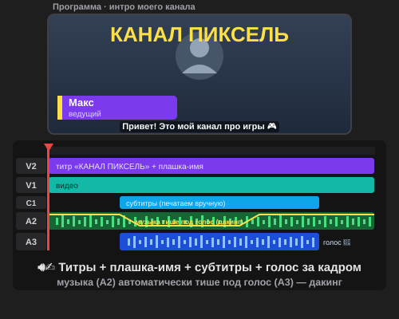

# Урок 3 — Голос и титры: интро канала со звуком 🔊✍️

**Модуль 5 · Видеомонтаж в Adobe Premiere Pro · Урок 3 из 5 | 2 ак.ч. (1,5 часа)**

> 🔁 В начале — [разминка/повтор](повторение.md) (5 мин).
> 👨‍🏫 Сценарий с хронометражом — в [преподавателю.md](преподавателю.md).
> 🖼 Что показать и материалы (голос, музыка, звуки) — в [изображения.md](изображения.md) и в конце («Материалы»).
> ⚠️ Всё делаем **вручную**, без ИИ. Голос — 🤖 нейросеть-озвучка **вне** Premiere (готовый MP3 просто импортируем).
> 🎞 **Рендер результата** (двигается) — [`изображения/результат-титры.svg`](изображения/результат-титры.svg), открой в браузере.

> 🧭 **Как читать урок.** До этого наши ролики были **немые и без подписей**. Сегодня добавим то, что превращает нарезку в настоящий контент: **титры** (название, плашка-имя), **субтитры**, **голос за кадром** и **киношный звук** (музыка + эффекты + чистая громкость). Сквозной проект — **«Интро для моего канала» 🎬**: короткая заставка, где появляется название канала, выезжает плашка с именем, снизу идут субтитры, а сверху — твой голос «Привет, это мой канал!». Каждый шаг — до конкретной панели, кнопки и клавиши: что нажать, где это, что увидишь 👀, зачем и типичная ошибка. *(А в практике из этих приёмов соберём **рекламу** своего продукта!)*

---

## 🎬 Что мы сделаем сегодня и что получим

**Задача:** взять короткий клип (ты за столом / твоё хобби / любой кадр) и «оформить» его как настоящий канал: **анимированный титр-название**, **плашка-имя** (как у блогеров), **субтитры**, **голос за кадром** (озвучим текст нейросетью — микрофон не нужен) и **звук** — фоновая музыка, которая **сама становится тише под голос** (дакинг), плюс эффект «вжух» на появлении титра.

**В итоге у тебя получится:** стильное **интро канала** 🎬 (≈12–15 сек) с титрами, субтитрами, голосом и киношным звуком — в формате **MP4** + проект `.prproj`.

**Главные навыки урока:**
- ✍️ **Титры** — инструмент «Текст» + панель **«Основные графические элементы»** + **анимация** текста (кинетический титр).
- 🪧 **Плашка-имя** (lower third) — как в блогах/новостях, выезжает сбоку.
- 💬 **Субтитры** (подписи) — печатаем **вручную**, подгоняем по времени.
- 🎙 **Голос за кадром** — 🤖 нейросеть-озвучка по тексту (без микрофона).
- 🎚 **Звук** — музыка + эффекты, **уровни громкости**, фейды, **дакинг** («Основной звук»).

> 💡 **Главная мысль:** звук и текст решают половину успеха. Даже простой кадр с **хорошим титром, голосом и чистым звуком** смотрится профессионально. Немое видео с «грязным» звуком — нет.

**🎞 Вот что должно получиться** (открой в браузере — титр появляется, плашка выезжает, идут субтитры, музыка тише под голос):

---

## 🧭 Где что находится (титры и звук)

- **Инструмент «Текст» (Type, `T`)** — на **панели инструментов**. Кликнул в мониторе «Программа» → печатаешь. Текст ложится на **видеодорожку сверху** (V2).
- **Панель «Основные графические элементы» (Essential Graphics)** — `Окно → Основные графические элементы` → вкладка **«Правка»**: шрифт, размер, цвет, **обводка**, **тень**, **фон-плашка**, выравнивание. Тут же — слои текста и фигур титра.
- **Анимация титра** — через **ключевые кадры** в панели **«Элементы управления эффектами» (Effect Controls)**: параметры «Положение», «Масштаб», «Непрозрачность» → значок **секундомера** ставит ключ.
- **Субтитры (подписи)** — `Окно → Текст` → вкладка **«Подписи (Captions)»** → **«Создать подписи» → «Создать пустую дорожку»** (печатаем сами!). Появится **дорожка подписей**.
- **Аудиодорожки** — снизу таймлайна: **A1** (звук видео), **A2** (музыка), **A3** (голос), **A4** (звуки-эффекты).
- **Уровни громкости** — на аудиоклипе есть **горизонтальная резинка** (тяни вверх/вниз). Или панель **«Микшер аудиоклипов»**.
- **Панель «Основной звук» (Essential Sound)** — `Окно → Основной звук`: выдели клип → задай тип (**Диалог / Музыка / Звуковые эффекты**) → готовые улучшения, в т.ч. **«Приглушение (дакинг)»** музыки под голос.

> 💡 **Клавиши урока:** `T` — Текст · Пробел — играть · `Ctrl+K` — разрез (или Лезвие `C`) · секундомер ⏱ — ключевой кадр.

> ⚠️ **БЕЗ ИИ внутри Premiere:** субтитры **НЕ** делаем авто-расшифровкой речи (Text-Based Editing / «Речь в текст») и не жмём «Улучшить речь». Печатаем и правим **вручную**. А голос за кадром берём **готовым MP3** из нейросети-озвучки — это внешний помощник **вне** Adobe (🤖), правило соблюдено.

---

## Часть 1 — Идея и текст озвучки (8 минут)

Сначала — план. Реши про свой канал:
1. **Название канала** (например, «КАНАЛ ПИКСЕЛЬ», «Мастерская Ани», «GameZone»).
2. **Про что канал** (игры, рисование, спорт, наука…).
3. **Текст голоса за кадром** — 1–2 фразы: *«Привет! Это мой канал про игры. Подписывайся — будет интересно!»*. Запиши текст — его озвучим нейросетью.
4. **Твоё имя/ник** — для плашки-имени.

> 💡 **Правило голоса:** держи фразу **короткой и бодрой**. Длинный текст → длинное интро → зритель скучает. 1–2 предложения — идеально.

---

## Часть 2 — 🤖 Голос за кадром (нейросеть-озвучка) (10 минут)

Микрофона нет — озвучим текст **нейросетью** и скачаем MP3. Это внешний помощник **вне** Premiere (в самой программе ИИ не трогаем).

1. Открой сайт-озвучку (см. «Материалы», напр. **TTSMaker**) → язык **Русский** → выбери **голос** (бодрый, под настроение канала).
2. Впиши **текст** из Части 1 → **«Озвучить»** → послушай → **«Скачать MP3»**. Сохрани как `golos.mp3` в папку проекта.
3. В Premiere: **`Файл → Импорт`** (`Ctrl+I`) → `golos.mp3` → перетащи на дорожку **A3**.
   - 👀 **Что видишь:** на A3 появилась **синяя волна** голоса.

> 💡 **Свой голос — по желанию.** Если есть телефон/микрофон, можно нажать **«Голос за кадром»** на дорожке и записать себя. Но нейросеть — быстрее и без шума класса.

> ⚠️ **Ошибка:** голос тихий и теряется под музыку. Это решим **уровнями** и **дакингом** в Части 6.

---

## Часть 3 — Титры: анимированное название (14 минут)

### Шаг 1. Печатаем название

1. Поставь плейхед в начало. Возьми **«Текст»** (`T`) → кликни в мониторе «Программа» по центру → напечатай **название канала**.
   - 👀 **Что произойдёт:** на дорожке **V2** (над видео) появился клип-титр.
2. Открой **`Окно → Основные графические элементы` → «Правка»**: выбери **крупный жирный шрифт**, яркий цвет, добавь **обводку** и **тень** (чтобы читалось на любом фоне).

### Шаг 2. Оживляем титр (кинетический)

3. Выдели титр → **`Окно → Элементы управления эффектами`**.
4. Ставим ключи (значок **секундомера ⏱**):
   - **Непрозрачность:** кадр начала — **0%**, через ~10 кадров — **100%** (титр **проявляется**);
   - **Масштаб:** начало — **70%**, через ~12 кадров — **100%** (титр слегка **«выскакивает»**).
5. Проиграй (**Пробел**) — название **эффектно появляется**.

> 💡 **Кинетический титр = вау.** Текст, который «влетает» или «выскакивает», выглядит куда дороже, чем просто возникший. Хватит лёгкого движения масштаба/прозрачности.

> ⚠️ **Ошибка:** белый текст на светлом фоне — не читается. Всегда добавляй **обводку/тень** или тёмную плашку под текст.

---

## Часть 4 — Плашка-имя (lower third) (8 минут)

Как у блогеров и в новостях: внизу слева — плашка с именем, которая **выезжает сбоку**.

1. Ещё один **«Текст»** (`T`) внизу слева: **имя/ник** (и мелким — «ведущий»/«автор»).
2. В **«Основных графических элементах»** добавь под текст **фон-плашку** (кнопка «Фон» → цвет) — получится «плашка».
3. Анимируй **выезд**: в «Элементах управления эффектами» → **Положение** → ключ 1 (плашка **за кадром слева**), ключ 2 через ~10 кадров (**на месте**). А в конце — уезжает обратно.

**👀 Что получишь:** аккуратная «подпись автора» — сразу видно, чей канал.

> 💡 Плашку показывай **несколько секунд** и убирай — она не должна висеть весь ролик.

---

## Часть 5 — Субтитры (печатаем вручную) (10 минут)

Субтитры = текст речи внизу экрана. Их смотрят без звука (в метро, ленте) — и это **стиль**.

1. **`Окно → Текст` → вкладка «Подписи»** → **«Создать подписи»** → выбери **«Создать пустую дорожку»** (не авто-расшифровку!).
   - 👀 Появилась **дорожка подписей** над видео.
2. Нажми **«+»** (Добавить подпись) → впиши **первую фразу** голоса. Перетащи её края, чтобы она совпадала с этой частью речи на A3.
3. Добавь следующие подписи по фразам, подгоняя тайминг под волну голоса (скраббинг, как в уроке 2).
4. В «Основных графических элементах» настрой стиль подписей (шрифт, фон-подложка) — чтобы читались.

> ⚠️ **БЕЗ ИИ:** мы **печатаем сами**, а не жмём «Транскрибировать/Речь в текст». Так и задумано — учимся вручную.

> 💡 Держи строку **короткой** (3–6 слов) — длинную не успеют прочитать.

---

## Часть 6 — 🎚 Звук: музыка, эффекты, громкость, дакинг (14 минут)

### Шаг 1. Музыка и звуки-эффекты

1. Импортируй **фоновую музыку** (бодрую) → на дорожку **A2**. **Звук «вжух»** (whoosh) → на **A4** ровно в момент появления титра. Ещё «поп»/«динь» — по вкусу.

### Шаг 2. Уровни громкости (чтобы голос было слышно)

2. У каждого аудиоклипа есть **горизонтальная резинка громкости**. Опусти **музыку** (A2) так, чтобы **голос** (A3) был главным. Голос — самый громкий, музыка — фон, эффекты — не заглушают голос.
3. **Фейды:** в начале музыки — плавное появление, в конце — затухание (перетащи **аудиопереход «Постоянная мощность»** из Эффектов на края, или потяни маленький «уголок» громкости).

### Шаг 3. ⚡ Дакинг — музыка сама тише под голос

4. **`Окно → Основной звук`**. Выдели клип **музыки** → нажми тип **«Музыка»**.
5. Открой **«Приглушение (Ducking)»** → отметь, что приглушать под **«Диалог»** → нажми **«Сгенерировать ключевые кадры»**.
   - 👀 **Что произойдёт:** на музыке появятся ключи громкости — она **автоматически становится тише там, где звучит голос**, и снова громче в паузах. Это **дакинг** — так делают на ТВ и в блогах!
6. *(Выдели клип голоса → тип **«Диалог»**, музыка будет знать, под что приглушаться.)*

**👀 Итог:** голос чёткий и разборчивый, музыка красиво «расступается» под него.

> 💡 **Дакинг — главный вау-приём урока.** Он мгновенно делает звук «профессиональным»: зритель слышит каждое слово, а музыка живёт фоном.

> ⚠️ **Ошибка:** музыка громче голоса — ничего не разобрать. Голос всегда **главный**; музыка и эффекты — тише.

> ⚠️ **Ошибка:** резкий обрыв музыки в конце. Добавь **фейд** (затухание).

---

## ✅ Как правильно / ❌ Как НЕ надо (титры и звук)

| ❌ Как НЕ надо | ✅ Как правильно |
|----------------|------------------|
| Текст без обводки на пёстром фоне | Обводка/тень/плашка — читается везде |
| Титр просто «возник» | **Анимация** (проявление + масштаб) — кинетический титр |
| Плашка-имя висит весь ролик | Показать пару секунд и убрать |
| Авто-расшифровка речи (ИИ) | Субтитры **печатаем вручную** |
| Музыка громче голоса | Голос — главный; музыка тише + **дакинг** |
| Резкий обрыв музыки | **Фейды** в начале/конце |
| Голос с шумом класса (микрофон) | 🤖 нейросеть-озвучка по тексту (чисто) |

> ⚠️ Главные ошибки урока: **музыка глушит голос** (нет дакинга/уровней) и **нечитаемые титры** (без обводки). Сделай голос главным и добавь титрам подложку.

---

## Часть 7 — Экспорт (6 минут)

1. Проверь целиком (**Пробел**): титры появляются, голос слышно, музыка приглушается.
2. **`Файл → Экспорт → Медиаконтент…`** (`Ctrl+M`) → **H.264** → пресет **«YouTube 1080p»** → **«Экспорт»**.
3. Сохрани проект (`Ctrl+S`).

> 💡 Хочешь субтитры «вшитые» в картинку (видно всегда) — они уже на дорожке подписей и попадут в видео. Для отдельного файла субтитров есть экспорт `.srt` (по желанию).

---

## 🎓 Часть 8 — Для 9–11: глубже (8 минут)

- **Кинетическая типографика:** слова появляются по одному (несколько титров с ключами) — динамичное интро.
- **Стиль-шаблон:** сохрани стиль титра (**«Основные графические элементы» → Стили**) и применяй ко всем подписям одним кликом.
- **Точный дакинг вручную:** ключи громкости музыки сам, без авто — полный контроль.
- **Звуковой дизайн:** riser перед титром, «бам» на появлении, эмбиент-фон — атмосфера.
- **Двуязычные субтитры** или подписи с эмодзи-стилем.

---

## 🧩 Для 5–7 классов (проще)

- Один **титр-название** (появление прозрачностью) + **плашка-имя** без анимации.
- Субтитры — 1–2 короткие строки.
- Голос — нейросеть (готовый MP3).
- Звук: опустить музыку под голос **резинкой** (дакинг — по желанию/показом учителя).

---

## 🏁 Итог урока (5 минут)

Сегодня ролик заговорил и получил подписи:

- ✅ **Титры** — «Текст» + «Основные графические элементы» + **анимация** (кинетический титр).
- ✅ **Плашка-имя** (lower third) — выезжает сбоку.
- ✅ **Субтитры** — печатаем **вручную**, подгоняем по времени.
- ✅ **Голос за кадром** — 🤖 нейросеть-озвучка (без микрофона).
- ✅ **Звук** — музыка + эффекты, **уровни**, фейды, **дакинг** («Основной звук»).
- ✅ **Экспорт MP4** + `.prproj`.

> 🏆 Теперь твои ролики выглядят как настоящий канал! Дальше — **урок 4 «Киномагия»**: цветокор (киношная картинка) и хромакей (телепорт куда угодно).

> 🎤 **Блиц:** на какой дорожке титр? как оживить титр? почему субтитры печатаем сами? что делает дакинг? кто должен быть громче — голос или музыка?

### 🎮 Викторина-закрепление

Открой **[викторина.html](викторина.html)** — вопросы про титры, субтитры, голос, уровни и дакинг + смешные и «на подумать».

➡️ **Самостоятельная работа** — сделай **рекламу** своего продукта (название + слоган + голос + звуки) — в [практике](практика.md).
🧰 **Трюки урока** (титры, плашка, дакинг, TTS-голос) — в [лайфхак.md](лайфхак.md).

---

## 🔗 Материалы и ссылки к уроку

**🧰 Инструмент:** Adobe Premiere Pro (по лицензии класса), русский интерфейс.

**📥 Материалы (свободные):**
- 🤖 **Голос за кадром — нейросеть-озвучка по тексту** (микрофон не нужен): [TTSMaker](https://ttsmaker.com/) (рус., без регистрации, MP3), [ttsMP3.com](https://ttsmp3.com/text-to-speech/Russian/), [Luvvoice](https://luvvoice.com/). *(Внешний помощник вне Adobe — по правилам можно; в Premiere просто импортируем MP3.)*
- 🎵 **Музыка:** [Pixabay Music](https://pixabay.com/music/) (`upbeat`, `intro`), [YouTube Audio Library](https://www.youtube.com/audiolibrary).
- 🔊 **Звуки-эффекты (whoosh/pop/ding):** [Pixabay Sound](https://pixabay.com/sound-effects/), [Mixkit](https://mixkit.co/free-sound-effects/), [Freesound](https://freesound.org/) (`whoosh`, `pop`, `notification`).
- 🎬 **Клип-фон:** свой кадр (хобби/стол) или стоки [Pexels](https://www.pexels.com/videos/) / [Pixabay](https://pixabay.com/videos/).

**🎬 Вдохновение:** поиск — *lower third Premiere*, *kinetic text animation*, *audio ducking Premiere Essential Sound*, *add captions Premiere*. YouTube (рус.): *«плашка имя Premiere»*, *«анимация текста Premiere»*, *«дакинг музыки под голос»*, *«субтитры в Premiere вручную»*.

**⚙️ Учителю:** заранее проверить TTS-озвучку на классных ПК; смонтировать образец-интро (титр + плашка + субтитры + голос + дакинг); показать «Основные графические элементы», ключи анимации, создание пустой дорожки субтитров и дакинг в «Основном звуке». Список — в [изображения.md](изображения.md).
