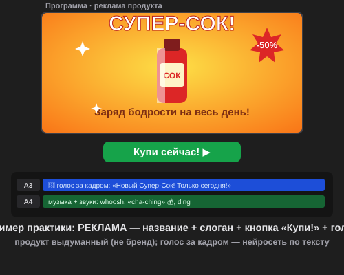

# Самостоятельная работа — Видеомонтаж, Урок 3

> 🧑‍🎓 Приёмы титров и звука — в дело! Снимаем **рекламу** своего (выдуманного) продукта.

---

## ✅ Задание 1 (для всех) — «Реклама моего продукта» 📢

Придумай **свой продукт** и сделай на него **рекламу-ролик** (15–25 секунд), как по телевизору или в интернете. Продукт **выдуманный и оригинальный** (не бренд!) — так интереснее и честнее.

**Придумай продукт** (пример — свой):
- 🥤 **Еда/напиток:** сок «Супер-Сок», шоколад «Ням-Ням», мороженое «Космо-лёд»;
- 👟 **Вещь:** суперкроссовки «Ветер», волшебный рюкзак «Всёношу», часы «Хроно»;
- 🤖 **Гаджет/игрушка:** робот-помощник «Дружок», конструктор, дрон;
- 🎮 **Своя игра/приложение:** назови и «прорекламируй»;
- 🧴 **Смешное:** шампунь для котов, антискучин, зарядка для настроения.

**🎞 Пример результата** (открой в браузере — реклама с названием, слоганом, кнопкой и голосом):

**Что должно быть в рекламе (обязательно):**
- [ ] **Название продукта** — крупный **анимированный титр** (появление + масштаб);
- [ ] **Слоган** — короткая цепляющая фраза («Заряд бодрости на весь день!»);
- [ ] **Голос за кадром** 🤖 — озвучь текст нейросетью (напр. «Новый Супер-Сок! Только сегодня — со скидкой!»);
- [ ] **Звуки-эффекты** — минимум 2 (whoosh на титре, «динь»/«ча-цзынь» 💰 на цене/кнопке);
- [ ] **Финальный призыв** — титр-кнопка «Купи сейчас!» / «Спроси у родителей!»;
- [ ] **Чистый звук** — голос главный, музыка тише (**дакинг**/уровни), фейды;
- [ ] Экспорт **MP4** + сохранён **`.prproj`**.

> 💡 **Секрет рекламы:** зацепи за 3 секунды (яркий кадр + название), покажи, **чем продукт крутой**, и закончи **призывом**. Голос — бодрый и уверенный.

---

## 🔗 Задание 2 (комбо, Уроки 1–3) — «Реклама в ритм»

Собери навыки вместе:
1. Нарежь кадры продукта **в ритм музыки** (маркеры на битах — урок 1).
2. На «геройский» кадр продукта дай **слоу-мо/стоп-кадр** (урок 2) — эффектный показ.
3. Сверху — **титры, голос и дакинг** (урок 3).

**Результат:** динамичная реклама, где картинка, время, текст и звук работают вместе.

---

## ⚡ Задание 3 (разминка-челлендж) — кинетический титр за 5 минут

**За 5 минут:** «Текст» (`T`) → впиши слово («РАСПРОДАЖА!») → в «Элементах управления эффектами» поставь ключи: **Масштаб 60% → 110% → 100%** и **Непрозрачность 0 → 100** за 12 кадров. Проиграй — слово **эффектно выскакивает**. Тренируем самый частый приём титров.

---

## 📋 Что проверяем

- [ ] Продукт — **свой выдуманный** (не бренд);
- [ ] Есть **анимированное название** + **слоган**;
- [ ] Есть **голос за кадром** (нейросеть по тексту) + минимум 2 **звука**;
- [ ] Есть **финальный призыв** («Купи!»);
- [ ] Голос **главный**, музыка тише (дакинг/уровни), есть **фейды**;
- [ ] Экспорт MP4 + `.prproj`;
- [ ] Сделано **«Комбо»** (ритм + слоу-мо + звук).

## 🧩 Для 5–7 классов
- Название + слоган + короткий голос (нейросеть) + 1 звук — этого достаточно.
- Музыку опустить **резинкой** под голос (дакинг — по желанию).
- Кадры продукта — картинка/готовый клип от учителя.

## 🎓 Для 9–11 классов
- **Кинетическая типографика** (слова по одному), плашка-имя бренда.
- **Точный дакинг** + звуковой дизайн (riser, «бам»).
- Продуманная драматургия рекламы: крючок → польза → призыв.
- Вертикальная версия для Reels/Shorts.

## 🖼 Рекламная пауза класса 📺
Сдай MP4 — устроим «рекламный блок»! Голосуем: **самая убедительная реклама**, **лучший слоган** и **самый смешной продукт**.

## Что сдать
- `реклама_*.mp4` + `*.prproj` (Задание 1) + версия «в ритм» (Задание 2).
