# Урок 4 — Киномагия: цвет и телепорт 🎨🪄

**Модуль 5 · Видеомонтаж в Adobe Premiere Pro · Урок 4 из 5 | 2 ак.ч. (1,5 часа)**

> 🔁 В начале — [разминка/повтор](повторение.md) (5 мин).
> 👨‍🏫 Сценарий с хронометражом — в [преподавателю.md](преподавателю.md).
> 🖼 Что показать и материалы (хромакей-футажи, фоны) — в [изображения.md](изображения.md) и в конце («Материалы»).
> ⚠️ Всё делаем **вручную**, без ИИ.
> 🎞 **Рендер результата** (двигается) — [`изображения/результат-цвет-хромакей.svg`](изображения/результат-цвет-хромакей.svg), открой в браузере.

> 🧭 **Как читать урок.** Сегодня — две «магии» кино в одном уроке: **цветокор** (одним движением делаем картинку тёплой, холодной или киношной) и **хромакей** (снятое на **зелёном фоне** «телепортируем» куда угодно). Сквозной проект — **«Я на другой планете» 🚀**: берём героя на зелёном фоне, **убираем фон**, ставим позади **космос/поверхность другой планеты** и **красим весь кадр** в киношный teal&orange с виньеткой — будто и правда снимали на съёмках блокбастера. Каждый шаг — до конкретной панели, кнопки и инструмента: что нажать, где это, что увидишь 👀, зачем и типичная ошибка. *(А в практике снимем настоящий **прогноз погоды** — как по телевизору!)*

---

## 🎬 Что мы сделаем сегодня и что получим

**Задача:** «телепортировать» героя **на другую планету** и сделать картинку **киношной**. Сначала **выбьем зелёный фон** (хромакей Ultra Key) и поставим позади **космос/инопланетный пейзаж**. Потом **покрасим кадр** цветокором Lumetri: баланс белого, контраст, фирменный **teal&orange** (тёплый герой + холодный космос) и **виньетку** — и всё это одним **корректирующим слоем** на всё видео.

**В итоге у тебя получится:** эффектный кадр **«Я на другой планете»** 🪄 (герой в космосе + киношный цвет) — в формате **MP4** + проект `.prproj`. Такое вызывает «вау, как настоящий фильм!». А в [практике](практика.md) снимешь **прогноз погоды** — встанешь перед картой, как ведущий на ТВ.

**Главные навыки урока:**
- 🎨 **Цветокор Lumetri** — баланс белого, экспозиция/контраст, насыщенность.
- 🟠🔵 **teal&orange + виньетка** — киношный «look» за минуту.
- 🧴 **Корректирующий слой** — цвет на все клипы разом + **LUT** (готовые киноцвета).
- 🟩 **Хромакей Ultra Key** — убрать зелёный фон → «телепорт».
- ✂️ **Мусорная маска + чистка края** — аккуратный ключ без «зелёной каёмки».

> 💡 **Главная мысль:** цвет — это **настроение** (тёплый = уют/закат, холодный = ночь/космос, teal&orange = «как в кино»). А хромакей — это **портал**: убираем один цвет (зелёный) — и за героем появляется любой мир.

**🎞 Вот что должно получиться** (открой в браузере — зелёный фон → космос → киношный цвет):

---

## 🧭 Где что находится (цвет и хромакей)

- **Панель «Цвет Lumetri» (Lumetri Color)** — `Окно → Цвет Lumetri`. Разделы: **«Основные коррекции»** (Баланс белого/пипетка, Экспозиция, Контраст, Света, Тени, Насыщенность), **«Кривые»**, **«Цветовые круги»** (Тени/Средние/Света), **«Виньетка»**, **«Креатив»** (готовый **Look/LUT** + интенсивность).
- **Корректирующий слой (Adjustment Layer)** — панель **«Проект»** → значок **«Новый элемент»** → **«Корректирующий слой»**. Кладём его на дорожку **сверху** (V2/V3) — весь цвет, применённый к нему, красит **всё под ним**.
- **Ultra Key (хромакей)** — панель **«Эффекты»** → **Видеоэффекты → Кеинг → Ultra Key**. Перетаскиваем на клип с зелёным фоном (он на **верхней** дорожке).
- **Настройки Ultra Key** — в панели **«Элементы управления эффектами»**: **«Цвет ключа»** (пипетка по зелёному), **«Создание матовости»** (Прозрачность/Света/Тени), **«Очистка матовости»** — **«Сжатие» (Choke)** и **«Смягчение» (Soften)**, **«Подавление разлива»** (убрать зелёный отсвет).
- **Фон** для телепорта — картинка/видео на дорожке **ниже** героя (V1).

> 💡 **Клавиши урока:** Пробел — играть · `V` — Выделение · пипетка 💧 — взять цвет · перетаскивание эффекта из «Эффектов» на клип.

> ⚠️ **Почему хромакей работает:** зелёный (или синий, или ровная одноцветная стена) фон — это цвет, которого **нет на лице**. Компьютер убирает **только этот цвет** — и за героем видно то, что на дорожке ниже. Поэтому фон должен быть **ровный и равномерно освещён** (гладкая ткань/стена без теней и складок).

---

## Часть 1 — Идея: на какой планете (6 минут)

Реши до компьютера:
1. **Куда** отправить героя? Открытый космос со звёздами 🌌, поверхность **Марса** 🔴, **Луны** 🌙, кольца Сатурна 🪐, инопланетные джунгли 👽.
2. **Кто** герой? Клип на **зелёном (или одноцветном) фоне** — готовый сток `green screen`, или снятый самим (зелёная ткань / ровная стена). Три способа — в Части 2, **Шаг 0**.
3. **Настроение цвета:** для космоса — **холодный синий фон + тёплый герой** (teal&orange) — классика блокбастеров.

> 💡 **Совет по фону:** бери фон **под настроение**. Космос — холодный синий, Марс — тёплый рыжий. Тогда цвет героя и фона «подружатся».

---

## Часть 2 — Хромакей: убираем зелёный фон (18 минут)

### Шаг 0. Откуда взять героя на «зелёном фоне»

Чтобы кого-то «телепортировать», нужен клип, где герой снят на **ровном одноцветном фоне**. Есть **три способа** (выбери любой):

1. **Готовый хромакей-клип (проще всего, без съёмки):** скачай сток с пометкой `green screen` (человек / игрушка / животное на зелёном) — ссылки в «Материалах». Снимать ничего не надо.
2. **Снять самому на зелёном:** повесь **зелёную ткань / простыню / ватман** ровно (без складок!), встань перед ней и сними на телефон.
3. **Без зелёнки — на любой ровный фон:** Ultra Key убирает **любой** ровный цвет, не только зелёный! Сними себя на фоне **однотонной стены** (не пёстрой) — потом пипеткой возьмёшь **её** цвет.

**Правила хорошей съёмки (чтобы ключ вышел чистым):**
- фон **ровный** и **равномерно освещён** — без теней и складок;
- **отойди** от стены на шаг — тогда на фоне не будет твоей тени;
- **не надевай** одежду цвета фона (на зелёном фоне — ничего зелёного, иначе будет «дырка» в животе);
- держи телефон **ровно** (штатив/подставка), сам стой в кадре целиком.

> 💡 **Секрет:** зелёный/синий берут потому, что этих цветов **нет на коже**. Но если зелёнки нет — **ровная стена** тоже сгодится: просто выбери пипеткой её цвет и не надевай одежду ей в тон.

> ⚠️ **Ошибка съёмки:** мятая ткань, тень на фоне, пёстрая стена — ключ выйдет «грязным» (дырки, каёмка). Ровный свет и гладкий фон решают половину дела.

### Шаг 1. Раскладываем слои

1. Фон-мир (космос) положи на дорожку **V1**.
2. Клип с героем **на зелёном (или одноцветном) фоне** — на дорожку **V2** (над фоном).
   - 👀 Пока виден только герой на зелёном (он перекрывает фон).

### Шаг 2. Применяем Ultra Key

3. Открой **«Эффекты»** → **Видеоэффекты → Кеинг → Ultra Key** → **перетащи** на клип героя (V2).
4. Выдели клип героя → **«Элементы управления эффектами»** → раздел **Ultra Key** → у параметра **«Цвет ключа»** возьми **пипетку** 💧 → кликни по **фону** (по зелёному — или по цвету твоей ровной стены).
   - 👀 **Что произойдёт:** зелёный **исчезнет**, и за героем появится **космос** с дорожки V1. Телепорт! 🚀

### Шаг 3. Чистим ключ

5. В **«Создание матовости»** покрути **Прозрачность/Тени/Света**, чтобы фон стал **полностью чёрным** (убран), а герой — целым.
6. В **«Очистка матовости»**: **«Сжатие» (Choke)** чуть подтяни (обрезать зелёную каёмку), **«Смягчение»** — сгладить край.
7. **«Подавление разлива»** — убрать зелёный **отсвет** на волосах/краях.

**👀 Что получишь:** герой аккуратно стоит в новом мире, без зелёных ореолов.

> ⚠️ **Ошибка:** фон убрался «дырками» (часть зелёного осталась / часть героя пропала). Подвигай **Прозрачность** и не выбирай пипеткой слишком тёмный/светлый зелёный — бери **средний** ровный участок.

> ⚠️ **Ошибка:** зелёная **каёмка** по контуру. Помогают **Сжатие (Choke)** + **Подавление разлива**.

> 🎓 **Для 9–11:** если в кадре есть лишнее (штатив, край зелёнки), добавь **мусорную маску**: в Ultra Key/через эффект «Обрезка» или маску-прямоугольник обрежь ненужное по краям.

---

## Часть 3 — Цветокор Lumetri: базовая коррекция (12 минут)

Теперь сделаем картинку красивой. Открой **«Окно → Цвет Lumetri»**, выдели клип (пока фон/героя).

1. **Баланс белого:** возьми **пипетку** у «Баланс белого» → кликни по тому, что должно быть **белым/серым** (кожа не годится). Цвет станет естественным. *(Или крути «Температуру»: вправо — теплее, влево — холоднее.)*
2. **Экспозиция** — общая яркость; **Контраст** — «сочность»; **Света/Тени** — вытянуть детали.
3. **Насыщенность** — сделать цвета живее (но не переборщить — лица не должны быть «оранжевыми»).

**👀 Что получишь:** ровная, чистая, яркая картинка — основа для «look».

> ⚠️ **Ошибка:** задрал насыщенность — кожа «горит». Держи умеренно; насыщенность добавляй **чуть-чуть**.

---

## Часть 4 — teal&orange + виньетка + LUT (14 минут)

Фирменный киношный «look» — тёплый герой на холодном фоне.

1. В Lumetri открой **«Цветовые круги»** (или «Кривые»):
   - **Тени** → потяни к **бирюзово-синему (teal)**;
   - **Света** → потяни к **тёплому оранжевому (orange)**.
   - 👀 Тёмные части кадра станут холодными, светлые — тёплыми. Это **teal&orange** — «как в блокбастере».
2. **Виньетка:** раздел **«Виньетка»** → **«Величина»** в **минус** (края темнеют) → чуть добавь **«Растушёвку»**.
   - 👀 Взгляд собирается в центр — кинематографично.
3. **Быстрый «look» (LUT):** раздел **«Креатив»** → выпадающий **«Look»** → выбери готовый киноцвет → убавь **«Интенсивность»** до вкуса.

> 💡 **teal&orange работает почти всегда:** кожа тёплая (оранжевая), фон/тени холодные (бирюзовые) — глаз это обожает. Виньетка добавляет «дорогой» вид.

> ⚠️ **Ошибка:** слишком сильный LUT/виньетка — «перекрас». Убавляй интенсивность; цель — **красиво**, а не «кислотно».

---

## Часть 5 — Корректирующий слой: цвет на весь ролик (8 минут)

Чтобы **все клипы** выглядели одинаково киношно — красим не каждый, а один слой сверху.

1. Панель **«Проект»** → **«Новый элемент» → «Корректирующий слой»** → он появится в проекте.
2. Перетащи его на дорожку **сверху** (например, V3), **растяни на всю длину** ролика.
3. Выдели корректирующий слой → в **Lumetri** сделай teal&orange + виньетку.
   - 👀 **Что произойдёт:** цвет ляжет на **всё видео разом** (всё, что под слоем). Меняешь слой — меняется весь ролик.

> 💡 **Плюс корректирующего слоя:** захотел другой цвет — правишь **один** слой, а не 20 клипов. И легко **выключить** (глазик), чтобы сравнить «до/после».

> ⚠️ **Ошибка:** корректирующий слой **под** клипами — тогда он ничего не красит. Он должен быть **сверху**.

---

## ✅ Как правильно / ❌ Как НЕ надо (цвет и хромакей)

| ❌ Как НЕ надо | ✅ Как правильно |
|----------------|------------------|
| Снимать на мятой ткани / пёстрой стене / в тени | **Ровный** гладкий фон, **равномерный свет**, шаг от стены |
| Одежда в цвет фона (зелёная на зелёном) | Одежда **другого** цвета, чем фон |
| Пипеткой по тёмному/пёстрому зелёному | Брать **ровный средний** цвет фона |
| Зелёная каёмка по контуру | **Сжатие (Choke)** + **Подавление разлива** |
| Фон убран «дырками» | Настроить **Прозрачность/Тени/Света** матовости |
| Красить каждый клип по отдельности | **Корректирующий слой** сверху — на всё разом |
| Задранная насыщенность (лица «горят») | Насыщенность **умеренно** |
| Огромная виньетка/LUT на 100% | Убавить **интенсивность** — красиво, не кислотно |
| Фон-мир не по настроению | Космос — холодный, пляж — тёплый (под грейд) |

> ⚠️ Главные ошибки урока: **зелёная каёмка** (нет чистки края) и **корректирующий слой не сверху** (не красит). Почисти ключ и подними слой наверх.

---

## Часть 6 — Экспорт (6 минут)

1. Проверь целиком (**Пробел**): герой в новом мире, цвет киношный.
2. **`Файл → Экспорт → Медиаконтент…`** (`Ctrl+M`) → **H.264** → **«YouTube 1080p»** → **«Экспорт»**.
3. Сохрани проект (`Ctrl+S`).

> 💡 Сравни «до/после»: выключи глазик корректирующего слоя и Ultra Key — сразу видно, сколько магии добавил цвет и хромакей.

---

## 🎓 Часть 7 — Для 9–11: глубже (8 минут)

- **Мусорная маска** для «грязной» зелёнки (обрезать лишнее по краям).
- **Ручные кривые** (RGB) для точного грейда вместо готового LUT.
- **Совпадение света:** подгони яркость/цвет героя под фон (чтобы «сидел» в сцене).
- **Тень героя** на фоне (полупрозрачный эллипс) — реалистичнее.
- **Маска цвета:** покрасить только небо/только героя (маска в Lumetri).

---

## 🧩 Для 5–7 классов (проще)

- Готовый клип на зелёном фоне и фон-мир даёт учитель.
- Хромакей: **пипетка по зелёному** + чуть **Сжатие** — этого достаточно.
- Цвет: готовый **LUT/«Look»** одним кликом (без ручных кругов).
- Виньетку — по желанию.

---

## 🏁 Итог урока (5 минут)

Сегодня ты освоил две киномагии:

- ✅ **Хромакей Ultra Key** — убрать зелёный фон → «телепорт» на любой фон.
- ✅ **Чистка ключа** — Сжатие, Смягчение, Подавление разлива (без каёмки).
- ✅ **Цветокор Lumetri** — баланс белого, экспозиция, контраст, насыщенность.
- ✅ **teal&orange + виньетка + LUT** — киношный «look».
- ✅ **Корректирующий слой** — цвет на весь ролик разом.
- ✅ **Экспорт MP4** + `.prproj`.

> 🏆 Ты умеешь телепортировать героев и красить кадр как в кино! Дальше — **урок 5 «Мой ролик»**: соберём всё изученное в финальный ролик и красиво выведем под платформы.

> 🎤 **Блиц:** почему фон именно зелёный? как убрать зелёную каёмку? что такое teal&orange? зачем корректирующий слой? куда его класть — вверх или вниз?

### 🎮 Викторина-закрепление

Открой **[викторина.html](викторина.html)** — вопросы про хромакей, чистку ключа, Lumetri, teal&orange и корректирующий слой + смешные и «на подумать».

➡️ **Самостоятельная работа** — сними **прогноз погоды** (ведущий на зелёном фоне → карта + титры-температура) — в [практике](практика.md).
🧰 **Трюки урока** (чистый ключ, teal&orange, корр. слой) — в [лайфхак.md](лайфхак.md).

---

## 🔗 Материалы и ссылки к уроку

**🧰 Инструмент:** Adobe Premiere Pro (по лицензии класса), русский интерфейс.

**📥 Материалы (свободные):**
- 🟩 **Герой на зелёном фоне — три способа:** (1) **готовый сток** `green screen` / `green screen person` / `green screen presenter` — [Pexels](https://www.pexels.com/videos/) / [Pixabay](https://pixabay.com/videos/) / [Mixkit](https://mixkit.co/free-stock-video/); (2) **снять самим** на зелёной ткани/простыне/ватмане; (3) **на ровной одноцветной стене** (Ultra Key убирает любой ровный цвет). Правила съёмки — в Части 2, Шаг 0.
- 🌌 **Космос/планеты (для урока):** те же стоки (`space`, `mars surface`, `moon`, `galaxy`) — видео или картинка.
- 🗺 **Карта погоды (для практики):** картинка карты/страны (`weather map`, `world map`) + иконки солнца/облака/дождя.
- 🎬 **Клип для грейда:** любой свой/сток.

**🎬 Вдохновение:** поиск — *Ultra Key Premiere green screen*, *teal and orange Lumetri*, *adjustment layer color grade*, *LUT Premiere*. YouTube (рус.): *«хромакей Premiere Ultra Key»*, *«цветокор Lumetri teal orange»*, *«корректирующий слой Premiere»*.

**⚙️ Учителю:** заранее подготовить 1–2 клипа на зелёном фоне + фоны-миры; смонтировать образец «телепорт»; показать Ultra Key (пипетка + чистка края), teal&orange по кругам, виньетку, корректирующий слой на проекторе. Список — в [изображения.md](изображения.md).
