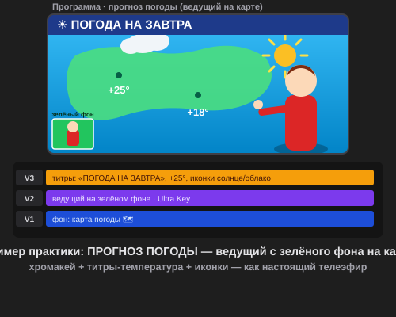

# Самостоятельная работа — Видеомонтаж, Урок 4

> 🧑‍🎓 Не космос! Становишься **телеведущим** и снимаешь настоящий **прогноз погоды** — как по телевизору.

---

## ✅ Задание 1 (для всех) — «Прогноз погоды» 📺🌦

Сделай **выпуск прогноза погоды** (15–25 секунд): «ведущий» стоит перед **картой погоды** и рассказывает, что будет завтра. Тут вся магия хромакея видна лучше всего — ведь так и делают на настоящем ТВ! (Как ведущий подойдёт клип человека/игрушки на зелёном фоне или свой.)

**Выбери, где твоя погода** (карта-фон — картинка):
- 🗺 **Карта твоей страны/области** — города с температурой;
- 🌍 **Карта мира** — «погода на планете»;
- 🏙 **Твой город** — «завтра в нашем городе»;
- 🪐 **Погода на другой планете** (шутка) — «на Марсе −60°, возможны метеориты»;
- 🏝 **Курорт мечты** — «а на нашем пляже +30°!».

**🎞 Пример результата** (открой в браузере — ведущий с зелёного фона на карте + титры):

**Обязательные условия:**
- [ ] **Хромакей Ultra Key**: зелёный фон ведущего **убран** (пипетка по зелёному);
- [ ] Ключ **чистый** — без зелёной каёмки (Сжатие + Подавление разлива);
- [ ] Ведущий стоит на **карте погоды** (фон на дорожке ниже);
- [ ] **Титры** (навык урока 3): заголовок «ПОГОДА НА ЗАВТРА» + **температура** («+25°») + иконки ☀🌧;
- [ ] **Цветокор Lumetri** — чистая «студийная» картинка (баланс белого, контраст), лёгкая виньетка;
- [ ] Экспорт **MP4** + сохранён **`.prproj`**.

> 💡 **Секрет реализма:** ведущий должен **смотреть/показывать на карту**, а не в пустоту. И подгони его **яркость под фон**, чтобы он не «висел» отдельно. Можно добавить **голос за кадром** (нейросеть): «Завтра ясно, плюс двадцать пять!».

---

## 🔗 Задание 2 (комбо, Уроки 1–4) — «Экстренный выпуск» ⛈

Сделай выпуск ярче, связав навыки:
1. Прогноз погоды (хромакей + карта + титры).
2. **Голос за кадром** (нейросеть) + **звук** дождя/грома, сведи с **дакингом** (урок 3).
3. **Погодный эффект поверх карты:** футаж дождя/снега на **третьей** дорожке (ещё один композитинг) — «настоящая» непогода.
4. По желанию — заставка-**титр** «⚡ ЭКСТРЕННЫЙ ВЫПУСК» с анимацией (урок 3).

**Результат:** динамичный выпуск новостей о погоде со звуком и эффектами.

---

## ⚡ Задание 3 (разминка-челлендж) — чистый ключ за 5 минут

**За 5 минут:** возьми клип на зелёном фоне → **Ultra Key** → пипетка по зелёному → доведи до **чистого** ключа: **Прозрачность** (фон чёрный), **Сжатие (Choke)** и **Подавление разлива** (убрать каёмку). Тренируем самый важный навык — аккуратный хромакей.

---

## 📋 Что проверяем

- [ ] Это **прогноз погоды** (ведущий у карты), а не космос с урока;
- [ ] Зелёный фон **убран**, ключ **чистый** (без каёмки);
- [ ] Ведущий на **карте погоды**; есть **титры** (заголовок + температура);
- [ ] **Цветокор** (студийная картинка) + лёгкая виньетка;
- [ ] Экспорт MP4 + `.prproj`;
- [ ] Сделан **«Экстренный выпуск»** (голос + звук + эффект дождя/снега).

## 🧩 Для 5–7 классов
- Готовый клип-ведущий на зелёном + карта от учителя.
- Хромакей: пипетка + чуть Сжатие.
- Титр — только температура («+20°»); цвет — по желанию.

## 🎓 Для 9–11 классов
- **Мусорная маска** для «грязной» зелёнки; подгон **света ведущего под студию**.
- Погодный эффект (дождь/снег футажом) поверх карты.
- Несколько городов с температурой, анимированные иконки.

## 🖼 Прогноз погоды класса 📺
Сдай MP4 — устроим «новостную студию»! Голосуем: **самый убедительный ведущий**, **самый чистый хромакей** и **самый смешной прогноз**.

## Что сдать
- `погода_*.mp4` + `*.prproj` (Задание 1) + «экстренный выпуск» (Задание 2).
