# Урок 5 — Мой ролик: собираем всё и публикуем 🏆🎬

**Модуль 5 · Видеомонтаж в Adobe Premiere Pro · Урок 5 из 5 (ФИНАЛ модуля) | 2 ак.ч. (1,5 часа)**

> 🔁 В начале — [разминка/повтор](повторение.md) (5 мин).
> 👨‍🏫 Сценарий с хронометражом — в [преподавателю.md](преподавателю.md).
> 🖼 Что показать и материалы — в [изображения.md](изображения.md) и в конце («Материалы»).
> ⚠️ Всё делаем **вручную**, без ИИ.
> 🎞 **Рендер результата** (двигается) — [`изображения/результат-ролик.svg`](изображения/результат-ролик.svg), открой в браузере.

> 🧭 **Как читать урок.** Это **финал модуля** 🏆 — сегодня НЕ учим один новый приём, а **собираем всё вместе** в готовый ролик, который не стыдно **выложить на канал**. Сквозной проект — **«Мой обзор»**: короткий ролик-обзор любимой вещи/игры/места, где работают все навыки модуля (нарезка в ритм, слоу-мо, титры и голос, цвет). Новое здесь — как **навести порядок в проекте** (бины), собрать всё аккуратно и **правильно вывести под платформу** (YouTube по-горизонтали и Shorts по-вертикали). А в конце — **защита**: покажешь ролик и расскажешь, как делал. Каждый шаг — до панели и кнопки.

---

## 🎬 Что мы сделаем сегодня и что получим

**Задача:** превратить набор клипов и навыков в **завершённый ролик** — с началом, серединой и концом, титрами, голосом, музыкой и цветом — и **экспортировать** его сразу в двух версиях: **горизонтальной** (YouTube) и **вертикальной** (Shorts/Reels). Плюс — навести **порядок в проекте**, чтобы не потеряться.

**В итоге у тебя получится:** твой **готовый ролик** 🏆 (влог/обзор/топ-5/мем — на выбор) в **MP4**, версия под платформу + проект `.prproj` — **итоговая работа Модуля 5** для портфолио и канала.

**Главные навыки урока (сборка всего модуля):**
- 🗂 **Организация проекта** — бины (папки), цветовые ярлыки, порядок.
- 🧩 **Сборка** — соединить все навыки (ритм у.1 + скорость у.2 + титры/голос у.3 + цвет/хромакей у.4).
- 🖼 **Обложка (thumbnail)** — «лицо» ролика.
- 📤 **Экспорт под платформы** — H.264, YouTube 1080p и вертикаль 1080×1920.
- 🎤 **Защита** — рассказать о ролике и приёмах.

> 💡 **Главная мысль:** монтаж — это не только эффекты, но и **порядок и завершённость**. Аккуратный проект + понятная история + правильный экспорт = ролик, которым гордишься.

**🎞 Вот что должно получиться** (открой в браузере — готовый ролик + экспорт под YouTube и Shorts):

---

## 🧭 Где что находится (сборка и экспорт)

- **Панель «Проект» (Project)** — тут наводим порядок: **бины** (папки-корзины) — кнопка **«Новая корзина»** (значок папки); **цветовые ярлыки** — правый клик по клипу → **«Метка»** → цвет; **переименование** — двойной клик по имени.
- **Таймлайн** — собираем ролик (все дорожки V1–V3, A1–A3, как в уроках 1–4).
- **Экспорт кадра (обложка)** — кнопка **фотоаппарата** под монитором «Программа» → **«Экспортировать кадр»** (сохранит картинку-thumbnail).
- **Экспорт ролика** — **`Файл → Экспорт → Медиаконтент…`** (`Ctrl+M`): **Формат — H.264**, **Набор настроек** — «YouTube 1080p» (гориз.) или создать **вертикальную** секвенцию 1080×1920 для Shorts.
- **Новая секвенция под формат** — `Файл → Создать → Секвенция` (выбрать размер: 1920×1080 гориз. или 1080×1920 верт.).

> 💡 **Клавиши урока:** `Ctrl+M` — экспорт · Пробел — играть · `Home`/`End` — в начало/конец.

> ⚠️ **Порядок бережёт время:** если клипы, музыка и титры разбросаны — легко потеряться и «уронить» проект. Бины и ярлыки — это как подписанные ящики.

---

## Часть 1 — План ролика и формат (8 минут)

Финал начинается **с плана** (как раскадровка). Реши:
1. **Какой у тебя ролик?** Выбери формат:
   - 🎙 **Влог** — «один момент из моей жизни/хобби»;
   - ⭐ **Обзор** — рассказ о любимой вещи/игре/книге;
   - 🔟 **Топ-5** — подборка (топ-5 игр/животных/трюков);
   - 😂 **Мем-нарезка** — смешные моменты;
   - 🛠 **Туториал** — «как сделать…».
2. **Структура** (мини-арка): **крючок** (первые 3 сек — зацепить) → **суть** (2–4 куска) → **концовка** (призыв «подпишись!»/вывод).
3. **Куда выложишь?** YouTube (горизонталь) или Shorts/Reels (вертикаль) — от этого зависит формат кадра.

> 💡 **Правило крючка (снова!):** первые секунды решают всё. Начни с самого интересного, а не с «привет, сегодня я…».

---

## Часть 2 — Наводим порядок в проекте (10 минут)

Прежде чем собирать — разложим всё по полочкам.

1. В панели **«Проект»** создай **бины** (папки): **«Видео»**, **«Музыка»**, **«Звуки»**, **«Титры»**, **«Голос»**. Перетащи файлы по папкам.
2. **Переименуй** клипы понятно (`клип_разбег`, `музыка_основа`), а не `MVI_2043`.
3. Поставь **цветовые ярлыки** (правый клик → «Метка»): например, видео — синий, звук — зелёный.

**👀 Что получишь:** чистый проект, где всё находится за секунду.

> ⚠️ **Ошибка:** монтировать из «свалки» — потом не найдёшь нужный клип и запутаешься. 5 минут на порядок экономят полчаса.

> 🧩 **Для 5–7:** хватит 2–3 бинов («Видео», «Звук», «Титры»).

---

## Часть 3 — Сборка: соединяем все навыки (16 минут)

Теперь собираем ролик, применяя **всё изученное**:

1. **Нарезка в ритм** (урок 1): выложи клипы по структуре, склейки — под музыку.
2. **Скорость** (урок 2): на «геройский» момент — **слоу-мо** (или стоп-кадр); скучное — ускорь.
3. **Титры и голос** (урок 3): **название**, **субтитры**, **голос за кадром** (🤖 нейросеть по тексту), музыка с **дакингом**.
4. **Цвет** (урок 4): **корректирующий слой** сверху — единый киношный цвет; при желании — **хромакей** (вставить себя куда-то).

**👀 Что получишь:** ролик, где каждый навык модуля работает на общую историю.

> 💡 **Не пихай всё сразу:** выбери 2–3 «фишки», которые украсят именно твой ролик. Слоу-мо на каждый кадр или 10 разных титров — перебор.

> ⚠️ **Ошибка:** ролик длинный и «провисает». Держи **коротко и бодро** (30–60 сек); режь всё лишнее.

---

## Часть 4 — Полировка (10 минут)

Мелочи, которые отличают «готово» от «сойдёт»:

1. **Переходы** — где нужно, мягкий «Наплыв»; вспышка на дропе (по вкусу).
2. **Единый цвет** — проверь, что корректирующий слой на всём ролике.
3. **Звук** — голос слышно, музыка приглушается (дакинг), в конце — фейд.
4. **Тайминг** — нет «провисаний»; крючок в начале, призыв в конце.
5. **Читаемость** — титры с обводкой, субтитры не налезают.

**👀 Что получишь:** ролик выглядит цельно и профессионально.

---

## Часть 5 — Обложка (thumbnail) (6 минут)

Обложка — «лицо» ролика, по ней решают, смотреть ли.

1. Поставь плейхед на **самый яркий кадр** → кнопка **фотоаппарата** под монитором → **«Экспортировать кадр»** → сохрани картинку.
2. *(По желанию)* добавь на неё **крупный текст** (в Premiere титром или позже) — эмоцию/интригу.

> 💡 Хорошая обложка = яркий кадр + крупная эмоция/лицо + короткий текст. Как в топовых видео.

---

## Часть 6 — Экспорт под платформы (10 минут)

Главный шаг финала — вывести ролик правильно.

### Горизонтальная версия (YouTube)

1. **`Файл → Экспорт → Медиаконтент…`** (`Ctrl+M`) → **Формат: H.264** → **Набор настроек: «YouTube 1080p»** (1920×1080) → имя/папка → **«Экспорт»**.

### Вертикальная версия (Shorts/Reels)

2. Сделай **вертикальную секвенцию** 1080×1920 (`Файл → Создать → Секвенция`), перекомпонуй кадр (передвинь/масштабируй клипы по центру — **вручную**, без авто-перекадровки ИИ), экспортируй так же H.264.
   - 👀 Теперь у тебя **две версии**: широкая для YouTube и вертикальная для Shorts.

3. Сохрани проект (`Ctrl+S`).

> 💡 **H.264 (MP4)** — универсально: и на YouTube, и на телефон. Вертикаль (9:16) — для Shorts/Reels/TikTok, горизонталь (16:9) — для YouTube.

> ⚠️ **Ошибка:** экспортнуть вертикальный ролик в горизонтальном формате — по бокам чёрные полосы. Формат секвенции должен совпадать с платформой.

---

## Часть 7 — 🎤 Защита ролика (6 минут)

Покажи ролик классу и расскажи (1 минута):
- **О чём** ролик и какой формат (влог/обзор/…);
- Какие **приёмы модуля** использовал (ритм, слоу-мо, титры, голос, цвет, хромакей);
- Что получилось **лучше всего** и что было **сложным**.

> 💡 Умение **рассказать о работе** — половина успеха блогера и любого автора. Тренируйся говорить уверенно.

---

## ✅ Как правильно / ❌ Как НЕ надо (финальный ролик)

| ❌ Как НЕ надо | ✅ Как правильно |
|----------------|------------------|
| Монтировать из «свалки» | **Бины** и ярлыки — порядок в проекте |
| Скучный старт | **Крючок** в первые 3 сек |
| Пихать все эффекты сразу | 2–3 фишки, что украсят именно твой ролик |
| Длинно и «провисает» | Коротко и бодро (30–60 сек) |
| Музыка глушит голос | Дакинг + фейды (голос главный) |
| Вертикальный ролик в гориз. формате | Формат секвенции = формат платформы |
| «Сойдёт и так» | Полировка: цвет, звук, читаемость, тайминг |

> ⚠️ Главные ошибки финала: **нет порядка** (теряешься) и **неправильный формат экспорта**. Разложи по бинам и экспортируй под нужную платформу.

---

## 🎓 Часть 8 — Для 9–11: глубже (8 минут)

- **Обе версии** (гориз. + верт.) аккуратно перекомпонованы вручную.
- **Своя обложка** с текстом и композицией.
- **Единый стиль** титров (сохранённый стиль-шаблон).
- **Экспорт-пресеты** под разные платформы; контроль битрейта/размера.
- **Мини-канал:** оформи 2–3 ролика в едином стиле (интро из урока 3 + этот ролик).

---

## 🧩 Для 5–7 классов (проще)

- Короткий ролик (20–30 сек), 3–4 клипа, 1–2 фишки.
- Порядок — 2–3 бина.
- Экспорт — **одна** версия (горизонтальная YouTube 1080p).
- Защита — 2–3 предложения.

---

## 🏁 Итог урока и модуля (5 минут)

Ты собрал **готовый ролик** — и завершил **весь Модуль 5**! 🏆

- ✅ **Организация проекта** — бины, ярлыки, порядок.
- ✅ **Сборка** — все навыки модуля в одной истории.
- ✅ **Полировка** — переходы, цвет, звук, тайминг, читаемость.
- ✅ **Обложка** + **экспорт под платформы** (YouTube + Shorts).
- ✅ **Защита** работы.

**За весь модуль ты научился:** резать и склеивать в ритм (у.1), играть со временем — слоу-мо/реверс/стоп-кадр (у.2), делать титры, субтитры, голос и киношный звук (у.3), красить кадр и телепортировать хромакеем (у.4), и наконец — **собирать всё в готовый ролик для канала** (у.5). Ты умеешь монтировать видео! 🎬

> 🏆 Дальше — **бонус-урок «Adobe-шедевр»**: объединим ВСЕ программы Adobe (Photoshop + Illustrator + Animate + Premiere) в одном промо-ролике.

> 🎤 **Блиц по модулю:** что такое бины? как поставить склейку на бит? какая скорость = слоу-мо? что делает дакинг? как убрать зелёный фон? в каком формате экспорт и чем отличаются YouTube и Shorts?

### 🎮 Викторина-закрепление (по ВСЕМУ Модулю 5)

Открой **[викторина.html](викторина.html)** — вопросы по всему модулю: нарезка, ритм, скорость, титры, звук, цвет, хромакей, экспорт + смешные и «на подумать».

➡️ **Самостоятельная работа** — сделай **свой ролик для канала** (любой формат) — в [практике](практика.md).
🧰 **Трюки урока** (порядок, обложка, экспорт под платформы) — в [лайфхак.md](лайфхак.md).

---

## 🔗 Материалы и ссылки к уроку

**🧰 Инструмент:** Adobe Premiere Pro (по лицензии класса), русский интерфейс.

**📥 Материалы (свободные):**
- 🎬 **Клипы:** **свои из уроков 1–4** (переиспользуй!) + [Pexels](https://www.pexels.com/videos/) / [Pixabay](https://pixabay.com/videos/) / [Mixkit](https://mixkit.co/free-stock-video/).
- 🎵 **Музыка/звуки:** [Pixabay Music](https://pixabay.com/music/), [YouTube Audio Library](https://www.youtube.com/audiolibrary), [Pixabay Sound](https://pixabay.com/sound-effects/).
- 🤖 **Голос за кадром:** нейросеть-озвучка по тексту — [TTSMaker](https://ttsmaker.com/), [ttsMP3.com](https://ttsmp3.com/text-to-speech/Russian/) (микрофон не нужен).

**🎬 Вдохновение:** поиск — *how to organize Premiere project bins*, *export vertical video Premiere Shorts*, *YouTube thumbnail from Premiere*. YouTube (рус.): *«бины в Premiere»*, *«экспорт вертикального видео»*, *«обложка для YouTube»*.

**⚙️ Учителю:** заранее собрать образец-ролик (все навыки + обе версии экспорта); показать бины/ярлыки, экспорт кадра-обложки, `Ctrl+M` под YouTube и вертикальную секвенцию под Shorts; провести защиту. Список — в [изображения.md](изображения.md).
