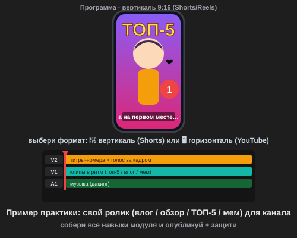

# Самостоятельная работа — Видеомонтаж, Урок 5 (финал)

> 🧑‍🎓 Это твой **итоговый ролик** модуля. Придумай **свой** — влог, обзор, топ-5 или мем.

---

## ✅ Задание 1 (для всех) — «Мой ролик для канала» 🏆

Собери **свой готовый ролик** (30–60 секунд) в **своём** формате. Выбери **один** (или придумай свой):

- 🎙 **Влог** — «один день/момент из моей жизни или хобби»;
- ⭐ **Обзор** — любимая игра / книга / вещь / место;
- 🔟 **Топ-5** — подборка с обратным отсчётом (топ-5 игр / животных / трюков);
- 😂 **Мем-нарезка** — смешные моменты под музыку;
- 🛠 **Туториал** — «как сделать…» по шагам.

**🎞 Пример подхода** (открой в браузере — вертикальный ролик для Shorts + все дорожки):

**Обязательные условия:**
- [ ] Есть **план-структура**: крючок (первые 3 сек) → суть → концовка/призыв;
- [ ] Проект **организован** (бины: Видео/Музыка/Титры/Голос);
- [ ] Собраны **минимум 3 навыка модуля**: нарезка в ритм (у.1) + любой из [слоу-мо/реверс/стоп-кадр (у.2), титры/голос/дакинг (у.3), цвет/хромакей (у.4)];
- [ ] Есть **название/титр** и **голос за кадром** (🤖 нейросеть) или субтитры;
- [ ] Единый **цвет** (корректирующий слой), звук сведён (дакинг + фейды);
- [ ] **Обложка** (экспорт кадра) + экспорт **MP4** (H.264) под платформу;
- [ ] Сохранён **`.prproj`**.

> 💾 **Это работа для портфолио и канала!** Сделай так, чтобы самому захотелось показать друзьям.

---

## 🔗 Задание 2 (комбо — весь модуль) — «Две версии»

Покажи мастерство платформ:
1. Экспортируй ролик в **горизонтали** (YouTube 1080p).
2. Сделай **вертикальную** версию 1080×1920 (перекомпонуй кадр вручную) для Shorts/Reels.

**Результат:** один ролик — два формата, готовые к разным платформам.

---

## ⚡ Задание 3 (разминка-челлендж) — порядок за 5 минут

**За 5 минут:** в панели «Проект» создай **бины** (Видео / Музыка / Титры / Голос), разложи файлы, поставь **цветовые ярлыки** и переименуй 3–4 клипа понятно. Тренируем навык, который экономит часы, — **порядок в проекте**.

---

## 📋 Что проверяем

- [ ] Формат — **свой** (влог/обзор/топ-5/мем), с планом-структурой;
- [ ] Проект **организован** (бины/ярлыки);
- [ ] Собрано **≥3 навыка** модуля;
- [ ] Есть **титр + голос/субтитры**, единый цвет, сведённый звук;
- [ ] **Обложка** + экспорт MP4 под платформу + `.prproj`;
- [ ] Сделаны **две версии** (гориз. + верт.) — Задание 2.

## 🧩 Для 5–7 классов
- Короткий ролик (20–30 сек), 3–4 клипа, 1–2 фишки.
- Порядок — 2–3 бина; **одна** версия экспорта (YouTube 1080p).
- Голос — нейросеть; защита в 2–3 предложениях.

## 🎓 Для 9–11 классов
- Обе версии аккуратно, своя **обложка** с текстом.
- Единый **стиль** титров (шаблон); мини-серия из 2–3 роликов.
- Продуманная драматургия (крючок → удержание → призыв).

## 🖼 Премьера канала класса 🎬
Сдай MP4 — устроим **премьеру**! Голосуем: **лучший ролик**, **лучшая обложка**, **приз зрительских симпатий**. Соберём общий «канал класса».

## Что сдать
- `мой_ролик.mp4` (+ вертикальная версия) + обложка (картинка) + `*.prproj`.
