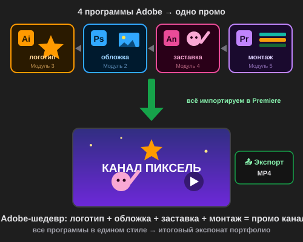

# Бонус-урок — Adobe-шедевр: всё вместе 🎬✨

**Модуль 5 · Видеомонтаж в Adobe Premiere Pro · Бонус-урок (капстон творческого блока) | 2 ак.ч. (1,5 часа)**

> ⭐ **Бонус-урок** — финал всего Adobe-блока (Модули 2–5). Делается, когда пройдены Photoshop, Illustrator, Animate и Premiere.
> 🔁 В начале — [разминка/повтор](повторение.md) (5 мин).
> 👨‍🏫 Сценарий с хронометражом — в [преподавателю.md](преподавателю.md).
> 🖼 Что показать и материалы — в [изображения.md](изображения.md) и в конце («Материалы»).
> ⚠️ Всё делаем **вручную**, без ИИ (голос — 🤖 нейросеть-озвучка вне Adobe).
> 🎞 **Рендер результата** (двигается) — [`изображения/результат-adobe-шедевр.svg`](изображения/результат-adobe-шедевр.svg), открой в браузере.

> 🧭 **Как читать урок.** Это **главный капстон** курса по Adobe 🏆 — сегодня НЕ учим новую программу, а **соединяем все четыре в одном проекте**. Сделаем **промо своего канала/бренда** (20–40 секунд), где по очереди работают: **Illustrator** (логотип), **Photoshop** (обложка), **Animate** (анимированная заставка) и **Premiere** (финальный монтаж). Это как настоящая студия: каждый инструмент делает свою часть, а в конце всё сходится в один ролик. Главное здесь — **единый стиль** (один цвет, шрифт, персонаж во всех программах) и **правильная передача файлов** между ними. Переиспользуй **свои готовые работы** из прошлых модулей!

---

## 🎬 Что мы сделаем сегодня и что получим

**Задача:** собрать **промо-ролик своего канала/бренда**, пройдя всю студийную цепочку: нарисовать **логотип** (Ai) → сделать **обложку/постер** (Ps) → оживить **заставку** (Animate) → смонтировать всё с клипами, звуком и цветом (Premiere) → **экспорт** + защита. Всё — **в едином фирменном стиле**.

**В итоге у тебя получится:** **промо-ролик** 🎬 (заставка с логотипом + кадры + титры + голос + музыка + цвет) в **MP4** + все исходники — **итоговый экспонат портфолио**, который показывает, что ты владеешь **всем Adobe**.

**Что соединяем (по модулям):**
- 🟠 **Illustrator (М3)** — векторный **логотип/эмблема** канала.
- 🔵 **Photoshop (М2)** — **обложка/постер** (thumbnail) или обработанный кадр.
- 🔴 **Animate (М4)** — **анимированная заставка** (логотип «собирается» / маскот машет и говорит) → экспорт GIF/MP4.
- 🟣 **Premiere (М5)** — **финальный монтаж**: заставка + клипы в ритм + слоу-мо + титры + голос + цвет → экспорт.

> 💡 **Главная мысль:** профи не делают всё в одной программе — у каждой своя суперсила. Логотип — в векторе (Ai), фотомонтаж — в Ps, анимацию — в Animate, а собирает всё видео — Premiere. Ты уже умеешь каждую! Осталось **соединить**.

**🎞 Вот что должно получиться** (открой в браузере — 4 программы сходятся в одно промо):

---

## 🧭 Где что находится (пайплайн между программами)

- **Единый стиль (бренд):** до старта зафиксируй **2–3 цвета**, **шрифт** и **персонаж/значок** — они должны быть **одинаковыми** во всех программах.
- **Illustrator → Premiere:** логотип экспортируй **`Файл → Экспорт → Экспортировать как…`** в **PNG** (с прозрачным фоном!) или **SVG**.
- **Photoshop → Premiere:** обложку/картинку — **`Файл → Экспортировать → Быстрый экспорт в PNG`** (прозрачный фон, если нужно наложить).
- **Animate → Premiere:** заставку — **`Файл → Экспорт → Экспортировать видео/медиа`** (MP4) или **анимированный GIF**; для наложения без фона — PNG-последовательность.
- **Premiere:** всё импортируем (`Ctrl+I`), раскладываем по **бинам** (папкам), собираем на таймлайне (как в уроке 5).

> 💡 **Прозрачный фон (PNG/альфа):** логотип и маскот с прозрачным фоном «лягут» поверх видео без белого прямоугольника. Это как слой в Photoshop.

> ⚠️ **Всё вручную, без ИИ.** Голос заставки/промо — 🤖 нейросеть-озвучка по тексту (вне Adobe), в программы просто импортируем готовый файл.

---

## Часть 1 — Бренд: имя, стиль, план (10 минут)

Промо начинается с **бренда**. Реши (запиши):
1. **Название** канала/бренда (например, «ПИКСЕЛЬ», «ЛАПКА», «Мастерская Ани»).
2. **О чём** он (игры, питомцы, рисование, спорт…).
3. **Фирменный стиль:** **2–3 цвета** + **шрифт** + **значок/маскот**. Это твоя «айдентика» — держи её во всех программах.
4. **План промо** (мини-арка): заставка с логотипом (2–3 сек) → пара кадров «о чём канал» → призыв «подпишись!» с логотипом в конце.

> 💡 **Можно взять готовое:** твой **бренд из Модуля 3** (лого + палитра) и **маскот из Модуля 4** — капстон как раз про то, чтобы **оживить** уже сделанное.

---

## Часть 2 — 🟠 Illustrator: логотип (12 минут)

1. Открой свой **логотип из Модуля 3** (или нарисуй простой: значок + название фирменным шрифтом и цветом).
2. Проверь, что он **читается маленьким** и в **одном-двух цветах**.
3. **Экспорт:** `Файл → Экспортировать → Экспортировать как…` → **PNG** (галка «Прозрачность»/фон прозрачный) — чтобы наложить на видео. Сохрани `logo.png` в папку проекта.

**👀 Что получишь:** чистый логотип с прозрачным фоном — «печать» твоего бренда.

> 🧩 **Для 5–7:** возьми готовый логотип из М3, только экспортируй в PNG. Рисовать заново не нужно.

---

## Часть 3 — 🔵 Photoshop: обложка (10 минут)

1. Сделай **обложку/постер** канала (или thumbnail для ролика): яркий фон/кадр + **логотип** + крупный **текст** (название/слоган).
2. Используй навыки М2: слои, стили слоя (свечение/тень для текста), кадрирование под **16:9**.
3. **Экспорт:** `Файл → Экспортировать → Быстрый экспорт в PNG` → `cover.png`.

**👀 Что получишь:** «лицо» канала — обложка в фирменном стиле.

> 💡 Обложка пригодится и как **стартовый кадр** промо, и как превью на YouTube.

---

## Часть 4 — 🔴 Animate: анимированная заставка (14 минут)

1. Сделай **короткую заставку** (2–4 сек) с логотипом. Идеи (навыки М4):
   - логотип **появляется/собирается** (морфинг или анимация движения + Альфа);
   - **маскот** машет и «говорит» название (кости/IK + липсинк + звук из М4);
   - буквы названия **выезжают** по одной.
2. Держи **фирменные цвета**.
3. **Экспорт:** `Файл → Экспорт → Экспортировать видео/медиа…` (**MP4**) или `…Экспортировать анимированный GIF`. Для наложения без фона — PNG-последовательность.

**👀 Что получишь:** живая заставка канала — как у настоящих блогеров.

> 🧩 **Для 5–7:** возьми **готовую** анимацию из М4 (мяч/маскот) как заставку — экспортируй и всё.

> ⚠️ **Ошибка:** заставка на **10 секунд** — это долго. Заставка = **2–4 сек**, бодро.

---

## Часть 5 — 🟣 Premiere: собираем промо (16 минут)

Финальная сборка — всё сходится здесь (навыки М5).

1. **Импортируй** в Premiere (`Ctrl+I`): заставку (Animate), логотип `logo.png`, обложку `cover.png`, клипы, музыку, голос. Разложи по **бинам**.
2. **Собери по плану:**
   - **начало** — заставка (Animate) + обложка;
   - **середина** — 2–4 клипа «о чём канал», нарезанные **в ритм** (М5 у.1), на «геройский» момент — **слоу-мо** (у.2);
   - **конец** — **логотип** (PNG поверх видео) + титр **«Подпишись!»** (у.3).
3. **Титры и голос:** название, субтитры, **голос за кадром** (🤖 нейросеть) — «Привет! Это канал про…». Музыка с **дакингом** (у.3).
4. **Цвет:** **корректирующий слой** — единый киношный цвет (у.4).
5. **Экспорт:** `Ctrl+M` → **H.264** → «YouTube 1080p» (и/или вертикаль для Shorts).

**👀 Что получишь:** цельное промо, где твой логотип, обложка, заставка и монтаж работают в едином стиле.

> 💡 **Логотип-«вотермарк»:** положи маленький логотип (PNG) в **уголок** на весь ролик (дорожка сверху) — как у брендов.

> ⚠️ **Ошибка:** разнобой — в Ai один цвет/шрифт, в Ps другой, в Animate третий. **Единый стиль** — главное в бренде.

---

## Часть 6 — 🎤 Защита и портфолио (6 минут)

Покажи промо классу и расскажи (1–2 минуты):
- **Что** за бренд/канал и какой у него **стиль** (цвета, шрифт, маскот);
- **Что в какой программе** сделал (лого — Ai, обложка — Ps, заставка — Animate, монтаж — Premiere);
- Какие **приёмы** использовал и что получилось лучше всего.

Положи промо и все исходники в **портфолио** — это твоя лучшая «визитка».

> 💡 Умение объяснить **весь путь работы** (пайплайн) — то, что ценят в любой творческой профессии.

---

## ✅ Как правильно / ❌ Как НЕ надо (капстон)

| ❌ Как НЕ надо | ✅ Как правильно |
|----------------|------------------|
| Делать всё с нуля | **Переиспользовать** свои работы из М2–М4 |
| Разные цвета/шрифт в каждой программе | **Единый стиль** (цвета, шрифт, маскот) везде |
| Логотип с белым прямоугольником | Экспорт **PNG с прозрачным фоном** |
| Заставка на 10 сек | Заставка **2–4 сек**, бодро |
| Свалка файлов в Premiere | **Бины** и порядок (как в уроке 5) |
| ИИ внутри Adobe | Всё вручную; голос — TTS **вне** Adobe |
| «И так сойдёт» | Полировка: цвет, звук, читаемость, единый стиль |

> ⚠️ Главные ошибки капстона: **разнобой стиля** и **непрозрачный логотип**. Держи один стиль и экспортируй лого в PNG с альфой.

---

## 🎓 Часть 7 — Для 9–11: глубже (8 минут)

- **Полный бренд-гайд:** лого + палитра + шрифт + маскот, применённые единообразно.
- **Логотип-анимация** с морфингом/кинетикой; вотермарк весь ролик.
- **Две версии** промо (гориз. YouTube + верт. Shorts).
- **Мини-серия:** интро-заставка + 1–2 ролика в одном стиле = заготовка канала.
- Аккуратная **папка проекта** (исходники всех программ + экспорт) для портфолио.

---

## 🧩 Для 5–7 классов (проще)

- Возьми **готовые** логотип (М3) и анимацию (М4) — только экспортируй.
- Обложка — простая (фон + лого + название).
- Промо — короткое (15–20 сек): заставка → 2 клипа → лого «Подпишись».
- Голос — нейросеть; экспорт — одна версия.

---

## 🏁 Итог урока и всего Adobe-блока (5 минут)

Ты собрал **Adobe-шедевр** — и прошёл **весь творческий блок**! 🏆

- ✅ **Единый бренд** — стиль во всех программах.
- ✅ **Illustrator** — логотип (PNG с альфой).
- ✅ **Photoshop** — обложка/постер.
- ✅ **Animate** — анимированная заставка (экспорт).
- ✅ **Premiere** — сборка промо (ритм, слоу-мо, титры, голос, цвет) + экспорт.
- ✅ **Защита** + портфолио.

**За весь блок Adobe ты научился:** обрабатывать фото и делать композиты (Photoshop, М2), рисовать вектор и бренды (Illustrator/Figma, М3), оживлять героев (Animate, М4), монтировать видео (Premiere, М5) — и наконец **соединять всё** в один проект, как настоящая студия. Ты — цифровой художник! 🎨🎬

> 🏆 Дальше — **профильный блок** (по возрасту) и **итоговый проект/портфолио** (Модуль 10), куда это промо войдёт как звезда.

> 🎤 **Блиц:** какая программа для логотипа? для обложки? для анимации? для монтажа? зачем прозрачный PNG? что такое единый стиль?

### 🎮 Викторина-закрепление (по всему Adobe-блоку)

Открой **[викторина.html](викторина.html)** — вопросы про пайплайн, какая программа за что отвечает, экспорт/импорт и единый стиль + смешные и «на подумать».

➡️ **Самостоятельная работа** — сделай **промо своего бренда/канала** — в [практике](практика.md).
🧰 **Трюки урока** (экспорт с альфой, единый стиль, вотермарк) — в [лайфхак.md](лайфхак.md).

---

## 🔗 Материалы и ссылки к уроку

**🧰 Инструменты:** Adobe Illustrator + Photoshop + Animate + Premiere Pro (по лицензии класса).

**📥 Материалы (свободные):**
- 🎨 **Свои работы из М2–М4** — логотип, бренд, маскот, анимации (переиспользуй!).
- 🎬 **Клипы:** свои + [Pexels](https://www.pexels.com/videos/) / [Pixabay](https://pixabay.com/videos/).
- 🎵 **Музыка/звуки:** [Pixabay Music](https://pixabay.com/music/), [YouTube Audio Library](https://www.youtube.com/audiolibrary), [Pixabay Sound](https://pixabay.com/sound-effects/).
- 🤖 **Голос:** нейросеть-озвучка — [TTSMaker](https://ttsmaker.com/), [ttsMP3.com](https://ttsmp3.com/text-to-speech/Russian/).

**🎬 Вдохновение:** поиск — *channel intro branding*, *logo animation reveal*, *brand promo video*. YouTube (рус.): *«интро для канала»*, *«анимация логотипа»*, *«промо ролик бренда»*.

**⚙️ Учителю:** заранее собрать образец-промо (все 4 программы + единый стиль); показать экспорт PNG с альфой (Ai/Ps), экспорт заставки (Animate), сборку в Premiere и вотермарк; провести защиту. Список — в [изображения.md](изображения.md).
