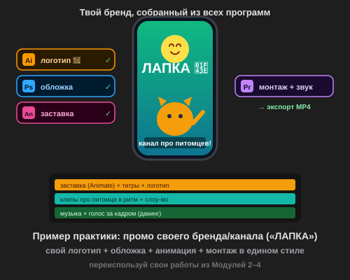

# Самостоятельная работа — Бонус-урок «Adobe-шедевр»

> 🧑‍🎓 Это твой **главный экспонат портфолио** — промо своего бренда, где работают все программы Adobe.

---

## ✅ Задание 1 (для всех) — «Промо моего бренда/канала» 🏆

Сделай **промо-ролик** (20–40 секунд) своего канала или бренда, пройдя всю студийную цепочку. Придумай **свой** (или оживи бренд из Модуля 3):

- 🎮 **Игровой канал** — обзоры/летсплеи;
- 🐾 **Про питомцев** — «ЛАПКА»;
- 🎨 **Про творчество** — рисование/поделки;
- 🍰 **Еда/рецепты** — своя «кухня»;
- ⚽ **Спорт/трюки** — свой спорт-канал;
- 🏪 **Свой бренд** (смузи/игрушки/одежда) — как в финале Модуля 3.

**🎞 Пример результата** (открой в браузере — промо бренда «ЛАПКА» из всех программ):

**Обязательные условия (используй ВСЕ 4 программы):**
- [ ] 🟠 **Illustrator** — логотип/эмблема (экспорт **PNG с прозрачным фоном**);
- [ ] 🔵 **Photoshop** — обложка/постер (или обработанный кадр);
- [ ] 🔴 **Animate** — анимированная заставка (2–4 сек) → экспорт;
- [ ] 🟣 **Premiere** — сборка: заставка + клипы в ритм + титры + голос (🤖) + музыка с дакингом + цвет;
- [ ] **Единый стиль** — одинаковые цвета/шрифт/маскот во всех программах;
- [ ] Экспорт **MP4** (H.264) + сохранены **все исходники**.

> 💾 **Это в портфолио!** Промо показывает, что ты владеешь всем Adobe. Сделай так, чтобы им хотелось похвастаться.

---

## 🔗 Задание 2 (комбо — весь блок) — «Логотип-вотермарк + две версии»

Добавь профи-штрихи:
1. Положи **маленький логотип** (PNG) в **уголок** на весь ролик — как у брендов (вотермарк).
2. Сделай **две версии**: горизонтальную (YouTube) и вертикальную (Shorts/Reels).

**Результат:** брендированное промо, готовое для разных платформ.

---

## ⚡ Задание 3 (разминка-челлендж) — экспорт с альфой за 5 минут

**За 5 минут:** открой свой логотип в Illustrator (или Photoshop) → **экспортируй в PNG с прозрачным фоном** → импортируй в Premiere → положи **поверх** любого видео. Убедись, что вокруг лого **нет белого прямоугольника**. Тренируем главный «мостик» между программами.

---

## 📋 Что проверяем

- [ ] Бренд/канал — **свой**, с единым стилем;
- [ ] Задействованы **все 4 программы** (лого/обложка/заставка/монтаж);
- [ ] Логотип — **PNG с прозрачным фоном**;
- [ ] Заставка короткая (2–4 сек); промо бодрое;
- [ ] Есть титры + голос (🤖) + музыка с дакингом + единый цвет;
- [ ] Экспорт MP4 + исходники;
- [ ] Сделан **вотермарк** и/или **две версии** (Задание 2).

## 🧩 Для 5–7 классов
- Готовые логотип (М3) и анимация (М4) — только экспортировать.
- Промо короткое (15–20 сек): заставка → 2 клипа → лого «Подпишись».
- Голос — нейросеть; одна версия экспорта.

## 🎓 Для 9–11 классов
- Полный бренд-стиль; логотип-анимация с кинетикой.
- Вотермарк весь ролик + две версии (гориз./верт.).
- Мини-серия (интро + 1–2 ролика) в одном стиле = заготовка канала.

## 🖼 Фестиваль брендов класса 🏆
Сдай MP4 + исходники — устроим «показ студий»! Голосуем: **лучший бренд**, **самый цельный стиль** и **лучшее промо**.

## Что сдать
- `промо_бренд.mp4` (+ вертикальная версия) + `logo.png`, `cover.png`, заставка + `*.prproj`/`.fla`/`.ai`/`.psd`.
