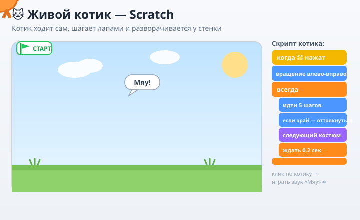
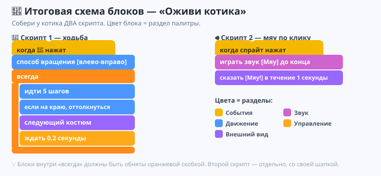

# Урок 1 — «Оживи котика»: интерфейс, спрайты, движение 🐱✨

**Модуль 6 · Игры на Scratch · Урок 1 из 9 | 2 ак.ч. (1,5 часа)**

> 🔁 В начале — [разминка/повтор](повторение.md) (5 мин).
> 👨‍🏫 Сценарий с хронометражом — в [преподавателю.md](преподавателю.md).
> 🖼 Что показать на проекторе — в [изображения.md](изображения.md).
> 🎞 **Рендер результата** (двигается) — [`изображения/результат-котик.svg`](изображения/результат-котик.svg), открой в браузере.
> 🆘 **Пропустил урок или хочешь закрепить?** Открой [самоучитель.md](самоучитель.md) — там 15 заданий с подсказками, по которым можно разобраться самому.

> 🧭 **Как читать урок.** Это **первый урок программирования** в жизни многих ребят. Пугаться не нужно: в Scratch код собирается из **цветных блоков-кирпичиков**, как из Lego — ошибиться «в буквах» невозможно. Сегодня мы **оживим котика**: он будет **сам ходить по сцене, шагать лапами, отталкиваться от стенок и мяукать**. Каждый шаг — до конкретного блока: какого он **цвета**, откуда его взять, куда перетащить, что **увидишь на сцене** 👀 и зачем это нужно.

---

## 🎮 Что мы сделаем сегодня и что получим

**Задача:** взять котика (он есть в Scratch с самого начала) и **превратить неподвижную картинку в живого персонажа** — чтобы он ходил по сцене туда-сюда, «перебирал лапами», отскакивал от краёв и мяукал, когда на него нажмёшь.

**В итоге у тебя получится:** твоя **первая программа-анимация** 🐱 — котик, который **живёт на сцене сам**: гуляет, шагает, разворачивается у стенки и отвечает на клик. Это уже маленькая интерактивная сценка, которую можно показать друзьям и сохранить (`.sb3`).

**Главные навыки урока:**
- 🗂 **Интерфейс Scratch** — где сцена, спрайты, палитра блоков, область скриптов.
- 🐱 **Спрайт и сцена** — что это и чем отличаются.
- 🚩 **События** — блок `когда нажат флажок` (с чего программа начинается).
- 🏃 **Движение** — `идти 10 шагов`, `повернуть`, `если на краю, оттолкнуться`.
- 🔁 **Цикл «всегда»** — как заставить действие повторяться без конца.
- 👗 **Костюмы** — смена костюмов = котик «шагает лапами».
- 🔊 **Реакция на клик** — `когда спрайт нажат` → `играть звук Мяу`.

> 💡 **Главная мысль:** **программа — это последовательность команд, которые компьютер выполняет по порядку.** Мы не рисуем движение кадр за кадром (как в анимации) — мы **приказываем**: «иди», «повернись», «повторяй всегда». Компьютер слушается буквально — в этом вся магия и вся ответственность программиста.

**🎞 Вот что должно получиться** (открой в браузере — котик ходит по сцене, шагает лапами, отскакивает от края):

---

## 🧭 Где что находится (интерфейс Scratch)

Открой Scratch: онлайн — [scratch.mit.edu/projects/editor](https://scratch.mit.edu/projects/editor/), или запусти **Scratch Desktop** (офлайн). Вверху справа можно переключить язык на **русский** (значок 🌐 глобус). Экран делится на **4 главные зоны**:

- **🎨 Палитра блоков** — **слева**. Все команды-кирпичики, разложены по **цветным категориям**: синие «Движение», фиолетовые «Внешний вид», розовые «Звук», жёлтые «События», оранжевые «Управление» и т.д. Отсюда мы **берём** блоки.
- **📝 Область скриптов** — **посередине** (большое пустое поле). Сюда мы **перетаскиваем блоки** и соединяем их в программу (скрипт). Это наш «верстак».
- **🎬 Сцена** — **справа вверху**. Это «экран игры» — то, что видит зритель. Здесь стоит котик. Над сценой — **зелёный флажок 🚩** (старт) и **красный знак стоп ⛔**.
- **🐱 Список спрайтов** — **справа внизу**, под сценой. Все персонажи проекта. Сейчас там один — **Котик (Sprite1)**. Рядом справа — панель **«Сцена»** (фон).

> 💡 **Спрайт** — это персонаж или объект (котик, мяч, кнопка). **Сцена** — фон, на котором они находятся. У **каждого спрайта — свои скрипты** (своя программа поведения).

> ⚠️ **Типичная ошибка новичка:** писать скрипт для котика, а на самом деле быть «внутри Сцены». Перед тем как собирать блоки — **проверь, что в списке спрайтов выделен котик** (у него синяя рамка). Иначе блоки уедут не туда.

---

## Часть 1 — Знакомство: перетаскиваем первый блок (8 минут)

Давай сразу почувствуем, как это работает.

1. Слева в палитре выбери синюю категорию **«Движение»**.
2. Найди блок **`идти 10 шагов`**, **зажми его мышкой и перетащи** в область скриптов (в центр).
3. **Кликни по блоку** прямо в области скриптов.
   - 👀 **Что видишь:** котик на сцене **прыгнул чуть вправо**. Каждый клик — ещё один «шаг».

Поздравляю — ты только что дал компьютеру команду, и он выполнил! Это и есть программирование.

4. Поменяй число: кликни на «10» в блоке и впиши **`50`**. Кликни блок ещё раз — котик прыгнет **дальше**.

> 💡 **Число внутри блока — это «сколько».** `идти 10 шагов` — маленький шаг, `идти 50 шагов` — большой. Блоки почти всегда можно настраивать числами и словами.

> ⚠️ **Ошибка:** искать «где кнопка запустить один блок». Просто **клик по блоку** в области скриптов = «выполни сейчас». Позже запускать будем флажком.

---

## Часть 2 — С чего всё начинается: флажок (8 минут)

Сейчас, чтобы котик пошёл, надо кликать по блоку. Игру так не запускают — нужен **старт по зелёному флажку**.

1. Выбери жёлтую категорию **«События»**.
2. Возьми блок-«шапочку» **`когда нажат 🚩 флажок`** и перетащи в область скриптов.
3. **Присоедини** к нему снизу блок `идти 10 шагов` — они **щёлкнут**, как детали Lego (появится серая тень-подсказка перед стыковкой).
   - 👀 **Что видишь:** два блока соединились в «стопочку».
4. Нажми **зелёный флажок 🚩** над сценой.
   - 👀 **Что произойдёт:** котик пошёл — теперь **по флажку**, а не по клику.

> 💡 **Блок-«шапочка» `когда...`** — это **событие**, начало программы. Он говорит: «когда случится ВОТ ЭТО — выполняй то, что прицеплено снизу». `когда нажат флажок` = «когда игрок нажал старт».

> ⚠️ **Ошибка:** блоки просто лежат рядом, но **не соединены**. Тогда флажок запустит только «шапочку», а команда не выполнится. Блоки должны **сцепиться** в одну стопку (без щели между ними).

---

## Часть 3 — Заставляем котика идти всегда: цикл «всегда» (12 минут)

Один шаг — скучно. Хотим, чтобы котик шёл **непрерывно**. Для этого есть **цикл** — блок, который повторяет команды.

1. Оранжевая категория **«Управление»** → возьми блок **`всегда`** (он в форме **скобки-рамки**, как «пасть», куда кладут другие блоки).
2. Присоедини `всегда` под `когда нажат флажок`.
3. **Перетащи блок `идти 10 шагов` ВНУТРЬ** рамки `всегда` (положи его в «пасть» — рамка подсветится).
   - 👀 **Что видишь:** блок движения теперь **внутри** «всегда».
4. Уменьши шаг: поставь **`идти 5 шагов`** (чтобы не мельтешил).
5. Жми флажок 🚩.
   - 👀 **Что произойдёт:** котик **едет** вправо и... **упирается в край** и застревает. Это нормально — сейчас починим.

> 💡 **Цикл `всегда`** = «повторяй то, что внутри, бесконечно, пока не нажали стоп ⛔». Это один из **самых главных блоков** в играх: «всегда проверяй клавиши», «всегда двигай врагов» и т.д.

> ⚠️ **Ошибка:** положить `идти` **под** рамку `всегда`, а не **внутрь**. Тогда шаг сделается один раз. Блок должен быть **обнят** скобкой «всегда» слева.

---

## Часть 4 — Разворот у стенки: «если на краю, оттолкнуться» (10 минут)

Котик упёрся в край. Сделаем, чтобы он **разворачивался** и шёл обратно — гулял туда-сюда.

1. Синяя **«Движение»** → найди блок **`если на краю, оттолкнуться`**. Перетащи его **внутрь `всегда`**, под `идти 5 шагов`.
2. Жми флажок 🚩.
   - 👀 **Что произойдёт:** котик доходит до края и... разворачивается, но идёт **вверх ногами** 🙃 (перевернулся). Сейчас поправим.
3. Синяя «Движение» → найди блок **`установить способ вращения [влево-вправо]`**. Перетащи его **в самое начало**, под `когда нажат флажок` (до `всегда`). Выбери в нём режим **«влево-вправо»**.
4. Жми флажок 🚩.
   - 👀 **Что видишь:** теперь котик **зеркально разворачивается** у стенки и гуляет туда-сюда **правильно**, не переворачиваясь вверх ногами. 🎉

> 💡 **`если на краю, оттолкнуться`** — проверяет: «котик коснулся края сцены? тогда развернись». **Способ вращения «влево-вправо»** = спрайт только зеркалится (как в зеркале), а не крутится «колесом». Для ходящих персонажей это то, что нужно.

> ⚠️ **Ошибка:** забыть про «способ вращения» — и персонаж ходит вверх ногами. Запомни этот блок: он нужен во **всех** играх с ходьбой.

---

## Часть 5 — Котик «шагает лапами»: костюмы (12 минут)

Сейчас котик **скользит**, как на коньках. Оживим походку — пусть **перебирает лапами**. У котика есть **два костюма** (две позы), и если быстро их менять — получится анимация ходьбы.

1. Над списком спрайтов вверху есть вкладки **«Код» / «Костюмы» / «Звуки»**. Нажми **«Костюмы»**.
   - 👀 **Что видишь:** у котика **два костюма** — `костюм1` и `костюм2` (лапы в разном положении).
2. Вернись на вкладку **«Код»**.
3. Фиолетовая категория **«Внешний вид»** → возьми блок **`следующий костюм`**. Положи его **внутрь `всегда`**, под `идти 5 шагов`.
4. Чтобы смена не была слишком быстрой, добавь паузу: оранжевая «Управление» → блок **`ждать 0.2 секунды`** — тоже **внутрь `всегда`**, под `следующий костюм`.
5. Жми флажок 🚩.
   - 👀 **Что видишь:** котик **шагает лапами** на ходу — настоящая походка! 🐾

> 💡 **Костюмы** — это разные «кадры» одного спрайта. Быстрая смена костюмов = анимация (как в мультике). `следующий костюм` = «переоденься в следующую позу».

> 💡 **`ждать ... секунды`** управляет **скоростью** анимации: меньше число — быстрее перебирает лапами, больше — медленнее. Поиграй числом (0.1 / 0.3), найди красивую походку.

> ⚠️ **Ошибка:** без паузы `ждать` костюмы меняются **бешено быстро** — лапы «мерцают». Пауза делает шаг видимым.

---

## Часть 6 — Реакция на клик: котик мяукает (10 минут)

Оживим ещё сильнее: пусть котик **мяукает, когда по нему щёлкнешь**. Это **второй, отдельный скрипт** для того же спрайта.

1. Жёлтая «События» → возьми **вторую «шапочку»** `когда спрайт нажат` и перетащи её на **пустое место** в области скриптов (рядом с первой стопкой — это будет отдельная программа).
2. Розовая категория **«Звук»** → блок **`играть звук [Мяу] до конца`**. Присоедини под `когда спрайт нажат`.
3. Добавим «эмоцию»: фиолетовая «Внешний вид» → **`сказать [Мяу!] в течение 1 секунды`** — тоже под звук.
4. Нажми флажок 🚩 (котик пошёл гулять), а теперь **кликни по котику мышкой прямо на сцене**.
   - 👀 **Что произойдёт:** котик **мяукнет** и покажет облачко «Мяу!». 🔊

> 💡 **У одного спрайта может быть несколько скриптов сразу.** Один «шапка-флажок» отвечает за ходьбу, другой «шапка-клик» — за мяуканье. Они работают **параллельно**, каждый ждёт своего события. Это очень важная идея для игр.

> ⚠️ **Ошибка:** прицепить `играть звук` к первой стопке (к ходьбе). Тогда котик будет мяукать **без остановки**. Нам нужен **отдельный** скрипт со своей «шапочкой» `когда спрайт нажат`.

---

## Часть 7 — Наводим красоту: фон и имя (8 минут)

1. **Фон сцены.** Справа внизу, рядом со списком спрайтов, — панель **«Сцена»**. Наведи на кнопку **«Выбрать фон»** (значок картинки 🖼) → выбери фон, например **`Blue Sky`** или **`Colorful City`**.
   - 👀 Котик теперь гуляет не по белому листу, а по красивому фону.
2. **Имя проекта.** Вверху в поле имени впиши **`Живой котик`** (онлайн) или сохрани файл с этим именем (офлайн).
3. **Сохрани работу:**
   - Офлайн (Scratch Desktop): **`Файл → Сохранить на компьютер`** → получишь файл **`Живой котик.sb3`**.
   - Онлайн (с аккаунтом): **`Файл → Сохранить сейчас`**.

> 💡 **`.sb3`** — это формат проекта Scratch. В нём хранятся и спрайты, и костюмы, и звуки, и весь код — можно открыть на любом компьютере со Scratch.

> ⚠️ **Ошибка:** закрыть вкладку браузера без сохранения — проект **пропадёт**. Возьми в привычку сохранять сразу после запуска и перед выходом.

---

## 🧩 Итоговая схема блоков (проверь себя)

Вот как должны выглядеть **оба скрипта котика**, когда всё собрано. Сверься — тот ли блок, из того ли раздела (по цвету), всё ли внутри «всегда»:

---

## ✅ Как правильно / ❌ Как НЕ надо (первая программа)

| ❌ Как НЕ надо | ✅ Как правильно |
|----------------|------------------|
| Собирать блоки, не выделив котика | Проверить: в списке спрайтов **выделен котик** (синяя рамка) |
| Блоки лежат рядом, не соединены | Блоки **сцеплены** в стопку (щёлкнули друг в друга) |
| `идти` лежит **под** рамкой `всегда` | `идти` — **внутри** рамки `всегда` (обнят скобкой) |
| Забыть «способ вращения» → ходит вверх ногами | Поставить **«влево-вправо»** в начале |
| Смена костюмов без паузы — «мерцает» | Добавить **`ждать 0.2 сек`** внутри цикла |
| Прицепить «Мяу» к скрипту ходьбы | Мяу — **отдельный** скрипт с `когда спрайт нажат` |
| Забыть сохранить | **Сохранять** `.sb3` регулярно |

> ⚠️ Главные ошибки урока: **блоки не соединены** и **`идти` не внутри `всегда`**. Если котик не двигается — проверь эти два места в первую очередь.

---

## 🎓 Часть 8 — Для тех, кто хочет глубже (по времени)

- **Скорость по-настоящему:** сделай два котика (правый клик по спрайту → «Дублировать») с разной паузой `ждать` — увидишь, кто быстрее.
- **Разворот-эмоция:** добавь в скрипт ходьбы `если <касается [края]> то → сказать [Стенка!] 0.5 сек`.
- **Смена фона по клику:** отдельный скрипт `когда клавиша [пробел] нажата → следующий фон`.
- **Плавность:** замени `идти 5 шагов` на связку с `ждать`, поиграй числами — найди самую живую походку.

---

## 🧩 Для 5–7 классов (проще)

- Хватит **трёх скриптов**: (1) флажок → всегда → идти + если на краю оттолкнуться; (2) костюмы для лапок можно добавить, если успеваете; (3) клик → мяу.
- «Способ вращения» и «следующий костюм» учитель показывает на проекторе — дети повторяют.
- Если не успели с фоном — не страшно, главное, чтобы котик **ходил и мяукал**.

---

## 🏁 Итог урока (5 минут)

Сегодня ты написал **свою первую программу** и оживил котика:

- ✅ **Интерфейс Scratch** — палитра, область скриптов, сцена, спрайты.
- ✅ **Событие** `когда нажат флажок` — старт программы.
- ✅ **Движение** — `идти`, `если на краю оттолкнуться`, способ вращения.
- ✅ **Цикл `всегда`** — повторение без конца.
- ✅ **Костюмы** — `следующий костюм` = походка лапами.
- ✅ **Второй скрипт** — `когда спрайт нажат` → звук «Мяу».
- ✅ **Фон и сохранение** `.sb3`.

> 🏆 Ты понял главное: **программа — это команды по порядку, а компьютер выполняет их буквально.** Дальше — **урок 2 «Управляй героем»**: заставим персонажа слушаться клавиш-стрелок!

> 🎤 **Блиц:** чем спрайт отличается от сцены? что делает блок `всегда`? почему котик ходил вверх ногами и как это чинится? зачем нужен блок `ждать`? как сделать, чтобы котик реагировал на клик?

### 🎮 Викторина-закрепление

Открой **[викторина.html](викторина.html)** — вопросы про интерфейс, блоки, цикл и костюмы + смешные и «на подумать».

➡️ **Самостоятельная работа** (свой ВАУ-проект + комбо) — в [практике](практика.md).
🆘 **Пропустил / хочешь потренироваться?** — [самоучитель.md](самоучитель.md): 15 заданий с убывающими подсказками.
🧰 **Трюки урока** (быстрое дублирование, аккуратные стопки, поиск блоков) — в [лайфхак.md](лайфхак.md).

---

## 🔗 Материалы и ссылки к уроку

**🧰 Инструмент:** Scratch — [онлайн-редактор](https://scratch.mit.edu/projects/editor/) или [Scratch Desktop (офлайн)](https://scratch.mit.edu/download), русский интерфейс.

**📥 Материалы:**
- 🐱 Всё встроено в Scratch: котик уже есть, фоны и звуки — по кнопкам «Выбрать фон» / «Выбрать звук».
- 🗂 Готовые игры для вдохновения — галерея [scratch.mit.edu](https://scratch.mit.edu) (раздел «Обзор»).

**🎬 Вдохновение:** на scratch.mit.edu в разделе «Обзор» → «Анимации» посмотри, как другие оживляют персонажей.

**⚙️ Учителю:** заранее открыть Scratch на проекторе, проверить русский язык и звук; показать 4 зоны интерфейса и «правило выделенного спрайта». Частые ошибки и хронометраж — в [преподавателю.md](преподавателю.md).
