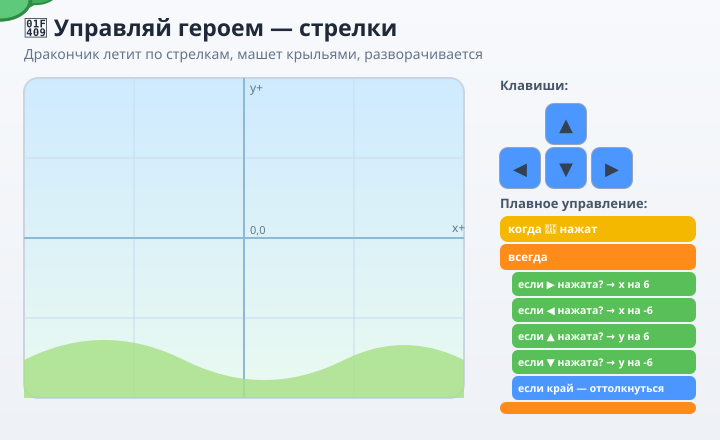
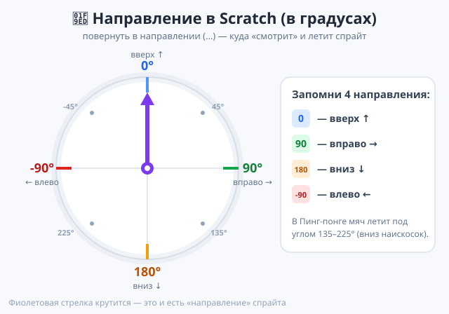
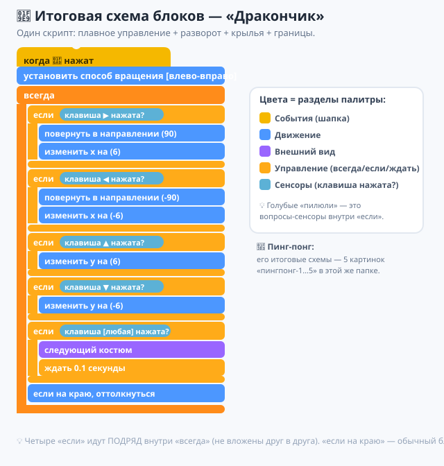
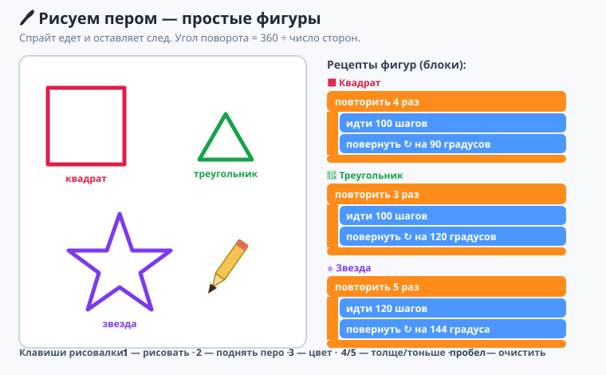
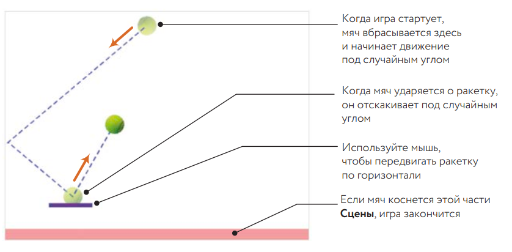
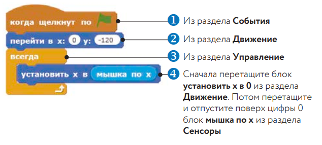
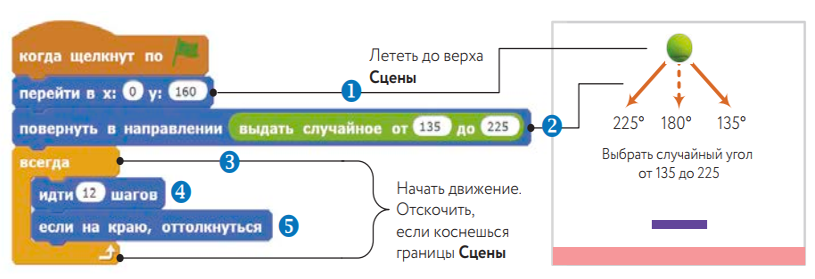
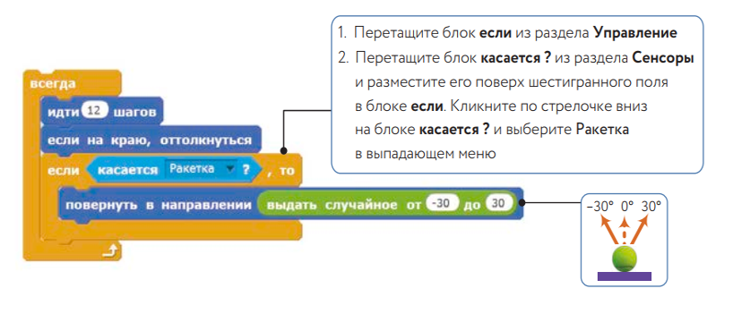
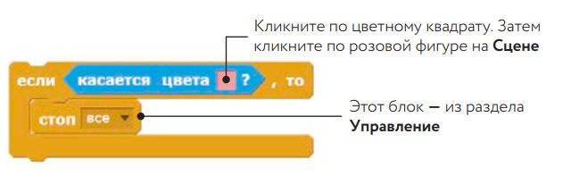

# Урок 2 — «Управляй героем»: движение с клавиатуры 🐉🎮

**Модуль 6 · Игры на Scratch · Урок 2 из 9 | 2 ак.ч. (1,5 часа)**

> 🔁 В начале — [разминка/повтор](повторение.md) урока 1 (5 мин).
> 👨‍🏫 Сценарий с хронометражом — в [преподавателю.md](преподавателю.md).
> 🖼 Что показать на проекторе — в [изображения.md](изображения.md).
> 🎞 **Рендер результата** (двигается) — [`изображения/результат-дракончик.svg`](изображения/результат-дракончик.svg), открой в браузере.
> 🆘 **Пропустил урок или хочешь закрепить?** Открой [самоучитель.md](самоучитель.md) — 16 заданий с убывающими подсказками.

> 🧭 **Как читать урок.** На уроке 1 котик ходил **сам**. Но в **игре** героем управляет **игрок**! Сегодня мы научим персонажа **слушаться клавиш-стрелок**: полетит **летающий дракончик** 🐉 — вверх/вниз/влево/вправо, будет **разворачиваться** в сторону полёта, **махать крыльями** и **не улетать за экран**. Разберём **два способа управления** — простой и «плавный, как в настоящих играх». Каждый шаг — до конкретного блока.

---

## 🎮 Что мы сделаем сегодня и что получим

**Задача:** сделать персонажа, которым **управляет игрок** с клавиатуры: дракончик летает по сцене стрелками, поворачивается в сторону движения, машет крыльями и упирается в границы экрана (не улетает).

**В итоге у тебя получится:** твоя **первая управляемая игра-основа** 🐉 — дракончик, который **летит туда, куда ты жмёшь**. Это «скелет» почти любой игры: дальше на него навесим сбор монет, врагов и очки.

**Главные навыки урока:**
- ⌨️ **События клавиш** — `когда клавиша [→] нажата`.
- 📍 **Координаты `x` и `y`** — что это и как двигать (`изменить x на 10`, `изменить y на 10`).
- 🌊 **Плавное управление** — `всегда` + `если <клавиша нажата?>` (профи-способ).
- ↔️ **Разворот в сторону движения** — способ вращения «влево-вправо».
- 🚧 **Границы экрана** — чтобы герой не улетал.
- 🪽 **Анимация на ходу** — крылья машут (костюмы), только когда летим.
- 🖊 **Перо** — рисуем след: вкл/выкл, цвет и толщина по клавишам + простые фигуры (квадрат, треугольник, звезда).

> 💡 **Главная мысль:** **интерактивность = программа реагирует на игрока.** До сих пор компьютер всё делал сам. Теперь между программой и действием встаёт **игрок и его клавиши** — это и превращает анимацию в **игру**.

**🎞 Вот что должно получиться** (открой в браузере — дракончик летит по стрелкам, машет крыльями, поворачивается):



---

## 🧭 Что такое координаты x и y (важная новая идея!)

Сцена Scratch — это **лист в клеточку с центром посередине**. Место любого спрайта задаётся **двумя числами**:

- **`x`** — положение **по горизонтали** (лево ↔ право). В центре `x = 0`, справа — **плюс** (до `240`), слева — **минус** (до `−240`).
- **`y`** — положение **по вертикали** (низ ↕ верх). В центре `y = 0`, вверх — **плюс** (до `180`), вниз — **минус** (до `−180`).

> 💡 Легко запомнить: **x** — как крестик, лежит поперёк (влево-вправо); **y** — стоит столбиком (вверх-вниз). Внизу слева на сцене всегда показаны текущие `x` и `y` под мышкой.

- **`изменить x на 10`** = сдвинуться **вправо** на 10. **`изменить x на -10`** = влево.
- **`изменить y на 10`** = **вверх** на 10. **`изменить y на -10`** = вниз.
- **`перейти в x: 0 y: 0`** = телепорт **в центр**.

> ⚠️ **Типичная путаница:** думать, что `y на -10` — это «влево». Нет! Минус по `y` — это **вниз**. Лево/право — только через `x`.

---

## Часть 1 — Готовим героя (6 минут)

1. Удали котика (ПКМ по спрайту → «Удалить») — сегодня новый герой.
2. Кнопка **«Выбрать спрайт»** (справа внизу) → в поиске набери **`Dragon`** → выбери дракончика.
   - 👀 У дракона **3 костюма** (разные позы крыльев) — пригодятся для взмахов.
3. Поставь фон: панель «Сцена» → «Выбрать фон» → например **`Blue Sky`** или **`Hills`**.
4. Поставь героя в центр: синяя «Движение» → `перейти в x: 0 y: 0` — кликни один раз.

> 🧩 **Для 5–7:** можно оставить любимого героя из библиотеки — лишь бы у него было 2–3 костюма для анимации.

---

## Часть 2 — Способ 1: простое управление стрелками (14 минут)

Самый понятный способ: **на каждую клавишу — свой скрипт**.

1. Жёлтая «События» → возьми **`когда клавиша [пробел] нажата`**. В выпадающем списке смени `пробел` на **`стрелка вправо`**.
2. Присоедини синий блок **`изменить x на 10`**.
   - Это скрипт: «когда жмут → , двигайся вправо на 10».
3. **Повтори ещё 3 раза** (проще всего — ПКМ по скрипту → «Дублировать», потом поменять клавишу и число):
   - `когда клавиша [стрелка влево] нажата` → `изменить x на -10`
   - `когда клавиша [стрелка вверх] нажата` → `изменить y на 10`
   - `когда клавиша [стрелка вниз] нажата` → `изменить y на -10`
4. Проверь: жми стрелки на клавиатуре.
   - 👀 **Что видишь:** дракончик прыгает в стороны по стрелкам! 🎉

> 💡 **Событие `когда клавиша нажата`** запускает свой скрипт каждый раз при нажатии. Четыре клавиши = четыре маленьких скрипта. Просто и наглядно.

> ⚠️ **Ошибка:** перепутать `x` и `y` или знак. Летит не туда — проверь: право/лево = **`x`** (право +, лево −); верх/низ = **`y`** (верх +, низ −).

> ⚠️ **Ошибка:** движение получается «рывками» и нельзя лететь по диагонали (вправо-вверх сразу). Это минус простого способа — сейчас сделаем лучше.

---

## Часть 3 — Способ 2: плавное управление (профи-способ) (14 минут)

В настоящих играх герой едет **плавно** и можно жать **две клавиши сразу** (по диагонали). Секрет — **опрос клавиш в цикле `всегда`**.

1. **Убери** (утащи в палитру) четыре скрипта из Части 2 — заменим одним умным.
2. Собери новый скрипт:
   - Жёлтая «События» → `когда нажат 🚩 флажок`.
   - Оранжевая «Управление» → `всегда`.
   - **Внутрь `всегда`** положи **четыре** блока `если <> то`:
3. В каждый `если` вставь **сенсор** `клавиша [ ] нажата?` (салатовая «Сенсоры», овальный блок — он входит в шестиугольник условия), и внутрь — движение:

```
когда нажат 🚩 флажок
всегда
    если <клавиша [стрелка вправо] нажата?> то
        изменить x на 6
    если <клавиша [стрелка влево] нажата?> то
        изменить x на -6
    если <клавиша [стрелка вверх] нажата?> то
        изменить y на 6
    если <клавиша [стрелка вниз] нажата?> то
        изменить y на -6
```

4. Жми флажок 🚩 и лети стрелками.
   - 👀 **Что видишь:** дракончик летит **плавно** и слушается **двух клавиш сразу** (вправо-вверх = по диагонали)! Совсем другое ощущение. 🐉💨

> 💡 **Почему плавнее:** цикл `всегда` **много раз в секунду** проверяет: «клавиша зажата? — двигай». Пока держишь — движение непрерывное. Несколько `если` проверяются одновременно → работают сразу несколько клавиш.

> 💡 **Скорость** героя = число в `изменить x/y`. Больше число — быстрее. Найди комфортное (5–8).

> ⚠️ **Ошибка:** вставить сенсор `клавиша нажата?` в **шестиугольник** не удалось — он «не влезает». Убедись, что тянешь именно **овальный** сенсор в **шестиугольное** окошко блока `если`.

---

## Часть 4 — Разворот в сторону полёта (10 минут)

Пусть дракончик **смотрит туда, куда летит** (вправо — мордой вправо, влево — влево).

1. В начало скрипта (под флажок) добавь синий `установить способ вращения [влево-вправо]`.
2. В блок **вправо** добавь фиолетовую «Внешность»? Нет — направление это «Движение»: добавь `повернуться в направлении (90)` в ветку «вправо» и `повернуться в направлении (-90)` в ветку «влево».

```
если <клавиша [стрелка вправо] нажата?> то
    повернуться в направлении (90)
    изменить x на 6
если <клавиша [стрелка влево] нажата?> то
    повернуться в направлении (-90)
    изменить x на -6
```

3. Жми флажок и лети влево-вправо.
   - 👀 **Что видишь:** дракончик **разворачивается** мордой по направлению полёта, а не летит «задом наперёд».

> 💡 **`направление 90`** = вправо, **`-90`** (или 270) = влево, **`0`** = вверх, **`180`** = вниз. Способ вращения «влево-вправо» не даёт дракону перевернуться вверх ногами.

**🧭 Направление в Scratch измеряется в градусах** — как компас. Вот «шкала направлений», по ней легко запомнить, какое число куда смотрит (эти же углы нам понадобятся для полёта мяча в Пинг-понге):



> 💡 **Полный круг = 360°.** Диагонали: `45°` — вправо-вверх, `135°` — вправо-вниз, `-45°` — влево-вверх, `225°` (то же, что `-135°`) — влево-вниз. Отрицательные и «большие» числа Scratch понимает одинаково: `-90` = `270`.

> ⚠️ **Ошибка:** без способа вращения дракон при полёте влево **переворачивается вверх ногами**. Тот же приём, что с котиком на уроке 1.

---

## Часть 5 — Крылья машут только в полёте (10 минут)

Оживим: пусть дракончик **машет крыльями**, когда летит, и **замирает**, когда стоит.

1. Добавь **ещё один** `если` внутри `всегда` — общий «летим ли мы вообще»:
   - Сенсор `клавиша [любая] нажата?` (в списке клавиш есть пункт **«любая»**).
   - Внутрь: фиолетовая «Внешность» → `следующий костюм` + оранжевая «Управление» → `ждать 0.1 секунды`.

```
если <клавиша [любая] нажата?> то
    следующий костюм
    ждать 0.1 секунды
```

2. Жми флажок, полетай и отпусти клавиши.
   - 👀 **Что видишь:** крылья машут **только в полёте**, на месте дракон спокоен.

> 💡 Так анимация «привязана» к действию — приём, который делает игры живыми (бежит — ноги двигаются, стоит — стоит).

---

## Часть 6 — Чтобы не улетал за экран (8 минут)

Сейчас героя можно «увести» за край и потерять. Удержим его на сцене.

**Простой способ (для всех):** синяя «Движение» → добавь в самый низ `всегда` блок `если на краю, оттолкнуться`. Дракон будет «отбиваться» от края — за экран не денется.

> 🎓 **Способ поточнее (9–11):** вместо отталкивания — «стенки»:
> ```
> если <(x) > (230)> то  →  установить x в 230
> если <(x) < (-230)> то  →  установить x в -230
> ```
> (и то же для `y` с 170/−170). Тогда герой мягко «упирается» в невидимую рамку.

> ⚠️ **Ошибка:** забыть про границы — герой улетает в бесконечность, и его «не найти». Всегда ограничивай игровое поле.

---

## 🧩 Итоговая схема блоков — дракончик (проверь себя)

Собрал всё? Сверься с итоговой схемой **одного скрипта** дракончика. Четыре `если` идут **подряд** внутри `всегда` (не вложены друг в друга):



---

## Часть 7 — 🖊 Рисуем пером: след, цвет, толщина (14 минут)

Раз герой умеет двигаться — пусть он **оставляет след**, как фломастер! Сделаем **«Рисовалку»**: спрайт едет по стрелкам и рисует, а другими клавишами мы **включаем/выключаем перо, меняем цвет и толщину**.

### Шаг 1. Подключаем «Перо»
Перо — это **расширение**. Внизу слева нажми кнопку **«Добавить расширение»** (значок с кубиком) → выбери **«Перо»**.
   - 👀 **Что видишь:** в палитре появилась новая **тёмно-зелёная категория «Перо»**.

### Шаг 2. Готовим спрайт-карандаш
1. Возьми спрайт **`Pencil`** (карандаш) или любой с острым кончиком, поставь в центр (`перейти в x:0 y:0`).
2. Оставь у него **плавное управление стрелками** (тот же скрипт, что у дракончика: `всегда` + четыре `если <клавиша нажата?>`). Так карандаш поедет — и будет чертить.

### Шаг 3. Команды пера (по клавишам)
Собери **отдельные маленькие скрипты** — по одному на клавишу:

| Клавиша | Скрипт | Что делает |
|---------|--------|-----------|
| `1` | `когда клавиша [1] нажата` → `опустить перо` | **включить** рисование (перо касается сцены) |
| `2` | `когда клавиша [2] нажата` → `поднять перо` | **выключить** рисование (едет без следа) |
| `3` | `когда клавиша [3] нажата` → `изменить цвет пера на (25)` | сменить **цвет** |
| `4` | `когда клавиша [4] нажата` → `изменить размер пера на (2)` | сделать линию **толще** |
| `5` | `когда клавиша [5] нажата` → `изменить размер пера на (-2)` | сделать линию **тоньше** |
| `пробел` | `когда клавиша [пробел] нажата` → `очистить` | **стереть** весь рисунок |

Проверь: нажми `1` (перо вниз) и порули стрелками — карандаш чертит! Жми `3` — цвет меняется, `4`/`5` — толщина, `2` — перестал рисовать, `пробел` — чистый лист.

> 💡 **Перо «привязано» к спрайту:** куда едет спрайт — там и линия. `опустить перо` = «прижать фломастер к листу», `поднять перо` = «оторвать».

> ⚠️ **Ошибка:** нарисовал, а стереть не можешь. **`очистить`** (по `пробел`) убирает всё пером нарисованное. А сам спрайт `очистить` не трогает.

> ⚠️ **Ошибка:** перо всегда «включено», и линия тянется, даже когда не надо. Не забывай `поднять перо` (`2`), чтобы переместиться **без следа**.

### Шаг 4. 📐 Простейшие фигуры для разбора
Рисовать от руки — весело, но пером можно чертить **точные фигуры**. Секрет — **повторять** одно и то же действие. Возьми блок **`повторить N раз`** (оранжевая «Управление») — он делает вложенные команды несколько раз подряд.

Собери отдельный скрипт (запуск, например, по клавише `к`): сначала `очистить` и `опустить перо`, а потом — **рецепт фигуры**:



- **Квадрат:** `повторить 4` → `идти 100 шагов` + `повернуть ↻ на 90 градусов`.
- **Треугольник:** `повторить 3` → `идти 100` + `повернуть ↻ на 120`.
- **Звезда:** `повторить 5` → `идти 120` + `повернуть ↻ на 144`.

> 💡 **Главное правило многоугольника:** угол поворота = **360 ÷ число сторон**. Для квадрата 360÷4 = 90°, для треугольника 360÷3 = 120°. Звезда — особый случай (144°). Поменяй число повторов и угол — получишь пяти-, шести-, восьмиугольник!

> 🧩 **Для 5–7:** хватит **рисовалки от руки** (Шаги 1–3) и **квадрата** по рецепту. Треугольник/звезда — по желанию.

> 🎓 **Для 9–11:** блок `повторить` — это **цикл** (подробно на уроке 3). Попробуй нарисовать фигуру из **8** сторон (угол 45°) или «раскрасить» её: перед рисованием добавь `установить цвет пера`.

---

## 🎁 Доп-проект (по желанию) — игра «Пинг-понг» 🏓

Раз мы освоили управление и направления — соберём **целую игру Пинг-понг** (её очень любят ребята!). Управлять ракеткой будем **мышкой**, а мяч будет летать под углами — теми самыми, что мы разобрали на «шкале направлений». Собирай по картинкам — на них подписан **каждый блок и из какого он раздела**.

**Как устроена игра:** мяч вбрасывается сверху под случайным углом, отскакивает от стен и от ракетки, а игрок мышкой двигает ракетку внизу. Если мяч упадёт на **нижнюю (розовую) полоску** — игра заканчивается.



### Шаг 1. Ракетка едет за мышкой 🏓
Сделай спрайт-ракетку (нарисуй прямоугольник или возьми `Paddle`) и собери скрипт. Ракетка держится внизу (`y: -120`) и **повторяет движение мыши по горизонтали** (`установить x в (мышка по x)`).



### Шаг 2. Запускаем мяч под случайным углом ⬇️
Добавь спрайт-мяч (`Ball`). Он появляется сверху (`y: 160`), поворачивается в **случайном направлении вниз** (`от 135 до 225`) и летит, отскакивая от краёв.



### Шаг 3. Отскок от ракетки 🎯
Внутрь `всегда` мяча добавь условие: **если мяч касается ракетки** — пусть отскочит вверх под случайным углом (`от -30 до 30`).



### Шаг 4. Конец игры 🛑
Если мяч коснётся **нижней розовой полоски** (цвета) — игра останавливается.



🏆 Готово — рабочая игра **Пинг-понг**! Здесь встретились наши темы: **управление** (мышь), **направление в градусах**, **случайные углы**, а ещё **касание** и **условия** — их мы подробно разберём на **уроке 3**. Так что если что-то непонятно — просто повтори по картинкам, а на следующем уроке всё «щёлкнет».

> 💡 **Хочешь ракетку на клавишах, а не мышью?** Замени `установить x в (мышка по x)` на два `если <клавиша нажата?>` (вправо/влево) + `если на краю оттолкнуться` — как мы делали с дракончиком.

---

## ✅ Как правильно / ❌ Как НЕ надо (управление)

| ❌ Как НЕ надо | ✅ Как правильно |
|----------------|------------------|
| Путать `x` и `y` | Право/лево = **x**, верх/низ = **y** |
| `y на -10` считать «влево» | Минус по **y** = **вниз** |
| Оставить только 4 скрипта-клавиши | Плавно = `всегда` + `если <клавиша нажата?>` |
| Забыть способ вращения | «влево-вправо» — герой не кувыркается |
| Крылья машут всегда | Анимация **только** когда жмём клавишу |
| Не ограничить поле | `если на краю оттолкнуться` / стенки по x,y |
| Сенсор не входит в «если» | Тяни **овальный** сенсор в **шестиугольник** |
| Перо чертит всё время | `поднять перо` при переезде; `очистить` — стереть |
| Угол фигуры «на глаз» | Угол = **360 ÷ число сторон** (квадрат — 90°) |

> ⚠️ Главные ошибки урока: **путаница x/y** и **герой улетает за экран**. Проверь эти два места, если что-то не так.

---

## 🎓 Часть 8 — Для 9–11: глубже (по времени)

- **Скорость-переменная:** заведи переменную `скорость` и двигай `изменить x на (скорость)` — сможешь менять темп в одном месте (это подводка к уроку 4).
- **Инерция:** держи «скорость» в переменной, каждый кадр чуть уменьшай — герой будет плавно тормозить (как в космосе).
- **Мышь вместо клавиш:** `всегда → плыть 0.3 сек в точку (x мыши) (y мыши)` — герой следует за курсором.
- **Ускорение по кнопке:** при зажатом `пробел` герой летит быстрее (добавь `если <клавиша [пробел] нажата?>` и увеличь шаг).

---

## 🧩 Для 5–7 классов (проще)

- Достаточно **Способа 1** (4 скрипта-стрелки) — он самый понятный.
- Способ 2 (плавный) показывает учитель на проекторе; кто хочет — повторяет.
- Обязательно: способ вращения (не кувыркаться) и `если на краю оттолкнуться` (не улетать).
- Крылья и Пинг-понг — по желанию/по времени.

---

## 🏁 Итог урока (5 минут)

Сегодня ты сделал **управляемого героя** — основу любой игры:

- ✅ **Координаты `x`/`y`** — как задаётся место на сцене.
- ✅ **Управление стрелками** — простое (4 скрипта) и **плавное** (`всегда` + `если <клавиша нажата?>`).
- ✅ **Разворот** в сторону движения (способ вращения + направление).
- ✅ **Анимация в движении** — крылья машут только в полёте.
- ✅ **Границы экрана** — герой не улетает.
- ✅ 🧭 **Направление в градусах** (0/90/180/-90) — куда «смотрит» спрайт.
- ✅ 🖊 **Перо** — след, цвет и толщина по клавишам; фигуры (квадрат/треугольник/звезда) через `повторить`.
- ✅ 🎁 Собрал целую игру **Пинг-понг** по картинкам (мышь, углы, отскок).

> 🏆 Теперь между программой и действием стоит **игрок** — это и есть игра! Дальше — **урок 3 «Лабиринт»**: разберём **условия** и **касание** (не касайся стен!) — те самые, что уже встретились в Пинг-понге.

> 🎤 **Блиц:** что такое `x` и `y`? как двигаться вправо? вниз? почему плавное управление лучше 4 скриптов? как не дать герою улететь за экран? что делают `опустить`/`поднять перо`? какой угол поворота нужен для квадрата и почему?

### 🎮 Викторина-закрепление

Открой **[викторина.html](викторина.html)** — вопросы про координаты, клавиши, плавное управление + смешные и «на подумать».

➡️ **Самостоятельная работа** (свой управляемый герой + комбо) — в [практике](практика.md).
🆘 **Пропустил / хочешь потренироваться?** — [самоучитель.md](самоучитель.md): 16 заданий с убывающими подсказками.
🧰 **Трюки урока** (дублирование скриптов, «любая» клавиша, поле по x/y) — в [лайфхак.md](лайфхак.md).

---

## 🔗 Материалы и ссылки к уроку

**🧰 Инструмент:** Scratch — [онлайн](https://scratch.mit.edu/projects/editor/) или [Scratch Desktop](https://scratch.mit.edu/download), русский интерфейс.

**📥 Материалы:**
- 🐉 Спрайт `Dragon`, карандаш `Pencil`, ракетка `Paddle`, мяч `Ball` и фоны — встроены в Scratch.
- 🖊 **Перо** — расширение: кнопка «Добавить расширение» (внизу слева) → «Перо». Скачивать ничего не нужно.
- 🏓 Пинг-понг: собираем вместе по картинкам прямо в уроке (доп-проект).

**🎬 Вдохновение:** на scratch.mit.edu поиск — *arrow keys control*, *smooth movement scratch*, *pen art scratch*.

**⚙️ Учителю:** показать координаты (двигать спрайт мышкой, следить за x/y внизу сцены); объяснить разницу «4 скрипта» vs «всегда+если»; частые ошибки и хронометраж — в [преподавателю.md](преподавателю.md).
