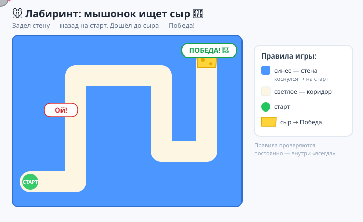
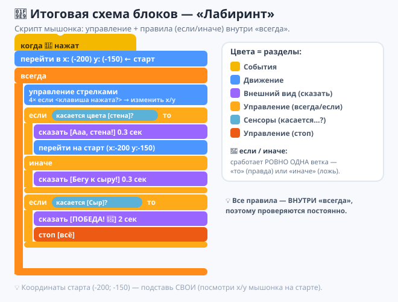
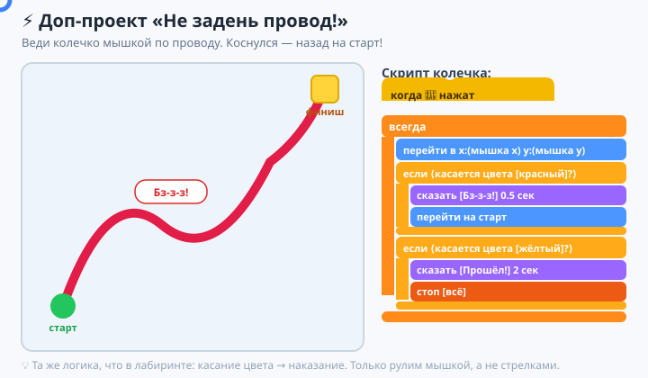

# Урок 3 — «Лабиринт: мышонок ищет сыр» 🐭🧀

**Модуль 6 · Игры на Scratch · Урок 3 из 9 | 2 ак.ч. (1,5 часа)**

> 🔁 В начале — [разминка/повтор](повторение.md) урока 2 (5 мин).
> 👨‍🏫 Сценарий с хронометражом — в [преподавателю.md](преподавателю.md).
> 🖼 Что показать на проекторе — в [изображения.md](изображения.md).
> 🎞 **Рендер результата** (двигается) — [`изображения/результат-лабиринт.svg`](изображения/результат-лабиринт.svg).
> 🆘 **Пропустил урок или хочешь закрепить?** Открой [самоучитель.md](самоучитель.md) — 18 заданий с убывающими подсказками.

> 🧭 **Как читать урок.** На уроке 2 герой уже слушался клавиш. Но пока ему всё **можно** — ходи где хочешь. В настоящей игре есть **правила**: сюда нельзя, тут стена, вот это — победа. Сегодня научим программу **принимать решения** — блок **`если`** и **`если/иначе`**, а ещё **чувствовать касание** (`касается цвета`). Соберём игру **«Мышонок ищет сыр»** 🐭🧀: мышонок бежит по лабиринту к сыру, но **коснулся стены — вернулся на старт**. Каждый шаг — до конкретного блока.

---

## 🎮 Что мы сделаем сегодня и что получим

**Задача:** сделать **лабиринт с правилами**. Мышонок управляется стрелками; если он **коснётся стены** — его отбрасывает **на старт**; если добежит до **сыра** — **Победа!** 🧀

**В итоге у тебя получится:** настоящая **игра-лабиринт** с проигрышем и победой — первая игра, где есть **правила и цель**, а не просто движение.

**Главные навыки урока:**
- ❓ **Условие `если`** — «если случилось ВОТ ЭТО — сделай…».
- 🔀 **`если/иначе`** — две дороги: «если да — одно, иначе — другое».
- 🎨 **`касается цвета?`** — как спрайт «чувствует» стену по цвету.
- 🏁 **Возврат на старт** — наказание за касание стены.
- 🧀 **Условие победы** — дошёл до сыра → «Победа», `стоп`.
- 🔁 **Главный цикл `всегда`** — правила проверяются **постоянно**.

> 💡 **Главная мысль:** **программа умеет выбирать.** До сих пор команды шли подряд, всегда одинаково. Блок `если` — это **развилка**: программа смотрит на условие (правда или нет?) и **решает**, что делать. Именно решения превращают набор команд в **игру с правилами**.

**🎞 Вот что должно получиться** (мышонок едет по лабиринту, задел стену — назад на старт, дошёл до сыра — Победа):



---

## 🧠 Новая идея: условие (правда или неправда?)

Компьютер умеет отвечать на вопросы **«да/нет»** (правда/ложь). Такие вопросы — это **сенсоры** (мы уже видели `клавиша нажата?`). Например:

- `касается цвета [синий]?` → **да**, если спрайт коснулся синего; иначе **нет**.
- `касается [Сыр]?` → **да**, если дотронулся до спрайта «Сыр».

Блок **`если ⟨вопрос⟩ то …`** выполняет вложенные команды **только если ответ «да»**. А **`если ⟨вопрос⟩ то … иначе …`** — выбирает **одну из двух** дорог.

> 💡 Условие — как охранник у двери: **«пропуск есть? — проходи; нет — стой»**. Программа задаёт вопрос и действует по ответу.

---

## Часть 1 — Рисуем лабиринт (10 минут)

Лабиринт — это **фон** со стенками **одного цвета**.

1. Панель **«Сцена»** (справа внизу) → **«Рисовать»** (кисточка) — откроется редактор фона.
2. Возьми инструмент **«Прямоугольник»**, выбери **яркий цвет стен** (например, **синий**) и нарисуй **стены-коридоры**. Оставь **проход** от угла (старт) до центра.
3. Другим цветом (например, **зелёным**) отметь маленький **квадрат-старт** в углу.
   - 👀 **Что видишь:** на сцене — лабиринт из синих стен с проходами.

> 💡 **Важно:** стены — **строго один цвет** (весь синий одинаковый). Если оттенки разные, `касается цвета` будет ловить не всё. Бери цвет **из палитры**, не рисуй «на глаз» поверх.

> ⚠️ **Ошибка:** нарисовать проходы **слишком узкими** — мышонок «толстый» и застрянет. Делай коридоры **шире спрайта** в 2–3 раза.

> 🧩 **Для 5–7:** учитель даёт **готовый фон-лабиринт** (загрузить в «Выбрать фон» или раздать файл), дети сразу программируют мышонка.

---

## Часть 2 — Мышонок и управление (10 минут)

1. **«Выбрать спрайт»** → найди **`Mouse1`** (мышонок). Он крупный — уменьши: поле **«Размер»** поставь **~40**.
2. Поставь мышонка на **старт** (перетащи в угол на зелёный квадрат).
3. Дай ему **управление стрелками** — плавное, как на уроке 2:

```
когда нажат 🚩 флажок
всегда
    если <клавиша [стрелка вправо] нажата?> то → изменить x на 4
    если <клавиша [стрелка влево] нажата?> то → изменить x на -4
    если <клавиша [стрелка вверх] нажата?> то → изменить y на 4
    если <клавиша [стрелка вниз] нажата?> то → изменить y на -4
```

4. Жми флажок — мышонок едет по лабиринту.
   - 👀 Пока он **проходит сквозь стены** — это починим правилом.

> 💡 **Скорость поменьше** (4, не 8): в лабиринте нужна точность, иначе «проскочишь» стену насквозь между кадрами.

---

## Часть 3 — `касается цвета?`: мышонок чувствует стену (10 минут)

1. Салатовая категория **«Сенсоры»** → возьми блок **`касается цвета [ ]?`**.
2. **Кликни по цветному квадратику** внутри блока → откроется палитра. Внизу есть **пипетка** 🎨 — нажми её и **кликни прямо по стене на сцене**. Блок «запомнит» **точный цвет стены**.
   - 👀 Квадратик в блоке стал **цвета стены**.

> 💡 **Пипетка — самый точный способ.** Не подбирай цвет ползунками «похоже» — возьми его **прямо со сцены**, тогда касание сработает точно (так же выбирают цвет в Пинг-понге для «дна»).

> ⚠️ **Ошибка:** выбрать цвет «на глазок» ползунками — оттенок не совпадёт, и мышонок будет «проходить» стены. Только **пипеткой со сцены**.

---

## Часть 4 — `если`: коснулся стены → на старт (12 минут)

Теперь **правило**: задел стену — вернись на старт.

1. Запомни координаты старта: поставь мышонка на старт, посмотри его **`x` и `y`** (внизу сцены). Пусть это, например, `x: -200, y: -150`.
2. В скрипт мышонка, **внутрь `всегда`** (после управления), добавь оранжевый **`если ⟨⟩ то`**.
3. В шестиугольник вставь **`касается цвета [стена]?`**, а внутрь `если`:
   - `перейти в x: -200 y: -150` (твои координаты старта),
   - `сказать [Ой! Назад!] в течение 0.5 секунды`.

```
если <касается цвета [синий]?> то
    перейти в x: (-200) y: (-150)
    сказать [Ой! Назад!] 0.5 сек
```

4. Жми флажок и веди мышонка. Задел стену — **бах, на старт!** 🐭💨

> 💡 **`если` без «иначе»** = «сделай это **только когда** правда». Правда (коснулся) — выполнили; неправда — пропустили и поехали дальше.

> ⚠️ **Ошибка:** положить `если` **под** `всегда`, а не внутрь. Тогда проверка случится один раз. Правило должно быть **внутри** главного цикла — проверяться постоянно.

> 🧩 **Полегче (для 5–7):** вместо «на старт» сделай `идти -10 шагов` (мышонок просто **отскочит** от стены и не пройдёт сквозь). Менее строго, но проще.

---

## Часть 5 — `если/иначе`: две дороги (10 минут)

Иногда нужно выбрать **одно из двух**. Для этого есть **`если ⟨⟩ то … иначе …`** — у него **две «пасти»**: верхняя (если правда) и нижняя (иначе).

Сделаем мышонку **«детектор»**: на дорожке — спокоен, у стены — паникует.

```
если <касается цвета [синий]?> то
    сказать [Ааа, стена!] 0.3 сек
    перейти в x: (-200) y: (-150)
иначе
    сказать [Бегу к сыру!] 0.3 сек
```

- 👀 **Что видишь:** пока мышонок в коридоре — говорит «Бегу к сыру!», коснулся стены — «Ааа, стена!» и назад.

> 💡 **`если/иначе` — это развилка на две дороги.** Всегда выполнится **ровно одна** ветка: либо «то», либо «иначе». Это отличается от двух отдельных `если` (там могут сработать оба).

> ⚠️ **Ошибка:** ждать, что выполнятся **обе** ветки. Нет — только **одна**: правда → верхняя, ложь → нижняя.

---

## Часть 6 — 🧀 Победа: дошёл до сыра (10 минут)

Добавим **цель** и **условие победы**.

1. **«Выбрать спрайт»** → **`Cheese`** (сыр). Поставь его в **конец** лабиринта (в центр/дальний угол).
2. Вернись к скрипту **мышонка**, добавь **внутрь `всегда`** ещё один `если`:

```
если <касается [Сыр]?> то
    сказать [ПОБЕДА! 🧀] 2 сек
    стоп [всё]
```

3. Жми флажок и проведи мышонка через весь лабиринт к сыру.
   - 👀 **Что видишь:** дотронулся до сыра — **«ПОБЕДА!»** и игра останавливается. 🎉

> 💡 `касается [Сыр]?` (спрайта) — удобно для «призов» и «врагов»: `касается цвета` — для стен/зон, `касается спрайта` — для предметов.

> ⚠️ **Ошибка:** блок `стоп [всё]` поставить в управление — игра застынет сразу. Он нужен **только** внутри условия победы.

---

## 🧩 Итоговая схема блоков — лабиринт (проверь себя)

Вот как выглядит **весь скрипт мышонка**: управление + три правила (стена, детектор, сыр) внутри одного `всегда`:



---

## 🎁 Доп-проект (по желанию, делаем вместе) — «Не задень провод!» ⚡

Классическая игра на ловкость и **те же условия** (`касается цвета` + `если`), но в другом виде. Нужно провести **колечко по извилистому проводу**, не коснувшись его.

**Как устроено:**
1. **Фон:** нарисуй толстый **извилистый провод** одним ярким цветом (например, **красный**) от «Старт» до «Финиш». Рядом — зелёный старт и жёлтый финиш.
2. **Спрайт-колечко:** маленький кружок с дыркой (нарисуй или возьми `Ring`). Управляется мышкой: `всегда → перейти в x:(мышка по x) y:(мышка по y)`.
3. **Правило проигрыша:** `если <касается цвета [красный провод]?> то → сказать [Бз-з-з!] → перейти на старт`.
4. **Правило победы:** `если <касается цвета [жёлтый финиш]?> то → сказать [Прошёл!] → стоп всё`.



🏆 Та же логика, что в лабиринте (касание цвета → наказание), но управление **мышкой** и «нерв» игры сильнее. Отличная тренировка условий!

---

## ✅ Как правильно / ❌ Как НЕ надо (условия и лабиринт)

| ❌ Как НЕ надо | ✅ Как правильно |
|----------------|------------------|
| Цвет стены «на глаз» ползунками | Взять **пипеткой** прямо со сцены |
| Стены разных оттенков | Стены — **строго один** цвет |
| `если` под `всегда` (снаружи) | Правило — **внутри** `всегда` (проверяется постоянно) |
| Узкие коридоры | Коридор в 2–3 раза **шире** спрайта |
| Ждать, что сработают **обе** ветки `если/иначе` | Срабатывает **ровно одна** |
| Большая скорость в лабиринте | Скорость **поменьше** (проскок сквозь стену) |
| `стоп всё` в управлении | `стоп всё` — **только** в победе |

> ⚠️ Главные ошибки урока: **цвет не пипеткой** (стены не ловятся) и **`если` снаружи `всегда`**. Проверь их, если правила «не работают».

---

## 🎓 Часть 7 — Для 9–11: глубже (по времени)

- **Таймер:** `сброс таймера` в начале, а победа — «Прошёл за (таймер) сек». Кто быстрее?
- **Враг-патруль:** второй спрайт (кот) ездит туда-сюда; `если <касается [Кот]?> то → на старт`.
- **Уровни:** дошёл до сыра → `следующий фон` (новый лабиринт) вместо `стоп`.
- **Счётчик попыток:** каждый «на старт» добавляет +1 к переменной «врезался» (подводка к уроку 4).

---

## 🧩 Для 5–7 классов (проще)

- Фон-лабиринт даёт учитель; коридоры широкие.
- Одно правило: `если касается стены → идти -10 шагов` (отскок) — этого достаточно.
- Победа: `если касается [Сыр] → сказать «Ура!»`.
- `если/иначе` показывает учитель; повторяют по желанию.

---

## 🏁 Итог урока (5 минут)

Сегодня ты научил программу **принимать решения** и собрал игру с правилами:

- ✅ **Условие `если`** — действие только когда «правда».
- ✅ **`если/иначе`** — развилка на две дороги (сработает одна).
- ✅ **`касается цвета?`** (пипетка со сцены) и **`касается спрайта?`**.
- ✅ **Правило стены** — коснулся → на старт.
- ✅ **Условие победы** — дошёл до сыра → «Победа», `стоп`.
- ✅ Правила живут **внутри `всегда`** — проверяются постоянно.

> 🏆 Твоя игра теперь умеет **проигрывать и выигрывать** — это уже настоящая игра! Дальше — **урок 4 «Собери монетки»**: заведём **переменную-счёт** и будем считать очки.

> 🎤 **Блиц:** что делает блок `если`? чем `если/иначе` отличается от двух `если`? как выбрать точный цвет стены? почему правило должно быть внутри `всегда`? как сделать условие победы?

### 🎮 Викторина-закрепление

Открой **[викторина.html](викторина.html)** — вопросы про условия, касание, лабиринт + смешные и «на подумать».

➡️ **Самостоятельная работа** (свой лабиринт + комбо) — в [практике](практика.md).
🆘 **Пропустил / хочешь потренироваться?** — [самоучитель.md](самоучитель.md): 18 заданий с убывающими подсказками.
🧰 **Трюки урока** (пипетка, координаты старта, порядок правил) — в [лайфхак.md](лайфхак.md).

---

## 🔗 Материалы и ссылки к уроку

**🧰 Инструмент:** Scratch — [онлайн](https://scratch.mit.edu/projects/editor/) или [Scratch Desktop](https://scratch.mit.edu/download), русский интерфейс.

**📥 Материалы:**
- 🐭 Спрайты `Mouse1`, `Cheese`, `Ring` и фоны — встроены в Scratch; лабиринт рисуем сами в редакторе фона.
- 🎨 Для 5–7 — готовый фон-лабиринт заранее готовит учитель.

**🎬 Вдохновение:** на scratch.mit.edu поиск — *maze game scratch*, *touching color scratch*.

**⚙️ Учителю:** показать пипетку (выбор цвета со сцены), разницу `если` vs `если/иначе`, «правило внутри всегда»; частые ошибки и хронометраж — в [преподавателю.md](преподавателю.md).
