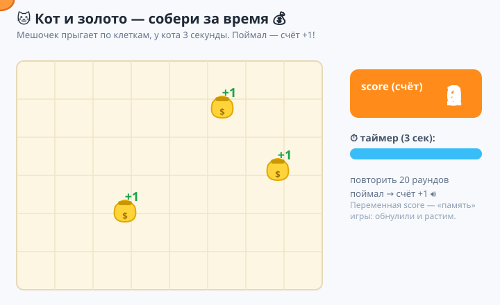
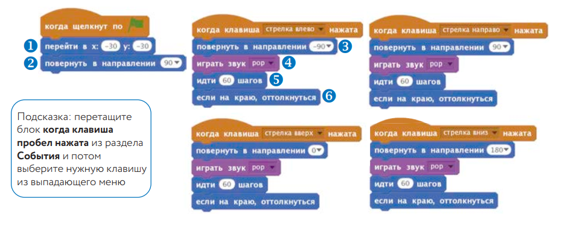
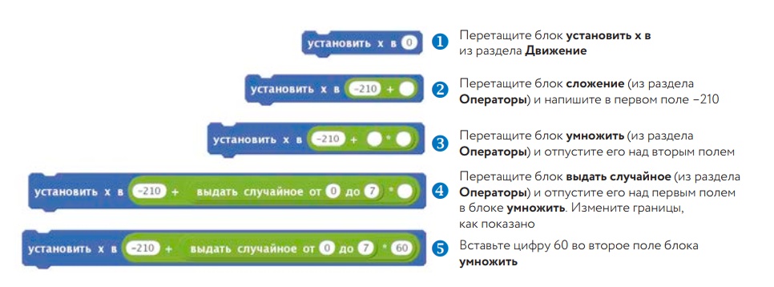
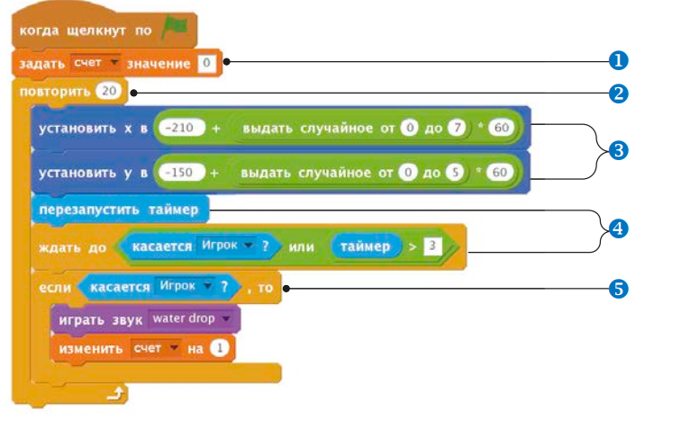
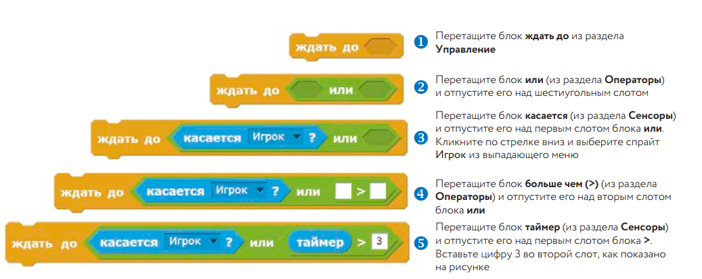
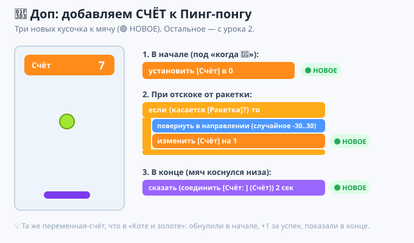

# Урок 4 — «Кот и золото»: собери мешочки за время 🐱💰

**Модуль 6 · Игры на Scratch · Урок 4 из 9 | 2 ак.ч. (1,5 часа)**

> 🔁 В начале — [разминка/повтор](повторение.md) урока 3 (5 мин).
> 👨‍🏫 Сценарий с хронометражом — в [преподавателю.md](преподавателю.md).
> 🖼 Что показать на проекторе — в [изображения.md](изображения.md).
> 🎞 **Рендер результата** (двигается) — [`изображения/результат-золото.svg`](изображения/результат-золото.svg).
> 📦 **Стартовый файл** — [`материалы/Money_NoCode.sb2`](материалы/Money_NoCode.sb2) (кот, мешочек, поле и переменная уже внутри — код добавляем сами).
> 🆘 **Пропустил урок или хочешь закрепить?** Открой [самоучитель.md](самоучитель.md) — 18 заданий с убывающими подсказками.

> 🧭 **Как читать урок.** У наших игр уже есть правила (урок 3), но пока нет **счёта** — а без очков азарта мало! Сегодня заведём **переменную** — «ячейку памяти» для числа, и сделаем игру **«Кот и золото»** 🐱💰: по полю появляется **мешочек**, у кота есть **3 секунды**, чтобы добежать; поймал — **+1 очко**. И так **20 раундов**. Начинаем **не с нуля**, а с готовой заготовки-поля. Каждый шаг — до конкретного блока.

---

## 🎮 Что мы сделаем сегодня и что получим

**Задача:** сделать **аркаду на время со счётом**. По игровому полю (сетка) в случайных местах появляется **мешочек золота**; кот-игрок бегает стрелками и **ловит** его, пока не вышли **3 секунды**. За каждый пойманный мешочек — **+1 к счёту**. Всего 20 попыток — набери максимум!

**В итоге у тебя получится:** первая игра с **очками и таймером** — с ней уже можно **соревноваться**: «а я набил 15!». Настоящий игровой азарт.

**Главные навыки урока:**
- 🔢 **Переменная** — «коробочка» для числа (наш **счёт**): создать, `установить в 0`, `изменить на 1`.
- 🎲 **Операторы** — `выдать случайное`, сложение и умножение → мешочек в **случайной клетке**.
- ⏱ **Таймер** — `сбросить таймер`, `таймер`, `ждать до ⟨…⟩` — даём **3 секунды** на раунд.
- 🔁 **`повторить 20`** — 20 раундов подряд.
- 🎯 **`касается [Игрок]?`** (из урока 3) — поймал ли кот мешочек.

> 💡 **Главная мысль:** **переменная — это память программы.** Раньше игра ничего не «помнила» между действиями. Теперь у неё есть **счёт**, который растёт, — и появляется цель, результат, рекорд. Числа, которые меняются по ходу игры (очки, жизни, время, уровень) — это всё **переменные**.

**🎞 Вот что должно получиться** (мешочек прыгает по полю, кот ловит, счёт растёт, идёт отсчёт):



---

## 🧠 Новая идея: переменная (коробочка для числа)

**Переменная** — это **ячейка памяти с именем**, куда можно положить число и потом менять его.

- Представь **коробочку с подписью «счёт»**. Сейчас в ней `0`. Поймал мешочек — **кладём +1**, стало `1`, потом `2`, `3`…
- Значение **видно на сцене** (табло со счётом) и его можно проверять в условиях («если счёт = 20 — победа»).

Главные блоки (фиолетово-оранжевая категория **«Переменные»**):
- **`установить [счёт] в 0`** — положить в коробочку число (обнулить в начале).
- **`изменить [счёт] на 1`** — прибавить (или `-1` — отнять).
- Галочка у переменной в палитре — **показать/скрыть табло** на сцене.

> 💡 Имя переменной — как подпись на коробке. `счёт`, `жизни`, `время`, `уровень` — у каждой своё число.

---

## Часть 1 — Открываем заготовку (6 минут)

Чтобы не тратить время на рисование поля, начинаем с **готового файла**.

1. **`Файл → Загрузить из компьютера`** → выбери **[`Money_NoCode.sb2`](материалы/Money_NoCode.sb2)**.
   - 👀 **Что внутри:** поле-сетка (фон `Grid60`), спрайт **`Player`** (кот-игрок), спрайт **`Gold`** (мешочек), и уже создана переменная **`score`** (счёт). Кода пока нет — его напишем мы.

> 💡 Файл в старом формате `.sb2` — современный Scratch **откроет его сам** и переведёт. Спрайты названы по-английски: **Player** (кот) и **Gold** (мешочек), переменная **score** (счёт).

> 🧩 **Для 5–7:** учитель заранее раздаёт файл в папки; открыли — и сразу к коду.

---

## Часть 2 — Кот ходит по клеткам (14 минут)

Поле разбито на **клетки по 60**. Кот будет прыгать **по клеткам** — на 60 шагов за нажатие (не плавно, как раньше, а «по-шахматному»).

Выдели спрайт **`Player`** (кот). Сначала — стартовый скрипт:

```
когда нажат 🚩 флажок
перейти в x: (-30) y: (-30)
повернуть в направлении (90)
```

Теперь **4 скрипта на стрелки**. Каждый: повернуться, пикнуть, прыгнуть на клетку, не выходить за край. Для стрелки **вправо**:

```
когда клавиша [стрелка вправо] нажата
повернуть в направлении (90)
играть звук [pop]
идти 60 шагов
если на краю, оттолкнуться
```

Сделай так же для остальных (проще — **продублировать** и поменять клавишу и направление):
- **влево:** направление `-90`
- **вверх:** направление `0`
- **вниз:** направление `180`

Жми стрелки — кот **прыгает по клеткам** и пикает. 🐱



> 💡 **Почему 60 шагов?** Клетка поля — 60 пикселей. Прыжок ровно на клетку — кот всегда «на сетке», как и мешочек. Красиво и точно.

> ⚠️ **Ошибка:** сделать 4 скрипта, но забыть поменять направление/клавишу у копий. Проверь каждый: своя клавиша, своё направление.

---

## Часть 3 — Мешочек в случайной клетке (12 минут)

Теперь главный скрипт — у спрайта **`Gold`** (мешочек). Начнём с появления в **случайной клетке**.

Поле: **8 клеток** по ширине и **6** по высоте, клетка — 60. Значит координата = **край + случайная клетка × 60**:

- по X: `-210 + (выдать случайное от 0 до 7) × 60`
- по Y: `-150 + (выдать случайное от 0 до 5) × 60`

Собери из **зелёных блоков «Операторы»** (сложение `+`, умножение `×`, `выдать случайное от … до …`) вот такие блоки:

```
установить x в (-210 + (выдать случайное от 0 до 7) × 60)
установить y в (-150 + (выдать случайное от 0 до 5) × 60)
```



Проверь: кликни по этим блокам несколько раз — мешочек **прыгает по разным клеткам** поля. 🎲

> 💡 **Операторы — это калькулятор Scratch.** `выдать случайное от 0 до 7` каждый раз даёт новое число (клетку), `× 60` превращает клетку в пиксели, `+ (-210)` сдвигает к левому краю. Так мешочек всегда попадает **ровно в клетку**.

> ⚠️ **Ошибка:** вложить блоки не в том порядке. Сначала **умножение** `случайное × 60`, потом **сложение** `-210 + …`. Собирай «изнутри наружу», как на картинке.

---

## Часть 4 — Счёт, таймер и 20 раундов (16 минут)

Теперь — сердце игры. Один общий скрипт у **`Gold`**: обнулить счёт, а потом **20 раз** подряд: показать мешочек в новой клетке, дать **3 секунды**, проверить — поймал ли кот.

1. Обнули счёт в начале: **«Переменные»** → `установить [score] в 0`.
2. Возьми **`повторить 20`** (Управление) — внутрь него положим весь раунд.
3. Внутрь — уже собранные `установить x…` и `установить y…` (мешочек в новую клетку).
4. **«Сенсоры»** → `сбросить таймер` (обнулить секундомер).
5. **«Управление»** → `ждать до ⟨…⟩`. В условие собери: `⟨касается [Player]?⟩ или ⟨таймер > 3⟩` (блок **«или»** из Операторов; **«касается»** из Сенсоров; **«таймер»** из Сенсоров; **«>»** из Операторов).
6. Проверка: `если ⟨касается [Player]?⟩ то → играть звук [water drop] → изменить [score] на 1`.

```
когда нажат 🚩 флажок
установить [score] в 0
повторить 20
    установить x в (-210 + (случайное 0..7) × 60)
    установить y в (-150 + (случайное 0..5) × 60)
    сбросить таймер
    ждать до ⟨ ⟨касается [Player]?⟩ или ⟨таймер > 3⟩ ⟩
    если ⟨касается [Player]?⟩ то
        играть звук [water drop]
        изменить [score] на 1
```




Жми флажок 🚩 — мешочек прыгает, у тебя **3 секунды** добежать котом; поймал — **+1** и звук! 20 раундов — и виден результат. 🎉

> 💡 **`ждать до ⟨А или Б⟩`** = «стой, пока не случится **хотя бы одно**: кот поймал **или** прошло 3 секунды». Это делает раунд честным: успел — плюс очко, не успел — мешочек прыгает дальше.

> 💡 **`таймер`** (Сенсоры) — встроенный секундомер (растёт сам). `сбросить таймер` обнуляет его в начале раунда, `таймер > 3` = «прошло больше 3 секунд».

> ⚠️ **Ошибка:** забыть `установить [score] в 0` в начале. Тогда счёт с прошлой игры **не обнулится**, и результат будет неправильным.

> 📸 **На фото — чуть старая версия Scratch.** Там `установить … в` называется **«задать … значение»**, а `сбросить таймер` — **«перезапустить таймер»**. Блоки те же, просто слова чуть другие.

---

## Часть 5 — Конец игры и рекорд (8 минут)

После 20 раундов покажем результат.

1. В скрипт `Gold`, **после** `повторить 20` (уже вне цикла), добавь:

```
спрятаться
сказать (соединить [Игра окончена! Счёт: ] (score)) в течение 3 секунд
стоп [всё]
```

- 👀 **Что видишь:** сыграли 20 раундов — мешочек прячется и объявляет: «Игра окончена! Счёт: 14».

> 💡 Блок **`соединить [текст] (переменная)`** (Операторы) склеивает слова и число — так показывают итог и рекорды.

> 🎓 **Рекорд (9–11):** заведи вторую переменную `рекорд`; в конце `если ⟨score > рекорд⟩ то → установить [рекорд] в (score)`. Табло рекорда не сбрасывай в начале — пусть живёт между играми.

---

## 🧩 Итоговая схема блоков — «Кот и золото»

Твои готовые скрипты выглядят так (это и есть **итоговые схемы**): **у кота** — [старт + 4 клавиши](изображения/скрипт-игрок.png); **у мешочка** — [главный скрипт со счётом и таймером](изображения/скрипт-золото.png). Сверься с ними блок за блоком.

> 🧠 Главное в этом уроке — **переменная `score`**: обнулили в начале (`установить в 0`) и растили при каждом улове (`изменить на 1`).

---

## 🎁 Доп-проект (по желанию, делаем вместе) — счёт для Пинг-понга 🏓

Помнишь Пинг-понг с урока 2? Пора добавить ему **очки** — как обещали!

1. Открой свой Пинг-понг (или собери ракетку+мяч заново).
2. Заведи переменную **`Счёт`**, в начале игры (`когда флажок` у мяча) — `установить [Счёт] в 0`.
3. В момент отскока мяча **от ракетки** добавь очко: в ветку `если ⟨касается [Ракетка]?⟩` — `изменить [Счёт] на 1`.
4. В конце (мяч коснулся низа) покажи: `сказать (соединить [Счёт: ] (Счёт)) 2 сек`.



🏆 Теперь Пинг-понг **считает очки** — можно соревноваться, кто дольше продержится. Игра стала «как настоящая»!

---

## ✅ Как правильно / ❌ Как НЕ надо (переменные и счёт)

| ❌ Как НЕ надо | ✅ Как правильно |
|----------------|------------------|
| Не обнулять счёт в начале | `установить [score] в 0` под флажком |
| Путать `установить в` и `изменить на` | `установить в` — задать число; `изменить на` — прибавить |
| Собирать операторы «снаружи внутрь» | Собирай **изнутри**: сначала `случайное × 60`, потом `+` |
| Забыть `сбросить таймер` в раунде | Обнулять таймер **в начале каждого** раунда |
| `изменить счёт` вне проверки касания | +1 — **только** внутри `если касается` |
| Прятать табло счёта | Показать переменную (галочка) — виден результат |

> ⚠️ Главные ошибки урока: **счёт не обнулён** и **операторы собраны не в том порядке**. Проверь их, если счёт «врёт» или мешочек прыгает мимо клеток.

---

## 🎓 Часть 6 — Для 9–11: глубже (по времени)

- **Рекорд** между играми (вторая переменная, не обнулять).
- **Усложнение со временем:** после каждого улова уменьшай лимит (переменная `лимит` вместо «3»), игра становится быстрее.
- **Штраф:** если не поймал за 3 сек — `изменить [score] на -1`.
- **Много мешочков сразу — это клоны!** Целый мешочек-дождь мы соберём на **уроке 5** (клоны). Здесь мешочек один, но «телепортируется».

---

## 🧩 Для 5–7 классов (проще)

- Скрипт игрока (движение по клеткам) и рецепты (случайная клетка, `ждать до`) можно **перетащить по картинкам** — главное понять, где **счёт**.
- Фокус: `установить [score] в 0` в начале и `изменить [score] на 1` при улове — это и есть тема урока.
- `повторить 20` можно уменьшить до `повторить 10` (короче игра).

---

## 🏁 Итог урока (5 минут)

Сегодня ты дал игре **память** — счёт — и собрал аркаду на время:

- ✅ **Переменная** — коробочка для числа; `установить в 0`, `изменить на 1`.
- ✅ **Операторы** — `случайное`, `+`, `×` → мешочек в случайной клетке.
- ✅ **Таймер** — `сбросить таймер`, `ждать до ⟨касается или таймер > 3⟩`.
- ✅ **`повторить 20`** — 20 раундов.
- ✅ **Итог и рекорд** — `соединить [текст] (счёт)`.
- ✅ 🎁 Добавил **счёт** в Пинг-понг.

> 🏆 Теперь твоя игра **считает очки** — с ней можно соревноваться! Дальше — **урок 5 «Метеоритный дождь»**: научимся делать **клоны** — десятки объектов из одного (метеоры, пули, тот самый «дождь из мешочков»).

> 🎤 **Блиц:** что такое переменная? чем `установить в` отличается от `изменить на`? зачем обнулять счёт в начале? что делает `ждать до ⟨А или Б⟩`? как показать итоговый счёт словами?

### 🎮 Викторина-закрепление

Открой **[викторина.html](викторина.html)** — вопросы про переменные, счёт, таймер, операторы + смешные и «на подумать».

➡️ **Самостоятельная работа** (своя игра со счётом + комбо) — в [практике](практика.md).
🆘 **Пропустил / хочешь потренироваться?** — [самоучитель.md](самоучитель.md): 18 заданий с убывающими подсказками.
🧰 **Трюки урока** (обнуление, показ табло, соединить текст) — в [лайфхак.md](лайфхак.md).

---

## 🔗 Материалы и ссылки к уроку

**🧰 Инструмент:** Scratch — [онлайн](https://scratch.mit.edu/projects/editor/) или [Scratch Desktop](https://scratch.mit.edu/download), русский интерфейс.

**📦 Файлы урока:**
- **Стартовая заготовка** — [`материалы/Money_NoCode.sb2`](материалы/Money_NoCode.sb2) (кот `Player`, мешочек `Gold`, поле `Grid60`, переменная `score` — кода нет).
- **Готовый образец (для учителя)** — [`материалы/Money_готовая.sb2`](материалы/Money_готовая.sb2) (собранная игра — на случай сверки).

**📥 Материалы:**
- 🐱 Всё нужное — в заготовке; звуки `pop`, `water drop` встроены в Scratch.

**🎬 Вдохновение:** на scratch.mit.edu поиск — *collect game scratch*, *score timer scratch*.

**⚙️ Учителю:** заранее разложить `Money_NoCode.sb2` по папкам; показать переменную (коробочка), сборку операторов «изнутри», `ждать до ⟨или⟩`; фото-разбор — в [изображения.md](изображения.md); хронометраж и ошибки — в [преподавателю.md](преподавателю.md).
