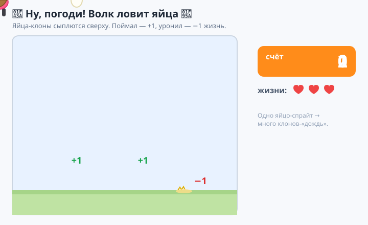
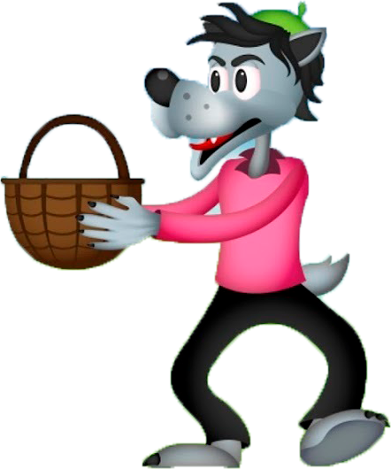
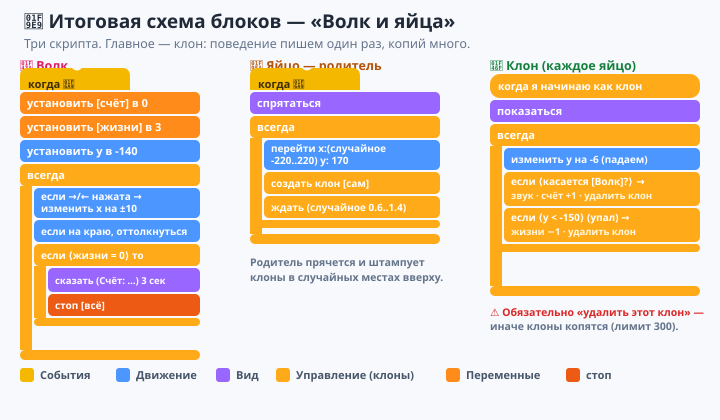
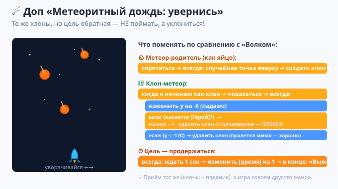

# Урок 5 — «Ну, погоди!»: волк ловит яйца 🐺🥚

**Модуль 6 · Игры на Scratch · Урок 5 из 9 | 2 ак.ч. (1,5 часа)**

> 🔁 В начале — [разминка/повтор](повторение.md) урока 4 (5 мин).
> 👨‍🏫 Сценарий с хронометражом — в [преподавателю.md](преподавателю.md).
> 🖼 Что показать на проекторе — в [изображения.md](изображения.md).
> 🎞 **Рендер результата** (двигается) — [`изображения/результат-волк.svg`](изображения/результат-волк.svg).
> 🐺 **Спрайт волка** — [`материалы/волк.png`](материалы/волк.png) (загрузи как спрайт).
> 🆘 **Пропустил урок или хочешь закрепить?** Открой [самоучитель.md](самоучитель.md) — 18 заданий с убывающими подсказками.

> 🧭 **Как читать урок.** В прошлой игре мешочек был **один**. А если нужно **много** падающих объектов — яиц, метеоров, капель дождя? Рисовать 20 спрайтов? Нет! Сегодня узнаем про **клоны** — как из **одного** спрайта наделать **сколько угодно** копий, и каждая живёт сама. Соберём легендарную игру **«Ну, погоди!»** 🐺: сверху сыплются **яйца**, волк с корзиной бегает внизу и **ловит** их; поймал — очко, уронил — минус жизнь. Каждый шаг — до конкретного блока.

---

## 🎮 Что мы сделаем сегодня и что получим

**Задача:** сделать аркаду **«лови падающее»**. Сверху в **случайных** местах появляются **яйца** и падают вниз; игрок двигает **волка** влево-вправо и ловит их корзиной. Поймал — **+1 очко**, уронил — **−1 жизнь**. Кончились жизни (3) — игра окончена.

**В итоге у тебя получится:** динамичная игра с **дождём из яиц**, счётом и жизнями — с настоящим азартом «ещё одну попытку!».

**Главные навыки урока:**
- 👯 **Клоны** — `создать клон`, `когда я начинаю как клон`, `удалить этот клон`: много копий из одного спрайта.
- 🎲 **Случайность** — яйцо появляется в случайном месте и в случайный момент.
- ⬇️ **Падение** — клон едет вниз (`изменить y на -6`).
- 🎯 **Ловля и промах** — `касается [Волк]?` (+очко) / долетело до дна (−жизнь).
- 🔢 **Переменные** (из урока 4) — `счёт` и `жизни`.

> 💡 **Главная мысль:** **клон — это живая копия спрайта.** Ты пишешь программу поведения **один раз** («как падать и ловиться»), а Scratch создаёт по ней **десятки самостоятельных яиц**. Один рецепт — много «actors» на сцене. Так делают дождь, пули, врагов, звёзды — почти в каждой игре.

**🎞 Вот что должно получиться** (яйца сыплются сверху, волк ловит, счёт и жизни меняются):



---

## 🧠 Новая идея: клоны (много из одного)

Раньше, чтобы было 5 яиц, пришлось бы завести 5 спрайтов и писать код 5 раз. **Клон** решает это одним махом:

- **Клон** — это **копия спрайта**, которая появляется во время игры и живёт **сама по себе** (у неё своя позиция, но тот же костюм и код).
- Ты пишешь поведение в блоке **`когда я начинаю как клон`** — и **каждая** копия выполняет его независимо.

Три главных блока (оранжевая «Управление»):
- **`создать клон [сам]`** — сделать новую копию.
- **`когда я начинаю как клон`** — «шапка» для кода, который выполняет каждый клон.
- **`удалить этот клон`** — убрать копию (например, когда поймали или улетела).

> 💡 **Родитель и клоны.** Сам спрайт-«родитель» обычно **прячется** и только **штампует клоны**. А видим мы и ловим — именно **клоны**.

> ⚠️ **Важно:** клон **наследует** позицию и вид родителя в момент создания. Поэтому родителя сначала **ставим** в нужную точку, а **потом** говорим `создать клон`.

---

## Часть 1 — Готовим сцену, волка и яйцо (10 минут)

1. **Фон.** Нажми «Выбрать фон» и подбери подходящий (двор, лес, кухня). *(Фон найди на свой вкус — игра от этого только выиграет.)*
2. **Волк.** «Выбрать спрайт» → **«Загрузить спрайт»** → выбери [`материалы/волк.png`](материалы/волк.png). Уменьши размер (~60), поставь **внизу** сцены.
3. **Яйцо.** «Выбрать спрайт» → найди **`Egg`** (яйцо) в библиотеке Scratch. Поставь его **вверху**.
4. Заведи **две переменные** (из урока 4): `счёт` и `жизни`. Поставь галочки — пусть видны на сцене.



> 🧩 **Для 5–7:** учитель заранее кладёт `волк.png` в папки; фон и яйцо выбирают вместе.

---

## Часть 2 — Волк ловит корзиной: управление (10 минут)

Выдели спрайт **волка**. Он бегает только **влево-вправо** по низу.

```
когда нажат 🚩 флажок
установить [счёт] в 0
установить [жизни] в 3
установить y в (-140)
всегда
    если <клавиша [стрелка вправо] нажата?> то → изменить x на 10
    если <клавиша [стрелка влево] нажата?> то → изменить x на -10
    если на краю, оттолкнуться
```

Жми флажок и стрелки — волк ездит по низу. 🐺

> 💡 **`установить y в -140`** держит волка **у самого низа** — там, где он будет ловить. По вертикали он не двигается, только влево-вправо.

> ⚠️ **Ошибка:** двигать волка ещё и по `y`. В этой игре он ездит только по горизонтали — так честнее ловить.

---

## Часть 3 — Яйцо штампует клоны (12 минут)

Теперь главное — **яйцо-родитель**. Оно само **прячется** и **штампует клоны** в случайных местах вверху.

Выдели спрайт **`Egg`**:

```
когда нажат 🚩 флажок
спрятаться
всегда
    перейти в x: (выдать случайное от -220 до 220) y: (170)
    создать клон [сам]
    ждать (выдать случайное от 0.6 до 1.4) секунд
```

- 👀 Пока на сцене ничего нового (клоны без кода невидимы) — оживим их в Части 4.

> 💡 **Разбор:** родитель прыгает в **случайную точку вверху** (`случайное -220..220` по X, `170` по Y), делает **клон** (он появится ровно там) и ждёт **случайное время** — поэтому яйца сыплются вразнобой, а не строем.

> ⚠️ **Ошибка:** не спрятать родителя. Тогда сверху «висит» лишнее яйцо-родитель. Родитель должен быть **скрыт** (`спрятаться`) — видны только клоны.

> ⚠️ **Ошибка:** поставить `создать клон` **раньше** `перейти в случайную точку`. Тогда все клоны появятся в одном месте. Порядок: **сначала переместились — потом клонировали**.

---

## Часть 4 — Клон падает, ловится и роняется (16 минут)

Это «жизнь» каждого яйца-клона. Добавь **тому же спрайту `Egg`** второй скрипт — с «шапкой» **`когда я начинаю как клон`**:

```
когда я начинаю как клон
показаться
всегда
    изменить y на (-6)
    если <касается [Волк]?> то
        играть звук [chomp]
        изменить [счёт] на 1
        удалить этот клон
    если <(y) < (-150)> то
        изменить [жизни] на -1
        удалить этот клон
```

Жми флажок 🚩 — **яйца сыплются сверху**, лови их волком! Поймал — **+1** и звук; уронил на дно — **−1 жизнь**. 🥚

> 💡 **Каждый клон** выполняет этот скрипт **сам**: сам падает, сам проверяет, поймали его или он долетел до дна. Десять яиц на экране — десять независимых «actors».

> 💡 **`если (y) < -150`** = «клон долетел почти до низа» (промах). `удалить этот клон` в обоих случаях убирает яйцо — иначе они копятся и тормозят игру.

> ⚠️ **Ошибка:** забыть `удалить этот клон`. Тогда яйца **накапливаются** сотнями, счёт/жизни считаются криво, игра «зависает». Клон, сделавший своё дело, **обязан удалиться**.

> ⚠️ **Ошибка:** блок `касается [Волк]` не находит волка — проверь, что в списке выбран именно спрайт **Волк** (по имени).

---

## Часть 5 — Конец игры: жизни кончились (8 минут)

Добавим проигрыш. Вернись к спрайту **волка** и в его `всегда` добавь проверку:

```
если <(жизни) = 0> то
    сказать (соединить [Игра окончена! Счёт: ] (счёт)) в течение 3 секунд
    стоп [всё]
```

- 👀 Уронил 3 яйца — «Игра окончена! Счёт: 12» и стоп.

> 💡 **Лимит клонов.** В Scratch одновременно живёт максимум **300 клонов** — поэтому мы их и удаляем. Если делать слишком часто и не удалять — новые перестанут появляться.

> 🎓 **Сложнее со временем (9–11):** заведи переменную `скорость` и увеличивай её по ходу игры — яйца будут падать **всё быстрее**. Или уменьшай паузу между клонами.

---

## 🧩 Итоговая схема блоков — «Волк и яйца»

Вот все три скрипта игры: **волк** (управление + конец), **яйцо-родитель** (штампует клоны) и **клон** (падает/ловится). Сверься:



> 🧠 Главное здесь — **клон**: один скрипт `когда я начинаю как клон`, а падающих яиц — **много**.

---

## 🎁 Доп-проект (по желанию, делаем вместе) — «Метеоритный дождь: увернись» ☄️

Те же клоны, но наоборот — не ловить, а **уворачиваться**!

1. Герой (ракета/кот) внизу, управляется влево-вправо.
2. Спрайт-**метеор** (или мяч) штампует клоны сверху в случайных местах (как яйцо-родитель).
3. Клон-метеор **падает вниз**; `если <касается [Герой]?> то → изменить [жизни] на -1 → удалить этот клон` (столкновение — плохо!).
4. Переменная `время` растёт (`всегда → ждать 1 → изменить [время] на 1`) — цель: **продержаться дольше**.
5. Кончились жизни → «Ты выжил (время) секунд!».



🏆 Тот же приём (клоны + случайное падение), но цель обратная — **избежать**, а не поймать. Два жанра из одного навыка!

---

## ✅ Как правильно / ❌ Как НЕ надо (клоны)

| ❌ Как НЕ надо | ✅ Как правильно |
|----------------|------------------|
| Делать 20 спрайтов вручную | Один спрайт + **клоны** |
| Не прятать родителя | Родитель `спрятаться`, видны только клоны |
| `создать клон` до перемещения | Сначала в случайную точку — **потом** клон |
| Забыть `удалить этот клон` | Отработал (поймали/упал) → **удалить** |
| Код падения под флажком | Падение — в `когда я начинаю как клон` |
| Двигать волка по вертикали | Волк ездит только влево-вправо |
| Спавнить слишком часто | Пауза между клонами (лимит 300 клонов) |

> ⚠️ Главные ошибки урока: **не удаляют клонов** (игра тормозит) и **не прячут родителя**. Проверь их, если что-то идёт не так.

---

## 🎓 Часть 6 — Для 9–11: глубже (по времени)

- **Ускорение:** переменная `скорость` растёт → яйца падают быстрее, пауза меньше.
- **Разные яйца:** случайно выбирай костюм/цвет клона; золотое яйцо = +3.
- **Бонус-жизнь:** редкий клон-«сердечко» даёт +1 жизнь.
- **Рекорд:** запомни лучший счёт между играми (переменная `рекорд`).
- **Ловля vs промах — анимация:** при промахе клон меняет костюм на «разбитое яйцо» перед удалением.

---

## 🧩 Для 5–7 классов (проще)

- Волка и яйцо ставит/раздаёт учитель; фон выбирают вместе.
- Скрипт клона можно собрать по [итоговой схеме](изображения/схема-блоков-волк.svg).
- Хватит **счёта** (без жизней): поймал → +1. Промах не наказываем.
- Главное — понять, что **одно яйцо = много клонов**.

---

## 🏁 Итог урока (5 минут)

Сегодня ты освоил **клоны** и собрал «Ну, погоди!»:

- ✅ **Клон** — живая копия: `создать клон`, `когда я начинаю как клон`, `удалить этот клон`.
- ✅ **Родитель прячется** и штампует клоны в **случайных** местах.
- ✅ **Падение** — `изменить y на -6` в цикле клона.
- ✅ **Ловля/промах** — `касается [Волк]?` (+очко) / дно (−жизнь).
- ✅ **Жизни и конец игры** — `если жизни = 0 → стоп`.

> 🏆 Один спрайт — целый **дождь** объектов! Это суперсила почти всех игр. Дальше — **урок 6 «Защити планету»**: клоны станут **пулями** — сделаем стрелялку!

> 🎤 **Блиц:** что такое клон? зачем прятать родителя? в каком блоке пишут поведение клона? почему клонов обязательно удалять? как поймать «падающее»?

### 🎮 Викторина-закрепление

Открой **[викторина.html](викторина.html)** — вопросы про клоны, случайность, падение, ловлю + смешные и «на подумать».

➡️ **Самостоятельная работа** (своя игра «лови/уворачивайся» + комбо) — в [практике](практика.md).
🆘 **Пропустил / хочешь потренироваться?** — [самоучитель.md](самоучитель.md): 18 заданий с убывающими подсказками.
🧰 **Трюки урока** (клоны без тормозов, случайность, лимит 300) — в [лайфхак.md](лайфхак.md).

---

## 🔗 Материалы и ссылки к уроку

**🧰 Инструмент:** Scratch — [онлайн](https://scratch.mit.edu/projects/editor/) или [Scratch Desktop](https://scratch.mit.edu/download), русский интерфейс.

**📦 Файлы урока:**
- **Спрайт волка** — [`материалы/волк.png`](материалы/волк.png) (загрузить как спрайт: «Выбрать спрайт → Загрузить спрайт»).

**📥 Материалы:**
- 🥚 Яйцо `Egg` и звуки (`chomp`, `pop`) — встроены в Scratch.
- 🖼 **Фон** — на свой вкус (двор/лес/кухня): кнопка «Выбрать фон» или свой рисунок.

**🎬 Вдохновение:** на scratch.mit.edu поиск — *catch game clones scratch*, *falling objects scratch*.

**⚙️ Учителю:** раздать `волк.png`; показать «родитель прячется — клоны падают», обязательное `удалить этот клон`, лимит 300; хронометраж и ошибки — в [преподавателю.md](преподавателю.md).
