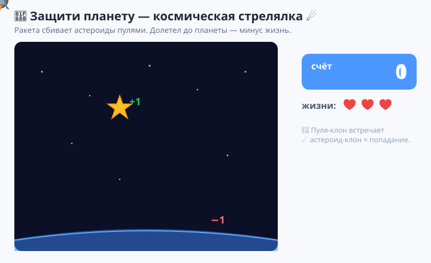
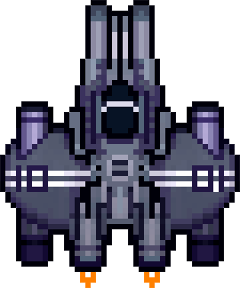
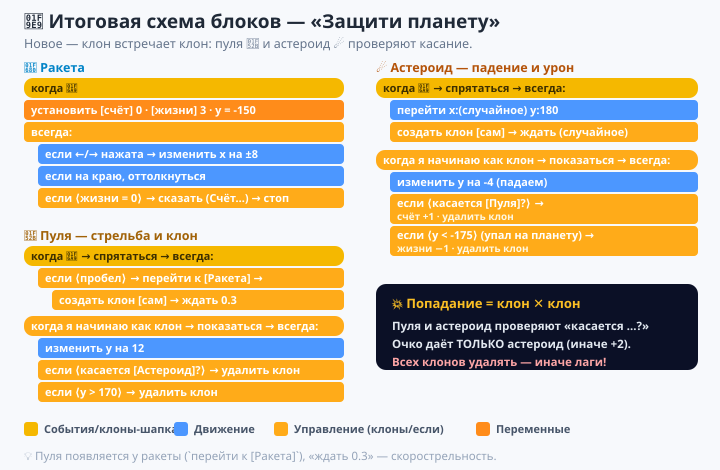
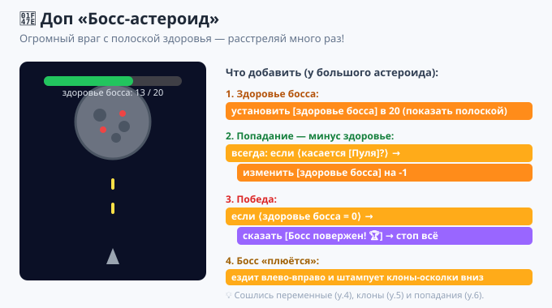

# Урок 6 — «Защити планету»: космическая стрелялка 🚀☄️

**Модуль 6 · Игры на Scratch · Урок 6 из 9 | 2 ак.ч. (1,5 часа)**

> 🔁 В начале — [разминка/повтор](повторение.md) урока 5 (5 мин).
> 👨‍🏫 Сценарий с хронометражом — в [преподавателю.md](преподавателю.md).
> 🖼 Что показать на проекторе — в [изображения.md](изображения.md).
> 🎞 **Рендер результата** (двигается) — [`изображения/результат-шутер.svg`](изображения/результат-шутер.svg).
> 🚀 **Спрайты** — в [`материалы/`](материалы) (ракета, астероид, взрыв, готовый образец).
> 🆘 **Пропустил урок или хочешь закрепить?** Открой [самоучитель.md](самоучитель.md) — 18 заданий с убывающими подсказками.

> 🧭 **Как читать урок.** На прошлом уроке клоны **падали** (яйца). Сегодня клоны будут **летать в две стороны**: **пули**, которые пускает игрок 🔼, и **астероиды**, которые сыплются на планету 🔽. А ещё научимся главному в любой стрелялке — **попаданию**: пуля коснулась астероида → взрыв, +очко. Собираем **космический тир «Защити планету»** 🚀. Каждый шаг — до конкретного блока.

---

## 🎮 Что мы сделаем сегодня и что получим

**Задача:** ракета внизу двигается влево-вправо и **стреляет** вверх; сверху на планету падают **астероиды**. Сбил астероид пулей — **+1 очко**; астероид долетел до планеты — **−1 жизнь**. Кончились жизни — игра окончена.

**В итоге у тебя получится:** настоящая **аркадная стрелялка** с пулями, врагами, счётом и жизнями — из тех, в которые залипаешь «ну ещё разок».

**Главные навыки урока:**
- 🔫 **Клоны-пули** — игрок стреляет: `создать клон` по нажатию, пуля летит вверх.
- ☄️ **Клоны-враги** — астероиды падают (как яйца на уроке 5).
- 💥 **Попадание** — `касается [Пуля]?` / `касается [Астероид]?`: клон встретил клон.
- 🔢 **Счёт и жизни** (из урока 4) + конец игры.
- 🎞 **Костюмы** — огонь двигателя ракеты и вращение астероида.

> 💡 **Главная мысль:** **клоны могут взаимодействовать друг с другом.** До этого клоны просто падали. Теперь **пуля-клон** встречает **астероид-клон** — и оба реагируют на касание. Так работает вся «боёвка» в играх: снаряд + враг → попадание.

**🎞 Вот что должно получиться** (ракета стреляет, астероиды падают, попадание = взрыв и +очко):



---

## Часть 1 — Космос, ракета и астероид (12 минут)

1. **Фон.** «Выбрать фон» → космический (`Stars`, `Nebula`) или свой.
2. **Ракета.** «Выбрать спрайт» → **«Загрузить спрайт»** → добавь по очереди [`материалы/ракета-1.png`](материалы), затем через вкладку **«Костюмы»** докинь `ракета-2.png` и `ракета-3.png` (это кадры огня двигателя). Уменьши размер (~50), поставь **внизу**.
3. **Астероид.** Так же загрузи [`материалы/астероид-1.png`](материалы) как спрайт (+ костюмы `2`, `3` для вращения). Размер ~50.
4. **Пуля.** «Выбрать спрайт» → **«Рисовать»** → нарисуй **короткую яркую чёрточку** (лазер) — узкий прямоугольник жёлтого/голубого цвета. Назови спрайт **`Пуля`**.
5. Заведи переменные **`счёт`** и **`жизни`** (галочки — на сцену).



> 🧩 **Для 5–7:** учитель раздаёт спрайты заранее; лазер можно взять готовый (`Ball`, уменьшить) вместо рисования.

---

## Часть 2 — Ракета: движение и огонь двигателя (10 минут)

Выдели спрайт **ракеты**.

**Движение** (влево-вправо по низу):
```
когда нажат 🚩 флажок
установить [счёт] в 0
установить [жизни] в 3
установить y в (-150)
всегда
    если <клавиша [стрелка вправо] нажата?> то → изменить x на 8
    если <клавиша [стрелка влево] нажата?> то → изменить x на -8
    если на краю, оттолкнуться
```

**Огонь двигателя** — отдельный скрипт (костюмы мигают):
```
когда нажат 🚩 флажок
всегда
    следующий костюм
    ждать 0.1 секунды
```

Жми флажок и стрелки — ракета летает, двигатель «пыхтит». 🚀

> 💡 **Два скрипта у одного спрайта** (движение + анимация) работают **параллельно** — как мы уже видели у котика на уроке 1.

---

## Часть 3 — 🔫 Стрельба: пули-клоны (14 минут)

Самое интересное — **выстрел по пробелу**. Стрелять будет спрайт **`Пуля`**: он прячется, ждёт нажатия, «встаёт» на ракету и штампует клон-пулю.

Выдели спрайт **`Пуля`**:
```
когда нажат 🚩 флажок
спрятаться
всегда
    если <клавиша [пробел] нажата?> то
        перейти к [Ракета]
        создать клон [сам]
        ждать 0.3 секунды
```

Теперь — **поведение клона-пули** (второй скрипт того же `Пуля`):
```
когда я начинаю как клон
показаться
всегда
    изменить y на 12
    если <(y) > 170> то
        удалить этот клон
```

Жми флажок и **пробел** — вверх летят лазеры! 🔫 (пока они просто улетают — сейчас научим попадать).

> 💡 **`перейти к [Ракета]`** (Движение) ставит пулю **ровно на ракету** перед клонированием — поэтому стреляет «из носа». **`ждать 0.3`** — это **скорострельность**: держишь пробел — очередь раз в 0.3 сек.

> ⚠️ **Ошибка:** не удалять улетевшие пули (`если y > 170 → удалить`). Иначе клоны копятся — упрёшься в лимит 300 и стрелять перестанет.

---

## Часть 4 — ☄️ Астероиды падают на планету (10 минут)

Это как «дождь» из урока 5. Выдели спрайт **астероида**.

**Родитель штампует:**
```
когда нажат 🚩 флажок
спрятаться
всегда
    перейти в x: (выдать случайное от -220 до 220) y: (180)
    создать клон [сам]
    ждать (выдать случайное от 0.7 до 1.5) секунд
```

**Клон-астероид падает:**
```
когда я начинаю как клон
показаться
всегда
    изменить y на (-4)
    если <(y) < (-175)> то
        изменить [жизни] на -1
        удалить этот клон
```

Жми флажок — астероиды сыплются, и за каждый долетевший до низа (планеты) — **−1 жизнь**. ☄️

> 💡 **Низ сцены = наша планета.** Пропустил астероид — планета получила урон. Наша задача — **сбивать их** до того, как долетят.

---

## Часть 5 — 💥 Попадание: пуля встречает астероид (14 минут)

Сейчас пули и астероиды **пролетают сквозь** друг друга. Добавим **попадание** — по одному правилу каждому.

**В клон-астероид** (внутрь `всегда`) добавь:
```
если <касается [Пуля]?> то
    изменить [счёт] на 1
    удалить этот клон
```

**В клон-пулю** (внутрь `всегда`) добавь:
```
если <касается [Астероид]?> то
    удалить этот клон
```

Жми флажок и стреляй — **попал пулей → астероид исчезает, +1 очко**, и пуля тоже пропадает! 💥🎉

> 💡 **`касается [Астероид]?` ловит ЛЮБОЙ клон** этого спрайта — не важно, какой именно астероид. Поэтому одно правило работает для всех врагов сразу.

> 💡 **Кто считает очко.** Очко добавляет **астероид** (он «умирает» один раз) — так счёт не задваивается. Пуля просто исчезает.

> ⚠️ **Ошибка:** добавить `+1` и пуле, и астероиду — очки задвоятся. Пусть считает **только** астероид.

---

## Часть 6 — Конец игры (6 минут)

Вернись к **ракете**, добавь в её `всегда` проверку:
```
если <(жизни) = 0> то
    сказать (соединить [Планета пала! Счёт: ] (счёт)) в течение 3 секунд
    стоп [всё]
```

- 👀 Пропустил 3 астероида — «Планета пала! Счёт: 18» и стоп.

> 🎓 **Взрыв (9–11):** в папке [`материалы/взрыв/`](материалы/взрыв) — 48 кадров анимации взрыва. Сделай спрайт-«Взрыв» с этими костюмами: при попадании появляйся на месте астероида и «прокрути» костюмы, потом спрячься. Очень эффектно! А в [`материалы/жизни/`](материалы/жизни) — картинки-полоска здоровья.

---

## 🧩 Итоговая схема блоков — «Защити планету»

Четыре «роли»: **ракета** (движение+конец), **пуля** (стрельба + полёт клона), **астероид** (падение клона + урон), и **попадание** (правила касания). Сверься:



> 🧠 Новое здесь — **клон встречает клон**: пуля-клон и астероид-клон проверяют касание друг друга.

---

## 🎁 Доп-проект (по желанию, делаем вместе) — «Босс-астероид» 👾

Добавим **босса** — огромный астероид, которого нужно расстрелять много раз!

1. Сделай большой астероид (размер ~180) вверху, ездит влево-вправо.
2. Заведи переменную **`здоровье босса`** = 20.
3. `если <касается [Пуля]?> то → изменить [здоровье босса] на -1` (и покажи `здоровье босса` полоской-табло).
4. `если <здоровье босса = 0> то → сказать [Босс повержен! 🏆] → стоп всё`.
5. Босс сам «плюётся» астероидами вниз (штампует клоны под собой).



🏆 Босс с полоской здоровья — это уже уровень «настоящих» игр! Здесь встретились **переменные** (урок 4), **клоны** (урок 5) и **попадания** (урок 6).

---

## ✅ Как правильно / ❌ Как НЕ надо (стрелялка)

| ❌ Как НЕ надо | ✅ Как правильно |
|----------------|------------------|
| Не удалять улетевшие пули | `если y > 170 → удалить этот клон` |
| Стрелять без паузы | `ждать 0.3` = скорострельность (иначе шторм клонов) |
| Пуля появляется не у ракеты | `перейти к [Ракета]` перед `создать клон` |
| +1 и пуле, и астероиду | Очко считает **только** астероид |
| Забыть удалять сбитые | Обе стороны попадания → `удалить этот клон` |
| Астероид без урона планете | `если y < -175 → жизни -1` |

> ⚠️ Главные ошибки урока: **не удаляют клонов** (тормоза) и **двойной счёт**. Проверь их, если игра лагает или очки «скачут».

---

## 🎓 Часть 7 — Для 9–11: глубже (по времени)

- **Взрыв** из 48 кадров (`материалы/взрыв/`) на месте сбитого астероида.
- **Уровни сложности:** со временем астероиды чаще и быстрее (переменная `скорость`).
- **Разные враги:** большой астероид — 3 попадания; маленький — 1.
- **Апгрейд оружия:** собрал бонус → стреляешь двумя пулями сразу.
- **Полоска здоровья** из картинок (`материалы/жизни/`) вместо числа.

---

## 🧩 Для 5–7 классов (проще)

- Спрайты раздаёт учитель; пулю можно взять готовую (мячик).
- Хватит: ракета стреляет, астероиды падают, попал → +счёт.
- Жизни/конец — по желанию (или 1 жизнь).
- Главное — **пуля-клон сбивает астероид-клон**.

---

## 🏁 Итог урока (5 минут)

Сегодня ты собрал **космическую стрелялку**:

- ✅ **Пули-клоны** — стрельба по пробелу (`перейти к [Ракета]` → `создать клон`).
- ✅ **Астероиды-клоны** — падают на планету.
- ✅ **Попадание** — `касается [Пуля]?` / `касается [Астероид]?`: клон встретил клон.
- ✅ **Счёт и жизни**, конец игры.
- ✅ **Костюмы** — огонь двигателя, вращение астероида.

> 🏆 У тебя настоящая аркада с «боёвкой»! Дальше — **урок 7 «Игра с уровнями»**: научимся **сообщениям** (`передать`/`когда получу`) — и сделаем смену уровней и экранов.

> 🎤 **Блиц:** как игрок «стреляет» клоном? зачем `перейти к [Ракета]`? зачем `ждать 0.3` при стрельбе? как сделать попадание? кто должен считать очко и почему?

### 🎮 Викторина-закрепление

Открой **[викторина.html](викторина.html)** — вопросы про пули-клоны, попадания, счёт + смешные и «на подумать».

➡️ **Самостоятельная работа** (своя стрелялка + комбо) — в [практике](практика.md).
🆘 **Пропустил / хочешь потренироваться?** — [самоучитель.md](самоучитель.md): 18 заданий с убывающими подсказками.
🧰 **Трюки урока** (скорострельность, попадания без лагов, взрыв) — в [лайфхак.md](лайфхак.md).

---

## 🔗 Материалы и ссылки к уроку

**🧰 Инструмент:** Scratch — [онлайн](https://scratch.mit.edu/projects/editor/) или [Scratch Desktop](https://scratch.mit.edu/download), русский интерфейс.

**📦 Файлы урока (папка `материалы/`):**
- **Ракета** — `ракета-1/2/3.png` (костюмы с огнём двигателя).
- **Астероид** — `астероид-1/2/3.png` (костюмы вращения).
- **Взрыв** — папка `взрыв/` (48 кадров, для 🎓).
- **Полоска здоровья** — папка `жизни/` (7 картинок, для 🎓).
- **Готовый образец** — `Космошутер_готовая.sb3` (для учителя, сверить).

**📥 Материалы:**
- 🔊 Звуки выстрела/взрыва (`laser`, `pop`, `zoop`) — встроены в Scratch.

**🎬 Вдохновение:** на scratch.mit.edu поиск — *space shooter scratch*, *shoot bullets clones scratch*.

**⚙️ Учителю:** раздать спрайты; показать «пуля встаёт на ракету → клон», правило скорострельности, «клон встречает клон»; хронометраж и ошибки — в [преподавателю.md](преподавателю.md).
