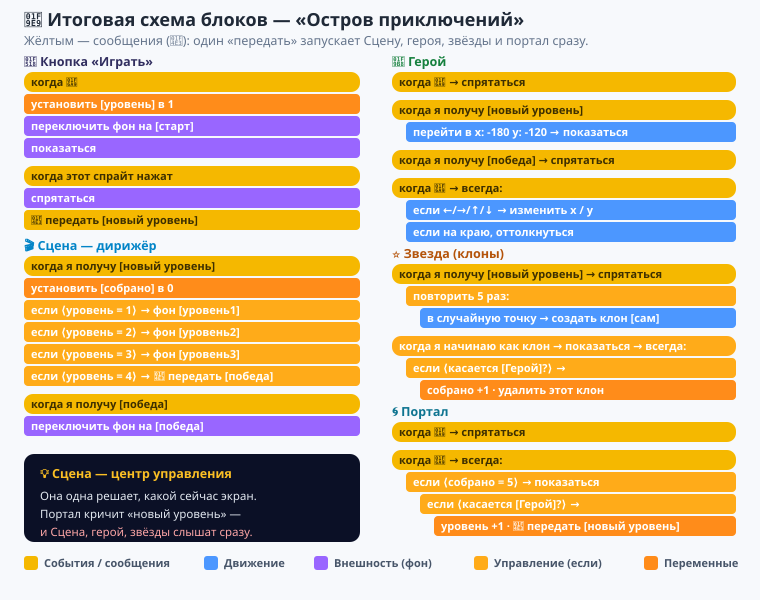
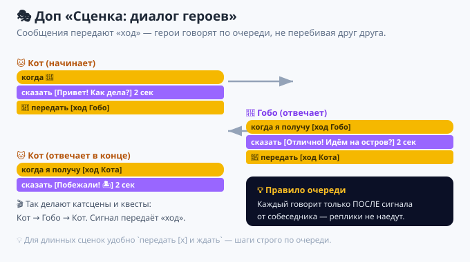

# Урок 7 — «Остров приключений»: игра с уровнями 🏝🗺

**Модуль 6 · Игры на Scratch · Урок 7 из 9 | 2 ак.ч. (1,5 часа)**

> 🔁 В начале — [разминка/повтор](повторение.md) урока 6 (5 мин).
> 👨‍🏫 Сценарий с хронометражом — в [преподавателю.md](преподавателю.md).
> 🖼 Что показать на проекторе — в [изображения.md](изображения.md).
> 🎞 **Рендер результата** (двигается) — [`изображения/результат-приключение.svg`](изображения/результат-приключение.svg).
> 🆘 **Пропустил урок или хочешь закрепить?** Открой [самоучитель.md](самоучитель.md) — 18 заданий с убывающими подсказками.

> 🧭 **Как читать урок.** До сих пор наши игры были **одним экраном**: одна сцена, и всё. А настоящие игры — это **экран старта** → **уровень 1** → **уровень 2** → **экран победы**. Как спрайту сказать «эй, все, начинаем новый уровень!»? Криком через всю сцену — **сообщением** (`передать` / `когда я получу`). Сегодня научимся **дирижировать игрой**: один сигнал — и герой встаёт на старт, звёзды рассыпаются заново, фон меняется. Соберём **«Остров приключений»** 🏝 из **трёх уровней** со стартовым экраном и финалом.

---

## 🎮 Что мы сделаем сегодня и что получим

**Задача:** сделать **игру с уровнями**. На стартовом экране — кнопка **«Играть»**. Нажал — начинается **уровень 1**: герой бегает и собирает **5 звёзд**. Собрал все — открывается **портал 🌀**; вошёл в него — **следующий уровень** (новый фон, звёзды заново). Прошёл 3 уровня — **экран «Победа! 🏆»**.

**В итоге у тебя получится:** настоящая игра «как в магазине» — со стартом, тремя уровнями и финалом, а не один бесконечный экран.

**Главные навыки урока:**
- 📣 **Сообщения** — `передать [сообщение]` и `когда я получу [сообщение]`: спрайты «договариваются» между собой.
- 🎬 **Экраны игры** — старт → уровни → победа через смену **фона** (`переключить фон на …`).
- 🎛 **Дирижёр (Сцена)** — один сигнал `новый уровень` заставляет **сразу всех** отреагировать.
- 🔢 **Переменные-уровни** — `уровень` и `собрано` управляют ходом игры.
- 👯 **Клоны** (из уроков 5–6) — звёзды-клоны рассыпаются заново на каждом уровне.

> 💡 **Главная мысль:** **сообщение — это радиосигнал для всех спрайтов сразу.** Один спрайт кричит «новый уровень!» (`передать`), а все, кто «настроен на эту волну» (`когда я получу`), одновременно делают своё: Сцена меняет фон, герой встаёт на старт, звёзды появляются заново. Так игры и соединяют много спрайтов в **одно слаженное действие**.

**🎞 Вот что должно получиться** (кнопка «Играть» → герой собирает звёзды → портал → новый уровень → победа):



---

## 🧠 Новая идея: сообщения (`передать` / `когда я получу`)

Раньше каждый спрайт жил сам по себе. Но в игре с уровнями им нужно **действовать вместе и в один момент**. Для этого есть **сообщения** — в разделе **«События»** (жёлтые блоки):

- **`передать [сообщение]`** — «крикнуть» сигнал. Его услышат **все** спрайты и Сцена.
- **`когда я получу [сообщение]`** — «шапка»: этот код запускается, **как только пришёл** такой сигнал.
- **`передать [сообщение] и ждать`** — крикнуть и **подождать**, пока все, кто услышал, доделают свои дела (пригодится для сценок).

> 💡 **Аналогия:** учитель говорит «Перемена!» (`передать [перемена]`) — и **все** дети разом встают (`когда я получу [перемена]`). Один сигнал — много реакций.

**Как создать своё сообщение:** в блоке `передать` нажми на стрелочку ▾ → **«Новое сообщение»** → впиши имя (например, `новый уровень`). Теперь это имя есть в обоих блоках.

> ⚠️ **Не путай с переменной!** Переменная **хранит число** (счёт, жизни). Сообщение **ничего не хранит** — это просто **сигнал** «делай сейчас». Имя пишем понятное: `новый уровень`, `старт игры`, `победа`.

---

## Часть 1 — Готовим фоны-экраны (10 минут)

Наша игра — это **5 фонов**: стартовый экран, три уровня и победа. Их будет **переключать** дирижёр.

1. Выдели **Сцену** (справа внизу, рядом со спрайтами) → вкладка **«Фоны»**.
2. Добавь фоны кнопкой «Выбрать фон» и переименуй их (двойной клик по имени):
   - **`старт`** — тёмный/нейтральный фон с местом под заголовок (напиши на нём «ОСТРОВ ПРИКЛЮЧЕНИЙ» кистью, или добавим текст спрайтом).
   - **`уровень1`**, **`уровень2`**, **`уровень3`** — три **разных** фона (лес, пляж, пещера — на свой вкус).
   - **`победа`** — праздничный фон.
3. Заведи **две переменные** (раздел «Переменные»): `уровень` и `собрано`. Галочки можно снять — по ходу игры они и так меняются.

> 👀 Имена фонов важны: именно по ним дирижёр будет переключать экраны. Пиши их **без опечаток**.

> 🧩 **Для 5–7:** учитель заранее добавляет 5 фонов и правильно их называет — детям остаётся выбрать картинки по вкусу.

---

## Часть 2 — Кнопка «Играть»: первый сигнал (10 минут)

Стартовый экран должен **ждать**, пока игрок нажмёт кнопку.

1. «Выбрать спрайт» → найди **`Button`** (кнопка) или нарисуй свою. Напиши на ней «ИГРАТЬ».
2. Поставь кнопку по центру. Собери два скрипта:

```
когда нажат 🚩 флажок
установить [уровень] в 1
переключить фон на [старт]
показаться
```
```
когда этот спрайт нажат
спрятаться
передать [новый уровень]
```

Жми флажок — виден стартовый экран с кнопкой. Кликнул по кнопке — она **прячется** и **кричит** «новый уровень!». Пока больше ничего не происходит — сейчас научим всех **слушать** этот сигнал. 📣

> 💡 **`когда этот спрайт нажат`** (раздел «События») — срабатывает по **клику мышкой** именно по этому спрайту. Идеально для кнопок.

> ⚠️ **Ошибка:** забыть `установить [уровень] в 1` под флажком. Тогда после победы вторая игра начнётся не с 1-го уровня. Флажок должен **всё обнулять**.

---

## Часть 3 — Дирижёр: Сцена переключает уровни (14 минут)

Самое главное. **Сцена** (а не спрайт!) будет **дирижёром**: услышав `новый уровень`, она выберет нужный фон по номеру уровня.

Выдели **Сцену** → вкладка **«Код»**:

```
когда я получу [новый уровень]
установить [собрано] в 0
если <(уровень) = 1> то → переключить фон на [уровень1]
если <(уровень) = 2> то → переключить фон на [уровень2]
если <(уровень) = 3> то → переключить фон на [уровень3]
если <(уровень) = 4> то → передать [победа]
```
```
когда я получу [победа]
переключить фон на [победа]
```

- 👀 Нажми флажок → кнопку. Фон сменится на **уровень1**, а `собрано` станет 0.

> 💡 **Почему дирижирует Сцена?** Фон — общий для всех, логично, чтобы им управлял «тот, кто над всеми». Сцена — идеальный **центр управления** игрой. Один её скрипт решает, какой сейчас экран.

> 💡 **Цепочка сигналов:** когда `уровень = 4`, Сцена сама **передаёт** новый сигнал `победа`. Сообщение может запускать другое сообщение — так собираются сложные сценарии.

> ⚠️ **Ошибка:** имя фона в блоке не совпадает с настоящим (`Уровень1` вместо `уровень1`, лишний пробел). Тогда фон не переключится. Сверь имена **буква в букву**.

---

## Часть 4 — Герой встаёт на старт по сигналу (10 минут)

Герой не должен быть виден на стартовом экране — он **появляется по сигналу** `новый уровень` и встаёт на начальную точку.

1. «Выбрать спрайт» → возьми любого героя (например, `Cat`, `Avery`, `Gobo`). Уменьши размер (~60).
2. Три скрипта:

```
когда нажат 🚩 флажок
спрятаться
```
```
когда я получу [новый уровень]
перейти в x: (-180) y: (-120)
показаться
```
```
когда я получу [победа]
спрятаться
```

3. Управление стрелками — отдельным скриптом (герой ходит по всему экрану):

```
когда нажат 🚩 флажок
всегда
    если <клавиша [стрелка вправо] нажата?> то → изменить x на 6
    если <клавиша [стрелка влево] нажата?> то → изменить x на -6
    если <клавиша [стрелка вверх] нажата?> то → изменить y на 6
    если <клавиша [стрелка вниз] нажата?> то → изменить y на -6
    если на краю, оттолкнуться
```

Жми флажок → «Играть» — герой появляется в левом нижнем углу и бегает по стрелкам! 🏃

> 💡 **Почему управление — под флажком, а не под `новый уровень`?** Если поставить `всегда` под каждый `новый уровень`, при смене уровня запустится **второй** такой цикл, потом третий — герой начнёт дёргаться. Цикл управления запускаем **один раз** под флажком; на старте героя просто **не видно** (`спрятаться`), поэтому его «беготня» никому не мешает.

> ⚠️ **Ошибка:** несколько циклов `всегда` на одном спрайте, запущенных по сигналу. Они складываются и всё ломают. **Один сигнал = одно действие**, а постоянные циклы — под флажком.

---

## Часть 5 — Звёзды рассыпаются на каждом уровне (14 минут)

Звёзды — это **клоны** (как яйца в уроке 5). На **каждый** `новый уровень` они появляются **заново**, в случайных местах.

1. «Выбрать спрайт» → найди **`Star`** (звезда). Уменьши (~50).
2. Три скрипта:

```
когда нажат 🚩 флажок
спрятаться
```
```
когда я получу [новый уровень]
спрятаться
повторить 5 раз
    перейти в x: (выдать случайное от -200 до 200) y: (выдать случайное от -140 до 140)
    создать клон [сам]
```
```
когда я начинаю как клон
показаться
всегда
    если <касается [Герой]?> то
        играть звук [Collect]
        изменить [собрано] на 1
        удалить этот клон
```

3. Замени `[Герой]` на **имя твоего спрайта-героя** (Cat/Avery/…).

Жми флажок → «Играть» — на уровне рассыпано **5 звёзд**. Собери их героем: каждая даёт **+1** к `собрано` и исчезает. ⭐

> 💡 **Почему звёзды слушают `новый уровень`?** Тот же сигнал, что меняет фон, **заново рассыпает** звёзды. Один `передать` — Сцена сменила фон, герой встал на старт, звёзды появились. Вот она, сила сообщений: **всё синхронно**.

> ⚠️ **Ошибка:** забыть `удалить этот клон` — звёзды-клоны копятся с прошлых уровней (помни лимит 300 из урока 5). Собрал звезду → **удаляем** клон.

---

## Часть 6 — Портал: собрал всё → следующий уровень (12 минут)

Когда `собрано = 5`, открывается **портал** 🌀. Вошёл в него герой — **переход** на следующий уровень.

1. «Выбрать спрайт» → нарисуй портал (кружок-вихрь) или возьми `Ball`/`Rainbow`. Поставь в угол (например, справа вверху).
2. Скрипты:

```
когда нажат 🚩 флажок
спрятаться
```
```
когда я получу [новый уровень]
спрятаться
```
```
когда нажат 🚩 флажок
всегда
    если <(собрано) = 5> то
        показаться
        если <касается [Герой]?> то
            изменить [уровень] на 1
            передать [новый уровень]
```

Жми флажок → «Играть». Собери 5 звёзд — **появляется портал**. Дойди до него — уровень **сменится**: новый фон, звёзды заново, `собрано` снова 0! 🌀

> 💡 **Как замыкается круг:** портал делает `изменить [уровень] на 1` и `передать [новый уровень]`. Сцена ловит сигнал → выбирает следующий фон → обнуляет `собрано` → прячет портал (его хат `новый уровень`) → звёзды рассыпаются. Один сигнал — и уровень **полностью** обновился.

> ⚠️ **Ошибка:** портал показывается сразу. Проверь: он `спрятаться` под флажком и по `новый уровень`, а **показывается только** когда `собрано = 5`.

---

## Часть 7 — Победа: третий уровень пройден (8 минут)

Когда после 3-го уровня портал добавит `уровень` до **4**, Сцена (Часть 3) поймает это и **передаст `победа`** → включится экран победы. Добавим героям красивую концовку.

На **Сцене** уже есть `когда я получу [победа] → переключить фон на [победа]`. Добавим ещё «фейерверк» словами — например, спрайту-кнопке или новому спрайту-надписи:

```
когда я получу [победа]
перейти в x: (0) y: (0)
показаться
сказать [Победа! Все уровни пройдены! 🏆] в течение 4 секунд
```

- 👀 Прошёл 3 уровня → фон «победа» + надпись «Победа!». 🎉

> 💡 **Считаем экраны:** старт → ур.1 → ур.2 → ур.3 → победа. `уровень` растёт 1 → 2 → 3 → 4. На «4» игра переключается на финал. Хочешь 5 уровней — добавь фон `уровень4` и строчку `если уровень = 4 → уровень4`, а победу перенеси на `= 5`.

> 🎓 **Сложнее (9–11):** добавь переменную `рекорд` — сколько всего звёзд собрано за игру; покажи её на экране победы.

---

## 🧩 Итоговая схема блоков — «Остров приключений»

Вот все скрипты игры: **Кнопка**, **Сцена-дирижёр**, **Герой**, **Звезда** и **Портал**. Жёлтым выделены сообщения — «нервная система» игры. Сверься:



> 🧠 Главное здесь — **сообщения**: один `передать [новый уровень]` заставляет Сцену, героя, звёзды и портал сработать **одновременно**.

---

## 🎁 Доп-проект (по желанию, делаем вместе) — «Сценка: диалог героев» 🎭

Сообщения нужны не только для уровней! Ими удобно делать **разговор по очереди**, чтобы герои не говорили хором.

1. Два спрайта — например, `Cat` и `Gobo`.
2. Кот начинает и по очереди передаёт «слово»:

```
(Кот)
когда нажат 🚩 флажок
сказать [Привет! Как дела?] в течение 2 секунд
передать [ход Гобо]
```
```
(Гобо)
когда я получу [ход Гобо]
сказать [Отлично! Идём на остров?] в течение 2 секунд
передать [ход Кота]
```
```
(Кот)
когда я получу [ход Кота]
сказать [Побежали! 🏝] в течение 2 секунд
```

3. Получится живой диалог: каждый говорит **только после сигнала** от собеседника.



🏆 Тот же приём (`передать` / `когда я получу`), но вместо уровней — **очередь реплик**. Так делают катсцены, квесты и обучающие диалоги в играх.

---

## ✅ Как правильно / ❌ Как НЕ надо (сообщения и уровни)

| ❌ Как НЕ надо | ✅ Как правильно |
|----------------|------------------|
| Менять фон в каждом спрайте отдельно | **Сцена-дирижёр** меняет фон по сигналу |
| Разные имена сигнала (`уровень`/`Уровень `) | Одно точное имя: `новый уровень` везде |
| Путать сообщение с переменной | Сообщение — **сигнал**, переменная — **число** |
| Цикл `всегда` под каждым `новый уровень` | Постоянные циклы — под 🚩 (один раз) |
| Забыть `установить уровень в 1` под флажком | Флажок **обнуляет** уровень и собрано |
| Портал виден всегда | Портал — только при `собрано = 5` |
| Не удалять клоны-звёзды | Собрал звезду → `удалить этот клон` |

> ⚠️ Главные ошибки урока: **опечатка в имени сообщения/фона** (сигнал «не долетает») и **лишние циклы по сигналу**. Проверь их, если что-то не срабатывает.

---

## 🎓 Часть 8 — Для 9–11: глубже (по времени)

- **Разная сложность уровней:** заведи `нужно` и на 2-м уровне ставь `нужно = 7`, на 3-м `= 10`; портал открывается при `собрано = нужно`.
- **Таймер уровня:** засекай время (`сбросить таймер`) — покажи на экране победы «Пройдено за … сек».
- **Враги на уровнях:** добавь клоны-препятствия (как метеоры из урока 5) — коснулся → назад на старт уровня (`передать [новый уровень]` без роста уровня).
- **Меню паузы:** клавиша `p` → `передать [пауза]` → все `когда я получу [пауза] → стоп [другие скрипты спрайта]`.
- **Экран «Проигрыш»:** переменная `жизни`; кончились → `передать [проигрыш]` → отдельный фон.

---

## 🧩 Для 5–7 классов (проще)

- Учитель заранее готовит 5 фонов с правильными именами и переменные.
- Достаточно **2 уровней** вместо трёх (победа на `уровень = 3`).
- Портал можно заменить: собрал 5 звёзд → **сразу** `передать [новый уровень]` (без входа в портал).
- Скрипты можно собрать по [итоговой схеме](изображения/схема-блоков-приключение.svg).
- Главное — понять: **сообщение = сигнал для всех сразу**.

---

## 🏁 Итог урока (5 минут)

Сегодня ты освоил **сообщения** и собрал игру **с уровнями**:

- ✅ **Сообщение** — `передать` (крикнуть) и `когда я получу` (услышать): сигнал для всех.
- ✅ **Экраны игры** — старт → уровни → победа через смену **фона**.
- ✅ **Сцена-дирижёр** — один центр управляет ходом игры.
- ✅ **Один сигнал — много реакций:** фон, герой, звёзды, портал срабатывают вместе.
- ✅ **Цепочка сигналов** — сообщение может запускать другое (`уровень 4 → победа`).

> 🏆 Теперь твои игры не «один экран», а **настоящее приключение** с началом и финалом! Дальше — **урок 8 «Прыгай по платформам»**: сделаем платформер с гравитацией и прыжком (как в Марио!).

> 🎤 **Блиц:** чем сообщение отличается от переменной? как создать новое сообщение? кто в игре дирижёр и почему? почему управление — под флажком, а не под сигналом? как замыкается переход на новый уровень?

### 🎮 Викторина-закрепление

Открой **[викторина.html](викторина.html)** — вопросы про сообщения, дирижёра-Сцену, экраны и уровни + смешные и «на подумать».

➡️ **Самостоятельная работа** (своя игра с уровнями + комбо) — в [практике](практика.md).
🆘 **Пропустил / хочешь потренироваться?** — [самоучитель.md](самоучитель.md): 18 заданий с убывающими подсказками.
🧰 **Трюки урока** (сообщения, дирижёр, экраны, «передать и ждать») — в [лайфхак.md](лайфхак.md).

---

## 🔗 Материалы и ссылки к уроку

**🧰 Инструмент:** Scratch — [онлайн](https://scratch.mit.edu/projects/editor/) или [Scratch Desktop](https://scratch.mit.edu/download), русский интерфейс.

**📥 Материалы (всё внутри Scratch):**
- 🦸 Герой, ⭐ `Star`, 🔘 `Button`, 🌀 портал — библиотека Scratch (или нарисуй сам).
- 🖼 **5 фонов** (старт / 3 уровня / победа) — «Выбрать фон» или свои рисунки.
- 🔊 Звук `Collect` — встроен в Scratch.

**🎬 Вдохновение:** на scratch.mit.edu поиск — *level game broadcast scratch*, *scene switch backdrops scratch*.

**⚙️ Учителю:** заранее назвать фоны точь-в-точь; показать «Сцена-дирижёр», разницу сообщение/переменная, опасность лишних циклов по сигналу; хронометраж и ошибки — в [преподавателю.md](преподавателю.md).
