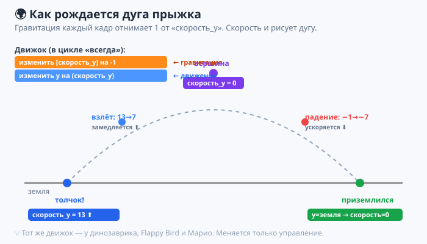
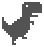
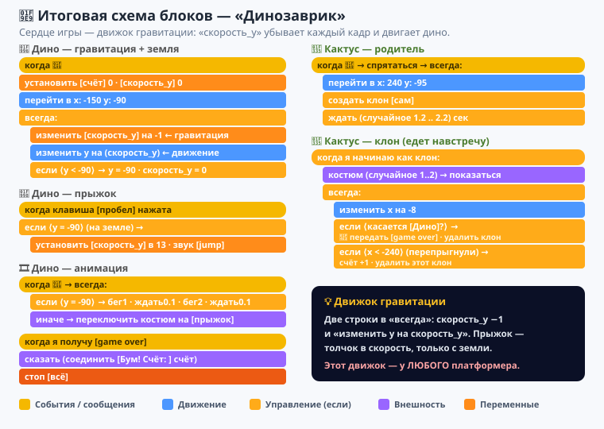
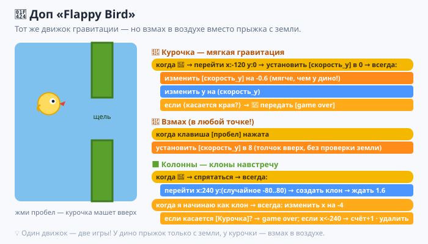

# Урок 8 — «Прыгай!»: гравитация и платформер 🦖🦘

**Модуль 6 · Игры на Scratch · Урок 8 из 9 | 2 ак.ч. (1,5 часа)**

> 🔁 В начале — [разминка/повтор](повторение.md) урока 7 (5 мин).
> 👨‍🏫 Сценарий с хронометражом — в [преподавателю.md](преподавателю.md).
> 🖼 Что показать на проекторе — в [изображения.md](изображения.md).
> 🎞 **Рендер результата** (двигается) — [`изображения/результат-дино.svg`](изображения/результат-дино.svg).
> 🦖 **Спрайты динозаврика** — папка [`материалы/динозаврик/`](материалы/динозаврик) (dino1, dino2, jump, кактусы, птеродактиль).
> 🐤 **Спрайты Flappy** — папка [`материалы/flappy/`](материалы/flappy) (курочка, колонна).
> 🆘 **Пропустил урок или хочешь закрепить?** Открой [самоучитель.md](самоучитель.md) — 18 заданий с убывающими подсказками.

> 🧭 **Как читать урок.** Во всех прошлых играх герой двигался, только пока ты жмёшь кнопку. Но в **платформерах** (Марио, динозаврик из Chrome, Flappy Bird) есть **гравитация**: герой всё время **падает вниз сам**, а по кнопке — **подпрыгивает** и снова падает. Сегодня соберём **этот «двигатель прыжка»** — сердце всех платформеров — и сделаем легендарного **🦖 динозаврика**, который прыгает через кактусы. А в доп-проекте тем же приёмом оживим **🐤 Flappy Bird**!

---

## 🎮 Что мы сделаем сегодня и что получим

**Задача:** сделать **бесконечный раннер** «Динозаврик». Динозавр бежит на месте (двигаются кактусы ему навстречу), а игрок жмёт **пробел**, чтобы **перепрыгнуть** препятствие. Задел кактус — конец игры. За каждый перепрыгнутый кактус — **+1 очко**.

**В итоге у тебя получится:** та самая игра из офлайн-Chrome — с настоящей **гравитацией**, прыжком, разгоном и счётом.

**Главные навыки урока:**
- 🌍 **Гравитация** — герой сам падает вниз через переменную-**скорость**.
- 🦘 **Прыжок** — по кнопке даём телу **толчок вверх**, гравитация плавно возвращает вниз.
- 🧱 **Земля** — герой не проваливается: упёрся в пол → скорость обнуляется.
- 👯 **Препятствия-клоны** (из уроков 5–7) — кактусы едут навстречу.
- 🎞 **Анимация бега** — смена костюмов (dino1 ↔ dino2), в воздухе — поза прыжка.
- 📣 **Сообщение** (из урока 7) — `game over` завершает игру.

> 💡 **Главная мысль:** **гравитация — это не команда «падай», а маленькое постоянное ускорение вниз.** Мы каждый кадр чуть-чуть **уменьшаем** «скорость по вертикали» (`скорость_y`) и на эту скорость сдвигаем героя. Прыжок = резко поставить `скорость_y` большим **плюсом** (толчок вверх). Дальше гравитация сама съедает толчок, герой замедляется, останавливается в высшей точке и падает обратно. **Один и тот же движок** — и у Марио, и у динозаврика, и у Flappy Bird.

**🎞 Вот что должно получиться** (динозавр бежит, прыгает через кактусы, счёт растёт):



---

## 🧠 Новая идея: гравитация через «скорость»

Раньше мы двигали героя напрямую: `изменить y на 10`. Но для прыжка так не выйдет — получится «телепорт вверх-вниз», без плавности. Нужен **разгон и торможение**. Их даёт **переменная-скорость**:

- Заводим переменную **`скорость_y`** — это «сколько пикселей вверх/вниз пролетаем в этот кадр».
- Каждый кадр делаем два дела:
  1. **Гравитация:** `изменить скорость_y на -1` (скорость всё время тянет вниз).
  2. **Движение:** `изменить y на (скорость_y)` (двигаем героя на текущую скорость).
- **Прыжок:** `установить скорость_y в 13` — резкий толчок вверх. Дальше гравитация каждый кадр отнимает по 1: 13 → 12 → … → 0 (высшая точка) → −1 → −2 … (падаем всё быстрее).

> 💡 **Почему это красиво:** скорость плавно **уменьшается** на взлёте и плавно **растёт** на падении — получается настоящая **дуга прыжка**, как в жизни. Никаких «телепортов».



---

## Часть 1 — Готовим сцену и динозаврика (10 минут)

1. **Фон.** «Выбрать фон» → простой (пустыня/город) или залей светлым. Внизу можно нарисовать **линию земли**.
2. **Динозавр.** «Выбрать спрайт» → **«Загрузить спрайт»** → загрузи по очереди из [`материалы/динозаврик/`](материалы/динозаврик): `dino1.png`. Потом на вкладке **«Костюмы»** этого же спрайта добавь ещё два костюма (кнопка «Загрузить костюм»): `dino2.png` и `jump.png`.
3. Переименуй костюмы (двойной клик по имени): **`бег1`**, **`бег2`**, **`прыжок`** — так будет понятно.
4. Уменьши размер (~60), поставь дино слева: `x = -150`.
5. Заведи **две переменные**: `счёт` и `скорость_y`.



> 🧩 **Для 5–7:** учитель заранее раздаёт папку `динозаврик/` и показывает, как добавить 3 костюма одному спрайту.

---

## Часть 2 — Гравитация: динозавр падает и стоит на земле (14 минут)

Это **двигатель** игры. Выдели спрайт **дино**:

```
когда нажат 🚩 флажок
установить [счёт] в 0
установить [скорость_y] в 0
перейти в x: (-150) y: (-90)
всегда
    изменить [скорость_y] на -1
    изменить y на (скорость_y)
    если <(y) < (-90)> то
        установить y в (-90)
        установить [скорость_y] в 0
```

Жми флажок — динозавр стоит на земле (`y = -90`) и **не проваливается**. Если поднять его мышкой вверх и отпустить — **упадёт** обратно. Гравитация работает! 🌍

> 💡 **Разбор «земли»:** `-90` — это уровень пола. Каждый кадр гравитация тянет дино вниз; как только он опустился **ниже** пола, мы **возвращаем** его ровно на `-90` и обнуляем скорость — иначе он падал бы вечно вниз за экран.

> ⚠️ **Ошибка:** забыть обнулить `скорость_y` при касании земли. Тогда скорость всё копит минус, и следующий прыжок «не сработает» — тело будто прилипло к полу.

---

## Часть 3 — Прыжок по пробелу (10 минут)

Толчок вверх — отдельным скриптом. Добавь **тому же дино**:

```
когда клавиша [пробел] нажата
если <(y) = (-90)> то
    установить [скорость_y] в (13)
    играть звук [jump]
```

Жми флажок, потом **пробел** — динозавр красиво **подпрыгивает** и мягко приземляется! 🦘

> 💡 **`если y = -90`** = «прыгать можно только **с земли**». Без этой проверки дино прыгал бы прямо в воздухе (бесконечно вверх). Это правило — «нельзя прыгнуть, пока не приземлился».

> ⚠️ **Ошибка:** поставить толчок в цикл `всегда`. Тогда, пока держишь пробел, дино улетит в космос. Толчок — **один раз** по нажатию, дальше работает гравитация.

> 🎓 **Двойной прыжок (9–11):** заведи переменную `прыжков` (0/1). На земле — сбрасывай в 0; каждый прыжок — `+1`; разрешай прыгать, пока `прыжков < 2`. Получится прыжок в воздухе, как у Марио.

---

## Часть 4 — Анимация: бежит на земле, поза прыжка в воздухе (10 минут)

Оживим дино сменой костюмов. Ещё один скрипт **тому же спрайту**:

```
когда нажат 🚩 флажок
всегда
    если <(y) = (-90)> то
        переключить костюм на [бег1]
        ждать (0.1) секунд
        переключить костюм на [бег2]
        ждать (0.1) секунд
    иначе
        переключить костюм на [прыжок]
```

- 👀 На земле лапки **мелькают** (бег1 ↔ бег2), в прыжке — поза **прыжок**. Живой динозавр! 🦖

> 💡 **Почему через `если y = -90`:** пока дино на земле — он «бежит» (мелькают костюмы); как только оторвался — показываем позу прыжка. Один взгляд на спрайт — и понятно, в воздухе он или нет.

---

## Часть 5 — Кактусы едут навстречу (клоны) (14 минут)

Динозавр бежит «на месте» — иллюзию бега создают **кактусы**, которые едут **справа налево** (как земля под ногами). Это **клоны** (вспомни уроки 5–7).

1. «Выбрать спрайт» → **«Загрузить спрайт»** → `Cactus1.png` из [`материалы/динозаврик/`](материалы/динозаврик). На «Костюмах» добавь костюм `Cactus2.png` (будет два вида кактусов).
2. Уменьши (~55). Скрипты:

```
когда нажат 🚩 флажок
спрятаться
всегда
    перейти в x: (240) y: (-95)
    создать клон [сам]
    ждать (выдать случайное от 1.2 до 2.2) секунд
```
```
когда я начинаю как клон
переключить костюм на (выдать случайное от 1 до 2)
показаться
всегда
    изменить x на (-8)
    если <касается [Дино]?> то
        передать [game over]
        удалить этот клон
    если <(x) < (-240)> то
        изменить [счёт] на 1
        удалить этот клон
```

3. В блоке `касается [Дино]?` выбери имя спрайта-динозавра.

Жми флажок — кактусы едут навстречу, прыгай через них пробелом! Перепрыгнул (кактус ушёл за левый край) — **+1 очко**. Задел — сигнал `game over`. 🌵

> 💡 **Почему очко даёт кактус, а не дино?** Кактус «знает», что доехал до левого края, никого не задев, — значит, его перепрыгнули. Считает **один** раз при удалении — как в уроке 6 (чтобы не было +2).

> ⚠️ **Ошибка:** забыть `удалить этот клон`. Кактусы копятся (лимит 300!), игра тормозит. Уехал или столкнулся → **удалить**.

> ⚠️ **Ошибка:** родитель-кактус не спрятан — на старте висит лишний кактус. Родитель `спрятаться`, видны только клоны.

---

## Часть 6 — Конец игры (8 минут)

Ловим сигнал `game over`. Добавь **дино** (или Сцене) скрипт:

```
когда я получу [game over]
переключить костюм на [прыжок]
сказать (соединить [Бум! Счёт: ] (счёт)) в течение 3 секунд
стоп [всё]
```

- 👀 Задел кактус → «Бум! Счёт: 8» и стоп.

> 💡 **Сообщение из урока 7** снова пригодилось: кактус кричит `game over`, а дино завершает игру. Разные спрайты — один сигнал.

> 🎓 **Ускорение (9–11):** заведи `скорость_игры` и по ходу увеличивай (кактусы едут быстрее, паузы короче) — как в настоящем динозаврике. Ещё: добавь **птеродактиля** (`Bird.png`) — летит на высоте, надо **не прыгать** под ним.

---

## 🧩 Итоговая схема блоков — «Динозаврик»

Вот все скрипты: **дино** (гравитация + прыжок + анимация + конец) и **кактус** (родитель + клон). Жёлтым — сообщение. Сверься:



> 🧠 Главное здесь — **движок гравитации**: `скорость_y` убывает каждый кадр, `изменить y на (скорость_y)` двигает тело. Прыжок — толчок вверх. Это ядро **любого** платформера.

---

## 🎁 Доп-проект (по желанию, делаем вместе) — «Flappy Bird» 🐤

Тот же двигатель гравитации, но управление другое: не «прыжок с земли», а **взмах в воздухе**. Спрайты — в [`материалы/flappy/`](материалы/flappy).

1. **Курочка.** Загрузи `chick-a.svg` как спрайт (можно добавить костюм `chick-flop.svg` — крылья вниз). Поставь слева.
2. **Гравитация помягче** (курочка лёгкая):

```
когда нажат 🚩 флажок
перейти в x: (-120) y: (0)
установить [скорость_y] в 0
всегда
    изменить [скорость_y] на -0.6
    изменить y на (скорость_y)
    если <касается края?> то → передать [game over]
```
3. **Взмах** (толчок вверх в любой момент):
```
когда клавиша [пробел] нажата
установить [скорость_y] в (8)
```
4. **Колонны-клоны.** Загрузи `column.svg`, штампуй клоны справа в случайной высоте, вези влево (как кактусы). Касание курочки → `game over`; ушла за край → `+1`.



🏆 **Один движок — две игры!** У динозаврика прыжок только с земли, у курочки — взмах в воздухе. Меняется одна деталь управления — получается совсем другая игра.

> 🖼 Готовые проекты для сверки — [`материалы/динозаврик/Динозаврик_готовая.sb3`](материалы/динозаврик/Динозаврик_готовая.sb3) и [`материалы/flappy/FlappyBird_готовая.sb3`](материалы/flappy/FlappyBird_готовая.sb3).

---

## ✅ Как правильно / ❌ Как НЕ надо (гравитация и прыжок)

| ❌ Как НЕ надо | ✅ Как правильно |
|----------------|------------------|
| Прыжок через `изменить y на 50` (телепорт) | Толчок в **скорость_y**, дальше гравитация |
| Толчок в цикле `всегда` | Толчок **один раз** по нажатию |
| Прыгать в воздухе (нет проверки) | Прыжок только `если y = земля` |
| Не обнулять `скорость_y` на земле | На полу → `скорость_y = 0` |
| Провал сквозь пол | `если y < земля → вернуть на землю` |
| Забыть `удалить этот клон` кактуса | Уехал/столкнулся → удалить (лимит 300) |
| Родитель-кактус не спрятан | Родитель `спрятаться`, видны клоны |

> ⚠️ Главные ошибки урока: **толчок в `всегда`** (дино улетает) и **нет проверки «с земли»** (прыжок в воздухе). Проверь их, если прыжок ведёт себя странно.

---

## 🎓 Часть 7 — Для 9–11: из раннера — в настоящий платформер (по времени)

Динозаврик — это половина платформера (только прыжок). Добавь **ходьбу и площадки** — получится Марио:

- **Ходьба:** `если стрелка вправо → изменить x на 5`, `если влево → изменить x на -5`.
- **Площадки:** нарисуй платформы **одним цветом** (например, зелёным). Замени проверку земли: вместо `y < -90` — `если касается цвета (зелёный)? → скорость_y = 0` (стоишь на любой платформе!).
- **Прыжок с платформы:** прыгать можно `если касается цвета (зелёный)?` (стоишь на чём-то).
- **Прокрутка мира:** когда герой доходит до середины, двигай **фон/платформы** влево — иллюзия большого уровня.
- **Цель уровня:** флажок/звезда справа → `касается → передать [новый уровень]` (связка с уроком 7!).

> 💡 Секрет платформеров: «стою на земле» = **«касаюсь цвета платформы»**. Один этот приём превращает прыжок в полноценный платформер.

---

## 🧩 Для 5–7 классов (проще)

- Учитель раздаёт папку `динозаврик/` с готовыми костюмами.
- Можно взять **готовые числа**: земля `-90`, толчок `13`, гравитация `-1` — не подбирать, а вписать.
- Кактус может быть **обычным спрайтом** (без клонов), который едет влево и возвращается направо (`если x < -240 → x = 240`).
- Главное — почувствовать **прыжок с гравитацией**: толчок вверх, плавное падение.
- Скрипты можно собрать по [итоговой схеме](изображения/схема-блоков-дино.svg).

---

## 🏁 Итог урока (5 минут)

Сегодня ты собрал **движок прыжка** — сердце платформеров:

- ✅ **Гравитация** — `изменить скорость_y на -1` + `изменить y на (скорость_y)` каждый кадр.
- ✅ **Прыжок** — толчок `скорость_y = 13`, **только с земли**.
- ✅ **Земля** — упёрся в пол → вернуть на уровень, обнулить скорость.
- ✅ **Анимация** — бег на земле, поза прыжка в воздухе.
- ✅ **Препятствия-клоны** едут навстречу; `game over` по касанию.

> 🏆 Ты сделал **динозаврика** (и Flappy Bird)! Теперь ты знаешь, как работает гравитация в играх — а это дорога к настоящим платформерам вроде Марио. Дальше — **урок 9 «Своя игра»**: собираешь всё, что умеешь, в собственный проект и защищаешь его!

> 🎤 **Блиц:** что такое `скорость_y`? как из неё получается дуга прыжка? почему прыжок — только с земли? почему толчок нельзя ставить в `всегда`? чем прыжок динозаврика отличается от взмаха курочки?

### 🎮 Викторина-закрепление

Открой **[викторина.html](викторина.html)** — вопросы про гравитацию, прыжок, землю, анимацию + смешные и «на подумать».

➡️ **Самостоятельная работа** (свой раннер/платформер + комбо) — в [практике](практика.md).
🆘 **Пропустил / хочешь потренироваться?** — [самоучитель.md](самоучитель.md): 18 заданий с убывающими подсказками.
🧰 **Трюки урока** (гравитация, дуга прыжка, «стою на цвете») — в [лайфхак.md](лайфхак.md).

---

## 🔗 Материалы и ссылки к уроку

**🧰 Инструмент:** Scratch — [онлайн](https://scratch.mit.edu/projects/editor/) или [Scratch Desktop](https://scratch.mit.edu/download), русский интерфейс.

**📦 Файлы урока:**
- 🦖 **Динозаврик** — [`материалы/динозаврик/`](материалы/динозаврик): `dino1/dino2/jump` (костюмы дино), `Cactus1/Cactus2` (кактусы), `Bird.png` (птеродактиль для 🎓), `Динозаврик_готовая.sb3` (для сверки).
- 🐤 **Flappy** — [`материалы/flappy/`](материалы/flappy): `chick-a/chick-flop/chick-dead`, `column.svg`, `game_over.svg`, `FlappyBird_готовая.sb3`.

**📥 Материалы:**
- 🔊 Звук `jump` — встроен в Scratch (или свой).
- 🖼 **Фон** — пустыня/город на свой вкус.

**🎬 Вдохновение:** на scratch.mit.edu поиск — *dino runner scratch*, *flappy bird scratch*, *platformer gravity scratch*.

**⚙️ Учителю:** раздать папки `динозаврик/` и `flappy/`; главный акцент — **гравитация через переменную скорости** и «прыжок только с земли»; хронометраж и ошибки — в [преподавателю.md](преподавателю.md).
