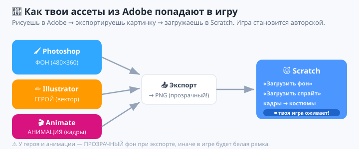
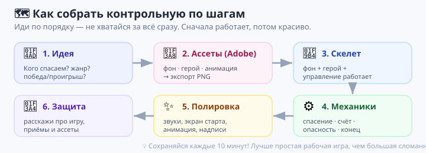
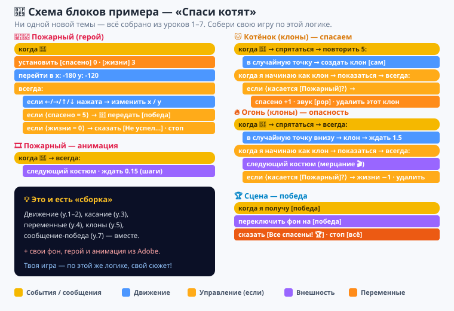

# Урок 9 — 🏆 Контрольная работа: «Спасательная миссия» 🚁

**Модуль 6 · Игры на Scratch · Урок 9 из 9 (ИТОГОВЫЙ) | 2 ак.ч. (можно 4 ак.ч.)**

> 🎓 Это **контрольная работа** за весь модуль. Ты собираешь **свою игру** и показываешь **всё, чему научился** за 8 уроков — плюс делаешь **свои картинки** в Photoshop, Illustrator и Animate.
> 🗺 Быстрая **шпаргалка по всем приёмам модуля** — в [повторение.md](повторение.md) (карта навыков).
> 🧪 **Тренажёр перед контрольной** (по 1 заданию на каждый навык) — в [самоучитель.md](самоучитель.md).
> 🎞 **Пример готовой игры** (двигается) — [`изображения/результат-спасение.svg`](изображения/результат-спасение.svg).
> 👨‍🏫 Критерии оценки, хронометраж и как защищать — в [преподавателю.md](преподавателю.md).

> 🧭 **Как читать урок.** Восемь уроков ты учился по частям: движение, циклы, условия, переменные, клоны, стрельба, сообщения, гравитация. Сегодня — **всё вместе**. Тема задана: **«Спасательная миссия»**. Твоя задача — придумать и собрать **свою** игру про спасение, нарисовать для неё **свои** ассеты в Adobe и **защитить** проект. Это твоя выпускная работа модуля — покажи, на что способен! 💪

---

## 🎯 Тема контрольной: «Спасательная миссия»

Твой герой должен кого-то или что-то **спасти**. Кого именно и как — решаешь **ты**:

- 🚁 спаси **питомца** (котёнка с дерева, щенка из реки);
- 🔥 спаси **друзей** из горящего дома (пожарный);
- 🌍 спаси **планету/город** от метеоритов, мусора, вируса;
- 🚀 спаси **космонавта**, застрявшего в космосе;
- 🏰 спаси **принцессу/друга** из подземелья;
- 🐢 спаси **животных** и выпусти на волю.

> 💡 Тема одна для всех — **«спасение»**, а **жанр выбираешь сам** из тех, что мы прошли: лабиринт, ловилка, стрелялка, раннер, игра с уровнями. Так каждый сделает **свою уникальную** игру на общую тему.

---

## 📋 Обязательные требования (что игра ДОЛЖНА содержать)

Чтобы игра была засчитана, в ней должно быть **минимум по одному** из каждого блока. Это как чек-лист «я умею»:

### 🧩 Программирование (Scratch) — обязательно:

| # | Требование | Из какого урока |
|---|------------|-----------------|
| 1 | **Управление** героем (клавиши или мышь) | уроки 1–2 |
| 2 | **Цикл** «всегда» + **условие** `если` (реакция на касание/клавишу) | уроки 1, 3 |
| 3 | **Переменная** со **счётом** (спасённые / очки / жизни) | урок 4 |
| 4 | **Проигрыш и/или победа** — конец игры (`стоп`, экран финала) | уроки 4, 7 |
| 5 | Ещё **любой 1 «продвинутый» приём** на выбор: **клоны** (у.5–6), **сообщения/уровни** (у.7) или **гравитация/прыжок** (у.8) | у.5–8 |

### 🎨 Свои ассеты (Adobe) — обязательно, входят в оценку:

| # | Что сделать | Где | Как попадает в игру |
|---|-------------|-----|---------------------|
| 6 | **Фон** игры | 🖌 **Photoshop** | экспорт PNG → «Загрузить фон» в Scratch |
| 7 | **Спрайт героя** (или предмета спасения) | ✏️ **Illustrator** | экспорт PNG/SVG → «Загрузить спрайт» |
| 8 | **Анимация** (2+ кадра: шаги героя, огонь, взмах) | 🎬 **Animate** | экспортируй кадры PNG → добавь как **костюмы** одного спрайта |

> 🎨 **Почему свои ассеты?** Ты уже умеешь рисовать в Adobe — покажи это! Игра со **своими** героем и фоном выглядит в 10 раз круче библиотечной и это **твоё авторское произведение**. Это межпредметная контрольная: программирование **+** графика **+** анимация.

> 🧩 **Для 5–7:** можно упростить — хотя бы **фон в Photoshop** и **герой в Illustrator**; анимацию — 2 костюма, нарисованные прямо в Scratch, если Animate не успеваете. Согласуй с учителем.

---

## 🗺 Этапы работы (как не запутаться)

Работай **по шагам** — не хватайся за всё сразу:

### Шаг 1 — Идея (5–7 мин) 💭
Ответь на 3 вопроса и запиши:
1. **Кого спасаем?** (котёнка / город / друга…)
2. **Какой жанр?** (лабиринт / ловилка / стрелялка / уровни / раннер)
3. **Как побеждаем и как проигрываем?** (спас всех за время / кончились жизни)

> 💡 Придумай **название** игры сразу — с ним проект «оживает».

### Шаг 2 — Ассеты в Adobe (20–30 мин) 🎨
- 🖌 **Photoshop:** нарисуй/собери **фон** (место действия). Размер 480×360 — как сцена Scratch. Экспорт: `Файл → Экспортировать → PNG`.
- ✏️ **Illustrator:** нарисуй **героя** (вектор — чёткий на любом размере). Экспорт PNG с прозрачным фоном.
- 🎬 **Animate:** сделай **2–4 кадра** анимации (шаг-шаг, огонь мерцает). Экспортируй кадры как PNG.

> ⚠️ **Прозрачный фон** у спрайтов! Экспортируй героя **без** белого прямоугольника вокруг — иначе в игре будет некрасивая рамка.

### Шаг 3 — Скелет игры (20 мин) 🦴
Собери **минимум**: фон + герой + управление. Убедись, что герой ходит. **Не украшай пока** — сначала работает, потом красиво.

### Шаг 4 — Механики (25–30 мин) ⚙️
Добавляй по одной: спасаемые (касание → +счёт) → опасности → счёт/жизни/таймер → продвинутый приём (клоны/сообщения/прыжок) → конец игры.

> 💡 После **каждой** добавленной механики — жми флажок и проверяй. Так легче найти ошибку.

### Шаг 5 — Полировка (10–15 мин) ✨
Звуки, экран старта/победы, анимация костюмов, аккуратные надписи счёта.

### Шаг 6 — Защита (по 2–3 мин на ученика) 🎤
Покажи игру классу и расскажи о ней (см. раздел «Защита» ниже).

---

## 💡 Пример-образец: «Спаси котят!» 🐱🔥

Чтобы было понятно, **как** совместить навыки — вот разбор одного примера. **Не копируй его** — сделай свою игру! Это только показывает, как всё соединяется.

**Идея:** пожарный бегает по горящему дому и спасает котят. Спас всех за время — победа; коснулся огня 3 раза — проигрыш.

**Что в нём собрано:**
- 🎮 **Движение** (у.1–2): пожарный по стрелкам.
- ⭐ **Условия + касание** (у.3): `если касается [котёнок]? → спасён +1`.
- 🔢 **Переменные + таймер** (у.4): `спасено`, `жизни`, обратный отсчёт.
- 👯 **Клоны** (у.5): языки огня-клоны появляются в случайных местах.
- 📣 **Сообщения** (у.7): все котята спасены → `передать [победа]` → экран победы.
- 🎨 **Свои ассеты:** фон-дом (Photoshop), пожарный (Illustrator), мерцающий огонь (Animate, 3 кадра).

**🎞 Так выглядит пример** (пожарный спасает котят, огонь мерцает, счёт растёт):

**🧩 Как собраны скрипты примера** (для понимания логики — собери свою по аналогии):

> 🧠 Видишь? Ни одной **новой** темы — только **уже известные** приёмы, собранные вместе. Твоя контрольная — про это же.

---

## ✅ Чек-лист самопроверки (перед сдачей)

Пройдись по списку — всё должно быть «да»:

**Программирование:**
- [ ] Герой **управляется** и не «залипает».
- [ ] Есть **условие** (реакция на касание/клавишу).
- [ ] Есть **переменная-счёт** (спасённые/очки/жизни).
- [ ] Есть **конец игры** (победа и/или проигрыш).
- [ ] Есть **1 продвинутый приём** (клоны / сообщения / гравитация).
- [ ] **Клоны удаляются** (если есть) — игра не тормозит.
- [ ] По флажку игра **начинается заново** корректно (счёт/позиции сброшены).

**Свои ассеты:**
- [ ] **Фон** сделан в Photoshop.
- [ ] **Герой** нарисован в Illustrator, фон **прозрачный**.
- [ ] Есть **анимация** (2+ костюма, Animate или Scratch).

**Оформление:**
- [ ] Есть **название** игры и понятно, **что делать** (надпись/старт-экран).
- [ ] Есть **звук** хотя бы на одно событие.
- [ ] Файл **сохранён** как `.sb3` (или опубликован ссылкой).

---

## 📊 Как оценивается (кратко)

| Что оценивается | Баллы |
|-----------------|------:|
| 🧩 Программирование (5 обязательных приёмов) | 50 |
| 🎨 Свои ассеты (Photoshop + Illustrator + Animate) | 25 |
| ✨ Игра работает без ошибок и доиграбельна | 10 |
| 🎤 Защита проекта (рассказал понятно) | 15 |
| **Итого** | **100** |

> 🎓 Подробная таблица с баллами по каждому пункту — у учителя ([преподавателю.md](преподавателю.md)). Бонусы — за оригинальную идею, аккуратность и «вау-эффект».

---

## 🎤 Защита проекта (что рассказать, 2–3 минуты)

Покажи игру и ответь:

1. **Название и идея:** «Моя игра называется … Ты играешь за … и должен спасти …».
2. **Как играть:** управление и цель (что делать игроку).
3. **Мои приёмы:** «Здесь я использовал переменную для счёта, клоны для …, сообщение для победы».
4. **Мои ассеты:** «Фон я нарисовал в Photoshop, героя — в Illustrator, огонь анимировал в Animate».
5. **Что было сложно** и как справился (самое ценное — про преодоление!).
6. **Что бы добавил**, будь больше времени.

> 💡 **Секрет хорошей защиты:** говори про **своё решение**, а не «ну, тут просто игра». Расскажи, как ты **придумал** и **починил** — это и есть навык программиста.

---

## 🏆 Портфолио

Готовую игру — **в портфолио**:

- Сохрани `.sb3` и (по желанию) опубликуй на [scratch.mit.edu](https://scratch.mit.edu) — получишь **ссылку**, которой можно поделиться.
- Сделай **скриншот** игры (красивый кадр) — для портфолио и презентации.
- Добавь короткое описание: название, жанр, что умеет, какие инструменты использовал.

> 🌟 Это твой **первый настоящий игровой проект** — от идеи и графики до кода и защиты. Им можно гордиться и показывать друзьям, родителям, на конкурсах.

---

## 🏁 Итог модуля (5 минут)

За 9 уроков ты прошёл путь **от «оживил котика» до собственной игры**:

- ✅ Движение, костюмы, циклы, события (у.1–2).
- ✅ Условия и касания (у.3).
- ✅ Переменные, счёт, таймер (у.4).
- ✅ Клоны и случайность (у.5–6).
- ✅ Сообщения и уровни (у.7).
- ✅ Гравитация и прыжок (у.8).
- ✅ **Своя игра** с авторской графикой и защитой (у.9)!

> 🏆 Ты **программист-геймдизайнер**! Ты умеешь придумать игру, нарисовать её, запрограммировать и рассказать о ней. Впереди — модули про **3D-игры (Kodu)** и **модели для Minecraft (BlockBench)**. Игры ты уже делать умеешь! 🎮

### 🎮 Итоговая викторина по всему модулю

Открой **[викторина.html](викторина.html)** — 16 вопросов **по всем 8 темам** модуля: от движения до гравитации. Проверь, всё ли помнишь!

---

## 🔗 Материалы и ссылки

**🧰 Инструменты:** Scratch ([онлайн](https://scratch.mit.edu/projects/editor/) / [Desktop](https://scratch.mit.edu/download)) + Photoshop, Illustrator, Animate (модули 2–4).

**📄 Помощь по контрольной:**
- 🗺 [повторение.md](повторение.md) — карта всех приёмов модуля (шпаргалка).
- 🧪 [самоучитель.md](самоучитель.md) — тренажёр: по 1 заданию на каждый навык + идеи по теме.
- 💡 [практика.md](практика.md) — банк идей и расширений «Спасательной миссии».
- 🧰 [лайфхак.md](лайфхак.md) — как всё успеть, полировка, экспорт ассетов из Adobe.

**⚙️ Учителю:** таблица оценки с баллами, хронометраж (2 или 4 ак.ч.), как принимать защиту и типичные ошибки — в [преподавателю.md](преподавателю.md).
