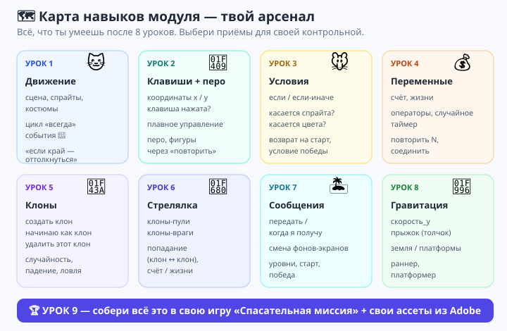

# 🗺 Шпаргалка перед контрольной — все приёмы модуля

**Модуль 6 · Урок 9 · Карта навыков (повторение всего курса)**

> Перед контрольной пробеги глазами **все приёмы** за 8 уроков. Это твой «арсенал» — выбери из него то, что нужно для своей игры.



---

## 🎮 Урок 1–2 — Движение и управление

```
когда 🚩 → всегда → если <клавиша [→] нажата?> → изменить x на 10
```
- `изменить x/y на …`, `перейти в x: y:`, `идти … шагов`.
- `если на краю, оттолкнуться`, способ вращения.
- Костюмы: `следующий костюм`, `переключить костюм на […]`.

## 🐭 Урок 3 — Условия

```
если <касается [спрайт]?> то … иначе …
если <касается цвета (■)?> то …
```
- `если` и `если/иначе`, касание спрайта/цвета, возврат на старт, условие победы.

## 🔢 Урок 4 — Переменные и счёт

```
установить [счёт] в 0 · изменить [счёт] на 1
сбросить таймер · ждать до <таймер > 30>
соединить [Счёт: ] (счёт)
```
- Переменные, операторы (`случайное`, `+`, `×`), таймер, `повторить N`.

## 👯 Урок 5–6 — Клоны и случайность

```
создать клон [сам]
когда я начинаю как клон → показаться → всегда (падать/лететь)
удалить этот клон
```
- Родитель прячется и штампует; клон живёт сам; **обязательно удалять** (лимит 300).
- Стрельба: `перейти к [Ракета] → создать клон`; попадание: `касается [клон]?`.

## 📣 Урок 7 — Сообщения и уровни

```
передать [новый уровень]   ·   когда я получу [новый уровень]
переключить фон на [уровень2]
```
- Один сигнал → много реакций; Сцена-дирижёр меняет экраны; цепочка сигналов.

## 🦖 Урок 8 — Гравитация и прыжок

```
всегда → изменить [скорость_y] на -1 → изменить y на (скорость_y)
если <y = земля> → скорость_y = 0
когда клавиша [пробел] → если <на земле> → скорость_y = 13
```
- Движок гравитации, прыжок-толчок только с земли, «стою на цвете» = платформер.

---

## 🎨 И не забудь — свои ассеты!

| Инструмент | Что делаем для игры |
|-----------|---------------------|
| 🖌 **Photoshop** | фон (место действия), 480×360, экспорт PNG |
| ✏️ **Illustrator** | герой/предметы (вектор), PNG с прозрачным фоном |
| 🎬 **Animate** | анимация (шаги, огонь), кадры → костюмы в Scratch |

> 💪 Всё это ты уже умеешь. Контрольная — не «новое», а **сборка знакомого** в свою игру. Спокойно выбирай приёмы из этой шпаргалки!
