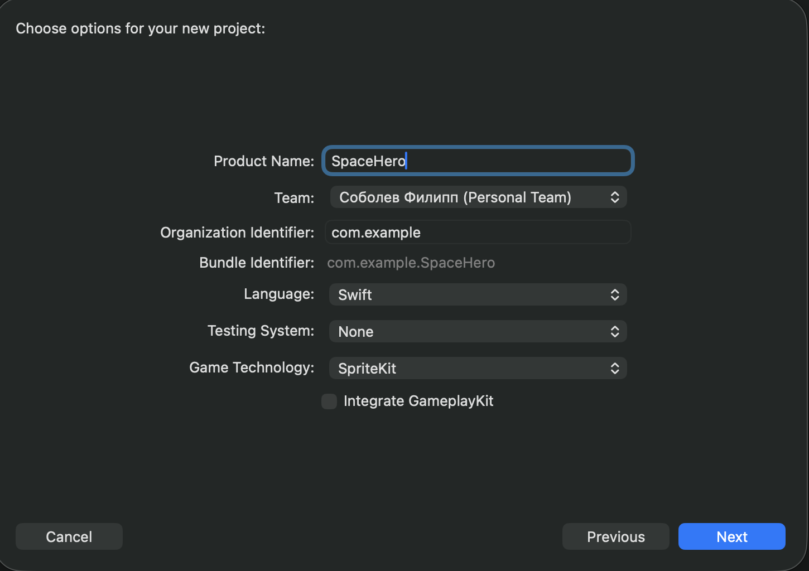

# Урок 13 — Теория: SpriteKit с нуля

---

## Блок 0 — Создаём проект в Xcode

Первым делом показываем ребёнку как создать игровой проект. Это отличается от обычного приложения.

### Шаг 1 — Создать проект

```
Xcode → File → New → Project...
```

В появившемся окне выбираем вкладку **iOS** → шаблон **Game** → Next



Заполняем поля:
- **Product Name:** `SpaceHero`
- **Team:** не важно (None или твой Apple ID)
- **Organization Identifier:** `com.lesson` (любое)
- **Language:** Swift
- **Game Technology:** SpriteKit ← обязательно!
- Interface: нет такого поля в новых версиях — пропускаем

Нажимаем **Next** → выбираем папку → **Create**

---

### Шаг 2 — Что Xcode создал автоматически

После создания проекта в левой панели (Navigator) увидим несколько файлов:

```
SpaceHero/
├── AppDelegate.swift        ← запуск приложения (не трогаем)
├── GameViewController.swift ← экран UIKit который держит игру
├── GameScene.swift          ← ВОТ ТУТ пишем нашу игру
├── GameScene.sks            ← визуальный редактор сцены (нам не нужен)
├── Actions.sks              ← заготовки анимаций (не трогаем)
└── Assets.xcassets          ← папка для картинок и звуков
```

**Объясни ребёнку:** «Мы будем работать только с `GameScene.swift`. Остальные файлы либо не трогаем, либо разберём позже».

---

### Шаг 3 — Открыть GameScene.swift и почистить

Нажимаем на `GameScene.swift` в левой панели.

Xcode покажет стандартный пример с вращающимся самолётом. Нам он не нужен.

**Удаляем всё содержимое** внутри класса (между фигурными скобками `{` `}`), оставляем только скелет:

```swift
import SpriteKit

class GameScene: SKScene {

    // сюда будем писать наш код

}
```

---

### Шаг 4 — Исправить GameViewController.swift

Открываем `GameViewController.swift`. Там есть стандартный код который загружает сцену из файла `.sks`. Нам удобнее загружать её программно — так работает на любом iPhone.

Находим метод `viewDidLoad` и **заменяем всё его содержимое**:

```swift
override func viewDidLoad() {
    super.viewDidLoad()

    if let view = self.view as? SKView {
        // Создаём сцену по размеру реального экрана
        let scene = GameScene(size: view.bounds.size)
        scene.scaleMode = .resizeFill

        view.presentScene(scene)
        view.ignoresSiblingOrder = true

        // Раскомментируй для отладки (показывает FPS и количество объектов):
        // view.showsFPS = true
        // view.showsNodeCount = true
    }
}
```

---

### Шаг 5 — Запустить пустую сцену

Нажимаем кнопку ▶ (Run) вверху или `Cmd + R`.

Выбираем симулятор — например **iPhone 15** или **iPhone 14**.

Должен запуститься **чёрный экран** — это наша пустая сцена. Всё работает!

> Если экран серый или крашится — скорее всего не заменили код в GameViewController. Проверяем ещё раз.

---

## Блок 1 — Как устроена игровая сцена

### Структура игры: слои как в Godot

```
iPhone
  └── UIWindow
        └── GameViewController    ← обычный контроллер UIKit
              └── SKView           ← "холст" для игры, занимает весь экран
                    └── SKScene    ← наш игровой уровень
                          ├── node1 (SKSpriteNode) ← персонаж
                          ├── node2 (SKSpriteNode) ← враг
                          ├── node3 (SKLabelNode)  ← текст счёта
                          └── node4 (SKShapeNode)  ← фигура
```

**Аналогия с Godot для ребёнка:**

| Godot | SpriteKit | Что это |
|---|---|---|
| Scene (.tscn файл) | SKScene | Игровой уровень |
| Node2D | SKNode | Базовый невидимый объект |
| Sprite2D | SKSpriteNode | Картинка / персонаж |
| Label | SKLabelNode | Текст на экране |
| ColorRect | SKShapeNode | Цветная фигура |
| AnimatedSprite2D | SKAction | Анимация движения |
| add_child() | addChild() | Добавить объект |
| _ready() | didMove(to:) | При загрузке сцены |
| _process() | update() | Каждый кадр |
| _input() | touchesBegan() | При касании |

---

### Жизненный цикл сцены

```swift
class GameScene: SKScene {

    // 1. Вызывается ОДИН РАЗ когда сцена появилась на экране
    //    Здесь создаём все объекты — персонажа, фон, счёт
    override func didMove(to view: SKView) {

    }

    // 2. Вызывается при КАЖДОМ касании пальцем
    override func touchesBegan(_ touches: Set<UITouch>, with event: UIEvent?) {

    }

    // 3. Вызывается 60 РАЗ В СЕКУНДУ (каждый кадр)
    //    Здесь обновляем логику — движение, проверки
    override func update(_ currentTime: TimeInterval) {

    }
}
```

> **Объясни ребёнку:** `didMove` — это как `_ready()` в Godot. Запускается один раз при старте. `update` — как `_process()`. `touchesBegan` — как `_input()` но только для касаний.

---

## Блок 2 — Координаты в SpriteKit

Это важно — координаты работают **иначе** чем в UIKit и в большинстве игровых движков.

### В UIKit (кнопки, таблицы):
- (0, 0) — **левый ВЕРХНИЙ** угол
- Y растёт **вниз**

### В SpriteKit:
- (0, 0) — **левый НИЖНИЙ** угол
- Y растёт **вверх** — как в математике!

```
SpriteKit координаты на iPhone 14 (390 × 844):

(0, 844) ───────── (390, 844)   ← верхний край
    │                   │
    │     (195, 422)    │       ← центр экрана
    │                   │
(0, 0)  ─────────  (390, 0)    ← нижний край (0,0 здесь!)
```

**Полезные позиции:**
```swift
// Центр экрана
CGPoint(x: size.width / 2, y: size.height / 2)

// Левый нижний угол
CGPoint(x: 0, y: 0)

// Правый верхний угол
CGPoint(x: size.width, y: size.height)

// Верхний центр (для счёта)
CGPoint(x: size.width / 2, y: size.height - 50)

// Нижний центр (для кнопок)
CGPoint(x: size.width / 2, y: 50)
```

---

## Блок 3 — SKSpriteNode: спрайты

`SKSpriteNode` — главный объект в SpriteKit. Им можно сделать всё: персонажа, врага, фон, кнопку.

### Способ 1 — из картинки (самый частый)

Сначала картинку нужно добавить в проект:
1. Перетащить файл `.png` в `Assets.xcassets` в левой панели
2. Назвать его, например `hero`

```swift
// imageNamed — имя файла БЕЗ расширения
let hero = SKSpriteNode(imageNamed: "hero")
hero.position = CGPoint(x: 200, y: 300)
addChild(hero)
```

### Способ 2 — из цвета (когда нет картинки)

```swift
// Создаём цветной прямоугольник
let box = SKSpriteNode(color: .red, size: CGSize(width: 60, height: 60))
box.position = CGPoint(x: 100, y: 200)
addChild(box)
```

### Основные свойства SKSpriteNode

```swift
let sprite = SKSpriteNode(color: .blue, size: CGSize(width: 80, height: 80))

// --- Позиция и размер ---
sprite.position = CGPoint(x: 195, y: 400)   // где стоит
sprite.size = CGSize(width: 100, height: 100) // размер
sprite.zPosition = 1                          // слой (выше = поверх других)

// --- Вращение ---
sprite.zRotation = 0.5    // в радианах (0.5 ≈ 30 градусов)

// --- Масштаб ---
sprite.setScale(2.0)      // увеличить в 2 раза
sprite.xScale = -1        // зеркальное отражение по горизонтали

// --- Прозрачность ---
sprite.alpha = 0.5        // 0.0 = невидимый, 1.0 = полностью видимый

// --- Цвет ---
sprite.color = .green
sprite.colorBlendFactor = 1.0  // насколько сильно перекрасить картинку

// --- Якорная точка (вокруг чего вращается и позиционируется) ---
sprite.anchorPoint = CGPoint(x: 0.5, y: 0.5)  // центр (по умолчанию)
sprite.anchorPoint = CGPoint(x: 0.0, y: 0.0)  // левый нижний угол

// --- Добавить на сцену ---
addChild(sprite)

// --- Удалить со сцены ---
sprite.removeFromParent()
```

### Вложенные спрайты (parent → child)

Спрайты можно вкладывать друг в друга — как узлы в Godot. Дочерний объект движется вместе с родителем.

```swift
// Создаём "тело" персонажа
let body = SKSpriteNode(color: .blue, size: CGSize(width: 60, height: 60))
body.position = CGPoint(x: 195, y: 400)

// Создаём "голову" — она будет дочерним объектом тела
let head = SKSpriteNode(color: .yellow, size: CGSize(width: 40, height: 40))
// Позиция относительно РОДИТЕЛЯ, а не сцены!
head.position = CGPoint(x: 0, y: 50)

// Добавляем голову К ТЕЛУ (не к сцене!)
body.addChild(head)

// Добавляем тело на сцену
addChild(body)

// Теперь если двигать body — голова двигается вместе с ним
```

---

## Блок 4 — SKLabelNode: текст на экране

`SKLabelNode` — текст. Используется для счёта, надписей, кнопок.

```swift
// Создать метку
let label = SKLabelNode(fontNamed: "Helvetica-Bold")

// Текст
label.text = "Счёт: 0"

// Размер шрифта
label.fontSize = 24

// Цвет текста
label.fontColor = .white

// Позиция
label.position = CGPoint(x: size.width / 2, y: size.height - 60)

// Выравнивание по горизонтали
label.horizontalAlignmentMode = .center  // .left, .right, .center

// Выравнивание по вертикали
label.verticalAlignmentMode = .center    // .top, .bottom, .center

// Добавить на сцену
addChild(label)

// Изменить текст позже
label.text = "Счёт: \(score)"
```

### Встроенные шрифты которые точно работают

```swift
"Helvetica-Bold"       // жирный, читаемый
"Helvetica"            // обычный
"Arial-BoldMT"         // похож на Helvetica Bold
"Courier-Bold"         // моноширинный, как в терминале
"Georgia-Bold"         // с засечками, красивый
"AvenirNext-Bold"      // современный, тонкий
"Chalkduster"          // мелованный, игровой стиль
"MarkerFelt-Wide"      // неформальный, детский стиль
```

---

## Блок 5 — SKShapeNode: фигуры 

`SKShapeNode` — рисуем фигуры кодом без картинок. Удобно для простых объектов и отладки.

```swift
// --- Круг ---
let circle = SKShapeNode(circleOfRadius: 30)
circle.fillColor = .red
circle.strokeColor = .white   // цвет обводки
circle.lineWidth = 2          // толщина обводки
circle.position = CGPoint(x: 100, y: 200)
addChild(circle)

// --- Прямоугольник ---
let rect = SKShapeNode(rectOf: CGSize(width: 100, height: 60))
rect.fillColor = .blue
rect.strokeColor = .clear   // без обводки
rect.position = CGPoint(x: 200, y: 300)
addChild(rect)

// --- Прямоугольник с закруглёнными углами ---
let rounded = SKShapeNode(rectOf: CGSize(width: 100, height: 60), cornerRadius: 12)
rounded.fillColor = .green
rounded.position = CGPoint(x: 200, y: 300)
addChild(rounded)

// --- Эллипс ---
let ellipse = SKShapeNode(ellipseOf: CGSize(width: 120, height: 60))
ellipse.fillColor = .orange
ellipse.position = CGPoint(x: 195, y: 400)
addChild(ellipse)
```

> **Совет:** `strokeColor = .clear` убирает обводку. По умолчанию у SKShapeNode белая обводка — не забывай её убирать когда не нужна.

---

## Блок 5.5 — Цвета: как перевести RGB в Swift

### Почему цвета выглядят странно?

В SpriteKit цвет задаётся числами от **0.0 до 1.0**, а не от 0 до 255 как мы привыкли.

```swift
// Выглядит непонятно — что за 0.05?
backgroundColor = SKColor(red: 0.05, green: 0.05, blue: 0.2, alpha: 1.0)
```

### Как перевести — формула

```
обычный RGB ÷ 255 = значение для Swift
```

Например нам нужен цвет `rgb(13, 13, 51)` — тёмно-синий:

```
13  ÷ 255 = 0.05  → red:   0.05
13  ÷ 255 = 0.05  → green: 0.05
51  ÷ 255 = 0.2   → blue:  0.2
```

> **Объясни ребёнку:** «Представь что 255 — это 100%. Тогда 13 из 255 — это примерно 5%, то есть 0.05. Swift просто хочет проценты вместо чисел».

### Способ 1 — посчитать в калькуляторе

```
нужный цвет: rgb(255, 87, 34)
255 ÷ 255 = 1.0
87  ÷ 255 ≈ 0.341
34  ÷ 255 ≈ 0.133

SKColor(red: 1.0, green: 0.341, blue: 0.133, alpha: 1.0)
```

### Способ 2 — расширение `.rgb()` (рекомендуется)

Добавить один раз в проект — и дальше писать привычные числа:

```swift
// Вставить в любой .swift файл проекта (например прямо под import SpriteKit)
extension SKColor {
    static func rgb(_ r: CGFloat, _ g: CGFloat, _ b: CGFloat) -> SKColor {
        return SKColor(red: r/255, green: g/255, blue: b/255, alpha: 1.0)
    }
}
```

После этого можно писать:

```swift
backgroundColor = .rgb(13, 13, 51)
let heroColor   = SKColor.rgb(76, 204, 255)
let enemyColor  = SKColor.rgb(255, 76, 76)
let goldColor   = SKColor.rgb(255, 204, 0)
```

### Способ 3 — HEX цвет (копируешь из любого дизайнера)

```swift
// Вставить в любой .swift файл проекта
extension SKColor {
    convenience init(hex: String) {
        let hex = hex.trimmingCharacters(in: CharacterSet.alphanumerics.inverted)
        var int: UInt64 = 0
        Scanner(string: hex).scanHexInt64(&int)
        let r = CGFloat((int >> 16) & 0xFF) / 255
        let g = CGFloat((int >> 8)  & 0xFF) / 255
        let b = CGFloat(int         & 0xFF) / 255
        self.init(red: r, green: g, blue: b, alpha: 1.0)
    }
}
```

После этого можно брать HEX прямо из любого инструмента (Google, Figma, Photoshop):

```swift
backgroundColor = SKColor(hex: "#0D0D33")
let orange      = SKColor(hex: "FF5722")
let mint        = SKColor(hex: "#00C9A7")
```

> **Совет для урока:** добавь расширение `.rgb()` в самом начале проекта — ребёнку будет понятнее работать с числами 0–255 чем с дробями. HEX тоже можно добавить, это пригодится когда будет подбирать цвета по-настоящему.

---

## Блок 6 — addChild и removeFromParent

Любой объект чтобы появиться на экране нужно добавить на сцену через `addChild`.

```swift
// Правило: сначала настрой объект, потом добавь

let star = SKShapeNode(circleOfRadius: 5)
star.fillColor = .white
star.position = CGPoint(x: 100, y: 200)

addChild(star)         // добавить на сцену (сцена = self)
// или:
self.addChild(star)    // то же самое, self = текущая сцена
```

### Вложенность: addChild vs сцена

```swift
// Добавить на сцену
addChild(hero)

// Добавить на другой объект (дочерний)
hero.addChild(healthBar)    // healthBar будет частью hero

// Удалить объект со сцены
hero.removeFromParent()

// Удалить всех детей объекта
hero.removeAllChildren()

// Удалить все объекты со сцены
removeAllChildren()
```

### Частая ошибка — добавить дважды

```swift
// ❌ ОШИБКА — крашнется! Нельзя добавить один объект дважды
addChild(hero)
addChild(hero)   // EXC_BAD_ACCESS

// ✅ Правильно — проверить перед добавлением
if hero.parent == nil {
    addChild(hero)
}
```

---

## Блок 7 — zPosition: кто поверх кого (2 минуты)

По умолчанию объекты рисуются в порядке добавления — последний добавленный сверху. Но это можно управлять через `zPosition`.

```swift
let background = SKSpriteNode(imageNamed: "bg")
background.zPosition = 0    // самый нижний слой — фон

let enemy = SKSpriteNode(imageNamed: "enemy")
enemy.zPosition = 1          // поверх фона

let hero = SKSpriteNode(imageNamed: "hero")
hero.zPosition = 2           // поверх врагов

let hud = SKLabelNode(fontNamed: "Helvetica-Bold")
hud.text = "100"
hud.zPosition = 10           // интерфейс всегда поверх всего
```

> **Правило:** фон = 0, игровые объекты = 1–5, интерфейс (счёт, кнопки) = 10+

---

## Блок 8 — Итоговая шпаргалка по типам объектов

| Тип | Когда использовать | Создание |
|---|---|---|
| `SKSpriteNode` | Персонаж, враг, фон, кнопка с картинкой | `SKSpriteNode(imageNamed:)` или `(color:size:)` |
| `SKLabelNode` | Счёт, надписи, текстовые кнопки | `SKLabelNode(fontNamed:)` |
| `SKShapeNode` | Простые фигуры, отладка, эффекты | `SKShapeNode(circleOfRadius:)` и др. |
| `SKNode` | Невидимый контейнер для группировки | `SKNode()` |
| `SKEmitterNode` | Частицы: взрывы, огонь, звёзды | из `.sks` файла частиц |

---

## Блок 9 — Мини-примеры «сделай прямо сейчас»

Эти примеры можно вставить прямо в `didMove` и сразу запустить — каждый занимает 1–2 минуты.

### Пример 1 — Цветной квадрат в центре

```swift
override func didMove(to view: SKView) {
    backgroundColor = .darkGray

    let box = SKSpriteNode(color: .systemBlue, size: CGSize(width: 100, height: 100))
    box.position = CGPoint(x: size.width / 2, y: size.height / 2)
    addChild(box)
}
```

### Пример 2 — Текст «Привет»

```swift
override func didMove(to view: SKView) {
    backgroundColor = .black

    let label = SKLabelNode(fontNamed: "Chalkduster")
    label.text = "Привет!"
    label.fontSize = 40
    label.fontColor = .yellow
    label.position = CGPoint(x: size.width / 2, y: size.height / 2)
    addChild(label)
}
```

### Пример 3 — Три круга разного цвета

```swift
override func didMove(to view: SKView) {
    backgroundColor = .black

    let colors: [SKColor] = [.red, .green, .blue]
    let positions: [CGFloat] = [100, 195, 290]

    for i in 0..<3 {
        let circle = SKShapeNode(circleOfRadius: 40)
        circle.fillColor = colors[i]
        circle.strokeColor = .clear
        circle.position = CGPoint(x: positions[i], y: size.height / 2)
        addChild(circle)
    }
}
```

### Пример 4 — Спрайт + текст поверх него

```swift
override func didMove(to view: SKView) {
    backgroundColor = .darkGray

    // Карточка игрока
    let card = SKShapeNode(rectOf: CGSize(width: 160, height: 200), cornerRadius: 16)
    card.fillColor = SKColor(red: 0.2, green: 0.2, blue: 0.4, alpha: 1.0)
    card.strokeColor = .white
    card.lineWidth = 2
    card.position = CGPoint(x: size.width / 2, y: size.height / 2)
    card.zPosition = 1
    addChild(card)

    // Имя поверх карточки
    let name = SKLabelNode(fontNamed: "Helvetica-Bold")
    name.text = "Игрок 1"
    name.fontSize = 20
    name.fontColor = .white
    name.position = CGPoint(x: size.width / 2, y: size.height / 2 - 60)
    name.zPosition = 2
    addChild(name)

    // Очки
    let score = SKLabelNode(fontNamed: "Helvetica")
    score.text = "⭐ 1250 очков"
    score.fontSize = 16
    score.fontColor = .yellow
    score.position = CGPoint(x: size.width / 2, y: size.height / 2 - 90)
    score.zPosition = 2
    addChild(score)
}
```

---

## Частые ошибки начинающих

| Ошибка | Что происходит | Как исправить |
|---|---|---|
| Забыл `addChild()` | Объект создан но не виден | Добавить `addChild(объект)` |
| Неправильные координаты | Объект за пределами экрана | Помнить: Y снизу. Центр = `(width/2, height/2)` |
| Добавил объект дважды | Краш приложения | Проверить `if hero.parent == nil` |
| Текст не виден | Белый текст на белом фоне | Поменять `fontColor` или фон |
| `size.width` равен 0 | Сцена ещё не загружена | Использовать `size` только внутри `didMove` |
| Объект добавлен не на ту сцену | Объект не виден или не там | Проверить: `addChild` или `другойОбъект.addChild` |

---

## ⭐ Бонус — Визуальный редактор GameScene.sks

Объекты можно добавлять не только кодом, но и мышкой — через встроенный редактор `.sks`. Это как редактор сцен в Godot.

> **Когда показывать:** если ребёнок справился с основным заданием и остаётся время, или если сам спросит «а можно как в Godot мышкой?»

### Как открыть редактор

Нажать на файл `GameScene.sks` в левой панели Xcode. Откроется серое поле — это и есть сцена.

```
Левая панель (Navigator)
  └── SpaceHero/
        ├── GameScene.swift   ← код
        └── GameScene.sks     ← визуальный редактор  ← нажать сюда
```

### Как добавить объект мышкой

1. Открыть `GameScene.sks`
2. Нажать кнопку **+** в правом верхнем углу Xcode (библиотека объектов)
3. В поиске написать нужный тип:
   - `Color Sprite` — цветной спрайт
   - `Label` — текст
   - `Shape` — фигура
4. Перетащить объект на серое поле сцены
5. В правой панели (**Attributes Inspector**) настроить:
   - **Name** — имя объекта (обязательно! по нему найдём в коде)
   - **Position** — координаты X и Y
   - **Size** — ширина и высота
   - **Color** — цвет

### Как получить объект из редактора в коде

После того как дали объекту имя в редакторе — находим его в `GameScene.swift` через `childNode(withName:)`:

```swift
override func didMove(to view: SKView) {

    // Найти спрайт по имени "hero" (имя задали в редакторе)
    if let hero = childNode(withName: "hero") as? SKSpriteNode {
        hero.color = .cyan
        hero.size = CGSize(width: 80, height: 80)
    }

    // Найти метку по имени "scoreLabel"
    if let label = childNode(withName: "scoreLabel") as? SKLabelNode {
        label.text = "Счёт: 0"
        label.fontColor = .white
    }

    // Найти фигуру по имени "platform"
    if let platform = childNode(withName: "platform") as? SKShapeNode {
        platform.fillColor = .green
    }
}
```

### Когда использовать редактор, а когда код

| Ситуация | Лучший способ | Почему |
|---|---|---|
| Статичный фон, платформы | Редактор `.sks` | Сразу видно как выглядит, не надо угадывать координаты |
| Декорации уровня | Редактор `.sks` | Быстро расставить мышкой |
| Враги, пули, эффекты | Только код | Создаются динамически во время игры |
| Счёт, кнопки интерфейса | Код | Легче обновлять текст и позицию |
| Прототип / проверяешь идею | Редактор `.sks` | Быстро посмотреть как будет выглядеть |

### Важные особенности редактора

**Размер сцены в редакторе** может отличаться от реального экрана. Чтобы это не мешало — нажать на серый фон сцены (не на объект) и в правой панели выставить:
- Width: `390`
- Height: `844`

Это размер iPhone 14. Объекты из редактора появятся ровно там где ты их поставил.

**Если используешь и редактор и код** — не вызывай `GameScene(size: view.bounds.size)` в GameViewController, а загружай из файла:

```swift
// GameViewController.swift — загрузка сцены из .sks файла
override func viewDidLoad() {
    super.viewDidLoad()

    if let view = self.view as? SKView {
        // Загружаем сцену из файла GameScene.sks
        if let scene = SKScene(fileNamed: "GameScene") {
            scene.scaleMode = .aspectFill
            view.presentScene(scene)
        }
        view.ignoresSiblingOrder = true
    }
}
```

### Мини-задание для бонуса

1. Открыть `GameScene.sks`
2. Добавить через редактор: цветной спрайт, метку с текстом, любую фигуру
3. Дать каждому имя: `"box"`, `"title"`, `"circle"`
4. В `GameScene.swift` найти их через `childNode(withName:)` и поменять цвет или текст кодом
5. Запустить и убедиться что объекты из редактора появились на экране

---

## Проект урока — «Персонаж на экране»

### Что делает готовый проект

- Тёмно-синий фон с 80 случайными звёздами
- Персонаж (синий квадрат с глазами) стоит в центре экрана
- При нажатии на любое место — персонаж **плавно перемещается** туда
- Персонаж разворачивается в сторону движения (зеркалится)
- Скорость движения постоянная — не зависит от расстояния
- В месте касания появляется жёлтый кружок и исчезает
- В верхней части экрана — счётчик нажатий

---

### Таймлайн урока

| Время | Что делаем |
|---|---|
| 0–5 мин | Разминка — аналогия с Godot, таблица сравнения |
| 5–15 мин | Теория: структура SpriteKit, координаты, типы объектов |
| 15–20 мин | Создаём проект в Xcode, чистим GameScene, правим GameViewController |
| 20–40 мин | Пишем проект вместе по шагам |
| 40–45 мин | Запускаем, смотрим результат, объясняем домашнее задание |

---

### Шаг 1 — Создать проект

```
File → New → Project → iOS → Game
```

- **Product Name:** `SpaceHero`
- **Language:** Swift
- **Game Technology:** SpriteKit

---

### Шаг 2 — Исправить GameViewController.swift

Открыть `GameViewController.swift`, найти метод `viewDidLoad` и заменить его содержимое:

```swift
override func viewDidLoad() {
    super.viewDidLoad()

    if let view = self.view as? SKView {
        let scene = GameScene(size: view.bounds.size)
        scene.scaleMode = .resizeFill
        view.presentScene(scene)
        view.ignoresSiblingOrder = true

        // Раскомментируй для отладки:
        // view.showsFPS = true
        // view.showsNodeCount = true
    }
}
```

---

### Шаг 3 — Очистить GameScene.swift

Удалить всё содержимое файла и вставить чистый скелет:

```swift
import SpriteKit

class GameScene: SKScene {

}
```

Запустить (`Cmd+R`) — должен появиться **чёрный экран**. Значит всё работает.

---

### Шаг 4 — Добавляем свойства и фон

Пишем по шагу, после каждого запускаем и смотрим результат:

```swift
import SpriteKit

class GameScene: SKScene {

    // Свойства сцены — переменные которые нужны во всём классе
    var hero: SKSpriteNode!
    var scoreLabel: SKLabelNode!
    var tapCount = 0

    // Загрузка сцены — вызывается один раз при старте
    override func didMove(to view: SKView) {
        setupBackground()
    }

    func setupBackground() {
        // Тёмно-синий фон
        backgroundColor = SKColor(red: 0.05, green: 0.05, blue: 0.2, alpha: 1.0)

        // 80 случайных звёзд
        for _ in 0..<80 {
            let star = SKShapeNode(circleOfRadius: CGFloat.random(in: 0.5...2))
            star.fillColor = .white
            star.strokeColor = .clear
            star.alpha = CGFloat.random(in: 0.3...1.0)
            star.position = CGPoint(
                x: CGFloat.random(in: 0...size.width),
                y: CGFloat.random(in: 0...size.height)
            )
            addChild(star)
        }
    }
}
```

▶ **Запустить** — должны появиться звёзды на тёмном фоне.

> **Объясни ребёнку:** `for _ in 0..<80` — повторить 80 раз. `_` вместо переменной — потому что номер повторения нам не нужен. Это то же самое что `for i in range(80)` в Python.

---

### Шаг 5 — Добавляем персонажа

Добавить функцию `setupHero()` и вызвать её в `didMove`:

```swift
override func didMove(to view: SKView) {
    setupBackground()
    setupHero()          // ← добавили
}

func setupHero() {
    // Создаём контейнер для персонажа
    hero = SKSpriteNode(color: .clear, size: CGSize(width: 70, height: 70))

    // Тело — синий квадрат с закруглёнными углами
    let body = SKShapeNode(rectOf: CGSize(width: 60, height: 60), cornerRadius: 12)
    body.fillColor = SKColor(red: 0.3, green: 0.8, blue: 1.0, alpha: 1.0)
    body.strokeColor = .white
    body.lineWidth = 2
    hero.addChild(body)

    // Левый глаз
    let leftEye = SKShapeNode(circleOfRadius: 8)
    leftEye.fillColor = .white
    leftEye.position = CGPoint(x: -12, y: 8)
    hero.addChild(leftEye)

    // Правый глаз
    let rightEye = SKShapeNode(circleOfRadius: 8)
    rightEye.fillColor = .white
    rightEye.position = CGPoint(x: 12, y: 8)
    hero.addChild(rightEye)

    // Левый зрачок
    let leftPupil = SKShapeNode(circleOfRadius: 4)
    leftPupil.fillColor = .black
    leftPupil.position = CGPoint(x: -12, y: 8)
    hero.addChild(leftPupil)

    // Правый зрачок
    let rightPupil = SKShapeNode(circleOfRadius: 4)
    rightPupil.fillColor = .black
    rightPupil.position = CGPoint(x: 12, y: 8)
    hero.addChild(rightPupil)

    // Ставим персонажа в центр экрана
    hero.position = CGPoint(x: size.width / 2, y: size.height / 2)

    // Добавляем на сцену — как add_child() в Godot!
    addChild(hero)
}
```

▶ **Запустить** — должен появиться персонаж с глазами в центре экрана.

> **Объясни ребёнку:** вложенные `addChild` — персонаж состоит из нескольких фигур. Глаза добавлены к `hero`, а `hero` добавлен к сцене. Если двигать `hero` — глаза двигаются вместе.

---

### Шаг 6 — Добавляем счётчик

```swift
override func didMove(to view: SKView) {
    setupBackground()
    setupHero()
    setupScoreLabel()    // ← добавили
}

func setupScoreLabel() {
    scoreLabel = SKLabelNode(fontNamed: "Helvetica-Bold")
    scoreLabel.text = "Нажатий: 0"
    scoreLabel.fontSize = 22
    scoreLabel.fontColor = .white
    scoreLabel.position = CGPoint(x: size.width / 2, y: size.height - 60)
    scoreLabel.horizontalAlignmentMode = .center
    scoreLabel.zPosition = 10   // поверх всего
    addChild(scoreLabel)
}
```

▶ **Запустить** — в верхней части появится надпись «Нажатий: 0».

---

### Шаг 7 — Обрабатываем касание

```swift
override func touchesBegan(_ touches: Set<UITouch>, with event: UIEvent?) {
    // Получаем первое касание
    guard let touch = touches.first else { return }

    // Координаты касания в системе координат сцены
    let location = touch.location(in: self)

    // Увеличиваем счётчик
    tapCount += 1
    scoreLabel.text = "Нажатий: \(tapCount)"

    // Двигаем персонажа
    moveHeroTo(point: location)

    // Показываем маркер
    showTapMarker(at: location)
}
```

---

### Шаг 8 — Движение персонажа

```swift
func moveHeroTo(point: CGPoint) {
    // Считаем расстояние чтобы скорость была постоянной
    let dx = point.x - hero.position.x
    let dy = point.y - hero.position.y
    let distance = sqrt(dx * dx + dy * dy)

    // 300 пикселей в секунду — постоянная скорость
    let speed: CGFloat = 300
    let duration = TimeInterval(distance / speed)

    // Создаём действие — как Tween в Godot
    let moveAction = SKAction.move(to: point, duration: duration)
    moveAction.timingMode = .easeInEaseOut   // плавное начало и конец

    // Останавливаем предыдущее движение и запускаем новое
    hero.removeAction(forKey: "move")
    hero.run(moveAction, withKey: "move")

    // Разворачиваем персонажа в сторону движения
    hero.xScale = dx > 0 ? 1 : -1
}
```

> **Объясни ребёнку формулу расстояния:** это теорема Пифагора — `√(dx² + dy²)`. Они наверняка проходили в школе. dx — разница по X, dy — разница по Y.

▶ **Запустить** — при нажатии персонаж должен плавно идти к точке касания.

---

### Шаг 9 — Маркер касания

```swift
func showTapMarker(at point: CGPoint) {
    // Жёлтый кружок в месте касания
    let marker = SKShapeNode(circleOfRadius: 15)
    marker.fillColor = SKColor(red: 1.0, green: 0.8, blue: 0.0, alpha: 0.6)
    marker.strokeColor = .yellow
    marker.lineWidth = 2
    marker.position = point
    addChild(marker)

    // Анимация: кружок растёт и исчезает
    let fadeOut = SKAction.fadeOut(withDuration: 0.4)
    let scaleUp = SKAction.scale(to: 2.0, duration: 0.4)
    let group   = SKAction.group([fadeOut, scaleUp])    // одновременно
    let remove  = SKAction.removeFromParent()
    marker.run(SKAction.sequence([group, remove]))      // по очереди
}
```

▶ **Запустить** — при касании появляется жёлтый кружок, расширяется и исчезает.

---

### Полный код GameScene.swift

```swift
import SpriteKit

class GameScene: SKScene {

    var hero: SKSpriteNode!
    var scoreLabel: SKLabelNode!
    var tapCount = 0

    override func didMove(to view: SKView) {
        setupBackground()
        setupHero()
        setupScoreLabel()
    }

    func setupBackground() {
        backgroundColor = SKColor(red: 0.05, green: 0.05, blue: 0.2, alpha: 1.0)
        for _ in 0..<80 {
            let star = SKShapeNode(circleOfRadius: CGFloat.random(in: 0.5...2))
            star.fillColor = .white
            star.strokeColor = .clear
            star.alpha = CGFloat.random(in: 0.3...1.0)
            star.position = CGPoint(
                x: CGFloat.random(in: 0...size.width),
                y: CGFloat.random(in: 0...size.height)
            )
            addChild(star)
        }
    }

    func setupHero() {
        hero = SKSpriteNode(color: .clear, size: CGSize(width: 70, height: 70))

        let body = SKShapeNode(rectOf: CGSize(width: 60, height: 60), cornerRadius: 12)
        body.fillColor = SKColor(red: 0.3, green: 0.8, blue: 1.0, alpha: 1.0)
        body.strokeColor = .white
        body.lineWidth = 2
        hero.addChild(body)

        let leftEye = SKShapeNode(circleOfRadius: 8)
        leftEye.fillColor = .white
        leftEye.position = CGPoint(x: -12, y: 8)
        hero.addChild(leftEye)

        let rightEye = SKShapeNode(circleOfRadius: 8)
        rightEye.fillColor = .white
        rightEye.position = CGPoint(x: 12, y: 8)
        hero.addChild(rightEye)

        let leftPupil = SKShapeNode(circleOfRadius: 4)
        leftPupil.fillColor = .black
        leftPupil.position = CGPoint(x: -12, y: 8)
        hero.addChild(leftPupil)

        let rightPupil = SKShapeNode(circleOfRadius: 4)
        rightPupil.fillColor = .black
        rightPupil.position = CGPoint(x: 12, y: 8)
        hero.addChild(rightPupil)

        hero.position = CGPoint(x: size.width / 2, y: size.height / 2)
        addChild(hero)
    }

    func setupScoreLabel() {
        scoreLabel = SKLabelNode(fontNamed: "Helvetica-Bold")
        scoreLabel.text = "Нажатий: 0"
        scoreLabel.fontSize = 22
        scoreLabel.fontColor = .white
        scoreLabel.position = CGPoint(x: size.width / 2, y: size.height - 60)
        scoreLabel.horizontalAlignmentMode = .center
        scoreLabel.zPosition = 10
        addChild(scoreLabel)
    }

    override func touchesBegan(_ touches: Set<UITouch>, with event: UIEvent?) {
        guard let touch = touches.first else { return }
        let location = touch.location(in: self)

        tapCount += 1
        scoreLabel.text = "Нажатий: \(tapCount)"

        moveHeroTo(point: location)
        showTapMarker(at: location)
    }

    func moveHeroTo(point: CGPoint) {
        let dx = point.x - hero.position.x
        let dy = point.y - hero.position.y
        let distance = sqrt(dx * dx + dy * dy)
        let duration = TimeInterval(distance / 300)

        let moveAction = SKAction.move(to: point, duration: duration)
        moveAction.timingMode = .easeInEaseOut

        hero.removeAction(forKey: "move")
        hero.run(moveAction, withKey: "move")

        hero.xScale = dx > 0 ? 1 : -1
    }

    func showTapMarker(at point: CGPoint) {
        let marker = SKShapeNode(circleOfRadius: 15)
        marker.fillColor = SKColor(red: 1.0, green: 0.8, blue: 0.0, alpha: 0.6)
        marker.strokeColor = .yellow
        marker.lineWidth = 2
        marker.position = point
        addChild(marker)

        let group  = SKAction.group([
            SKAction.fadeOut(withDuration: 0.4),
            SKAction.scale(to: 2.0, duration: 0.4)
        ])
        let remove = SKAction.removeFromParent()
        marker.run(SKAction.sequence([group, remove]))
    }
}
```

---

## Домашнее задание

### Задание

Добавить в проект функцию `addEnemy(at:)` которая создаёт красного врага в указанной точке.

**Конкретно:**
1. Написать функцию `addEnemy(at position: CGPoint)` — создаёт красный квадрат
2. При старте игры добавить **5 врагов** в случайных местах экрана
3. При каждом нажатии добавлять ещё одного врага рядом с точкой касания (случайное смещение ±100 по X и Y)
4. ⭐ **Бонус:** сделать врагов разного размера от 30 до 80 пикселей

### Подсказка

```swift
// Случайная позиция рядом с точкой
let randomX = point.x + CGFloat.random(in: -100...100)
let randomY = point.y + CGFloat.random(in: -100...100)

// Ограничить чтобы враг не вышел за края экрана
let clampedX = max(40, min(size.width - 40, randomX))
let clampedY = max(40, min(size.height - 40, randomY))
```

### Решение (для учителя — не показывать раньше времени)

```swift
func addEnemy(at position: CGPoint) {
    // ⭐ Бонус — случайный размер
    let enemySize = CGFloat.random(in: 30...80)

    let enemy = SKSpriteNode(color: .clear, size: CGSize(width: enemySize, height: enemySize))

    let body = SKShapeNode(rectOf: CGSize(width: enemySize - 10, height: enemySize - 10), cornerRadius: 8)
    body.fillColor = SKColor(red: 1.0, green: 0.3, blue: 0.3, alpha: 1.0)
    body.strokeColor = .white
    body.lineWidth = 1.5
    enemy.addChild(body)

    enemy.position = position

    // Анимация появления
    enemy.setScale(0)
    addChild(enemy)
    enemy.run(SKAction.scale(to: 1.0, duration: 0.3))
}

// Добавить в didMove:
for _ in 0..<5 {
    let pos = CGPoint(
        x: CGFloat.random(in: 40...(size.width - 40)),
        y: CGFloat.random(in: 40...(size.height - 40))
    )
    addEnemy(at: pos)
}

// Добавить в touchesBegan после showTapMarker:
let offsetX = CGFloat.random(in: -100...100)
let offsetY = CGFloat.random(in: -100...100)
let clampedX = max(40, min(size.width - 40, location.x + offsetX))
let clampedY = max(40, min(size.height - 40, location.y + offsetY))
addEnemy(at: CGPoint(x: clampedX, y: clampedY))
```